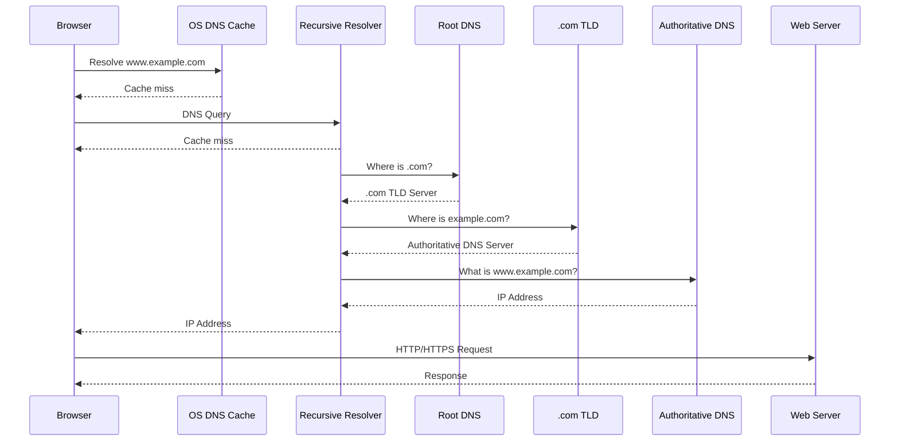

# DNS — Domain Name System
## How DNS Works | System Design | Flow | Architecture | Caching | Records | Security | Interview Q&A

---

# 1. What is DNS?

**DNS (Domain Name System)** converts human-readable domain names into IP addresses.

Example:

```text
www.example.com
       ↓
   DNS Resolution
       ↓
93.184.216.34
```

Humans remember:

```text
google.com
```

Computers ultimately communicate using:

```text
IP Address
```

So DNS acts like the **internet's distributed naming system**.

---

# 2. Why Do We Need DNS?

Without DNS, users would need to remember IP addresses:

```text
https://142.250.x.x
```

Instead:

```text
https://google.com
```

DNS also provides more than simple name-to-IP mapping.

It supports:

- Load balancing
- Failover
- CDN routing
- Service discovery
- Mail routing
- Geographic routing
- Traffic management

---

# 3. High-Level DNS Architecture

```text
                         DNS ROOT
                            |
             ┌──────────────┼──────────────┐
             ↓              ↓              ↓
          .com             .org           .in
        TLD Server        TLD Server      TLD Server
             |
             ↓
     Authoritative DNS
             |
             ↓
       example.com
             |
             ↓
      IP / DNS Records
```

The main components are:

```text
Client
   ↓
Recursive DNS Resolver
   ↓
Root DNS Server
   ↓
TLD DNS Server
   ↓
Authoritative DNS Server
   ↓
IP Address / DNS Record
```

---

# 4. DNS Resolution — Simple Flow

Suppose the user enters:

```text
www.example.com
```

The flow is:

```text
Browser
   ↓
OS DNS Cache
   ↓
Local / Recursive Resolver
   ↓
Root Server
   ↓
.com TLD Server
   ↓
Authoritative DNS Server
   ↓
IP Address
   ↓
Browser connects to IP
```

---

# 5. DNS Sequence Diagram



---

# 6. Step-by-Step DNS Resolution

## Step 1 — User enters URL

```text
https://www.example.com
```

Browser needs the IP address.

---

## Step 2 — Browser Cache

Browser first checks whether it already knows:

```text
www.example.com → IP
```

If found:

```text
Cache HIT
```

DNS lookup can finish immediately.

---

## Step 3 — OS Cache

If browser cache misses, the operating system may have a cached DNS result.

```text
Browser
   ↓
OS DNS Cache
```

If present, no external DNS lookup is needed.

---

## Step 4 — Recursive Resolver

If local caches miss, the request goes to a **recursive DNS resolver**.

Examples:

```text
ISP DNS
Enterprise DNS
Public DNS Resolver
```

The resolver performs the lookup on behalf of the client.

---

# 7. Recursive DNS Resolver

The recursive resolver is responsible for finding the final answer.

```text
Client
   |
   | www.example.com?
   v
Recursive Resolver
   |
   +--> Root
   |
   +--> TLD
   |
   +--> Authoritative
   |
   v
IP Address
```

The client usually does **not** communicate directly with root/TLD/authoritative servers.

The recursive resolver does that work.

---

# 8. Root DNS Server

Root servers are at the top of the DNS hierarchy.

They don't normally provide:

```text
www.example.com → IP
```

Instead, they tell the resolver where to find the relevant TLD servers.

Example:

```text
Resolver
   ↓
Root
   ↓
"Ask the .com TLD servers"
```

There are **13 logical root server identities**, operated using many physical instances around the world.

---

# 9. TLD Server

TLD means:

**Top-Level Domain**

Examples:

```text
.com
.org
.net
.in
.uk
```

For:

```text
www.example.com
```

the `.com` TLD server knows where the authoritative DNS servers for `example.com` are.

```text
Root
 ↓
.com TLD
 ↓
Authoritative DNS for example.com
```

---

# 10. Authoritative DNS Server

The authoritative server contains the actual DNS records for the domain.

Example:

```text
example.com

www.example.com → 93.184.216.34
api.example.com → 10.20.30.40
mail.example.com → mail.provider.com
```

This server is the **source of truth** for that DNS zone.

---

# 11. DNS Hierarchy

DNS is hierarchical:

```text
                         .
                         |
                    Root Zone
                         |
          ┌──────────────┼──────────────┐
          ↓              ↓              ↓
         com             org             in
          |
          ↓
       example
          |
          ↓
         www
```

For:

```text
www.example.com
```

breakdown:

```text
www       → Subdomain / Host
example   → Domain
com       → TLD
.         → Root
```

---

# 12. DNS Records

DNS doesn't only store IP addresses.

Important record types:

| Record | Purpose |
|---|---|
| A | Domain → IPv4 |
| AAAA | Domain → IPv6 |
| CNAME | Alias → another hostname |
| MX | Mail server |
| NS | Authoritative name servers |
| TXT | Arbitrary text / verification / security |
| SOA | Zone authority information |
| PTR | IP → hostname |
| SRV | Service discovery |
| CAA | Which CAs may issue certificates |

---

# 13. A Record

Maps hostname to IPv4.

```text
example.com
      ↓
93.184.216.34
```

Example:

```text
api.example.com → 10.10.20.30
```

---

# 14. AAAA Record

Maps hostname to IPv6.

```text
example.com
      ↓
IPv6 Address
```

Use:

```text
AAAA
```

for IPv6.

---

# 15. CNAME Record

CNAME creates an alias.

Example:

```text
www.example.com
       ↓
example.com
```

Or:

```text
cdn.example.com
       ↓
my-cdn.provider.com
```

The resolver continues resolving the target hostname.

---

# 16. MX Record

Used for email.

```text
example.com
     ↓
MX
     ↓
mail.example.com
```

Email servers use MX records to determine where mail should be delivered.

---

# 17. NS Record

NS identifies authoritative name servers.

Example:

```text
example.com

NS → ns1.dns-provider.com
NS → ns2.dns-provider.com
```

Multiple authoritative servers provide redundancy.

---

# 18. DNS TXT Record

TXT records can store text used for:

- Domain verification
- SPF
- DKIM-related information
- DMARC-related configuration
- Other application-specific verification

Example:

```text
example.com
   ↓
TXT
   ↓
"verification=abc123"
```

---

# 19. DNS Caching

DNS would be extremely expensive if every request went through:

```text
Root → TLD → Authoritative
```

Therefore DNS uses caching heavily.

Typical cache layers:

```text
Browser Cache
     ↓
OS Cache
     ↓
Recursive Resolver Cache
     ↓
Authoritative DNS
```

---

# 20. TTL — Time To Live

Each DNS record can have a TTL.

Example:

```text
www.example.com
A
93.184.216.34
TTL = 300 seconds
```

This means a resolver can generally cache the answer for about:

```text
300 seconds = 5 minutes
```

During that period, it can answer from cache instead of querying authoritative DNS.

---

# 21. DNS Cache HIT vs MISS

### Cache HIT

```text
Client
  ↓
Resolver
  ↓
Cache HIT
  ↓
IP Address
```

Fast.

### Cache MISS

```text
Client
  ↓
Resolver
  ↓
Root
  ↓
TLD
  ↓
Authoritative
  ↓
IP
```

Slower.

The resolver then caches the answer.

---

# 22. DNS and Load Balancing

DNS can return different IP addresses.

Example:

```text
api.example.com

     DNS
      |
 ┌────┼────┐
 ↓    ↓    ↓
LB-1 LB-2 LB-3
```

Or:

```text
api.example.com
       |
       +--> 10.0.0.1
       +--> 10.0.0.2
       +--> 10.0.0.3
```

This can distribute traffic.

However, DNS-based load balancing is not the same as a traditional L4/L7 load balancer.

---

# 23. DNS + CDN

A common production architecture:

```text
User
  |
  | www.example.com
  v
DNS
  |
  v
CDN
  |
  v
Origin / Load Balancer
  |
  v
Application Servers
```

DNS can direct users toward a CDN hostname.

The CDN then selects an appropriate edge location.

---

# 24. DNS-Based Geographic Routing

Suppose we have:

```text
Users
 ├── India
 ├── Europe
 └── USA
```

DNS can return different endpoints:

```text
India
   ↓
Mumbai Region

Europe
   ↓
Frankfurt Region

USA
   ↓
Virginia Region
```

Architecture:

```text
                 DNS
                  |
       ┌──────────┼──────────┐
       ↓          ↓          ↓
    Mumbai    Frankfurt    Virginia
       |          |           |
       v          v           v
     Apps       Apps        Apps
```

This reduces latency and can improve availability.

---

# 25. DNS Failover

Suppose:

```text
Primary Region
10.0.0.1
```

fails.

DNS health checks can detect the failure and return:

```text
Secondary Region
20.0.0.1
```

Flow:

```text
User
 ↓
DNS
 ↓
Primary unhealthy
 ↓
Secondary IP
 ↓
Secondary Region
```

### Important Limitation

DNS caching means failover is **not always immediate**.

If clients/resolvers still have the old DNS answer cached, they may continue using the old IP until TTL/cache rules allow refresh.

---

# 26. DNS Load Balancing Algorithms

DNS providers can implement policies such as:

### Round Robin

```text
Request 1 → IP1
Request 2 → IP2
Request 3 → IP3
Request 4 → IP1
```

### Weighted

```text
IP1 → 70%
IP2 → 20%
IP3 → 10%
```

Useful for gradual traffic migration.

### Geographic

```text
India → Mumbai
Europe → Frankfurt
USA → Virginia
```

### Latency-Based

Return an endpoint expected to provide lower network latency.

### Failover

```text
Primary → Secondary
```

---

# 27. DNS Doesn't Always Return One IP

A DNS answer can contain multiple records.

Example:

```text
api.example.com

A → 10.0.0.1
A → 10.0.0.2
A → 10.0.0.3
```

The client/resolver may receive multiple addresses.

But DNS itself doesn't guarantee sophisticated per-request load balancing behavior at the client.

For precise traffic distribution, a load balancer is usually better.

---

# 28. DNS vs Load Balancer

| DNS | Load Balancer |
|---|---|
| Maps names to endpoints | Distributes connections/requests |
| Distributed and heavily cached | Usually directly handles traffic |
| TTL affects changes | Can react quickly |
| Good for global routing | Good for precise balancing |
| Can provide regional failover | Can perform health checks |
| Client may cache result | Can choose backend per request |

Common architecture:

```text
DNS
 ↓
Load Balancer
 ↓
Application Servers
```

They complement each other.

---

# 29. DNS Recursive vs Authoritative

This is a very common interview question.

### Recursive Resolver

```text
Find the answer for me.
```

It queries other DNS servers and returns the final answer.

### Authoritative Server

```text
I am responsible for this domain/zone.
```

It provides the authoritative DNS records.

```text
Client
  ↓
Recursive Resolver
  ↓
Authoritative Server
```

---

# 30. Recursive Query vs Iterative Lookup

Conceptually:

### Client → Recursive Resolver

```text
"Find www.example.com for me."
```

The resolver does the work.

### Resolver → Root/TLD/Authoritative

The servers may respond with referrals:

```text
"Ask this server next."
```

The resolver follows those referrals until it obtains the answer.

---

# 31. DNS Resolution with Caching

```text
Client
  |
  v
Browser Cache
  |
  | Miss
  v
OS Cache
  |
  | Miss
  v
Recursive Resolver
  |
  | Cache HIT?
  |
 ┌┴──────────────┐
 | YES           | NO
 v               v
IP            Root DNS
                ↓
              TLD DNS
                ↓
        Authoritative DNS
                ↓
               IP
                |
                v
        Cache at Resolver
```

---

# 32. What Happens When DNS Server is Down?

DNS is designed with redundancy.

For example:

```text
example.com

NS1 → DNS Server 1
NS2 → DNS Server 2
NS3 → DNS Server 3
```

If one authoritative server fails:

```text
NS1 ❌
NS2 ✅
NS3 ✅
```

Resolver can use another authoritative server.

---

# 33. DNS Availability

Production DNS should use:

```text
Multiple DNS Servers
        +
Multiple Networks
        +
Multiple Locations
        +
Anycast / Distributed Infrastructure
        +
Caching
```

The goal is to avoid a single DNS failure taking down the entire application.

---

# 34. DNS Anycast

Anycast allows the same IP address to be announced from multiple locations.

Example:

```text
                 DNS IP
               1.1.1.1
                   |
       ┌───────────┼───────────┐
       ↓           ↓           ↓
     Mumbai     London       New York
       DNS        DNS          DNS
```

Routing sends users toward a suitable/nearby location according to network routing.

This improves:

- Availability
- Latency
- DDoS resilience

---

# 35. DNS Security

Important DNS attacks/challenges:

```text
DNS Spoofing
DNS Cache Poisoning
DNS Hijacking
DDoS
DNS Amplification
Domain Takeover
```

---

# 36. DNS Cache Poisoning

Attacker tries to insert a fake DNS response into a resolver's cache.

Example:

```text
www.bank.com
      ↓
Fake IP
      ↓
Attacker Server
```

User thinks they are visiting the legitimate site.

### Protection

**DNSSEC** provides cryptographic validation of DNS data.

---

# 37. DNSSEC

DNSSEC adds cryptographic signatures to DNS data.

Conceptually:

```text
DNS Query
   ↓
DNS Response
   +
Digital Signature
   ↓
Resolver validates
   ↓
Trusted / Invalid
```

DNSSEC protects DNS data integrity/authenticity.

Important:

> DNSSEC does **not encrypt normal DNS queries**.

It helps verify that DNS data has not been tampered with.

---

# 38. DNS over HTTPS — DoH

Traditional DNS commonly uses:

```text
DNS → UDP/TCP port 53
```

DNS over HTTPS sends DNS queries through HTTPS.

```text
Client
  |
  | HTTPS
  v
DoH Resolver
  |
  v
DNS Infrastructure
```

Benefits include improved privacy from local network observers and easier integration with HTTPS-based transport.

---

# 39. DNS over TLS — DoT

DNS queries can also be sent over TLS.

```text
Client
  |
  | TLS
  v
DNS Resolver
```

DoT commonly uses:

```text
TCP 853
```

DoH commonly uses:

```text
HTTPS / 443
```

---

# 40. DNS and HTTPS

DNS only answers:

```text
What IP should I connect to?
```

Then HTTPS handles:

```text
Encryption
Authentication
Secure HTTP communication
```

Typical flow:

```text
DNS
 ↓
IP Address
 ↓
TCP / QUIC
 ↓
TLS
 ↓
HTTP / HTTPS
```

---

# 41. DNS in a Large-Scale System

Example:

```text
                    Users
                      |
                      v
                 DNS Provider
                      |
          ┌───────────┼───────────┐
          ↓           ↓           ↓
       Region A    Region B    Region C
          |           |           |
          v           v           v
       CDN / LB     CDN / LB    CDN / LB
          |           |           |
          v           v           v
       Services    Services    Services
```

DNS handles **global routing**.

Load balancers handle **regional/request-level distribution**.

---

# 42. DNS Scalability

DNS achieves huge scale through:

### 1. Caching

Most queries are answered from cache.

### 2. Distributed architecture

DNS is spread across many servers.

### 3. Hierarchy

Root → TLD → Authoritative.

### 4. Replication

Multiple authoritative servers.

### 5. Anycast

Same service available from multiple geographic locations.

### 6. Stateless query handling

DNS queries can generally be handled independently.

---

# 43. Important DNS Trade-Off — TTL

### Low TTL

Example:

```text
TTL = 30 seconds
```

Advantages:

- Faster changes
- Faster failover
- Faster traffic migration

Disadvantages:

- More DNS queries
- Higher DNS infrastructure load
- More dependency on DNS availability

### High TTL

Example:

```text
TTL = 24 hours
```

Advantages:

- Better caching
- Fewer DNS queries
- Lower DNS load

Disadvantages:

- Changes propagate more slowly
- Failover can take longer

---

# 44. DNS Propagation

People often say:

> "DNS propagation takes 24–48 hours."

More precisely, changes become visible as existing cached records expire according to TTL and resolver behavior.

Example:

```text
Old IP
10.0.0.1
TTL = 1 hour
```

Change to:

```text
New IP
20.0.0.1
```

Some resolvers may continue serving the old answer until their cached TTL expires.

---

# 45. DNS Failure Scenarios

## Scenario 1 — Recursive Resolver Down

Client can use another configured resolver.

```text
Resolver 1 ❌
     ↓
Resolver 2 ✅
```

---

## Scenario 2 — One Authoritative Server Down

```text
NS1 ❌
NS2 ✅
NS3 ✅
```

Resolver uses another authoritative server.

---

## Scenario 3 — Region Down

DNS health checks / routing policy can direct users to another region.

```text
Mumbai ❌
   ↓
DNS
   ↓
Singapore ✅
```

---

## Scenario 4 — DNS Provider Outage

Use multiple authoritative DNS providers where the availability requirements justify the operational complexity.

---

## Scenario 5 — Stale DNS Cache

Old IP may continue being returned until cached TTL expires.

This is one reason DNS is not ideal for instant failover.

---

# 46. DNS in Deployment

DNS is often used during migrations.

Example:

```text
Old Application
10.0.0.1

New Application
20.0.0.1
```

Use weighted routing:

```text
Old → 90%
New → 10%
```

Then gradually:

```text
90/10
 ↓
70/30
 ↓
50/50
 ↓
10/90
 ↓
0/100
```

This supports controlled migration.

---

# 47. DNS-Based Blue-Green Deployment

```text
                  DNS
                   |
          ┌────────┴────────┐
          ↓                 ↓
      Blue Version       Green Version
          |                 |
        v1.0              v2.0
```

Traffic can be switched between environments.

However, TTL/caching means the switch may not be instantaneous.

---

# 48. DNS-Based Canary Deployment

```text
DNS
 |
 +---- 99% → Stable
 |
 +---- 1%  → Canary
```

Gradually increase:

```text
1%
 ↓
5%
 ↓
10%
 ↓
25%
 ↓
50%
 ↓
100%
```

For precise user/request-level canarying, application-level or load-balancer-level routing can provide better control than DNS.

---

# 49. DNS System Design Requirements

If designing a large DNS platform:

### Functional

```text
✓ Resolve domain names
✓ Manage DNS records
✓ Support multiple record types
✓ Health checks
✓ Routing policies
✓ Failover
✓ Geographic routing
✓ Weighted routing
```

### Non-Functional

```text
✓ Very high availability
✓ Very low latency
✓ Massive query throughput
✓ Global distribution
✓ Fault tolerance
✓ DDoS resilience
✓ Strong consistency for configuration
✓ Eventual propagation for cached responses
```

---

# 50. DNS Control Plane vs Data Plane

A useful system-design distinction.

### Control Plane

Used to configure DNS.

```text
User
 ↓
DNS Management API
 ↓
Configuration DB
 ↓
DNS Config Distribution
 ↓
Authoritative Servers
```

### Data Plane

Handles actual DNS queries.

```text
Client
 ↓
DNS Query
 ↓
Authoritative DNS
 ↓
DNS Response
```

The data plane should continue serving existing configuration even if the management/control plane is temporarily unavailable.

---

# 51. Large-Scale DNS Architecture

```text
                     CONTROL PLANE
                          |
                    DNS Management
                          |
                    Configuration DB
                          |
                   Config Distribution
                          |
        ┌─────────────────┼─────────────────┐
        ↓                 ↓                 ↓
   Authoritative      Authoritative      Authoritative
      Region A           Region B           Region C
        |                 |                 |
        └─────────────────┼─────────────────┘
                          |
                       DATA PLANE
                          |
                    DNS Query Traffic
                          |
                         Users
```

---

# 52. DNS Monitoring

Monitor:

```text
Query Rate
Latency
Error Rate
NXDOMAIN Rate
SERVFAIL Rate
Cache Hit Ratio
Authoritative Availability
Propagation Delay
Health Check Status
DNSSEC Validation Failures
```

Important alerts:

```text
DNS latency suddenly increases
DNS error rate increases
Unexpected record changes
Authoritative server unavailable
Large NXDOMAIN spike
```

---

# 53. DNS Security Best Practices

```text
✓ DNSSEC where appropriate
✓ Protect DNS management APIs
✓ MFA for DNS administration
✓ RBAC
✓ Audit DNS changes
✓ Prevent unauthorized zone changes
✓ Rate limiting
✓ DDoS protection
✓ Monitor unusual query patterns
✓ Use multiple authoritative servers
✓ Consider multiple DNS providers for critical systems
```

---

# 54. Common Interview Questions

## Q1. What happens when I type google.com?

Answer:

```text
Browser Cache
 → OS Cache
 → Recursive Resolver
 → Root
 → TLD
 → Authoritative DNS
 → IP
 → Browser connects to IP
```

---

## Q2. What is a recursive DNS server?

> A resolver that performs DNS lookups on behalf of the client and returns the final answer.

---

## Q3. What is an authoritative DNS server?

> The server responsible for the DNS records of a particular zone/domain.

---

## Q4. What is TTL?

> TTL determines how long a DNS response can generally be cached before it needs to be refreshed.

---

## Q5. Why is DNS caching important?

> It reduces latency, DNS traffic, and load on upstream DNS infrastructure.

---

## Q6. What happens if DNS is down?

> Cached answers may continue working temporarily. Clients/resolvers can use alternate resolvers, and authoritative DNS should be replicated across multiple servers/locations.

---

## Q7. Can DNS be used as a load balancer?

> Yes, DNS can distribute users across endpoints using policies such as round robin, weighted, geographic, or latency-based routing. But it is not a replacement for a request-level load balancer.

---

## Q8. Why can't DNS provide instant failover?

> Because DNS responses are cached according to TTL, so clients and recursive resolvers may continue using an old answer.

---

## Q9. DNS vs CDN?

> DNS resolves a hostname to an endpoint. A CDN actually serves/caches content from distributed edge locations. DNS can direct users to a CDN.

---

## Q10. DNS vs Service Discovery?

> DNS can be used for service discovery, but dedicated service-discovery systems may provide faster health-aware registration, richer metadata, and dynamic service membership.

---

# 55. Scenario-Based Interview Questions

## Scenario 1 — Your application has users worldwide. How do you reduce latency?

Use:

```text
Global DNS
   +
Geo/Latency Routing
   +
Multiple Regions
   +
CDN
```

---

## Scenario 2 — Mumbai region fails. What happens?

```text
Health Check
     ↓
Mumbai = unhealthy
     ↓
DNS routing changes
     ↓
Traffic → Healthy Region
```

But cached DNS responses may delay the switch.

---

## Scenario 3 — You need to migrate to a new application.

Use weighted DNS:

```text
Old → 95%
New → 5%
```

Then gradually increase new traffic.

---

## Scenario 4 — DNS receives millions/billions of queries.

Use:

```text
Caching
+
Distributed Authoritative Servers
+
Anycast
+
Horizontal Scaling
+
Replication
+
DDoS Protection
```

---

## Scenario 5 — One DNS server fails.

Use multiple authoritative servers:

```text
NS1 ❌
NS2 ✅
NS3 ✅
```

The resolver can use another server.

---

## Scenario 6 — You need immediate user-level traffic switching.

DNS may not be the best layer because of caching.

Prefer:

```text
DNS
 ↓
Load Balancer / CDN
 ↓
Application Routing
```

The lower layer can make more precise decisions.

---

# 56. DNS vs Service Discovery

| DNS | Service Discovery |
|---|---|
| Internet/global naming | Usually internal service communication |
| Hierarchical | Dynamic service registry |
| Strong caching | Frequently updated membership |
| Simple | Rich service metadata |
| Good for stable endpoints | Good for dynamic services |
| Example: `api.example.com` | `order-service` |

Examples of service discovery mechanisms:

```text
Kubernetes DNS
Consul
Eureka
Cloud service discovery
```

---

# 57. DNS End-to-End Example

User opens:

```text
https://api.example.com/orders
```

### Step 1

Browser needs:

```text
api.example.com → IP
```

### Step 2

DNS resolution occurs:

```text
Browser
 ↓
OS
 ↓
Recursive Resolver
 ↓
Root
 ↓
.com TLD
 ↓
Authoritative DNS
```

### Step 3

DNS returns:

```text
20.10.30.40
```

### Step 4

Client connects:

```text
20.10.30.40
```

### Step 5

Request reaches:

```text
Load Balancer
 ↓
Order Service
 ↓
Database
```

Complete architecture:

```text
User
 |
 | api.example.com
 v
DNS
 |
 | IP
 v
Global / Regional LB
 |
 v
API Gateway
 |
 v
Order Service
 |
 v
Database
```

---

# 58. One-Minute Interview Answer

> **“DNS is a distributed hierarchical naming system that translates domain names into IP addresses and other DNS records. When a user enters a domain, the browser and OS first check their caches. If there is a miss, the request goes to a recursive resolver. The resolver may query the root server, the relevant TLD server, and finally the authoritative DNS server to obtain the record. The resolver caches the result according to TTL. In large-scale systems, DNS is also used for global routing, CDN integration, weighted traffic migration, geographic routing, and regional failover. For high availability, authoritative DNS is replicated and distributed, often using techniques such as anycast. The main trade-off is that DNS caching improves performance and scalability but makes routing changes and failover non-instant.”**

---

# 59. Final Mental Model

```text
                         USER
                           |
                           | www.example.com
                           v
                    Browser DNS Cache
                           |
                           v
                      OS DNS Cache
                           |
                           v
                  Recursive Resolver
                           |
                    Cache HIT?
                    /         \
                  YES          NO
                   |            |
                   |          Root
                   |            |
                   |          TLD
                   |            |
                   |       Authoritative
                   |            |
                   └───────┬────┘
                           |
                       IP Address
                           |
                           v
                     CDN / Load Balancer
                           |
                           v
                       API Gateway
                           |
                           v
                       Services
                           |
                           v
                         DB
```

## The 10 Things to Remember

```text
1. DNS = Domain Name → IP / other records

2. DNS is hierarchical:
   Root → TLD → Authoritative

3. Recursive resolver does the lookup work.

4. Authoritative DNS is the source of truth for a zone.

5. DNS caching is critical for scale.

6. TTL controls DNS cache lifetime.

7. DNS can provide global routing and failover.

8. DNS is NOT the same as a Load Balancer.

9. DNS caching makes failover/changes non-instant.

10. Large-scale DNS uses replication, distribution,
    caching, anycast, health checks, and DDoS protection.
```