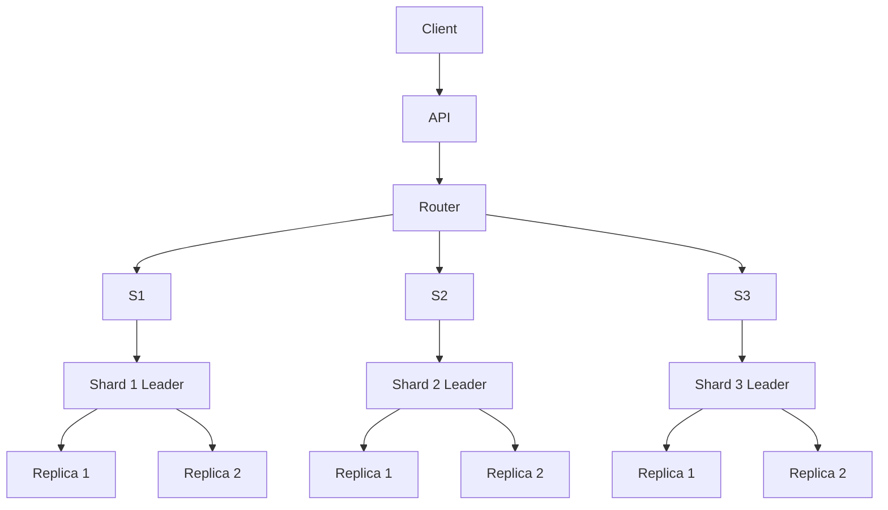

# Database Replication & Sharding — System Design Interview Notes

> **Goal:** Understand why databases need replication and sharding, how they work individually, and how large-scale systems combine both.

---

# 1. Why Do We Need Database Scaling?

A single database eventually becomes a bottleneck.

Suppose an e-commerce system has:

- 10 million users
- 100K requests/sec
- Millions of orders/day
- Heavy read traffic
- Growing data size

A single database may struggle with:

- CPU
- RAM
- Disk I/O
- Network bandwidth
- Connection limits
- Storage capacity
- Query latency
- Availability

There are two major scaling approaches:

```text
                 Database Scaling
                       |
              +--------+--------+
              |                 |
        Vertical Scaling    Horizontal Scaling
              |                 |
        Bigger machine       More machines
                                |
                         +------+------+
                         |             |
                    Replication     Sharding
```

## Vertical Scaling

Upgrade the database server:

```text
Before:
8 CPU
32 GB RAM
1 TB SSD

        ↓

After:
64 CPU
256 GB RAM
10 TB SSD
```

### Advantages

- Simple
- Minimal application changes
- Easy to operate initially

### Disadvantages

- Hardware has a limit
- Expensive at large scale
- Single-machine failure remains a problem
- Doesn't solve all availability requirements

---

# 2. Replication vs Sharding

This distinction is extremely important in interviews.

## Replication

**Replication = copying the same data to multiple database nodes.**

```text
             Same Dataset
                  |
          +-------+-------+
          |       |       |
        DB-1    DB-2    DB-3
        Copy    Copy    Copy
```

Primary goals:

- High availability
- Read scalability
- Disaster recovery
- Fault tolerance

---

## Sharding

**Sharding = splitting the dataset across multiple database nodes.**

```text
              Entire Dataset
                   |
          +--------+--------+
          |        |        |
       Shard-1  Shard-2  Shard-3
       Users    Users    Users
       1-1M     1M-2M    2M-3M
```

Primary goals:

- Data capacity
- Write scalability
- Storage scalability
- Distributing CPU/I/O load

---

## Replication + Sharding

Large systems commonly use both.

```text
                       Database
                          |
             +------------+------------+
             |            |            |
          Shard 1       Shard 2      Shard 3
             |            |            |
          Leader        Leader       Leader
          /    \        /    \       /    \
       Follower Follower Follower Follower Follower Follower
```

This is one of the most important architectures to understand.

---

# 3. Database Replication

Replication means maintaining multiple copies of database data.

Example:

```text
              Application
                   |
                   v
             +-----------+
             |  Leader   |
             +-----------+
              /         \
             v           v
       +---------+   +---------+
       |Follower1|   |Follower2|
       +---------+   +---------+
```

The leader usually handles writes.

Followers replicate changes from the leader and can often serve reads.

---

# 4. Leader-Follower Replication

Also called:

- Primary-Replica
- Master-Slave — older terminology
- Primary-Secondary

Modern terminology usually prefers **leader/follower** or **primary/replica**.

---

## Write Flow

```text
Client
  |
  | WRITE
  v
Leader
  |
  | Replication Log
  v
Followers
```

Example:

```text
UPDATE orders
SET status = 'PAID'
WHERE order_id = 123;
```

The leader performs the write and sends the corresponding changes to replicas.

---

# 5. Read Flow

Reads can potentially be distributed:

```text
                 Application
                /     |      \
               /      |       \
              v       v        v
          Leader   Follower1 Follower2
             |        |          |
           WRITE     READ       READ
```

This helps when:

```text
Reads = 95%
Writes = 5%
```

Instead of forcing all reads onto one database, replicas can absorb read traffic.

---

# 6. Synchronous vs Asynchronous Replication

This is a major interview topic.

## Synchronous Replication

Leader waits for replica acknowledgement.

```text
Client
  |
  v
Leader
  |
  +--------> Replica
  |             |
  |<------------+
  |
  v
ACK to client
```

### Advantages

- Stronger durability
- Less chance of losing acknowledged data

### Disadvantages

- Higher latency
- Replica failure can affect writes
- Availability can decrease

---

## Asynchronous Replication

Leader responds without waiting for replicas.

```text
Client
  |
  v
Leader
  |
  +----> ACK
  |
  +----> Replica
```

### Advantages

- Lower write latency
- Better availability
- Replicas can lag temporarily

### Disadvantages

- Replication lag
- Recently committed data may be lost if leader fails before replication
- Read-after-write consistency becomes harder

---

# 7. Replication Lag

Suppose:

```text
Leader:
Order 123 = PAID

Follower:
Order 123 = PAYMENT_PENDING
```

The follower has not caught up.

This is called **replication lag**.

---

## Scenario

User pays for an order.

Immediately afterward:

```text
POST /payment
GET /order/123
```

If POST goes to leader but GET goes to a lagging follower:

```text
POST -> Leader
         |
         | update
         v

GET -> Follower
       |
       v
Old value
```

The user may see:

> Payment successful

followed by:

> Payment pending

---

## Solutions

### Option 1 — Read from leader after write

```text
Write -> Leader
Read  -> Leader
```

### Option 2 — Session stickiness

After a write, temporarily route the user's reads to the leader.

### Option 3 — Read-your-writes consistency

Track the replication position/version and only read from a replica that has caught up.

### Option 4 — Accept eventual consistency

Useful for:

- Analytics
- Recommendations
- Counters
- Social feeds

---

# 8. Failover in Leader-Follower Replication

Suppose:

```text
              Leader
                X
              DOWN

          /           \
     Follower1     Follower2
```

A follower must become the new leader.

Typical process:

```text
Failure Detection
       |
       v
Select Candidate
       |
       v
Promote Replica
       |
       v
Redirect Writes
       |
       v
Reconfigure Replicas
```

---

# 9. Problems During Failover

## Split Brain

Two nodes believe they are the leader.

```text
        Network Partition

     Leader A       Leader B
       |               |
    "I am leader"   "I am leader"
```

Both may accept writes.

This can cause conflicting data.

### Prevention

Use:

- Consensus systems
- Quorum
- Fencing
- Leader election
- Epoch/term numbers
- Proper failure detection

---

# 10. Replication Quorum

Suppose there are 3 replicas:

```text
A
B
C
```

A quorum may require:

```text
2 / 3 nodes
```

For example:

```text
Write
 |
 +--> A ✓
 |
 +--> B ✓
 |
 +--> C X
 |
 v
Success
```

Because a majority acknowledged.

The exact semantics depend on the database/system.

---

# 11. Leader-Leader Replication

Also called:

- Multi-primary
- Multi-leader
- Active-active

Multiple nodes can accept writes.

```text
          Application
          /         \
         v           v
     Leader A <----> Leader B
         ^              ^
         |              |
       Writes          Writes
```

This is useful for:

- Multi-region systems
- Geographic distribution
- High write availability

---

# 12. Problem with Leader-Leader

The major problem is **write conflicts**.

Example:

```text
Leader A:
user.balance = 100

Leader B:
user.balance = 100
```

User performs:

```text
A: balance = 80
B: balance = 70
```

Both writes may succeed independently.

Now:

```text
A -> 80
B -> 70
```

Replication discovers a conflict.

---

# 13. Conflict Resolution

Common strategies:

## 1. Last Write Wins

Choose the value with the latest timestamp/version.

```text
A: value = X, timestamp = 10
B: value = Y, timestamp = 11

Winner = Y
```

### Problem

A valid update can be silently overwritten.

---

## 2. Version Numbers

Example:

```text
Version 10
Version 11
```

The system detects which update is newer or whether updates diverged.

---

## 3. Application-Level Merge

Example:

Two users modify different fields:

```text
A:
name = Rahul

B:
email = rahul@example.com
```

The system can merge:

```text
name = Rahul
email = rahul@example.com
```

---

## 4. CRDTs

Conflict-free replicated data types allow certain data structures to merge automatically.

Useful for:

- Collaborative editing
- Counters
- Sets
- Distributed state

But CRDTs are not a universal solution.

---

## 5. Conflict Avoidance

Instead of allowing the same entity to be written in multiple regions:

```text
User 123 -> Region A owns writes
User 456 -> Region B owns writes
```

This can dramatically reduce conflicts.

---

# 14. Replication Strategies

Common patterns:

```text
Leader-Follower
Leader-Leader
Leaderless
```

---

## Leader-Follower

```text
        Leader
       /      \
      v        v
   Replica  Replica
```

Best for:

- Read scaling
- Simpler consistency model
- High availability

---

## Leader-Leader

```text
Leader A <----> Leader B
```

Best for:

- Multi-region writes
- Geographic availability

But:

- Conflict resolution becomes difficult.

---

## Leaderless

Clients communicate with multiple replicas.

```text
             Client
            /  |  \
           v   v   v
          R1  R2  R3
```

Quorum techniques may be used.

Example:

```text
N = 3
W = 2
R = 2
```

Conceptually:

```text
W + R > N
```

can help ensure read/write overlap, though actual guarantees depend on the database's implementation.

---

# 15. Database Sharding

Sharding divides a large dataset into smaller pieces.

Each piece is called a **shard**.

Example:

```text
Users:

1 - 1,000,000       -> Shard 1
1,000,001 - 2,000,000 -> Shard 2
2,000,001 - 3,000,000 -> Shard 3
```

---

# 16. Why Sharding?

Suppose:

```text
Database size = 50 TB
Write traffic = 500K writes/sec
```

A single DB may not handle it.

Sharding distributes the workload:

```text
               500K writes/sec
                      |
        +-------------+-------------+
        |             |             |
     Shard 1       Shard 2       Shard 3
     170K/s        165K/s        165K/s
```

---

# 17. Shard Key

The **shard key** determines where a record is stored.

Example:

```text
user_id = 12345
```

The system calculates:

```text
shard = hash(user_id)
```

and routes the request to that shard.

A good shard key should provide:

- Even distribution
- High cardinality
- Query locality
- Stable routing
- Low hotspot risk

---

# 18. Sharding Strategy #1 — Range Based

Divide data into ranges.

```text
user_id

1 - 1M       -> Shard 1
1M - 2M      -> Shard 2
2M - 3M      -> Shard 3
```

### Advantages

- Simple
- Range queries are efficient
- Easy to understand

### Disadvantages

- Hotspots
- Uneven distribution
- Sequential IDs can overload the newest shard

---

## Example Hotspot

Suppose new orders have increasing IDs:

```text
100001
100002
100003
100004
...
```

If newest IDs always go to Shard 3:

```text
Shard 1 -> low traffic
Shard 2 -> low traffic
Shard 3 -> extremely high traffic
```

This is a **hot shard**.

---

# 19. Sharding Strategy #2 — Hash Based

Calculate:

```text
hash(shard_key) % N
```

Example:

```text
hash(user_id) % 4
```

Possible result:

```text
0 -> Shard 0
1 -> Shard 1
2 -> Shard 2
3 -> Shard 3
```

### Advantages

- Usually good distribution
- Reduces hotspots

### Disadvantages

- Range queries become difficult
- Resharding can be expensive with naive modulo hashing

---

# 20. Why Naive Modulo Hashing Has a Problem

Suppose:

```text
N = 4
shard = hash(key) % 4
```

Then increase to:

```text
N = 5
```

Many keys change shards.

```text
hash(key) % 4 != hash(key) % 5
```

This means massive data movement.

---

# 21. Consistent Hashing

Consistent hashing reduces the amount of data that must move when nodes change.

Imagine a hash ring:

```text
                 0
            .---------.
         /               \
       /                   \
    25                       75
       \                   /
         \               /
            '---------' 
                 50
```

Nodes are placed on the ring.

Keys are hashed onto the ring.

A key is assigned to the next node clockwise.

---

# 22. Consistent Hashing Example

```text
Hash Ring

        Node A
          |
    key1  |
          v
      ---------
     /         \
 Node D       Node B
     \         /
      ---------
          |
        Node C
```

If Node B is removed:

```text
Keys previously assigned to B
        |
        v
Move to next available node
```

Only a portion of keys move instead of almost everything.

---

# 23. Virtual Nodes

Real nodes can have multiple positions on the hash ring.

```text
             Hash Ring

      A1       B1
        \      /
      A2       B2
        \      /
      C1       A3
```

This improves:

- Distribution
- Load balancing
- Node addition/removal behavior

Virtual nodes are commonly used in distributed hashing systems.

---

# 24. Sharding Strategy #3 — Directory-Based

Maintain a mapping:

```text
Customer ID -> Shard
```

Example:

```text
123 -> Shard A
456 -> Shard B
789 -> Shard C
```

A routing service/directory determines where data lives.

### Advantages

- Flexible
- Easy to move specific tenants/customers
- Good for tenant-based systems

### Disadvantages

- Directory becomes critical infrastructure
- Lookup overhead
- Mapping must be highly available

---

# 25. Tenant-Based Sharding

Very useful in SaaS applications.

```text
Tenant A -> Shard 1
Tenant B -> Shard 2
Tenant C -> Shard 3
```

This provides:

- Tenant isolation
- Query locality
- Easier tenant migration
- Potential compliance/data residency benefits

But a large tenant can become a hotspot.

---

# 26. Choosing a Good Shard Key

Suppose an e-commerce database contains:

```text
orders(
    order_id,
    user_id,
    product_id,
    region,
    created_at
)
```

Possible shard keys:

```text
order_id
user_id
region
created_at
```

The choice depends on access patterns.

---

## If most queries are:

```sql
SELECT * FROM orders
WHERE user_id = ?
```

Then:

```text
user_id
```

may be a strong shard key.

---

## If most queries are:

```sql
SELECT * FROM orders
WHERE order_id = ?
```

Then:

```text
order_id
```

may be better.

---

# 27. Shard Key Requirements

A strong shard key should ideally have:

### 1. High Cardinality

Avoid:

```text
gender = male/female
```

Only a few values → poor distribution.

---

### 2. Even Distribution

Avoid:

```text
country = India
```

if most traffic comes from India.

---

### 3. Query Locality

If most requests use:

```text
user_id
```

shard by `user_id`.

This allows the system to route the query directly.

---

### 4. Low Hotspot Risk

Avoid keys that create a single overloaded shard.

---

# 28. Hot Shard

A hot shard occurs when one shard receives disproportionate traffic.

Example:

```text
Shard 1 -> 10K req/s
Shard 2 -> 11K req/s
Shard 3 -> 12K req/s
Shard 4 -> 500K req/s  <-- HOT
```

Possible causes:

- Celebrity user
- Popular product
- Sequential IDs
- Uneven tenant sizes
- Poor shard key

---

# 29. Handling Hot Shards

Possible techniques:

## 1. Better shard key

Choose a more evenly distributed key.

## 2. Hashing

```text
hash(user_id)
```

## 3. Key Salting

Instead of:

```text
product:iphone
```

use:

```text
product:iphone:0
product:iphone:1
product:iphone:2
...
```

Traffic is distributed.

But reads must know/search multiple buckets.

---

## 4. Split Hot Shard

```text
Shard 4
   |
   +----> Shard 4A
   |
   +----> Shard 4B
```

---

## 5. Cache Hot Data

Popular products/users can often be served from cache.

---

# 30. Cross-Shard Queries

This is one of the biggest disadvantages of sharding.

Suppose:

```sql
SELECT *
FROM orders
WHERE created_at > '2026-01-01'
ORDER BY created_at DESC;
```

If data is distributed across shards:

```text
Query
 |
 +--> Shard 1
 +--> Shard 2
 +--> Shard 3
 +--> Shard 4
```

The application/database must:

1. Query multiple shards
2. Gather results
3. Merge/sort
4. Return final result

This is called a **scatter-gather query**.

---

# 31. Cross-Shard Transactions

Suppose:

```text
User balance -> Shard A

Order -> Shard B
```

Creating an order requires:

```text
1. Deduct balance
2. Create order
```

These are on different shards.

A normal local transaction cannot automatically provide atomicity across both shards.

Possible approaches:

- Avoid cross-shard transactions through data modeling
- Saga
- Transaction coordinator
- Distributed transaction / 2PC where supported and justified
- Event-driven workflows

---

# 32. Cross-Shard Joins

Example:

```sql
SELECT *
FROM users
JOIN orders ON users.id = orders.user_id;
```

If users and orders are on different shards, joins become expensive.

Solutions:

### 1. Co-locate related data

Shard both using:

```text
user_id
```

Then:

```text
User 123
Order 1
Order 2
Order 3
```

can live on the same shard.

### 2. Denormalization

Store frequently needed data together.

### 3. Application-side aggregation

Query multiple systems and combine results.

---

# 33. Replication + Sharding Together

This is the architecture used by many large distributed databases.

Suppose we have 3 shards:

```text
                   Database
                      |
        +-------------+-------------+
        |             |             |
      Shard A       Shard B       Shard C
        |             |             |
     Leader         Leader        Leader
      /  \           /  \          /  \
     F1   F2        F1   F2       F1   F2
```

Each shard contains only a portion of the data.

Each shard independently replicates that portion.

---

# 34. Why Combine Them?

Sharding provides:

```text
More write capacity
More storage
More CPU capacity
```

Replication provides:

```text
High availability
Read scaling
Fault tolerance
```

Together:

```text
Sharding
   +
Replication
   =
Horizontal database architecture
```

---

# 35. Request Routing

Application sends:

```text
GET /users/123
```

The routing layer calculates:

```text
hash(123)
```

Then:

```text
Shard Router
     |
     v
Shard 2
     |
     v
Replica
```

For writes:

```text
Application
     |
     v
Shard Router
     |
     v
Shard 2 Leader
     |
     +----> Replica 1
     |
     +----> Replica 2
```

---

# 36. End-to-End Architecture



---

# 37. E-Commerce Example

Suppose:

```text
100M users
1B orders
100K writes/sec
1M reads/sec
```

A possible architecture:

```text
                 API
                  |
             Shard Router
                  |
       +----------+----------+
       |          |          |
     Shard 1    Shard 2    Shard 3
       |          |          |
      L/F        L/F        L/F
```

Shard key:

```text
user_id
```

Why?

Because common queries are:

```text
Get user's orders
Get user's profile
Get user's payment history
```

This creates query locality.

---

# 38. Social Media Example

Suppose:

```text
Users
Posts
Likes
Comments
Followers
```

Possible strategy:

```text
Users      -> user_id
Posts      -> author_id/user_id
Likes      -> post_id or user_id depending on access pattern
```

But social systems often have hot keys.

Example:

```text
Celebrity post
     |
     v
1 million reads/sec
```

A single shard can become overloaded.

Solutions:

- Cache
- Replicate reads
- Fan-out strategies
- Hot-key splitting
- Feed materialization

---

# 39. Global Application

Suppose users exist in:

```text
India
Europe
US
```

Possible architecture:

```text
                    Global Router
                   /      |       \
                  v       v        v
               India    Europe     US
                  |       |        |
               DB      DB         DB
```

Possible strategy:

- Region-based data ownership
- Local read replicas
- Regional leaders
- Multi-leader replication
- Data residency rules

---

# 40. Region-Based Sharding

Example:

```text
India users -> India shard
EU users    -> EU shard
US users    -> US shard
```

Advantages:

- Lower latency
- Data residency
- Regional isolation

Disadvantages:

- Users traveling between regions
- Cross-region queries
- Cross-region transactions
- Failover complexity

---

# 41. What Happens When a Shard Fails?

Suppose:

```text
Shard 2 Leader
     X
```

But:

```text
Shard 2 Replica 1
Shard 2 Replica 2
```

are healthy.

Failover:

```text
Shard Router
     |
     X
Old Leader
     |
     v
Replica 1 promoted
     |
     v
New Leader
```

Only Shard 2's traffic is affected.

This is another benefit of partitioning failures by shard.

---

# 42. What Happens When an Entire Region Fails?

Example:

```text
US Region
   X
```

Possible approaches:

### Active-Passive

```text
US Primary
    |
    v
EU Standby
```

Failover to another region.

### Active-Active

```text
US <----> EU
```

Both regions serve traffic.

Active-active gives better availability but introduces:

- Conflict resolution
- Data consistency challenges
- More complex routing

---

# 43. Replication Does NOT Replace Sharding

Important interview statement:

> Replication creates more copies of data; sharding creates partitions of data.

If you replicate one huge database:

```text
DB A = 10 TB
DB B = 10 TB
DB C = 10 TB
```

You still have:

```text
10 TB dataset
```

on each node.

Replication doesn't fundamentally solve dataset size or write capacity on the primary.

---

# 44. Sharding Does NOT Replace Replication

If you only shard:

```text
Shard A
Shard B
Shard C
```

and Shard B dies:

```text
Shard B -> DATA UNAVAILABLE
```

Replication provides redundancy for each shard.

---

# 45. Database Scaling Decision

```text
Need read scaling?
        |
        v
   Replication

Need more storage/write capacity?
        |
        v
      Sharding

Need both?
        |
        v
Sharding + Replication
```

---

# 46. Best Practices

## 1. Start without sharding if possible

Sharding adds significant complexity.

Prefer:

```text
Vertical scaling
+
Indexes
+
Query optimization
+
Caching
+
Read replicas
```

before introducing sharding.

---

## 2. Design around access patterns

Don't choose shard keys just because they look unique.

Ask:

```text
What queries are most frequent?
What data must be together?
What causes hotspots?
```

---

## 3. Prefer high-cardinality keys

Good:

```text
user_id
order_id
tenant_id
```

Potentially bad:

```text
gender
country
status
```

depending on distribution.

---

## 4. Avoid hotspots

Always ask:

> Can one key receive enormous traffic?

Examples:

```text
celebrity_id
popular_product_id
large_tenant_id
```

---

## 5. Monitor replication lag

Track:

- Replication delay
- Replica health
- Write throughput
- Read throughput
- Failover events

---

## 6. Plan resharding early

Ask:

```text
What happens when:
10 shards -> 100 shards?
```

You need:

- Data migration
- Dual writes or controlled migration
- Routing changes
- Validation
- Cutover
- Rollback strategy

---

# 47. Resharding

Suppose:

```text
Shard A
Shard B
Shard C
```

becomes insufficient.

Need:

```text
Shard A
Shard B
Shard C
Shard D
Shard E
Shard F
```

A safe migration can look like:

```text
Old Shard
    |
    | Copy data
    v
New Shard
    |
    | Validate
    v
Switch routing
    |
    v
Stop old writes
    |
    v
Cleanup
```

Resharding is operationally expensive.

---

# 48. Shard Metadata / Routing

Large systems need to know:

```text
Which shard owns this key?
```

Possible architecture:

```text
Application
     |
     v
Shard Router
     |
     v
Metadata Service
     |
     +--> Shard 1
     +--> Shard 2
     +--> Shard 3
```

The metadata must itself be:

- Highly available
- Consistent enough for routing
- Versioned
- Recoverable

---

# 49. Consistent Hashing vs Range Sharding

| Feature | Range | Hash / Consistent Hash |
|---|---|---|
| Distribution | Can be uneven | Usually better |
| Range queries | Excellent | Poor |
| Hotspot risk | Higher | Lower |
| Resharding | Can be manageable | Consistent hashing helps |
| Ordering | Preserved | Lost |
| Complexity | Lower | Higher |

---

# 50. Replication vs Sharding

| Feature | Replication | Sharding |
|---|---|---|
| Data | Same copy | Different partition |
| Main purpose | HA/read scaling | Capacity/write scaling |
| Storage | Duplicated | Distributed |
| Failover | Yes | Usually combined with replication |
| Cross-node query | Usually simpler | More complex |
| Cross-node transaction | Possible depending setup | Difficult |
| Operational complexity | Medium | High |

---

# 51. Interview Q&A — Conceptual

## Q1. What is database replication?

**Answer:** Replication maintains multiple copies of database data across nodes to improve availability, fault tolerance, and often read scalability.

---

## Q2. What is database sharding?

**Answer:** Sharding horizontally partitions data across multiple database nodes so that each node stores only part of the dataset.

---

## Q3. Replication vs sharding?

**Answer:**

> Replication copies data; sharding partitions data.

---

## Q4. Why use read replicas?

**Answer:** To distribute read traffic and reduce load on the primary database.

---

## Q5. What is replication lag?

**Answer:** The delay between a write being committed on the leader and that change becoming visible on a replica.

---

## Q6. Why can read replicas return stale data?

**Answer:** Because asynchronous replication may not have applied the latest leader changes yet.

---

## Q7. What is leader-follower replication?

**Answer:** One node accepts writes and followers replicate its changes and typically serve reads.

---

## Q8. What is leader-leader replication?

**Answer:** Multiple nodes accept writes and replicate changes between each other, requiring conflict handling.

---

## Q9. Why is multi-leader replication difficult?

**Answer:** Concurrent writes to the same data can conflict, requiring conflict detection and resolution.

---

## Q10. What is a shard key?

**Answer:** A field or combination of fields used to determine which shard stores a record.

---

## Q11. What makes a good shard key?

**Answer:** High cardinality, even distribution, low hotspot risk, and alignment with common query patterns.

---

## Q12. Why is sequential ID sometimes a bad shard key?

**Answer:** Range-based partitioning can send all new records to the newest shard, creating a hotspot.

---

## Q13. What is consistent hashing?

**Answer:** A hashing technique where adding/removing nodes moves only a relatively small portion of keys instead of remapping almost everything.

---

## Q14. Why use virtual nodes?

**Answer:** To distribute keys more evenly and reduce imbalance when physical nodes are added or removed.

---

## Q15. What is a hot shard?

**Answer:** A shard receiving disproportionately high traffic or data load compared with other shards.

---

## Q16. What is scatter-gather?

**Answer:** Sending one logical query to multiple shards and combining their results.

---

## Q17. Why are cross-shard transactions difficult?

**Answer:** Because atomicity must span multiple independent database partitions, often requiring distributed transaction coordination or application-level workflows.

---

## Q18. Does replication solve database write scaling?

**Answer:** Traditional leader-follower replication usually doesn't scale writes because writes still go through the leader. Sharding distributes writes across multiple leaders/shards.

---

## Q19. Does sharding improve availability?

**Answer:** Sharding by itself doesn't necessarily improve availability. Each shard should usually be replicated for fault tolerance.

---

## Q20. Why not shard everything immediately?

**Answer:** Sharding introduces routing, migration, cross-shard query, transaction, monitoring, and operational complexity.

---

# 52. Scenario-Based Interview Questions

## Scenario 1 — E-Commerce Orders

### Question

You have:

```text
500M users
5B orders
100K writes/sec
1M reads/sec
```

How would you scale the database?

### Answer

Use:

```text
Application
    |
    v
Shard Router
    |
    +---- Shard 1
    +---- Shard 2
    +---- Shard 3
    +---- ...
```

Each shard:

```text
Leader
 /   \
R1   R2
```

Potential shard key:

```text
user_id
```

if most queries are user-centric.

Benefits:

- Write scaling
- Storage scaling
- Read scaling
- High availability

---

# 53. Scenario 2 — Read-Heavy Application

### Question

Your system has:

```text
5% writes
95% reads
```

Database CPU is mostly consumed by reads.

What do you do?

### Answer

First consider:

```text
Read replicas
+
Caching
+
Query/index optimization
```

Architecture:

```text
               Application
                /       \
             WRITE      READ
               |          |
            Leader    Read Replicas
```

No need to introduce sharding immediately.

---

# 54. Scenario 3 — Hot Celebrity User

### Question

One celebrity's profile receives:

```text
500K requests/sec
```

and all requests map to the same shard.

What do you do?

### Answer

Potential solutions:

1. Cache the profile.
2. Add read replicas.
3. Split the hot key.
4. Use request distribution across replicas.
5. Consider dedicated handling for extreme hot keys.

Important:

> A theoretically good shard key can still have hot keys because traffic distribution may differ from data distribution.

---

# 55. Scenario 4 — Sequential Order IDs

### Question

You use:

```text
order_id = auto_increment
```

and range sharding:

```text
1-1M -> Shard 1
1M-2M -> Shard 2
...
```

New orders all go to the latest shard.

What happens?

### Answer

The latest shard becomes a hotspot.

Possible solutions:

- Hash-based partitioning
- Time bucketing + additional distribution
- Composite shard key
- Hash(order_id)
- Better workload-aware partitioning

---

# 56. Scenario 5 — Payment System

### Question

Would you use eventual consistency for payment balance?

### Answer

Usually no for the critical balance update.

Prefer:

- Strong consistency where required
- Atomic DB updates
- Idempotency
- Transactions
- Optimistic/pessimistic concurrency control
- Carefully designed payment state machine

Eventual consistency can be used for secondary views such as:

```text
Analytics
Notifications
Reporting
```

---

# 57. Scenario 6 — Global Social Network

### Question

Users are distributed across:

```text
US
Europe
India
```

and users expect low latency.

What would you consider?

### Answer

Potential architecture:

```text
Global Router
   |
   +--> US DB
   +--> EU DB
   +--> India DB
```

Use:

- Regional ownership
- Local replicas
- CDN/cache
- Region-aware routing

If multiple regions must accept writes:

```text
Multi-leader
```

may be considered, but conflict resolution becomes important.

---

# 58. Scenario 7 — Primary Database Fails

### Question

Your primary DB suddenly crashes.

What happens?

### Answer

If replicas exist:

```text
Primary X

Replica A
Replica B
```

A healthy replica can be promoted:

```text
Replica A
    |
    v
New Primary
```

The system then:

1. Detects failure
2. Elects/selects candidate
3. Promotes replica
4. Updates routing
5. Reconfigures replication
6. Monitors recovery

Need to consider replication lag and possible data loss with asynchronous replication.

---

# 59. Scenario 8 — Replica is Behind

### Question

A user updates their profile, immediately refreshes, and sees old data.

Why?

### Answer

Likely:

```text
WRITE -> Leader

READ -> Lagging Replica
```

Solutions:

- Read from leader after write
- Session stickiness
- Read-your-writes mechanism
- Replica freshness checks
- Accept eventual consistency where appropriate

---

# 60. Scenario 9 — Cross-Shard Order Transaction

### Question

Customer balance is on Shard A, order is on Shard B.

How do you guarantee:

```text
Deduct money
+
Create order
```

atomically?

### Answer

Prefer redesigning data ownership to avoid cross-shard transactions.

If unavoidable:

- Saga
- Distributed transaction coordinator
- 2PC/XA where justified
- Outbox/event-driven workflow
- Compensation

For high-scale systems, application-level workflows are often preferred over expensive distributed transactions.

---

# 61. Scenario 10 — Database Growing Rapidly

### Question

Database is currently:

```text
500 GB
```

but expected to become:

```text
100 TB
```

in a few years.

What do you consider?

### Answer

Plan for:

- Sharding strategy
- Shard key
- Resharding
- Data lifecycle/archival
- Storage scaling
- Backup/restore
- Replica topology
- Operational automation

Don't wait until the database reaches its physical limit.

---

# 62. Scenario 11 — Large Tenant

### Question

Your SaaS application shards by:

```text
tenant_id
```

One enterprise tenant becomes 30% of total traffic.

What happens?

### Answer

That tenant becomes a hotspot.

Possible solution:

```text
Tenant A -> Shard 1
Tenant B -> Shard 2

Large Tenant X
      |
      +--> X1
      +--> X2
      +--> X3
```

Large tenants may need dedicated or sub-sharded partitions.

---

# 63. Scenario 12 — Need Range Queries

### Question

Your application frequently asks:

```sql
Find orders between timestamps T1 and T2
```

Would pure hash sharding be ideal?

### Answer

Not necessarily.

Range-based partitioning may provide better locality for range queries.

But consider:

- Hot recent ranges
- Time-based hotspots
- Partition size
- Retention
- Query frequency

A hybrid strategy may be better.

---

# 64. Scenario 13 — Multi-Region Writes

### Question

Users in US and India need local writes.

Would leader-follower with one global leader be ideal?

### Answer

It may create high cross-region write latency.

Consider:

```text
US Leader
India Leader
```

with multi-leader replication.

But now you must solve:

- Write conflicts
- Ordering
- Failover
- Clock differences
- Data ownership
- Consistency

A common alternative is **regional write ownership** to reduce conflicts.

---

# 65. Scenario 14 — Database Has High CPU

### Question

Before sharding, what would you investigate?

### Answer

Check:

```text
Indexes
Slow queries
Query plans
Connection pool
Cache hit rate
Read/write ratio
Lock contention
Missing indexes
N+1 queries
Large scans
```

Scaling should not hide bad queries.

---

# 66. Common Pitfalls

## Pitfall 1 — Choosing shard key only for uniqueness

A unique key isn't automatically a good shard key.

---

## Pitfall 2 — Ignoring access patterns

The most important question is:

> How will the application query the data?

---

## Pitfall 3 — Ignoring hotspots

Average distribution can look perfect while one popular key receives enormous traffic.

---

## Pitfall 4 — Assuming replicas are always current

Asynchronous replicas may lag.

---

## Pitfall 5 — Using leader-leader without conflict strategy

Multi-primary writes require an explicit conflict model.

---

## Pitfall 6 — Ignoring resharding

Always ask:

> What happens when we need 10× more capacity?

---

## Pitfall 7 — Too many cross-shard operations

Excessive:

- joins
- transactions
- aggregations

can eliminate the benefits of sharding.

---

## Pitfall 8 — Treating replication as backup

Replication is **not a substitute for backups**.

If bad data is accidentally deleted:

```text
Leader -> DELETE
      |
      v
Replica -> DELETE
```

The deletion may replicate everywhere.

You still need:

- Backups
- Point-in-time recovery
- Disaster recovery

---

# 67. Important Trade-offs

## Replication

### Pros

- High availability
- Read scaling
- Disaster tolerance
- Reduced read load

### Cons

- Replication lag
- More infrastructure
- Failover complexity
- Storage duplication

---

## Sharding

### Pros

- Write scaling
- Storage scaling
- CPU scaling
- Large dataset support

### Cons

- Complex routing
- Cross-shard queries
- Cross-shard transactions
- Resharding
- Operational complexity
- Hotspot management

---

# 68. Interview Decision Framework

When asked:

> "How would you scale the database?"

Answer in this order:

```text
1. Optimize queries
       ↓
2. Add indexes
       ↓
3. Add caching
       ↓
4. Vertical scaling
       ↓
5. Read replicas
       ↓
6. Sharding
       ↓
7. Combine sharding + replication
```

Don't jump directly to sharding.

---

# 69. Interview Design Template

When designing a large database, explicitly discuss:

### Step 1 — Traffic

```text
QPS
Read/write ratio
Peak traffic
```

### Step 2 — Data

```text
Current size
Growth rate
Record size
Retention
```

### Step 3 — Access Patterns

```text
Point lookup?
Range query?
Aggregation?
Join?
```

### Step 4 — Shard Key

Explain:

```text
Why this key?
Distribution?
Hotspot risk?
Query locality?
```

### Step 5 — Replication

Explain:

```text
How many replicas?
Sync or async?
Read routing?
Failover?
```

### Step 6 — Consistency

Explain:

```text
Strong?
Eventual?
Read-your-writes?
```

### Step 7 — Failure

Explain:

```text
What if leader dies?
What if replica lags?
What if shard dies?
What if region dies?
```

### Step 8 — Growth

Explain:

```text
How do we reshard?
How do we add capacity?
```

---

# 70. Interview Trap Questions

## Trap 1

**"If I have 5 replicas, can I handle 5× writes?"**

No.

Traditional leader-follower replication still sends writes to the leader.

---

## Trap 2

**"If I shard the database, do I automatically get high availability?"**

No.

A shard can still fail.

Replicate each shard for HA.

---

## Trap 3

**"Can I always use user_id as shard key?"**

No.

It depends on access patterns, distribution, and hotspots.

---

## Trap 4

**"Does consistent hashing solve all sharding problems?"**

No.

It helps with node membership and key movement, but does not solve:

- Hot keys
- Cross-shard joins
- Transactions
- Bad query patterns

---

## Trap 5

**"Does replication guarantee zero data loss?"**

No.

Async replication can lose recently committed data during failure.

---

## Trap 6

**"Can I use multi-leader everywhere?"**

No.

It introduces conflict-resolution and consistency complexity.

---

# 71. One-Line Revision

- **Replication:** Copy the same data to multiple nodes.
- **Sharding:** Split data across multiple nodes.
- **Leader-follower:** One node writes; replicas follow.
- **Multi-leader:** Multiple nodes accept writes.
- **Replication lag:** Replica is behind the leader.
- **Failover:** Promote another replica when leader fails.
- **Shard key:** Determines where a record is stored.
- **Range sharding:** Partition using ranges.
- **Hash sharding:** Partition using a hash.
- **Consistent hashing:** Minimize key movement when nodes change.
- **Virtual nodes:** Multiple hash-ring positions per physical node.
- **Hot shard:** One shard gets disproportionate load.
- **Scatter-gather:** Query multiple shards and merge results.
- **Cross-shard transaction:** Transaction spanning multiple shards.
- **Read scaling:** Replication is usually useful.
- **Write scaling:** Sharding distributes writes.
- **Storage scaling:** Sharding distributes data.
- **HA:** Replication provides redundancy.
- **Multi-region:** Often requires regional ownership or multi-leader architecture.
- **Resharding:** Moving/repartitioning data as capacity requirements grow.

---

# 72. 1-Minute Interview Answer

> "I distinguish replication from sharding. Replication creates multiple copies of the same data and is mainly used for high availability, failover, and read scaling. Sharding partitions the dataset across multiple nodes and is mainly used for write, storage, and compute scaling.
>
> For a large system, I would typically combine them: each shard owns a subset of the data and has one leader plus multiple replicas. The application or routing layer determines the shard using a carefully selected shard key.
>
> I'd choose the shard key based on cardinality, even distribution, query locality, and hotspot risk. Depending on access patterns, I might use range sharding, hash sharding, or consistent hashing.
>
> I'd also explicitly address replication lag, read-after-write consistency, leader failover, split brain, cross-shard queries, cross-shard transactions, hot shards, and resharding.
>
> For multi-region systems, I would consider regional write ownership or multi-leader replication, but multi-leader requires a clear conflict-resolution strategy.
>
> Finally, I would avoid sharding prematurely and first optimize queries, indexes, caching, vertical scaling, and read replicas."

---

# 73. Final Revision Checklist

Before an interview, make sure you can answer:

- [ ] Why database scaling is necessary
- [ ] Vertical vs horizontal scaling
- [ ] Replication vs sharding
- [ ] Leader-follower architecture
- [ ] Synchronous vs asynchronous replication
- [ ] Replication lag
- [ ] Read-after-write consistency
- [ ] Leader failover
- [ ] Split brain
- [ ] Quorum
- [ ] Leader-leader replication
- [ ] Conflict resolution
- [ ] Last-write-wins
- [ ] Application-level conflict resolution
- [ ] Shard key selection
- [ ] Range sharding
- [ ] Hash sharding
- [ ] Consistent hashing
- [ ] Virtual nodes
- [ ] Directory-based sharding
- [ ] Tenant-based sharding
- [ ] Hot shards
- [ ] Hot keys
- [ ] Scatter-gather
- [ ] Cross-shard joins
- [ ] Cross-shard transactions
- [ ] Resharding
- [ ] Sharding + replication
- [ ] Multi-region database design
- [ ] Backup vs replication
- [ ] Failover strategy
- [ ] Disaster recovery
- [ ] Monitoring replication lag
- [ ] Capacity planning

---

# Final Takeaway

> **Replication gives you more copies for availability and reads; sharding gives you more partitions for capacity and writes; large-scale databases usually combine both, while carefully managing consistency, hotspots, failover, cross-shard operations, and resharding.**