# JVM Architecture

## 1. What is JVM?

**JVM (Java Virtual Machine)** is the runtime engine that executes Java bytecode.

When we write Java code:

```java
public class Hello {
    public static void main(String[] args) {
        System.out.println("Hello");
    }
}
```

the CPU does not directly understand the `.java` source code.

The source code is first compiled into **bytecode**:

```text
Hello.java
    |
    | javac
    ↓
Hello.class
    |
    | JVM
    ↓
Machine Instructions
    |
    ↓
CPU
```

The JVM's job is to take the bytecode and provide everything required to execute it:

- Load classes
- Verify classes
- Allocate memory
- Execute bytecode
- Manage threads
- Compile frequently executed code
- Perform garbage collection
- Handle runtime errors
- Interact with native code and the operating system

---

# 2. JVM Architecture — Complete View

A useful way to visualize the JVM is:

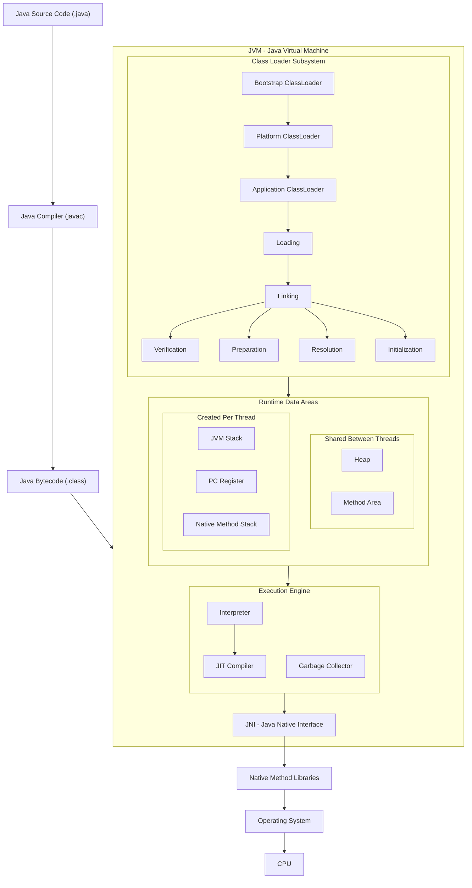

This diagram represents the main relationship:

```text
Java Source
    ↓
javac
    ↓
Bytecode
    ↓
Class Loader
    ↓
Runtime Data Areas
    ↓
Execution Engine
    ↓
JNI / Native Libraries
    ↓
Operating System
    ↓
CPU
```

---

# 3. Main Components of JVM

The JVM can be understood through these major components:

```text
JVM
│
├── 1. Class Loader Subsystem
│
├── 2. Runtime Data Areas
│   ├── Heap
│   ├── Method Area
│   ├── JVM Stack
│   ├── PC Register
│   └── Native Method Stack
│
├── 3. Execution Engine
│   ├── Interpreter
│   ├── JIT Compiler
│   └── Garbage Collector
│
└── 4. Native Interface
    ├── JNI
    └── Native Method Libraries
```

Each component solves a different problem.

---

# 4. Why does JVM have these components?

Think of JVM as a complete runtime system.

Suppose the JVM receives:

```text
CustomerService.class
```

It needs to answer several questions:

### Question 1

**How do I find and load this class?**

→ Class Loader

### Question 2

**Where do I store the class information?**

→ Method Area / Metaspace

### Question 3

**Where do I create objects?**

→ Heap

### Question 4

**Where does a thread keep its method execution state?**

→ JVM Stack

### Question 5

**Which bytecode instruction is the thread executing?**

→ PC Register

### Question 6

**How do I execute bytecode?**

→ Interpreter / JIT

### Question 7

**How do I clean objects that are no longer reachable?**

→ Garbage Collector

### Question 8

**How can Java interact with native code?**

→ JNI

So the JVM architecture is not a random collection of components.

Each component exists to solve a specific runtime problem.

---

# 5. Class Loader Subsystem

The **Class Loader Subsystem** loads Java classes into the JVM.

Suppose we have:

```java
Customer customer = new Customer();
```

Before the JVM can execute code involving `Customer`, it needs the `Customer` class definition.

The Class Loader is responsible for finding and loading that class.

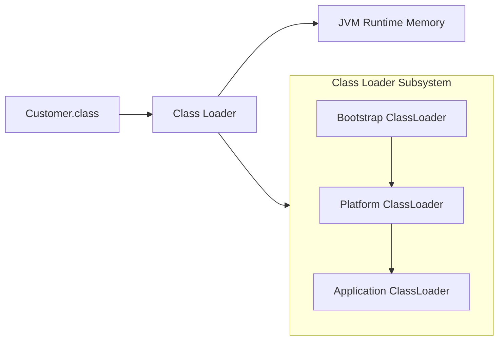

---

# 6. Why doesn't JVM load every class at startup?

Imagine a large application with:

```text
20,000 classes
```

The application may only use a few thousand during a particular execution.

Loading everything immediately would:

- Consume unnecessary memory
- Increase startup time
- Do unnecessary work

Therefore, JVM generally loads classes **when they are needed**.

Conceptually:

```text
Application starts
       |
       ↓
Load Application class
       |
       ↓
Application uses Customer
       |
       ↓
Load Customer
       |
       ↓
Customer uses Address
       |
       ↓
Load Address
```

This is why class loading is generally described as **lazy/on-demand**.

---

# 7. Types of Class Loaders

Modern Java has three important built-in class-loader levels:

```text
Bootstrap ClassLoader
        ↓
Platform ClassLoader
        ↓
Application ClassLoader
```

---

# 8. Bootstrap ClassLoader

The **Bootstrap ClassLoader** loads core Java runtime classes.

Examples include classes such as:

```java
java.lang.Object
java.lang.String
java.lang.System
java.lang.Integer
```

These are fundamental Java classes.

The Bootstrap ClassLoader is special: it is implemented by the JVM/runtime rather than being an ordinary Java class-loader object.

---

# 9. Platform ClassLoader

The **Platform ClassLoader** loads platform classes provided by the JDK.

It is the modern Java terminology corresponding to what older Java versions called the **Extension ClassLoader**.

The exact classes available depend on the Java version and modules installed.

---

# 10. Application ClassLoader

The **Application ClassLoader** loads application classes from the application classpath/module path.

For example:

```text
com.mycompany.Customer
com.mycompany.OrderService
com.mycompany.PaymentService
```

Your application classes are normally loaded through this loader.

---

# 11. Parent Delegation Model

Class loaders normally follow the **parent delegation model**.

Suppose the Application ClassLoader receives a request for:

```java
String
```

It doesn't immediately try to load the class itself.

The request is delegated toward the parent:

```text
Application ClassLoader
        ↓
Platform ClassLoader
        ↓
Bootstrap ClassLoader
```

If a parent can load the class, the parent does it.

Conceptually:

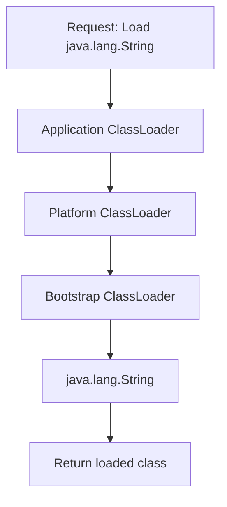

---

# 12. Why Parent Delegation?

Main reasons include:

### Security

An application should not be able to replace trusted core classes easily.

Imagine someone defines:

```java
package java.lang;

public class String {
}
```

You don't want the JVM to simply accept that class as the real `java.lang.String`.

### Consistency

Core Java classes should come from the trusted runtime/platform.

### Avoid duplicate loading

The same class shouldn't unnecessarily be loaded independently by child loaders when the parent already provides it.

---

# 13. Loading, Linking and Initialization

Class loading is usually discussed as three major phases:

```text
Loading
   ↓
Linking
   ↓
Initialization
```

Linking contains:

```text
Verification
Preparation
Resolution
```

So:

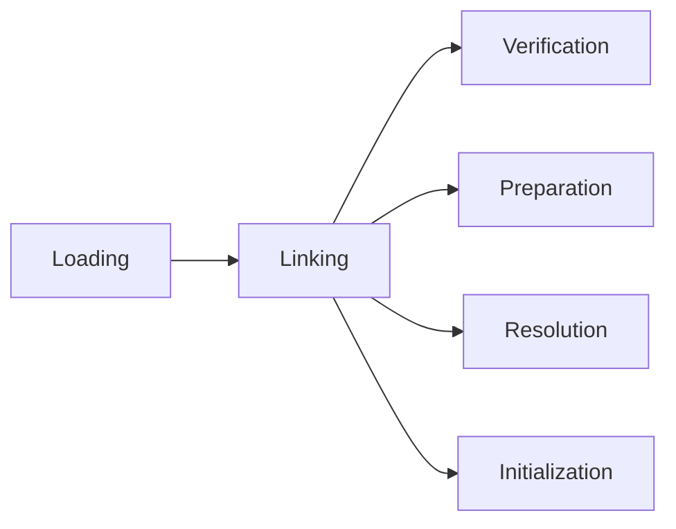

---

# 14. Loading

During **Loading**, JVM:

1. Finds the class definition
2. Reads the `.class` representation
3. Creates the runtime representation of the class

For example:

```text
Customer.class
      ↓
Class Loader
      ↓
Customer class loaded into JVM
```

---

# 15. Verification

Verification checks whether the bytecode is valid and safe to execute.

The JVM checks things such as:

- Correct bytecode structure
- Valid instructions
- Type correctness
- Valid stack usage
- Access rules

Think of verification as:

> "Is this bytecode valid enough for the JVM to execute safely?"

---

# 16. Preparation

Preparation allocates memory for class-level/static fields and assigns their **default values**.

Example:

```java
class Test {

    static int count = 10;
}
```

During preparation, conceptually:

```text
count = 0
```

because `0` is the default value for `int`.

The explicit:

```java
count = 10;
```

belongs to class initialization.

This distinction is important.

---

# 17. Resolution

Class files contain symbolic references.

For example, bytecode may contain a symbolic reference to:

```text
Customer.getName()
```

Resolution turns symbolic references into runtime references the JVM can use.

Resolution may happen lazily depending on the JVM implementation and when the reference is actually needed.

---

# 18. Initialization

Initialization executes the class's static initialization.

Example:

```java
class Test {

    static int count = 10;

    static {
        System.out.println("Initializing Test");
    }
}
```

During initialization:

```text
count = 10
static block executes
```

So remember:

```text
Preparation
    ↓
Default values

Initialization
    ↓
Explicit static initialization
```

---

# 19. Runtime Data Areas

After classes are loaded, the JVM needs memory for execution.

These memory areas are called **Runtime Data Areas**.

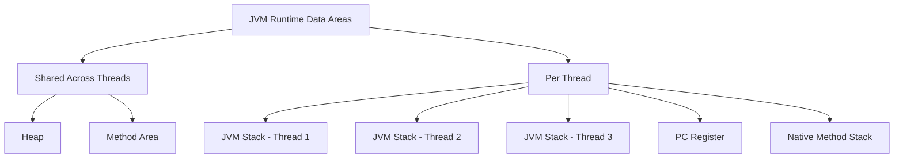

The most important distinction is:

```text
Shared
├── Heap
└── Method Area

Per Thread
├── JVM Stack
├── PC Register
└── Native Method Stack
```

---

# 20. Heap

The **Heap** is the runtime memory area where Java objects and arrays are allocated.

Example:

```java
Customer customer = new Customer();
```

Conceptually:

```text
Stack                     Heap

customer ───────────────→ Customer object
```

The variable `customer` is a reference associated with the executing method.

The object created by:

```java
new Customer()
```

is conceptually a heap object.

---

# 21. Why is Heap shared?

Suppose we have:

```text
Thread 1
Thread 2
Thread 3
```

All threads can potentially access the same objects.

For example:

```java
class Counter {
    int value;
}
```

Multiple threads may have references to the same `Counter` object.

Therefore, heap memory is shared between threads.

This is also why shared mutable objects can create concurrency problems.

For example:

```java
counter.value++;
```

from multiple threads may require synchronization or another concurrency strategy.

---

# 22. Garbage Collector and Heap

The Garbage Collector primarily manages objects in the heap.

Example:

```java
Customer customer = new Customer();

customer = null;
```

If no other live reference points to the object:

```text
Customer Object
      ↑
      X

No reachable reference
        ↓
Eligible for GC
```

Important:

> Eligible for GC does not mean immediately deleted.

The GC decides when memory should be reclaimed.

---

# 23. Generational Heap Concept

Many JVM garbage collectors use generational concepts.

The traditional model is:

```text
Heap
│
├── Young Generation
│   ├── Eden
│   └── Survivor
│
└── Old Generation
```

New objects generally start in young regions.

Objects that survive collections may eventually be promoted to older regions.

The exact physical implementation depends on the garbage collector.

For example, G1 organizes the heap into regions rather than using exactly the traditional contiguous young/old layout.

So understand the concept rather than memorizing one physical diagram.

---

# 24. Why Generational Garbage Collection?

Most applications create many temporary objects.

Example:

```java
for (int i = 0; i < 1_000_000; i++) {
    new TemporaryObject();
}
```

Many of those objects may become unreachable quickly.

Therefore, it makes sense to collect short-lived objects frequently.

This is based on the commonly observed principle:

> **Most objects die young.**

---

# 25. Method Area

The **Method Area** is a JVM specification concept for storing class-level runtime information.

It can contain information such as:

- Class metadata
- Method information
- Field information
- Runtime constant pool
- Other class-level runtime structures

The specification defines the logical area, but does not force one exact physical implementation.

---

# 26. Metaspace

In **HotSpot**, class metadata is stored in **Metaspace**.

Java 7 and earlier commonly used **PermGen**.

Java 8 replaced PermGen with Metaspace.

Conceptually:

```text
JVM Process

Java Heap
    |
    | separate
    ↓
Metaspace
```

Metaspace uses native memory rather than being part of the normal Java heap.

---

# 27. Why was PermGen replaced?

PermGen was a fixed/limited area in older HotSpot implementations and could cause:

```text
OutOfMemoryError: PermGen space
```

Metaspace uses native memory and can grow according to available/configured limits.

But this does **not** mean Metaspace is unlimited.

It can still fail with:

```text
OutOfMemoryError: Metaspace
```

---

# 28. JVM Stack

Every Java thread has its own **JVM Stack**.

When a method is called, the JVM creates a **stack frame** for that method.

Example:

```java
public int add(int a, int b) {

    int result = a + b;

    return result;
}
```

Conceptually:

```text
Thread
  |
  ↓
JVM Stack
  |
  ├── add() frame
  │     ├── local variables
  │     ├── operand stack
  │     └── method execution information
  │
  └── caller frame
```

---

# 29. Stack Frame

Each method invocation gets a stack frame.

A frame conceptually contains:

```text
Stack Frame
│
├── Local Variable Array
├── Operand Stack
├── Reference to runtime constant-pool information
└── Return / execution information
```

For:

```java
int add(int a, int b) {
    return a + b;
}
```

the parameters `a` and `b`, along with other local execution state, are represented in the frame.

When the method returns:

```text
add() frame
     ↓
removed
```

---

# 30. Why does every thread have its own stack?

Consider:

```text
Thread 1 → method A
Thread 2 → method B
Thread 3 → method C
```

Each thread has an independent method-execution chain.

Therefore:

```text
Thread 1 → Stack 1
Thread 2 → Stack 2
Thread 3 → Stack 3
```

This allows each thread to maintain its own local execution state.

---

# 31. StackOverflowError

Because every thread has a stack with a finite configured/implementation-defined capacity, excessive method nesting can cause:

```java
void test() {
    test();
}
```

The flow becomes:

```text
test()
 ↓
test()
 ↓
test()
 ↓
test()
 ↓
...
```

Eventually the thread's stack cannot grow further:

```text
StackOverflowError
```

---

# 32. Stack vs Heap

A common conceptual diagram:

```text
Thread Stack                     Shared Heap

┌───────────────┐               ┌────────────────────┐
│ main() frame  │               │                    │
│               │               │ Customer object    │
│ customer ────────────────→    │                    │
└───────────────┘               │                    │
                                │ Order object       │
┌───────────────┐               │                    │
│ worker()      │               └────────────────────┘
│ frame         │
└───────────────┘
```

### Stack

- Per thread
- Contains stack frames
- Represents method execution
- Automatically unwound when methods return

### Heap

- Shared
- Contains objects/arrays conceptually
- Managed mainly by GC

### Important

Don't say:

> "All primitives are stored on stack and all objects are stored on heap."

That is an oversimplification.

The JVM specification defines runtime behavior, not a simplistic physical-memory rule for every variable.

JIT optimizations can change the physical representation.

A safer explanation is:

> **Conceptually, method-local execution state belongs to stack frames and objects are heap objects, while the JIT may optimize their physical representation.**

---

# 33. PC Register

PC means **Program Counter**.

Each Java thread has its own PC register.

It tracks the current JVM instruction being executed by that thread.

Think of it as:

> "Where am I currently executing?"

Example:

```text
Bytecode instructions:

10
11
12  ← current
13
14
```

The PC identifies the current execution position.

---

# 34. Why does every thread need its own PC?

Suppose:

```text
Thread 1 → executing instruction 100
Thread 2 → executing instruction 250
Thread 3 → executing instruction 50
```

Each thread has a different execution position.

Therefore each thread needs its own PC.

---

# 35. Native Method Stack

Java can call native methods written outside Java, commonly through JNI.

For example:

```java
public native void doSomething();
```

When native code executes, the JVM can use the native method stack associated with native execution.

Conceptually:

```text
Java method
     ↓
JNI
     ↓
Native method
     ↓
Native Method Stack
```

The exact implementation details are JVM-specific.

---

# 36. Execution Engine

After classes are loaded and runtime memory is available, the JVM must execute bytecode.

This is handled by the **Execution Engine**.

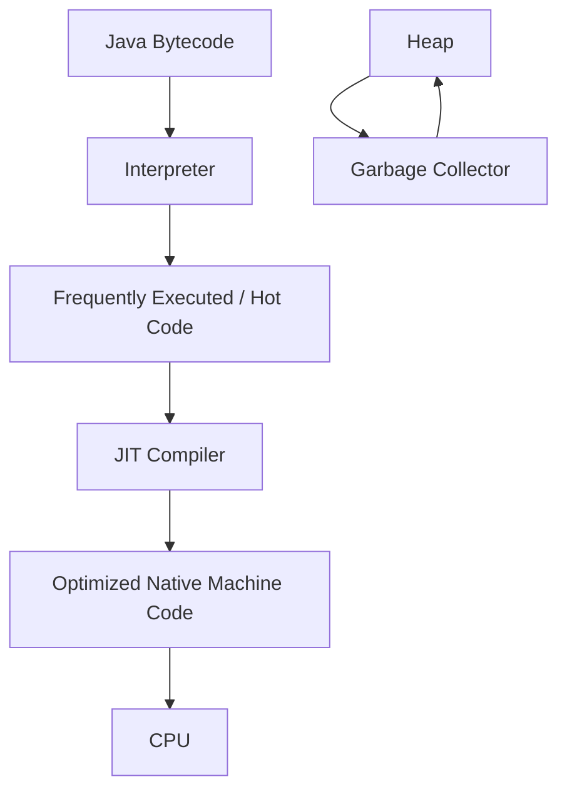

The important execution components are:

```text
Execution Engine
│
├── Interpreter
├── JIT Compiler
└── Garbage Collector
```

---

# 37. Interpreter

The Interpreter executes bytecode instructions.

Conceptually:

```text
Bytecode instruction
       ↓
Interpret
       ↓
Execute
       ↓
Next instruction
       ↓
Interpret
       ↓
Execute
```

The advantage is **fast startup**.

The JVM doesn't have to spend a lot of time compiling every method before the application can start running.

---

# 38. Why not compile everything immediately?

Suppose an application contains:

```text
10,000 methods
```

but during a particular execution only:

```text
500 methods
```

are frequently used.

Compiling all 10,000 methods immediately would waste:

- CPU
- startup time
- memory

Instead, the JVM can start execution and use runtime profiling to determine which code becomes important.

---

# 39. JIT Compiler

JIT means:

> **Just-In-Time Compiler**

The JIT compiler compiles suitable frequently executed bytecode into native machine code.

The flow is:

```text
Bytecode
   ↓
Interpreter
   ↓
Runtime profiling
   ↓
Hot code identified
   ↓
JIT compilation
   ↓
Native machine code
   ↓
CPU
```

The major benefit is improved performance for long-running code.

---

# 40. Why is JIT called "Just-In-Time"?

Because compilation happens **during program execution**, rather than everything being compiled ahead of time into native machine code.

Java starts with bytecode.

Then, while the program is running, the JVM learns about the actual runtime behavior and can optimize important code.

This is one of the reasons JVM applications can become faster after warming up.

---

# 41. JIT Optimizations

The JIT can perform many runtime optimizations.

Examples include:

- Method inlining
- Dead-code elimination
- Loop optimizations
- Escape analysis
- Lock optimizations
- Devirtualization in suitable cases
- Architecture-specific optimizations

---

# 42. Method Inlining

Consider:

```java
int add(int a, int b) {
    return a + b;
}
```

and:

```java
int result = add(10, 20);
```

If this method becomes hot, the JIT may inline it.

Conceptually:

```text
Before:

result = add(10, 20)


After optimization:

result = 10 + 20
```

This is not a Java source-code transformation.

It is an optimization performed on the compiled representation.

---

# 43. Escape Analysis

The JIT can analyze whether an object escapes a method or thread.

Example:

```java
void test() {

    Person p = new Person();

    p.setName("John");
}
```

If the object doesn't escape the method, the JIT may be able to optimize its allocation.

Possible optimization techniques include scalar replacement.

Therefore:

> `new` in Java source code does not guarantee that the JVM must perform a traditional heap allocation that remains visible in the generated machine code.

---

# 44. Garbage Collector

The **Garbage Collector (GC)** automatically reclaims memory occupied by objects that are no longer reachable.

Example:

```java
Customer customer = new Customer();

customer = null;
```

If no other live reference exists:

```text
Customer Object
      ↓
Unreachable
      ↓
Eligible for GC
```

The GC can eventually reclaim the memory.

---

# 45. How does GC know an object is unused?

Modern garbage collectors use the concept of **reachability**.

They start from **GC roots**.

Examples of roots can include references associated with:

- Active thread stacks
- Static references
- JNI/native references
- Other JVM runtime structures

Conceptually:

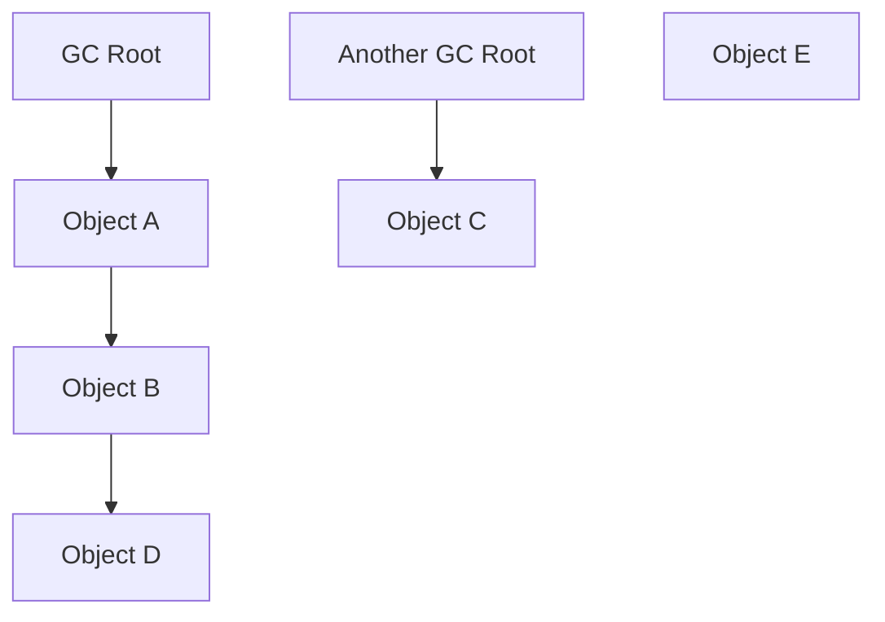

Objects reachable from roots remain live.

Objects with no path from any GC root can become eligible for collection.

---

# 46. Garbage Collection is not simply "delete unused variables"

This is an important concept.

GC does not ask:

> "Was this variable used recently?"

It asks approximately:

> "Can this object still be reached from the GC roots?"

For example:

```java
Customer c1 = new Customer();
Customer c2 = c1;

c1 = null;
```

The object is still reachable:

```text
c2
 ↓
Customer
```

Therefore it is not eligible just because `c1` became null.

---

# 47. Common Garbage Collectors

Depending on the Java version and JVM distribution, commonly encountered HotSpot collectors include:

```text
Serial GC
Parallel GC
G1 GC
ZGC
Shenandoah
```

Each makes different trade-offs involving:

- Throughput
- Pause time
- Heap size
- CPU overhead
- Application latency

---

# 48. G1 GC

G1 means:

> Garbage-First Garbage Collector

Instead of thinking of the heap only as:

```text
Young → Old
```

G1 divides the heap into many regions.

Conceptually:

```text
Heap

┌────┬────┬────┬────┐
│ R1 │ R2 │ R3 │ R4 │
├────┼────┼────┼────┤
│ R5 │ R6 │ R7 │ R8 │
├────┼────┼────┼────┤
│ R9 │R10 │R11 │R12 │
└────┴────┴────┴────┘
```

G1 can prioritize regions with more reclaimable garbage.

It is designed to balance throughput and pause-time goals.

---

# 49. ZGC

ZGC is designed for very low pause times and supports large heaps.

A major design goal is to perform much of the GC work concurrently with application execution.

It is particularly useful when:

```text
Large heap
+
Strict latency requirements
```

are important.

---

# 50. JNI

JNI means:

> **Java Native Interface**

JNI allows Java code to interact with native code.

Conceptually:

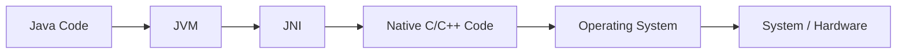

JNI can be useful when Java needs to access:

- Native libraries
- Operating-system functionality
- Existing C/C++ code
- Hardware/system APIs

---

# 51. Native Method Libraries

Native method libraries contain native code used by the JVM or Java application.

Conceptually:

```text
Java
 ↓
JVM
 ↓
JNI
 ↓
Native Library
 ↓
Operating System
```

Examples include native implementations for certain platform-level operations.

---

# 52. Complete JVM Execution Flow

Now combine everything.

Suppose we have:

```java
public class OrderService {

    static int count = 10;

    public static void main(String[] args) {

        Order order = new Order(100);

        System.out.println(order);
    }
}
```

The runtime flow is approximately:

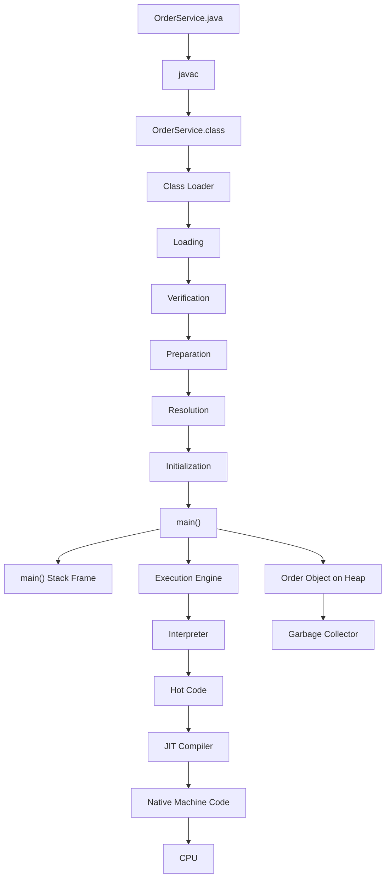

---

# 53. What happens to `static int count = 10`?

Consider:

```java
class OrderService {

    static int count = 10;
}
```

The flow is:

```text
Class Loading
     ↓
Preparation
     ↓
count gets default value 0
     ↓
Initialization
     ↓
count becomes 10
```

So:

```text
Preparation → default value
Initialization → explicit static initialization
```

---

# 54. What happens when `new Order()` executes?

Consider:

```java
Order order = new Order(100);
```

Conceptually:

```text
Thread
  |
  | executing main()
  ↓
JVM Stack
  |
  | order reference
  ↓
Heap
  |
  └── Order object
```

The object is allocated as part of heap management.

The JIT may optimize physical allocation in some cases, but conceptually the Java object is a heap object.

---

# 55. What happens when a method is called?

Suppose:

```java
public static void main(String[] args) {

    calculate();
}

static void calculate() {

    int x = 10;
}
```

Conceptually:

```text
JVM Stack

┌─────────────────┐
│ calculate()     │
│ x = 10          │
├─────────────────┤
│ main()          │
│                 │
└─────────────────┘
```

When `calculate()` returns:

```text
┌─────────────────┐
│ main()          │
└─────────────────┘
```

The `calculate()` frame is removed.

---

# 56. JVM Thread Architecture

Suppose an application creates three threads:

```text
Thread-1
Thread-2
Thread-3
```

The JVM has shared runtime areas and per-thread areas.

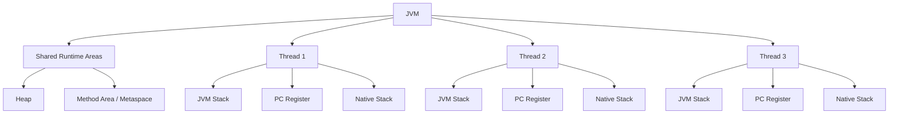

This distinction is extremely important for understanding concurrency.

---

# 57. Why is Heap shared but Stack private?

Consider:

```java
class Counter {

    int count;
}
```

Two threads may have:

```text
Thread 1 ──────┐
               ↓
             Counter
               ↑
Thread 2 ──────┘
```

Both threads can access the same heap object.

But each thread needs independent method execution state:

```text
Thread 1 → Stack 1
Thread 2 → Stack 2
```

Therefore:

```text
Heap → shared
Stack → per thread
```

This is the foundation for understanding many Java concurrency issues.

---

# 58. JVM Memory and OS Memory

A very important production concept is:

> The Java heap is not the same thing as total JVM process memory.

For example:

```bash
-Xmx2g
```

means approximately:

> Maximum Java heap size is 2 GB.

It does **not** mean:

> The entire JVM process can use only 2 GB.

The process can also consume memory for:

```text
JVM Process Memory
│
├── Java Heap
├── Metaspace
├── Thread Stacks
├── Code Cache / JIT related memory
├── Direct Buffers
├── Native Libraries
├── GC structures
└── Other native JVM memory
```

Therefore, an application can potentially have:

```text
-Xmx2g
```

and still consume more than 2 GB of process/container memory.

This is very important when diagnosing container memory limits and `OutOfMemoryError` problems.

---

# 59. Important JVM Errors

Understanding the architecture helps understand JVM errors.

## StackOverflowError

Usually caused by excessive stack usage.

Example:

```java
void test() {
    test();
}
```

Result:

```text
StackOverflowError
```

---

## OutOfMemoryError: Java heap space

Usually means the JVM could not satisfy an object allocation in the Java heap.

Possible causes:

```text
Too many live objects
Memory leak
Very large objects
Insufficient heap
Unexpected workload
```

---

## OutOfMemoryError: Metaspace

Usually associated with excessive class metadata usage.

Possible causes:

```text
Huge number of classes
Dynamic class generation
Class-loader leaks
Repeated application redeployment problems
```

---

# 60. ClassLoader Leak

This is an important real-world JVM problem.

Suppose an application server deploys:

```text
Application A
     ↓
ClassLoader A
     ↓
Application classes
```

When the application is undeployed, ideally the class loader becomes unreachable:

```text
Application A
     ↓
ClassLoader A
     ↓
No external references
```

Then its classes can eventually become eligible for unloading.

But suppose some global/static object keeps a reference:

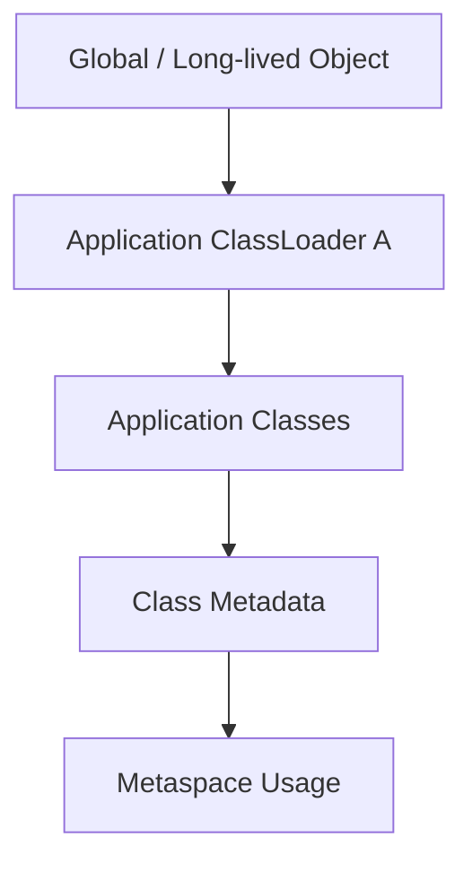

Then the class loader remains reachable.

Its classes cannot be unloaded.

Repeated deployments can cause:

```text
ClassLoader leak
     ↓
Class metadata remains
     ↓
Metaspace keeps growing
     ↓
OutOfMemoryError: Metaspace
```

This is why class-loader lifecycle is important in:

- Application servers
- Plugin systems
- Dynamic module systems
- Hot deployment systems

---

# 61. Class Unloading

A class can generally be unloaded when its defining class loader becomes unreachable and the JVM determines that the class metadata can be reclaimed.

Therefore:

```text
Class
  ↓
Defining ClassLoader
  ↓
ClassLoader becomes unreachable
  ↓
Class becomes eligible for unloading
```

This is another reason why class-loader leaks can cause memory problems.

---

# 62. JVM Shutdown

Eventually the JVM shuts down.

For a normal command-line application:

```java
public static void main(String[] args) {
    System.out.println("Hello");
}
```

after the main thread completes and there are no remaining non-daemon threads keeping the JVM alive, the JVM can shut down.

Conceptually:

```text
Application starts
       ↓
JVM starts
       ↓
main()
       ↓
Application work
       ↓
Non-daemon threads finish
       ↓
Shutdown
```

JVM shutdown can also happen because of explicit termination or external process termination.

---

# 63. What exactly happens from `.java` to CPU?

The complete conceptual journey is:

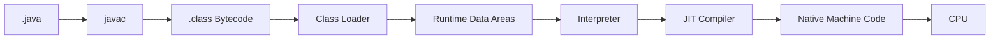

The important point is:

> The JVM does not simply translate the entire Java application into machine code once and execute it.

It is a **runtime execution environment** that can interpret bytecode, profile execution, compile hot code, optimize it, manage memory, and provide runtime services.

---

# 64. JVM vs JDK vs JRE

These are related but different.

```text
JDK
│
├── Development Tools
│   ├── javac
│   ├── javadoc
│   └── other tools
│
└── Runtime
    ├── JVM
    └── Java runtime components
```

### JVM

Executes bytecode.

### JRE

Historically described the runtime environment containing JVM + runtime libraries.

### JDK

Provides development tools plus the runtime.

Modern Java distributions no longer follow the old model of separately installing a standalone JRE in the same way older Java releases did.

For modern Java, think primarily in terms of the **JDK**, which provides the tools and runtime needed to develop and run Java applications.

---

# 65. JVM vs Operating System

JVM is not the operating system.

The relationship is:

```text
Java Application
       ↓
JVM
       ↓
Operating System
       ↓
Hardware / CPU
```

The JVM provides an abstraction layer.

For example, Java bytecode does not need to know the exact native instruction set of the machine.

The JVM implementation for that platform handles the platform-specific execution.

---

# 66. Why is Java Platform Independent but JVM Platform Dependent?

This is a very common interview question.

Java source is compiled into:

```text
Platform-independent bytecode
```

But the JVM itself must understand the underlying machine.

So:

```text
                    Bytecode
                       |
          ┌────────────┼────────────┐
          ↓            ↓            ↓
     Windows JVM   Linux JVM    macOS JVM
          ↓            ↓            ↓
       Windows       Linux        macOS
```

Therefore:

> **Java bytecode is platform-independent, while the JVM implementation is platform-dependent.**

---

# 67. Important JVM Memory Model Clarification

Do not confuse:

```text
JVM Runtime Data Areas
```

with the **Java Memory Model (JMM)**.

They are different concepts.

### JVM Runtime Data Areas

Describe runtime memory areas such as:

```text
Heap
Stack
Method Area
PC Register
Native Stack
```

### Java Memory Model

Defines rules for:

```text
Threads
Visibility
Ordering
Happens-before
Synchronization
Volatile
Atomic operations
```

So:

```text
JVM Memory Architecture ≠ Java Memory Model
```

They are related to runtime behavior but solve different problems.

---

# 68. What, Why, When, Where and Which?

## Class Loader

**What?**

Loads classes.

**Why?**

JVM needs class definitions before execution.

**When?**

When classes are required.

**Where?**

Class definitions and runtime metadata are represented in JVM runtime memory.

**Which?**

Bootstrap, Platform, Application, plus custom class loaders.

---

## Heap

**What?**

Shared runtime area for objects and arrays.

**Why?**

Objects need dynamically managed memory.

**When?**

Whenever objects/arrays are allocated.

**Where?**

Within the JVM's managed heap.

**Which manages it?**

Garbage Collector.

---

## JVM Stack

**What?**

Per-thread execution stack.

**Why?**

Each thread needs independent method execution state.

**When?**

Whenever Java methods execute.

**Where?**

Each Java thread has its own stack.

---

## PC Register

**What?**

Tracks the current execution position for a thread.

**Why?**

Each thread needs to know where it is executing.

**When?**

During thread execution.

**Where?**

Each thread has its own PC register.

---

## Method Area

**What?**

Logical runtime area for class-level information.

**Why?**

JVM needs metadata about loaded classes.

**When?**

When classes are loaded and used.

**Where?**

Implementation-dependent; in HotSpot, class metadata is primarily associated with Metaspace.

---

## Interpreter

**What?**

Executes bytecode instructions.

**Why?**

Provides fast startup without compiling everything first.

**When?**

Especially important during initial execution and for code that isn't worth compiling.

---

## JIT

**What?**

Runtime compiler.

**Why?**

To optimize frequently executed code.

**When?**

When runtime profiling identifies suitable hot code.

---

## Garbage Collector

**What?**

Automatic memory management system.

**Why?**

Reclaims memory from unreachable objects.

**When?**

When the JVM determines collection work is appropriate.

---

## JNI

**What?**

Java Native Interface.

**Why?**

Allows Java/native interoperability.

**When?**

When Java needs native functionality.

---

# 69. JVM Architecture — Final Mental Model

If you want to understand the JVM deeply, remember it as four major responsibilities:

```text
                     JVM
                      |
       ┌──────────────┼──────────────┐
       ↓              ↓              ↓
     LOAD           STORE          EXECUTE
       |              |              |
 Class Loader    Runtime Areas    Execution Engine
                                    |
                              ┌─────┼─────┐
                              ↓     ↓     ↓
                         Interpreter JIT   GC
```

And for native integration:

```text
JVM
 ↓
JNI
 ↓
Native Libraries
 ↓
Operating System
 ↓
CPU
```

---

# 70. Complete JVM Architecture — Revision Diagram

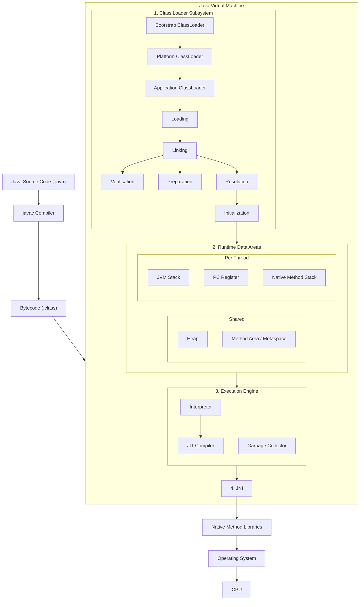

---

# 71. One Complete Example to Remember

Consider:

```java
public class EmployeeService {

    static int count = 10;

    public static void main(String[] args) {

        Employee employee =
                new Employee("John");

        printEmployee(employee);
    }

    static void printEmployee(Employee employee) {

        System.out.println(employee);
    }
}
```

Think about the JVM execution like this:

```text
EmployeeService.java
        ↓
       javac
        ↓
EmployeeService.class
        ↓
Class Loader
        ↓
Loading
        ↓
Verification
        ↓
Preparation
        ↓
Resolution
        ↓
Initialization
        ↓
main()
        ↓
main() stack frame
        |
        └──────────────→ Employee object in Heap
                              |
                              ↓
                       printEmployee()
                              |
                              ↓
                     New stack frame
                              |
                              ↓
                       Method executes
                              |
                              ↓
                     Frame removed
                              |
                              ↓
                       main() continues
                              |
                              ↓
                            Exit
```

While the application is running:

```text
Interpreter
    ↓
Runtime profiling
    ↓
Hot code
    ↓
JIT
    ↓
Optimized native code
    ↓
CPU
```

At the same time:

```text
Heap
 ↓
Garbage Collector
 ↓
Reclaim unreachable objects
```

And if native functionality is required:

```text
Java
 ↓
JNI
 ↓
Native Library
 ↓
OS
 ↓
CPU
```

That is the JVM architecture as a complete system.

---

# 72. Final Summary

The JVM is best understood as a runtime system with several cooperating parts:

```text
                    JVM
                     |
       ┌─────────────┼─────────────┐
       ↓             ↓             ↓
 Class Loader    Runtime Memory   Execution
       |             |             |
       |          ┌──┴──┐       ┌──┼───┐
       |          |     |       |  |   |
       |        Heap  Method  Interpreter JIT
       |        Area   Area        |
       |          |                |
       |          ↓                ↓
       |          GC           Native Code
       |                           |
       └───────────────────────────┘
                                   ↓
                                  JNI
                                   ↓
                              Native Library
                                   ↓
                                   OS
                                   ↓
                                  CPU
```

The most important relationships to remember are:

```text
Class Loader
    → loads classes

Heap
    → stores objects/arrays conceptually

Method Area
    → stores class-level runtime information

JVM Stack
    → stores method execution frames per thread

PC Register
    → tracks thread execution position

Native Method Stack
    → supports native method execution

Interpreter
    → executes bytecode

JIT
    → compiles hot code into optimized native code

Garbage Collector
    → reclaims unreachable objects

JNI
    → connects Java with native code

CPU
    → ultimately executes machine instructions
```

The entire JVM can therefore be remembered as:

```text
LOAD
  ↓
Class Loader

STORE
  ↓
Runtime Data Areas

EXECUTE
  ↓
Interpreter + JIT

MANAGE MEMORY
  ↓
Garbage Collector

CONNECT TO NATIVE WORLD
  ↓
JNI + Native Libraries
```

And the overall journey is:

```text
.java
 ↓
javac
 ↓
.class bytecode
 ↓
Class Loader
 ↓
Runtime Data Areas
 ↓
Interpreter / JIT
 ↓
Native Machine Instructions
 ↓
CPU
```

This mental model is more useful than memorizing isolated JVM component definitions because it explains **why each component exists and how the components work together**.