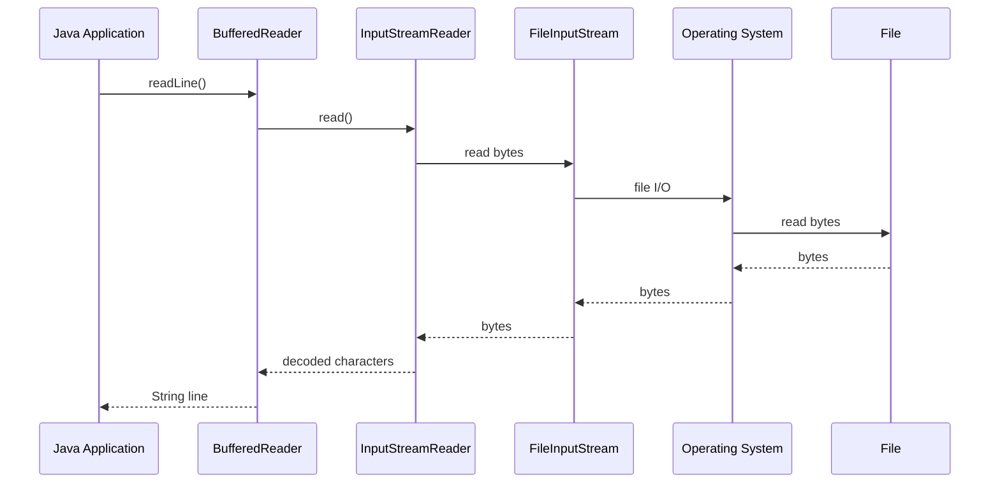
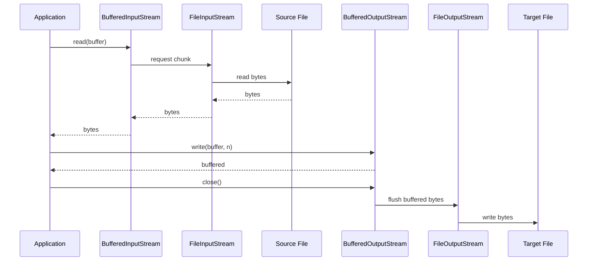
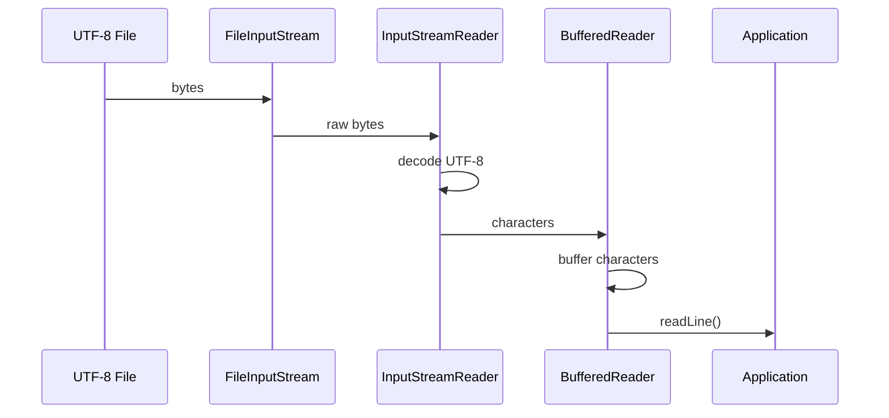

# Java File Handling Explained | Streams, Buffers, Readers & Writers

> **Interview-focused notes covering:** `InputStream`, `OutputStream`, buffering, `DataStream`, object serialization, character streams, `Reader`, `Writer`, and the Decorator Design Pattern.

---

## 1. Big Picture

Java provides different APIs for working with files depending on **what kind of data** we are handling.

### Two major categories

```text
                    Java I/O
                       |
             +---------+---------+
             |                   |
        Byte Streams        Character Streams
             |                   |
       InputStream          Reader
       OutputStream         Writer
             |                   |
      Binary data          Text data
      images, PDF,         String, characters,
      audio, etc.           text files
```

### Common classes

| Requirement | Classes |
|---|---|
| Read bytes | `FileInputStream` |
| Write bytes | `FileOutputStream` |
| Faster byte I/O | `BufferedInputStream`, `BufferedOutputStream` |
| Read/write primitives | `DataInputStream`, `DataOutputStream` |
| Read/write objects | `ObjectInputStream`, `ObjectOutputStream` |
| Convert bytes ↔ characters | `InputStreamReader`, `OutputStreamWriter` |
| Buffered text I/O | `BufferedReader`, `BufferedWriter` |

---

# 2. What is a Stream?

A **stream** represents a flow of data.

Think of it like a pipe:

```text
File  --->  Stream  --->  Java Program
```

For writing:

```text
Java Program  --->  Stream  --->  File
```

A stream doesn't necessarily mean a file.

Streams can work with:

- Files
- Network connections
- Memory
- Byte arrays
- Pipes
- Other streams

---

# 3. InputStream vs OutputStream

## InputStream

Used to **read data into the application**.

```text
File
 |
 | data
 v
InputStream
 |
 v
Java Program
```

Main method:

```java
int read()
```

---

## OutputStream

Used to **write data from the application**.

```text
Java Program
 |
 | data
 v
OutputStream
 |
 v
File
```

Main method:

```java
void write(...)
```

---

# 4. Byte Streams

The root classes are:

```java
java.io.InputStream
java.io.OutputStream
```

They work with **bytes**.

A byte is 8 bits.

```text
1 byte = 8 bits
```

Byte streams are appropriate for:

- Images
- PDFs
- Videos
- Audio
- ZIP files
- Binary files
- Raw file data

---

# 5. FileInputStream

`FileInputStream` reads bytes from a file.

```java
FileInputStream fis = new FileInputStream("input.txt");

int data;

while ((data = fis.read()) != -1) {
    System.out.print((char) data);
}

fis.close();
```

### Important

`read()` returns:

```java
int
```

not `byte`.

Why?

Because Java needs a special value:

```text
-1 = End Of File
```

Valid byte values are represented in the lower 8 bits.

---

# 6. FileOutputStream

Used to write bytes to a file.

```java
FileOutputStream fos =
        new FileOutputStream("output.txt");

fos.write(65);
fos.write(66);
fos.write(67);

fos.close();
```

The file contains:

```text
ABC
```

because:

```text
65 -> A
66 -> B
67 -> C
```

---

# 7. Copying a File

A basic file-copy implementation:

```java
try (
    FileInputStream fis = new FileInputStream("input.txt");
    FileOutputStream fos = new FileOutputStream("output.txt")
) {

    int data;

    while ((data = fis.read()) != -1) {
        fos.write(data);
    }
}
```

This works, but there is a performance problem.

---

# 8. Problem with Reading One Byte at a Time

Consider a large file:

```text
1 GB file
```

If we do:

```java
fis.read();
```

for every byte, we may perform a huge number of read operations.

Conceptually:

```text
Application
    |
    | read 1 byte
    v
Operating System
    |
    v
File

Application
    |
    | read 1 byte
    v
Operating System
    |
    v
File

Application
    |
    | read 1 byte
    v
Operating System
    |
    v
File
```

System calls / I/O operations are relatively expensive.

So we use **buffering**.

---

# 9. BufferedInputStream

`BufferedInputStream` adds a buffer around another `InputStream`.

```java
InputStream
     |
     v
BufferedInputStream
     |
     v
Application
```

Example:

```java
try (
    BufferedInputStream bis =
        new BufferedInputStream(
            new FileInputStream("input.txt")
        )
) {

    int data;

    while ((data = bis.read()) != -1) {
        System.out.print((char) data);
    }
}
```

---

# 10. What Does Buffering Do?

Instead of:

```text
read 1 byte
read 1 byte
read 1 byte
read 1 byte
...
```

the buffer reads a **larger chunk** internally.

```text
                 Buffer
              +---------+
File -------> | A B C D |
              +---------+
                  |
                  v
             Application
```

When the application requests one byte:

```text
Application -> Buffer
```

rather than immediately going to the file every time.

---

# 11. BufferedOutputStream

Similarly, `BufferedOutputStream` buffers writes.

```java
try (
    BufferedOutputStream bos =
        new BufferedOutputStream(
            new FileOutputStream("output.txt")
        )
) {

    bos.write("Hello World".getBytes());
}
```

Data can first accumulate in memory:

```text
Application
    |
    v
Buffer
+----------------+
| Hello World... |
+----------------+
    |
    | larger write
    v
File
```

When the stream is flushed or closed, buffered data is written.

---

# 12. Why close() Matters

Consider:

```java
BufferedOutputStream bos = ...;

bos.write(data);
```

The data may still be inside the buffer.

Therefore:

```java
bos.close();
```

is important.

Closing generally flushes buffered output and releases resources.

Better:

```java
try (BufferedOutputStream bos = ...) {
    bos.write(data);
}
```

This uses **try-with-resources**.

---

# 13. flush() vs close()

### `flush()`

Pushes buffered data to the underlying stream.

```java
bos.flush();
```

The stream remains usable.

### `close()`

Usually:

1. Flushes buffered output
2. Closes the stream
3. Releases resources

```java
bos.close();
```

After closing, you should not continue using the stream.

---

# 14. Decorator Design Pattern

This is one of the most important concepts in traditional Java I/O.

Instead of creating a separate class for every possible combination:

```text
FileInputStream
BufferedFileInputStream
DataBufferedFileInputStream
...
```

Java allows us to **wrap streams**.

Example:

```java
InputStream
    |
    v
FileInputStream
    |
    v
BufferedInputStream
    |
    v
DataInputStream
```

Code:

```java
DataInputStream dis =
    new DataInputStream(
        new BufferedInputStream(
            new FileInputStream("data.bin")
        )
    );
```

Each layer adds behavior.

---

# 15. Decorator Pattern Mental Model

Think of a coffee:

```text
Coffee
  |
  +-- Milk
       |
       +-- Sugar
            |
            +-- Whipped Cream
```

Similarly:

```text
FileInputStream
       |
       +-- BufferedInputStream
              |
              +-- DataInputStream
```

Each wrapper **decorates** the underlying stream.

---

# 16. Why Decorator Pattern?

Without decorators, Java might need classes such as:

```text
BufferedFileInputStream
DataFileInputStream
BufferedDataFileInputStream
...
```

Combinations grow rapidly.

Decorator allows composition:

```java
new BufferedInputStream(
    new FileInputStream(...)
)
```

Advantages:

- Flexible
- Reusable
- Composable
- Follows composition over inheritance
- Each class has a focused responsibility

---

# 17. DataInputStream

`DataInputStream` allows us to read Java primitive types directly.

For example:

```java
int
long
float
double
boolean
char
UTF String
```

Example:

```java
DataInputStream dis =
    new DataInputStream(
        new FileInputStream("data.bin")
    );

int age = dis.readInt();
double salary = dis.readDouble();
boolean active = dis.readBoolean();

dis.close();
```

---

# 18. DataOutputStream

Used to write primitive values.

```java
DataOutputStream dos =
    new DataOutputStream(
        new FileOutputStream("data.bin")
    );

dos.writeInt(25);
dos.writeDouble(50000.50);
dos.writeBoolean(true);

dos.close();
```

---

# 19. Important: Read and Write Order Must Match

Suppose we write:

```java
dos.writeInt(25);
dos.writeDouble(50000.50);
dos.writeBoolean(true);
```

We must read in the same order:

```java
int age = dis.readInt();
double salary = dis.readDouble();
boolean active = dis.readBoolean();
```

Do not do:

```java
double salary = dis.readDouble();
int age = dis.readInt();
```

because the binary representation/order does not match.

---

# 20. DataStream Is Not a General Serialization Format

This:

```java
DataOutputStream
```

writes primitive values in Java's data format.

It does **not** automatically create a portable JSON-like representation.

For APIs and cross-language communication, formats such as:

```text
JSON
Protocol Buffers
Avro
```

are often more appropriate.

---

# 21. ObjectOutputStream

Java also provides object serialization.

```java
ObjectOutputStream
```

can write objects.

Example:

```java
class User implements Serializable {

    private String name;
    private int age;

    // constructor/getters/setters
}
```

Writing:

```java
User user = new User("John", 25);

try (
    ObjectOutputStream oos =
        new ObjectOutputStream(
            new FileOutputStream("user.dat")
        )
) {
    oos.writeObject(user);
}
```

---

# 22. ObjectInputStream

Used to read serialized objects.

```java
try (
    ObjectInputStream ois =
        new ObjectInputStream(
            new FileInputStream("user.dat")
        )
) {

    User user = (User) ois.readObject();

    System.out.println(user.getName());
}
```

---

# 23. Serializable

The class must implement:

```java
Serializable
```

Example:

```java
class User implements Serializable {

    private String name;
    private int age;
}
```

`Serializable` is a **marker interface**.

It does not require implementing methods.

---

# 24. transient

Suppose:

```java
class User implements Serializable {

    private String username;

    private transient String password;
}
```

The `password` field is not serialized through standard Java serialization.

Useful for fields that should not be serialized.

But don't treat `transient` as a complete security mechanism.

---

# 25. Problems with Java Native Serialization

Java native serialization can be convenient, but it has important drawbacks.

### Problems

- Security risks when deserializing untrusted data
- Tight coupling to Java classes
- Version compatibility concerns
- Less convenient for cross-language communication
- Can create large/complex serialized graphs
- Difficult API interoperability

For modern distributed systems, formats such as:

```text
JSON
Protobuf
Avro
```

are often preferred.

---

# 26. Byte Streams vs Character Streams

This is extremely important.

### Byte stream

```text
InputStream
OutputStream
```

Works with:

```text
bytes
```

### Character stream

```text
Reader
Writer
```

Works with:

```text
characters
```

Mental model:

```text
Binary data
    |
    v
InputStream / OutputStream

Text data
    |
    v
Reader / Writer
```

---

# 27. Why Character Streams Exist?

Suppose we have:

```text
Hello
```

Simple ASCII text may appear straightforward.

But modern text can contain:

```text
é
€
中
😊
```

Characters are represented using encodings such as:

```text
UTF-8
UTF-16
```

A character may require multiple bytes.

Therefore, simply reading one byte and casting it to `char` is not a reliable way to decode arbitrary text.

---

# 28. Problem with This Approach

You may see:

```java
FileInputStream fis =
    new FileInputStream("file.txt");

int data;

while ((data = fis.read()) != -1) {
    System.out.print((char) data);
}
```

This is not a proper general solution for text.

Why?

Because:

```text
Bytes != Characters
```

The file has an encoding.

For example:

```text
UTF-8 bytes
      |
      | decode
      v
Characters
```

---

# 29. InputStreamReader

`InputStreamReader` is a **bridge** between byte streams and character streams.

```text
FileInputStream
      |
      | bytes
      v
InputStreamReader
      |
      | characters
      v
Reader
```

Example:

```java
try (
    Reader reader =
        new InputStreamReader(
            new FileInputStream("file.txt"),
            StandardCharsets.UTF_8
        )
) {

    int ch;

    while ((ch = reader.read()) != -1) {
        System.out.print((char) ch);
    }
}
```

---

# 30. Encoding Matters

Prefer explicitly specifying the charset.

```java
StandardCharsets.UTF_8
```

rather than relying on the platform default.

Example:

```java
new InputStreamReader(
    new FileInputStream("file.txt"),
    StandardCharsets.UTF_8
);
```

This makes behavior more predictable across machines.

---

# 31. OutputStreamWriter

The reverse operation.

```text
Characters
    |
    v
OutputStreamWriter
    |
    | encode
    v
Bytes
    |
    v
FileOutputStream
```

Example:

```java
try (
    Writer writer =
        new OutputStreamWriter(
            new FileOutputStream("output.txt"),
            StandardCharsets.UTF_8
        )
) {

    writer.write("Hello 世界");
}
```

---

# 32. BufferedReader

`BufferedReader` provides buffering around a `Reader`.

```java
BufferedReader reader =
    new BufferedReader(
        new FileReader("file.txt")
    );
```

It is especially useful because it provides:

```java
readLine()
```

Example:

```java
try (
    BufferedReader br =
        new BufferedReader(
            new InputStreamReader(
                new FileInputStream("file.txt"),
                StandardCharsets.UTF_8
            )
        )
) {

    String line;

    while ((line = br.readLine()) != null) {
        System.out.println(line);
    }
}
```

---

# 33. BufferedWriter

Used to efficiently write characters/text.

```java
try (
    BufferedWriter bw =
        new BufferedWriter(
            new OutputStreamWriter(
                new FileOutputStream("output.txt"),
                StandardCharsets.UTF_8
            )
        )
) {

    bw.write("Hello");
    bw.newLine();
    bw.write("World");
}
```

---

# 34. Complete Stream Hierarchy

A useful interview mental model:

```text
                    InputStream
                         |
              +----------+----------+
              |                     |
       FileInputStream      BufferedInputStream
              |                     |
              +----------+----------+
                         |
                   DataInputStream
                         |
                  ObjectInputStream


                    OutputStream
                         |
              +----------+----------+
              |                     |
      FileOutputStream     BufferedOutputStream
              |                     |
              +----------+----------+
                         |
                  DataOutputStream
                         |
                 ObjectOutputStream
```

Character side:

```text
                     Reader
                       |
              +--------+--------+
              |                 |
        FileReader       InputStreamReader
                                |
                         BufferedReader


                     Writer
                       |
              +--------+--------+
              |                 |
        FileWriter      OutputStreamWriter
                                |
                         BufferedWriter
```

---

# 35. Recommended Modern File API: java.nio.file

Although traditional `java.io` streams are important for interviews, modern Java applications commonly use:

```java
java.nio.file.Path
java.nio.file.Files
```

Example:

```java
Path path = Path.of("input.txt");

String content = Files.readString(path);
```

Write:

```java
Files.writeString(
    Path.of("output.txt"),
    "Hello World",
    StandardCharsets.UTF_8
);
```

---

# 36. Files.readAllLines()

For a reasonably sized text file:

```java
List<String> lines =
    Files.readAllLines(
        Path.of("file.txt"),
        StandardCharsets.UTF_8
    );
```

But don't use this blindly for huge files because the entire content is loaded into memory.

---

# 37. Files.lines()

For line-oriented processing:

```java
try (Stream<String> lines =
         Files.lines(
             Path.of("file.txt"),
             StandardCharsets.UTF_8
         )) {

    lines.forEach(System.out::println);
}
```

The stream should be closed because it may hold an underlying file resource.

---

# 38. When to Use Which API?

| Requirement | Recommended |
|---|---|
| Small text file | `Files.readString()` |
| Write small text file | `Files.writeString()` |
| Process lines | `Files.lines()` |
| Large binary file | `InputStream` |
| Efficient byte I/O | Buffered streams |
| Primitive binary format | `DataInputStream` / `DataOutputStream` |
| Java object serialization | Object streams, only when appropriate |
| Character decoding | `InputStreamReader` |
| Buffered text | `BufferedReader` |
| Buffered text output | `BufferedWriter` |

---

# 39. Traditional File Copy with Buffer

Better than one-byte-at-a-time copying:

```java
try (
    InputStream in =
        new BufferedInputStream(
            new FileInputStream("input.jpg")
        );

    OutputStream out =
        new BufferedOutputStream(
            new FileOutputStream("output.jpg")
        )
) {

    byte[] buffer = new byte[8192];

    int bytesRead;

    while ((bytesRead = in.read(buffer)) != -1) {
        out.write(buffer, 0, bytesRead);
    }
}
```

Important:

```java
out.write(buffer, 0, bytesRead);
```

not:

```java
out.write(buffer);
```

because the last read may contain fewer bytes than the buffer capacity.

---

# 40. Why Buffer Size Matters

Example:

```java
byte[] buffer = new byte[8192];
```

means:

```text
8 KB buffer
```

Larger buffers can reduce I/O calls, but bigger is not automatically better.

There are diminishing returns.

Typical production code should generally:

- use sensible buffering
- measure before micro-optimizing
- consider the underlying storage/network characteristics

---

# 41. try-with-resources

Preferred approach:

```java
try (InputStream in =
         new FileInputStream("input.txt")) {

    // use stream

}
```

Java automatically closes the resource.

This is much safer than:

```java
InputStream in = null;

try {
    in = new FileInputStream("input.txt");
} finally {
    if (in != null) {
        in.close();
    }
}
```

---

# 42. Multiple Resources

```java
try (
    InputStream in =
        new FileInputStream("input.txt");

    OutputStream out =
        new FileOutputStream("output.txt")
) {

    // copy
}
```

Resources are automatically closed.

---

# 43. Closing Decorated Streams

Suppose:

```java
InputStream in =
    new BufferedInputStream(
        new FileInputStream("file.txt")
    );
```

Close the outermost stream:

```java
in.close();
```

Closing the wrapper generally closes the underlying stream as well.

---

# 44. FileReader and FileWriter

Traditional classes:

```java
FileReader
FileWriter
```

are character-oriented file APIs.

Example:

```java
try (FileReader reader =
         new FileReader("file.txt")) {

    int ch;

    while ((ch = reader.read()) != -1) {
        System.out.print((char) ch);
    }
}
```

However, for predictable encoding behavior, modern code often prefers:

```java
InputStreamReader
```

or:

```java
Files.newBufferedReader(path, charset)
```

with an explicit charset.

---

# 45. FileInputStream vs FileReader

| | FileInputStream | FileReader |
|---|---|---|
| Type | Byte stream | Character stream |
| Reads | Bytes | Characters |
| Binary files | Yes | No |
| Text | Possible but decoding is your responsibility | Character-oriented |
| Charset handling | No decoding itself | Historically uses default charset |
| Modern preference | Good for binary | Prefer explicit charset APIs |

---

# 46. FileOutputStream vs FileWriter

```text
FileOutputStream
    -> bytes

FileWriter
    -> characters
```

For explicit encoding:

```java
Files.newBufferedWriter(
    Path.of("file.txt"),
    StandardCharsets.UTF_8
);
```

is often preferable.

---

# 47. append vs overwrite

This:

```java
new FileOutputStream("file.txt")
```

normally overwrites the file.

To append:

```java
new FileOutputStream("file.txt", true)
```

Example:

```java
try (
    FileOutputStream fos =
        new FileOutputStream("log.txt", true)
) {
    fos.write("New log\n".getBytes(StandardCharsets.UTF_8));
}
```

---

# 48. RandomAccessFile

Sometimes we need random access instead of sequential access.

```java
RandomAccessFile file =
    new RandomAccessFile("data.bin", "rw");

file.seek(100);

int value = file.read();

file.close();
```

Useful when you need:

```text
jump to byte 100
jump to byte 5000
update a specific location
```

---

# 49. File Handling and Large Files

Avoid:

```java
String content =
    Files.readString(hugeFile);
```

for arbitrarily large files.

Potential problem:

```text
Huge file
   |
   v
Entire file in memory
   |
   v
OutOfMemoryError / memory pressure
```

Instead process incrementally:

```java
try (BufferedReader br =
         Files.newBufferedReader(
             path,
             StandardCharsets.UTF_8
         )) {

    String line;

    while ((line = br.readLine()) != null) {
        process(line);
    }
}
```

---

# 50. File Handling in Backend Applications

A typical backend flow:

```text
HTTP Request
     |
     v
Controller
     |
     v
Service
     |
     v
File Storage abstraction
     |
     +--------> Local Disk
     |
     +--------> Object Storage
```

For scalable systems, avoid assuming that local disk is shared between application instances.

For example:

```text
          Load Balancer
               |
       +-------+-------+
       |               |
    Server A         Server B
       |               |
    local disk      local disk
```

A file uploaded to Server A may not exist on Server B.

For distributed applications, object storage is often more appropriate:

```text
Application
     |
     v
Object Storage
```

---

# 51. Common Backend File Storage Pattern

```text
Client
  |
  | upload
  v
API
  |
  v
Storage Service
  |
  v
Object Storage

Database
  |
  +-- fileId
  +-- objectKey
  +-- metadata
```

Store metadata in the database, while the actual large file lives in object storage.

---

# 52. Security Considerations

Never blindly trust an uploaded filename.

Potential problems:

```text
../../some-file
```

or malicious content disguised as:

```text
image.jpg
```

Consider:

- Validate file size
- Validate content type
- Validate file signature/magic bytes where appropriate
- Generate server-side object names
- Prevent path traversal
- Restrict executable uploads
- Store uploads outside executable directories
- Apply authorization
- Scan untrusted files when required
- Avoid logging sensitive file contents

---

# 53. Important Interview Question: Stream vs Buffer

### Question

Why use `BufferedInputStream` if `FileInputStream` already reads files?

### Answer

`FileInputStream` provides direct byte-oriented file access.

`BufferedInputStream` adds an in-memory buffer so that many small reads can be served from memory after larger chunks are fetched from the underlying stream.

This can reduce expensive underlying I/O operations and improve performance, especially for many small reads.

---

# 54. Interview Question: Is Buffer Always Faster?

Not necessarily.

Buffering usually helps when:

```text
many small I/O operations
```

are performed.

But performance depends on:

- underlying device
- access pattern
- buffer size
- OS caching
- workload

Therefore:

> Buffering is an optimization, not a guarantee of unlimited performance improvement.

---

# 55. Interview Question: InputStream vs Reader

### Answer

`InputStream` is byte-oriented.

`Reader` is character-oriented.

Use:

```text
InputStream -> binary data
Reader      -> text data
```

For text, a reader handles character decoding according to a charset.

---

# 56. Interview Question: Why InputStreamReader?

Because it bridges:

```text
byte stream
    ↓
character stream
```

Example:

```java
new InputStreamReader(
    new FileInputStream("file.txt"),
    StandardCharsets.UTF_8
);
```

It decodes bytes into characters.

---

# 57. Interview Question: Why BufferedReader?

Main advantages:

1. Adds buffering
2. Reduces underlying I/O operations
3. Provides convenient `readLine()`

Example:

```java
BufferedReader br = ...
String line = br.readLine();
```

---

# 58. Interview Question: Why DataInputStream?

It lets us read primitive Java types directly:

```java
readInt()
readLong()
readDouble()
readBoolean()
readUTF()
```

Instead of manually interpreting raw bytes.

---

# 59. Interview Question: Can DataInputStream Read Text?

It can read specific encoded data such as `readUTF()`, but it is **not a replacement for a general text reader**.

For normal text:

```text
Reader / BufferedReader
```

is usually more appropriate.

---

# 60. Interview Question: What is the Decorator Pattern in Java I/O?

Example:

```java
new DataInputStream(
    new BufferedInputStream(
        new FileInputStream("data.bin")
    )
);
```

Each wrapper adds behavior:

```text
FileInputStream
    -> file access

BufferedInputStream
    -> buffering

DataInputStream
    -> primitive type reading
```

This avoids creating a separate class for every combination of functionality.

---

# 61. Interview Question: What Happens When close() Is Called?

For a decorated stream:

```text
DataInputStream
      |
BufferedInputStream
      |
FileInputStream
```

closing the outer stream generally closes the underlying streams.

This is why you normally close the outermost resource.

---

# 62. Interview Question: What Is the Difference Between flush() and close()?

```text
flush()
  -> pushes buffered output
  -> stream remains usable

close()
  -> flushes/finishes output as appropriate
  -> releases resource
  -> stream should no longer be used
```

---

# 63. Interview Question: Why Is read() Returning int?

Because it needs to represent:

```text
0..255 -> byte values
-1     -> end of stream
```

If it returned a byte, there would be no clean way to represent EOF separately from byte values.

---

# 64. Interview Question: Why Should We Specify UTF-8?

Different systems may have different default character encodings.

If you rely on the default:

```java
new FileReader(...)
```

behavior can vary depending on environment/JDK/platform.

Explicit:

```java
StandardCharsets.UTF_8
```

makes encoding behavior deterministic.

---

# 65. Scenario: Copy a 10 GB Video

### Bad approach

```java
byte[] all =
    Files.readAllBytes(path);
```

Potential problem:

```text
10 GB file
    ↓
10 GB+ memory requirement
```

### Better

Stream incrementally:

```java
try (
    InputStream in =
        new BufferedInputStream(
            Files.newInputStream(source)
        );

    OutputStream out =
        new BufferedOutputStream(
            Files.newOutputStream(destination)
        )
) {

    byte[] buffer = new byte[8192];

    int n;

    while ((n = in.read(buffer)) != -1) {
        out.write(buffer, 0, n);
    }
}
```

---

# 66. Scenario: Read a Huge Log File

Requirement:

> Process one log line at a time.

Use:

```java
try (BufferedReader br =
         Files.newBufferedReader(
             Path.of("application.log"),
             StandardCharsets.UTF_8
         )) {

    String line;

    while ((line = br.readLine()) != null) {
        process(line);
    }
}
```

Why?

```text
Do not load entire file
        ↓
Process incrementally
        ↓
Lower memory usage
```

---

# 67. Scenario: Store Primitive Binary Data

Suppose the file format is:

```text
int
long
boolean
double
```

Use:

```java
DataOutputStream
```

and:

```java
DataInputStream
```

Example:

```java
try (DataOutputStream out =
         new DataOutputStream(
             new BufferedOutputStream(
                 new FileOutputStream("data.bin")
             )
         )) {

    out.writeInt(100);
    out.writeLong(5000L);
    out.writeBoolean(true);
}
```

---

# 68. Scenario: Read UTF-8 Text

Use:

```java
BufferedReader
```

with an explicit charset:

```java
try (BufferedReader reader =
         Files.newBufferedReader(
             Path.of("input.txt"),
             StandardCharsets.UTF_8
         )) {

    String line;

    while ((line = reader.readLine()) != null) {
        System.out.println(line);
    }
}
```

---

# 69. Scenario: Application Runs on Multiple Servers

Suppose:

```text
Server A
   |
   +-- /uploads/a.jpg

Server B
   |
   +-- /uploads/ ?
```

A request may hit either server.

Local disk is therefore problematic for shared application state.

Better:

```text
              +------ Server A
Client -> LB -|
              +------ Server B
                       |
                       v
                 Object Storage
```

---

# 70. Sequence Diagram: Reading a File



---

# 71. Sequence Diagram: Buffered File Copy



---

# 72. Sequence Diagram: Character Decoding



---

# 73. File Handling Mental Model

Remember this chain:

```text
                 BASE RESOURCE
                       |
                 FileInputStream
                       |
                 +-----+-----+
                 |           |
             BUFFER       DECODER
                 |           |
 BufferedInputStream   InputStreamReader
                 |           |
                 +-----+-----+
                       |
                BufferedReader
                       |
                  Application
```

And for writing:

```text
Application
    |
BufferedWriter
    |
OutputStreamWriter
    |
BufferedOutputStream
    |
FileOutputStream
    |
File
```

Not every layer is required.

Choose based on the requirement.

---

# 74. Common Mistakes

## Mistake 1: Reading huge files completely

```java
Files.readString(hugeFile);
```

Can cause excessive memory usage.

---

## Mistake 2: One-byte-at-a-time processing

```java
while ((b = input.read()) != -1) {
    ...
}
```

It is correct, but may be inefficient for large workloads.

Use buffered/block reads where appropriate.

---

## Mistake 3: Ignoring charset

```java
new InputStreamReader(input);
```

Prefer:

```java
new InputStreamReader(
    input,
    StandardCharsets.UTF_8
);
```

---

## Mistake 4: Forgetting to close resources

Bad:

```java
InputStream in = new FileInputStream(file);
```

without reliable cleanup.

Prefer:

```java
try (InputStream in = ...) {
    ...
}
```

---

## Mistake 5: Assuming flush is the same as close

They are different.

```text
flush != close
```

---

## Mistake 6: Using character streams for binary files

Don't use:

```java
Reader
Writer
```

for:

```text
JPEG
PNG
PDF
ZIP
MP4
```

Use byte streams.

---

# 75. Byte vs Character Decision Tree

```text
What data are you handling?
          |
          +---- Binary?
          |       |
          |       +--> InputStream / OutputStream
          |
          +---- Text?
                  |
                  +--> Reader / Writer
```

Then:

```text
Need performance?
    |
    +--> Add buffering

Need charset conversion?
    |
    +--> InputStreamReader / OutputStreamWriter

Need primitive binary values?
    |
    +--> DataInputStream / DataOutputStream

Need Java object serialization?
    |
    +--> ObjectInputStream / ObjectOutputStream
```

---

# 76. Advantages of Stream-Based File Handling

### 1. Memory efficient

Process data incrementally.

### 2. Composable

Streams can be wrapped:

```java
new BufferedInputStream(
    new FileInputStream(...)
)
```

### 3. Supports large files

No requirement to load the entire file into memory.

### 4. Reusable abstractions

The same concepts work with:

- Files
- Network connections
- Memory
- Other streams

### 5. Flexible

Different layers provide:

- buffering
- decoding
- primitive reading
- object serialization

---

# 77. Disadvantages

### 1. API complexity

There are many classes:

```text
InputStream
OutputStream
Reader
Writer
BufferedReader
DataInputStream
ObjectInputStream
...
```

### 2. Resource management

Streams must be closed.

### 3. Encoding issues

Incorrect charset handling can corrupt text.

### 4. Performance mistakes

Poor buffering/access patterns can be slow.

### 5. Serialization risks

Native Java deserialization requires careful security handling.

### 6. Local filesystem limitations

Local files are not automatically shared across distributed servers.

---

# 78. Interview Comparison Table

| Concept | Main purpose |
|---|---|
| `InputStream` | Read bytes |
| `OutputStream` | Write bytes |
| `FileInputStream` | Read bytes from file |
| `FileOutputStream` | Write bytes to file |
| `BufferedInputStream` | Buffer byte reads |
| `BufferedOutputStream` | Buffer byte writes |
| `DataInputStream` | Read primitive values |
| `DataOutputStream` | Write primitive values |
| `ObjectInputStream` | Deserialize Java objects |
| `ObjectOutputStream` | Serialize Java objects |
| `Reader` | Read characters |
| `Writer` | Write characters |
| `InputStreamReader` | Bytes → characters |
| `OutputStreamWriter` | Characters → bytes |
| `BufferedReader` | Buffered character reads + `readLine()` |
| `BufferedWriter` | Buffered character writes |
| `Files` | Modern high-level file operations |
| `Path` | Modern filesystem path abstraction |

---

# 79. Most Important Interview Questions

### Q1. What is a stream?

A stream represents a flow of data between a source and a destination.

---

### Q2. InputStream vs Reader?

```text
InputStream -> bytes
Reader      -> characters
```

---

### Q3. Why use BufferedInputStream?

To buffer reads and reduce expensive underlying I/O operations.

---

### Q4. Why use BufferedReader?

It buffers character input and provides convenient line-based reading through `readLine()`.

---

### Q5. Why InputStreamReader?

It bridges byte streams and character streams by decoding bytes using a charset.

---

### Q6. Why OutputStreamWriter?

It converts characters to bytes using a charset.

---

### Q7. What is Decorator Pattern in Java I/O?

It allows stream behavior to be layered dynamically through composition.

Example:

```java
new DataInputStream(
    new BufferedInputStream(
        new FileInputStream(...)
    )
);
```

---

### Q8. Why does read() return int?

To represent both byte values and EOF (`-1`).

---

### Q9. What is flush?

It pushes buffered output to the underlying stream.

---

### Q10. flush vs close?

```text
flush -> continue using stream
close -> release stream/resource
```

---

### Q11. Why use try-with-resources?

It guarantees automatic resource cleanup.

---

### Q12. Byte stream vs character stream?

Byte streams are for raw binary data; character streams are for text and charset-aware character processing.

---

### Q13. Why specify UTF-8?

To avoid platform-dependent charset behavior.

---

### Q14. Can BufferedReader read binary files?

No. It is intended for character data.

---

### Q15. Can FileInputStream read text?

It reads bytes. It does not perform general character decoding.

---

### Q16. What happens if a large file is loaded entirely into memory?

Memory usage can become very high and may cause GC pressure or `OutOfMemoryError`.

---

### Q17. Why is Java serialization often avoided in distributed systems?

Because of security, compatibility, Java coupling, and interoperability concerns.

---

### Q18. What is `transient`?

A Java serialization modifier that prevents a field from being serialized through standard Java serialization.

---

### Q19. What is `DataInputStream`?

A decorator that provides methods for reading primitive Java data types.

---

### Q20. What is `RandomAccessFile`?

An API that allows reading/writing at arbitrary file positions using operations such as `seek()`.

---

# 80. Scenario-Based Interview Questions

## Scenario 1

**You need to copy a 20 GB video. What would you use?**

Answer:

```text
BufferedInputStream
        +
BufferedOutputStream
        +
byte[]
```

Process the file in chunks instead of loading it into memory.

---

## Scenario 2

**You need to process a 5 GB application log line by line.**

Use:

```java
BufferedReader
```

or:

```java
Files.newBufferedReader()
```

Process one line at a time.

---

## Scenario 3

**You need to read UTF-8 text containing emojis and Chinese characters.**

Use a character-aware API with explicit UTF-8:

```java
Files.newBufferedReader(
    path,
    StandardCharsets.UTF_8
);
```

---

## Scenario 4

**You need to store int, long and boolean values in a binary file.**

Use:

```text
DataOutputStream
DataInputStream
```

---

## Scenario 5

**Two application servers need access to uploaded files.**

Do not rely on each server's local disk.

Use shared/object storage and store metadata separately.

---

## Scenario 6

**Your application is slow while reading thousands of small files.**

Investigate:

- excessive system calls
- buffering
- disk latency
- filesystem characteristics
- access pattern
- concurrency

Don't assume simply increasing buffer size will solve everything.

---

## Scenario 7

**Your text looks corrupted after moving the application to another server.**

Check character encoding.

For example:

```text
Server A -> UTF-8
Server B -> different default charset
```

Use explicit:

```java
StandardCharsets.UTF_8
```

---

## Scenario 8

**You wrote to BufferedOutputStream but the file appears incomplete before the stream closes.**

The data may still be buffered.

Use:

```java
flush();
```

when you need buffered data pushed while keeping the stream open.

---

## Scenario 9

**You want to read only a particular section of a huge binary file.**

Consider:

```java
RandomAccessFile
```

or appropriate NIO/file-channel APIs.

---

## Scenario 10

**You receive an untrusted serialized Java object from a client.**

Do not blindly call:

```java
ObjectInputStream.readObject()
```

on untrusted input.

Java native deserialization has serious security implications and requires strong controls.

---

# 81. Modern Java Recommendation

For modern Java applications, think in terms of:

```text
java.nio.file.Path
java.nio.file.Files
```

Example:

```java
Path path = Path.of("data.txt");

try (BufferedReader reader =
         Files.newBufferedReader(
             path,
             StandardCharsets.UTF_8
         )) {

    String line;

    while ((line = reader.readLine()) != null) {
        process(line);
    }
}
```

This combines:

```text
NIO Path
+
Files
+
BufferedReader
+
UTF-8
+
try-with-resources
```

---

# 82. Final Architecture

The complete mental model:

```text
                         Java I/O
                            |
              +-------------+-------------+
              |                           |
         Byte Streams               Character Streams
              |                           |
       InputStream                  Reader
       OutputStream                 Writer
              |                           |
       FileInputStream          InputStreamReader
       FileOutputStream         OutputStreamWriter
              |                           |
       Buffered Streams          BufferedReader
              |                  BufferedWriter
              |
       Data Streams
              |
       Object Streams
```

Decorator composition:

```text
Application
     |
     v
DataInputStream
     |
     v
BufferedInputStream
     |
     v
FileInputStream
     |
     v
File
```

Text:

```text
Application
     |
     v
BufferedReader
     |
     v
InputStreamReader
     |
     v
FileInputStream
     |
     v
UTF-8 File
```

---

# 83. One-Minute Interview Answer

> Java I/O provides byte streams and character streams. `InputStream` and `OutputStream` work with bytes and are suitable for binary data such as images and PDFs. `Reader` and `Writer` work with characters and are appropriate for text. Java I/O heavily uses the Decorator Pattern, where streams can be wrapped to add behavior. For example, `FileInputStream` provides file access, `BufferedInputStream` adds buffering, and `DataInputStream` adds primitive-type reading. `InputStreamReader` bridges bytes to characters using a charset, while `BufferedReader` adds buffering and convenient `readLine()` support. For resource safety, we should use try-with-resources. For modern Java, `Path` and `Files` from NIO provide convenient high-level file operations. For large files, process data incrementally rather than loading everything into memory, and always handle text with an explicit charset such as UTF-8.

---

# 84. Final Cheat Sheet

```text
BINARY
------
InputStream
OutputStream

FILE
----
FileInputStream
FileOutputStream

BUFFER
------
BufferedInputStream
BufferedOutputStream

PRIMITIVES
----------
DataInputStream
DataOutputStream

OBJECTS
-------
ObjectInputStream
ObjectOutputStream

TEXT
----
Reader
Writer

BYTE -> CHARACTER
-----------------
InputStreamReader

CHARACTER -> BYTE
-----------------
OutputStreamWriter

BUFFERED TEXT
-------------
BufferedReader
BufferedWriter

MODERN FILE API
---------------
Path
Files

RESOURCE MANAGEMENT
-------------------
try-with-resources

ENCODING
--------
StandardCharsets.UTF_8

RANDOM ACCESS
-------------
RandomAccessFile
```

## Most Important Things to Remember

```text
1. InputStream  = read bytes
2. OutputStream = write bytes
3. Reader       = read characters
4. Writer       = write characters

5. BufferedStream = improve I/O efficiency
6. DataStream    = primitive values
7. ObjectStream  = Java object serialization
8. InputStreamReader  = bytes -> chars
9. OutputStreamWriter = chars -> bytes

10. Decorator Pattern = layer stream behavior
11. flush != close
12. read() returns int because of EOF = -1
13. Always use try-with-resources
14. Explicitly specify charset for text
15. Don't load huge files entirely into memory
16. Don't use character streams for binary files
17. Avoid blindly deserializing untrusted data
18. Modern Java -> Path + Files
```