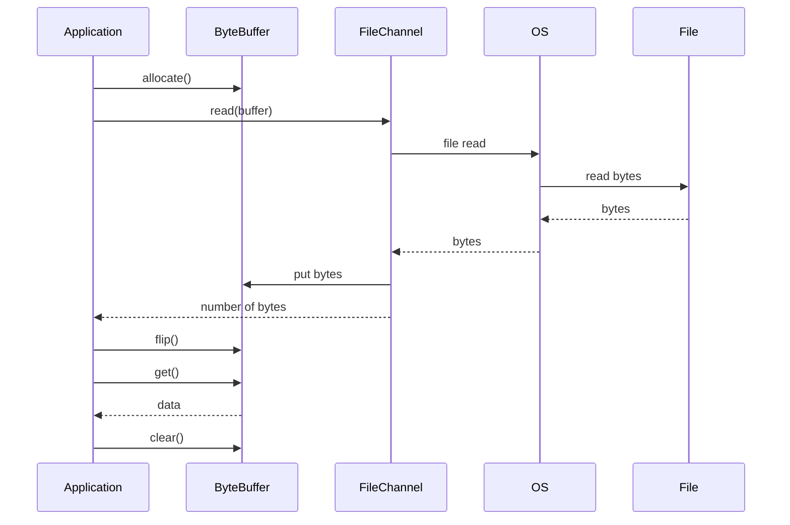
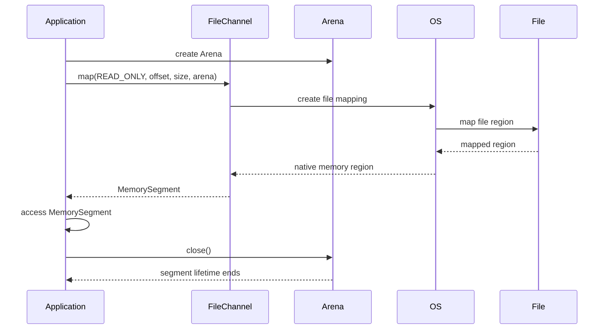
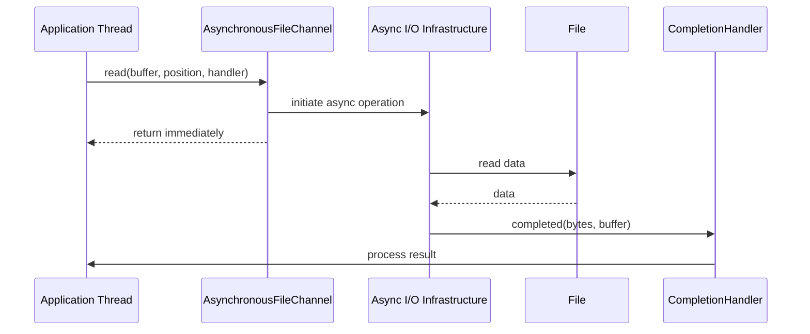
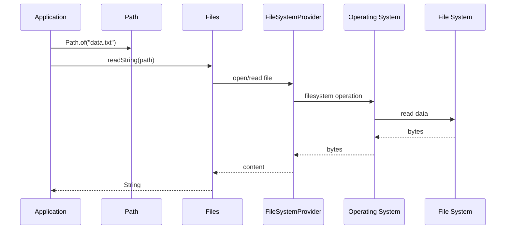
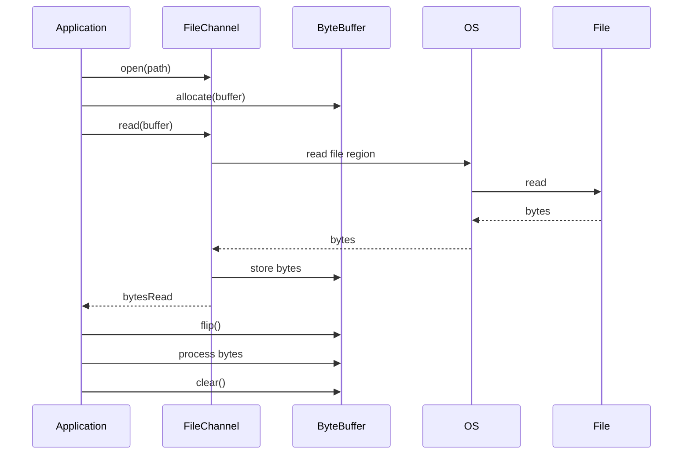
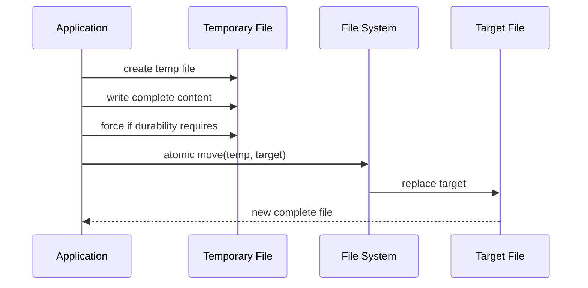
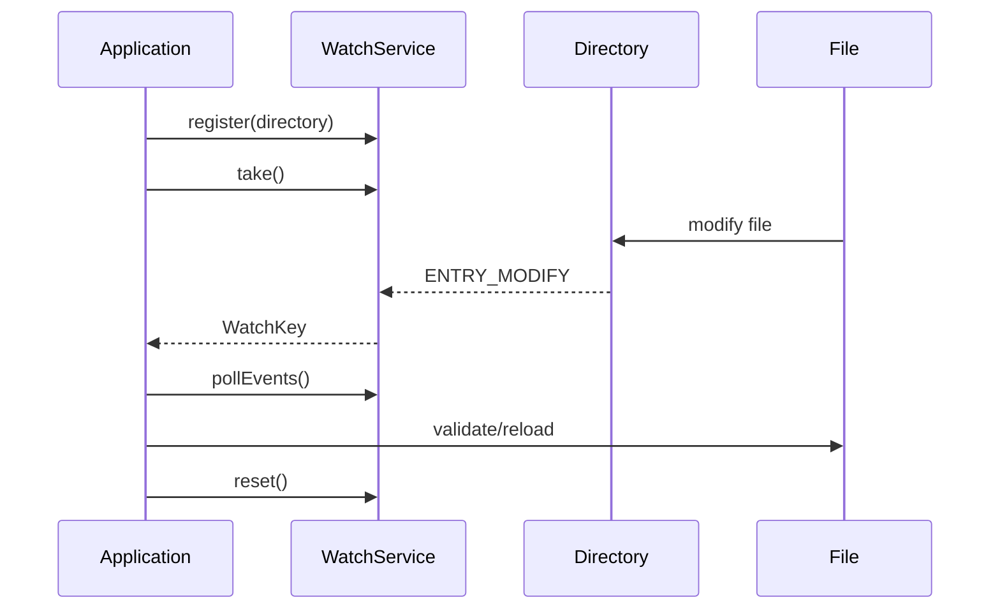
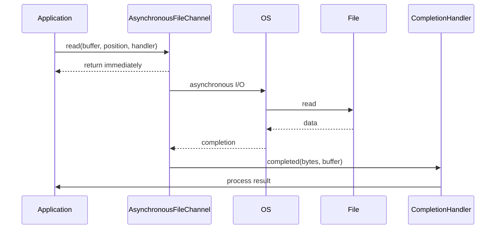

# Modern Java NIO File Handling & Channels
## Java 8 → Java 25 | Interview + Scenario Based Notes

> **Scope:** This continues the previous Java I/O notes.  
> It intentionally does **not** repeat `FileInputStream`, `FileOutputStream`, `BufferedReader`, `BufferedWriter`, `DataInputStream`, `ObjectInputStream`, etc.

---

# 1. What Are We Learning Here?

The important modern NIO concepts are:

```text
Java NIO
   |
   +-- Path
   |
   +-- Files
   |
   +-- FileChannel
   |
   +-- ByteBuffer
   |
   +-- SeekableByteChannel
   |
   +-- FileLock
   |
   +-- Memory-mapped files
   |
   +-- AsynchronousFileChannel
   |
   +-- DirectoryStream
   |
   +-- Files.walk()
   |
   +-- Files.find()
   |
   +-- Files.lines()
   |
   +-- WatchService
   |
   +-- File attributes
   |
   +-- Symbolic links
   |
   +-- FileSystemProvider
   |
   +-- Java 11 Path.of()
   |
   +-- Java 11 Files.readString/writeString
   |
   +-- Java 12 Files.mismatch()
   |
   +-- Java 22 FileChannel -> MemorySegment mapping
```

---

# 2. First Important Clarification

NIO is **not new in Java 8**.

The NIO/NIO.2 foundation existed before Java 8.

For example:

```text
Java 1.4
    |
    +-- java.nio
    +-- ByteBuffer
    +-- Channel concepts

Java 7
    |
    +-- java.nio.file
    +-- Path
    +-- Files
    +-- FileChannel.open(Path,...)
    +-- WatchService
    +-- file attributes
```

Therefore, when we say:

> "NIO from Java 8 to Java 25"

we should distinguish between:

1. **Existing NIO concepts you must know**
2. **APIs/enhancements added after Java 8**

This note focuses especially on #2 while covering the channel concepts necessary to understand them.

---

# 3. NIO Architecture

The traditional I/O mental model was:

```text
Application
    |
    v
Stream
    |
    v
File
```

NIO introduces a richer model:

```text
Application
    |
    v
Path
    |
    v
Files / FileChannel
    |
    v
FileSystemProvider
    |
    v
Operating System
    |
    v
File System
```

For channel-based I/O:

```text
Application
     |
     v
FileChannel
     |
     v
ByteBuffer
     |
     v
Operating System
     |
     v
File
```

The key idea:

> **Channels transfer data through buffers.**

Oracle describes `FileChannel` as a channel for reading, writing, mapping, and manipulating files.

---

# 4. Path

`Path` represents the location of a file or directory.

Example:

```java
Path path = Path.of("data/users.txt");
```

Think:

```text
Path = "Where is the file?"
```

It doesn't mean:

```text
"Read the file"
```

Instead:

```text
Path
  |
  +-- identifies file/directory
```

Then:

```java
Files.readString(path);
```

performs an operation.

---

# 5. Path.of() — Java 11

Before Java 11:

```java
Paths.get("data/users.txt");
```

Modern Java:

```java
Path path = Path.of("data/users.txt");
```

Java's documentation recommends obtaining a `Path` using `Path.of(...)` rather than `Paths.get(...)`.

Examples:

```java
Path p1 = Path.of("data/users.txt");

Path p2 = Path.of("data", "users.txt");

Path p3 = Path.of("/var/log/app.log");
```

---

# 6. Path Operations

These are extremely important in interviews.

## resolve()

```java
Path base = Path.of("/app/data");

Path file = base.resolve("users.txt");
```

Result:

```text
/app/data/users.txt
```

Think:

```text
base + child
```

---

# 7. resolveSibling()

```java
Path path = Path.of("/app/data/users.txt");

Path backup =
    path.resolveSibling("users-backup.txt");
```

Result:

```text
/app/data/users-backup.txt
```

Useful when replacing or creating a sibling file.

---

# 8. relativize()

Given:

```text
/app/data
/app/data/users/file.txt
```

we can calculate the relative path.

```java
Path base = Path.of("/app/data");
Path target = Path.of("/app/data/users/file.txt");

Path relative = base.relativize(target);

System.out.println(relative);
```

Result:

```text
users/file.txt
```

Mental model:

```text
A -----------------> B

relativize(A, B)
       |
       v
How do I travel from A to B?
```

---

# 9. normalize()

Suppose:

```java
Path path =
    Path.of("/app/data/../logs/./app.log");
```

Then:

```java
Path normalized = path.normalize();
```

Conceptually:

```text
/app/data/../logs/./app.log

        ↓

/app/logs/app.log
```

### Important

`normalize()` is a **path manipulation operation**.

It does not necessarily verify that the resulting path actually exists.

---

# 10. toAbsolutePath()

```java
Path path = Path.of("data/users.txt");

Path absolute = path.toAbsolutePath();
```

Turns a relative path into an absolute path based on the current working directory.

---

# 11. toRealPath()

```java
Path real =
    path.toRealPath();
```

Different from:

```java
toAbsolutePath()
```

`toRealPath()` resolves the actual filesystem path and normally requires the file to exist.

It can also resolve symbolic links unless configured otherwise.

---

# 12. Path Mental Model

```text
Path
 |
 +-- resolve()
 |
 +-- resolveSibling()
 |
 +-- relativize()
 |
 +-- normalize()
 |
 +-- toAbsolutePath()
 |
 +-- toRealPath()
 |
 +-- getFileName()
 |
 +-- getParent()
 |
 +-- getRoot()
 |
 +-- startsWith()
 |
 +-- endsWith()
```

---

# 13. Files Class

`Files` provides operations on files/directories represented by `Path`.

Think:

```text
Path  = address
Files = operations
```

Example:

```java
Path path = Path.of("data.txt");

boolean exists = Files.exists(path);
```

---

# 14. Java 8: Files.lines()

One important Java 8 addition is:

```java
Files.lines(...)
```

It returns a lazy `Stream<String>` instead of immediately loading all lines into a `List`. Oracle documents `Files.lines` as lazily populating the stream as it is consumed.

Example:

```java
try (Stream<String> lines =
         Files.lines(
             Path.of("application.log"),
             StandardCharsets.UTF_8
         )) {

    lines
        .filter(line -> line.contains("ERROR"))
        .forEach(System.out::println);
}
```

---

# 15. Why Files.lines() Is Important

Compare:

```java
Files.readAllLines(path);
```

with:

```java
Files.lines(path);
```

### readAllLines()

```text
File
 |
 v
Entire content
 |
 v
List<String>
 |
 v
Memory
```

### lines()

```text
File
 |
 v
Stream<String>
 |
 v
Process incrementally
```

Therefore:

```text
readAllLines -> materialized collection

lines        -> lazy stream
```

---

# 16. Important Trap: Files.lines() Must Be Closed

This is wrong:

```java
Files.lines(path)
    .forEach(System.out::println);
```

Better:

```java
try (Stream<String> lines = Files.lines(path)) {
    lines.forEach(System.out::println);
}
```

Why?

The stream maintains a reference to an open file.

The JDK documentation explicitly recommends closing the returned stream promptly.

---

# 17. Java 8: Files.list()

```java
try (Stream<Path> stream =
         Files.list(Path.of("data"))) {

    stream.forEach(System.out::println);
}
```

This lists entries in a directory.

Example:

```text
data/
 |
 +-- users.txt
 +-- orders.txt
 +-- images/
 +-- logs/
```

The stream contains:

```text
users.txt
orders.txt
images
logs
```

It is **not recursive**.

---

# 18. Files.list() vs Files.walk()

### list()

```java
Files.list(directory)
```

Only immediate children.

```text
data
 |
 +-- a.txt
 +-- b.txt
 +-- sub/
```

Result:

```text
a.txt
b.txt
sub/
```

### walk()

```java
Files.walk(directory)
```

Recursive traversal.

```text
data
 |
 +-- a.txt
 +-- sub/
      |
      +-- b.txt
```

Result includes:

```text
data
data/a.txt
data/sub
data/sub/b.txt
```

---

# 19. Java 8: Files.walk()

`Files.walk()` provides a lazy `Stream<Path>` while walking a file tree. The traversal is depth-first.

Example:

```java
try (Stream<Path> paths =
         Files.walk(Path.of("data"))) {

    paths
        .filter(Files::isRegularFile)
        .forEach(System.out::println);
}
```

---

# 20. Files.walk(maxDepth)

You can restrict recursion.

```java
try (Stream<Path> paths =
         Files.walk(
             Path.of("data"),
             2
         )) {

    paths.forEach(System.out::println);
}
```

Conceptually:

```text
depth 0 -> data
depth 1 -> direct children
depth 2 -> grandchildren
```

---

# 21. Files.find()

`Files.find()` combines tree traversal with attribute-based filtering.

Example:

```java
try (Stream<Path> paths =
         Files.find(
             Path.of("data"),
             10,
             (path, attrs) ->
                 attrs.isRegularFile()
                 && attrs.size() > 10_000
         )) {

    paths.forEach(System.out::println);
}
```

Useful for:

> Find all regular files larger than 10 KB under this directory.

---

# 22. walk() vs find()

### walk()

```java
Files.walk(path)
```

Returns paths.

Then you can filter:

```java
.filter(Files::isRegularFile)
```

### find()

```java
Files.find(
    path,
    depth,
    matcher
)
```

Provides:

```text
Path
+
BasicFileAttributes
```

to the predicate.

This can be useful when the filtering requires attributes such as:

- size
- file type
- timestamps

---

# 23. Java 8: Files.walkFileTree()

For more control over traversal:

```java
Files.walkFileTree(...)
```

Use:

```java
FileVisitor<Path>
```

Example:

```java
Files.walkFileTree(
    Path.of("data"),
    new SimpleFileVisitor<>() {

        @Override
        public FileVisitResult visitFile(
                Path file,
                BasicFileAttributes attrs) {

            System.out.println(file);

            return FileVisitResult.CONTINUE;
        }
    }
);
```

---

# 24. walk() vs walkFileTree()

Use:

```text
Files.walk()
```

when:

```text
I want a Stream<Path>
```

Use:

```text
Files.walkFileTree()
```

when:

```text
I need lifecycle callbacks and traversal control.
```

For example:

```text
preVisitDirectory()
visitFile()
visitFileFailed()
postVisitDirectory()
```

---

# 25. FileVisitor

Useful methods:

```java
preVisitDirectory()
visitFile()
visitFileFailed()
postVisitDirectory()
```

Mental model:

```text
enter directory
     |
     v
process children
     |
     v
leave directory
```

---

# 26. File Tree Deletion Scenario

Deleting a directory recursively is a classic interview scenario.

You generally need to:

```text
1. Visit files
2. Delete files
3. After directory contents are gone
4. Delete directory
```

Example:

```java
Files.walkFileTree(
    root,
    new SimpleFileVisitor<>() {

        @Override
        public FileVisitResult visitFile(
                Path file,
                BasicFileAttributes attrs)
                throws IOException {

            Files.delete(file);

            return FileVisitResult.CONTINUE;
        }

        @Override
        public FileVisitResult postVisitDirectory(
                Path dir,
                IOException exc)
                throws IOException {

            Files.delete(dir);

            return FileVisitResult.CONTINUE;
        }
    }
);
```

---

# 27. Java 11: Files.readString()

Java 11 introduced:

```java
Files.readString(path)
```

Example:

```java
String content =
    Files.readString(
        Path.of("config.json")
    );
```

The no-charset overload uses UTF-8.

There is also:

```java
Files.readString(
    path,
    StandardCharsets.UTF_8
);
```

The API was added in Java 11.

---

# 28. Java 11: Files.writeString()

Example:

```java
Files.writeString(
    Path.of("output.txt"),
    "Hello World",
    StandardCharsets.UTF_8
);
```

By default, the operation behaves like:

```text
CREATE
TRUNCATE_EXISTING
WRITE
```

when no open options are supplied.

---

# 29. Java 11: append with writeString()

```java
Files.writeString(
    path,
    "new line\n",
    StandardCharsets.UTF_8,
    StandardOpenOption.CREATE,
    StandardOpenOption.APPEND
);
```

This is convenient for small text operations.

For huge/high-throughput logs, you should think about:

- batching
- buffering
- asynchronous logging
- dedicated logging frameworks

rather than repeatedly calling `writeString()`.

---

# 30. Java 11: Path.of() + Files

Modern simple file code:

```java
Path path = Path.of("config/application.properties");

String config =
    Files.readString(
        path,
        StandardCharsets.UTF_8
    );
```

This is much cleaner than older `java.io.File` style code.

---

# 31. Java 12: Files.mismatch()

Java 12 introduced:

```java
Files.mismatch(path1, path2)
```

It compares two files and returns the position of the first mismatching byte.

If the files are equal:

```text
-1
```

Otherwise:

```text
0, 1, 2, 3...
```

Example:

```java
long mismatch =
    Files.mismatch(
        Path.of("a.txt"),
        Path.of("b.txt")
    );

if (mismatch == -1) {
    System.out.println("Files are identical");
} else {
    System.out.println(
        "First mismatch at byte " + mismatch
    );
}
```

---

# 32. Why Files.mismatch() Is Useful

Imagine:

```text
file A = 10 GB
file B = 10 GB
```

You don't want to manually load both files into memory.

Conceptually:

```text
A ----\
       -> compare
B ----/
```

The API can locate the first differing byte.

Excellent interview example:

> "How would you efficiently determine whether two large files are identical?"

Answer:

```java
Files.mismatch(path1, path2) == -1
```

---

# 33. FileChannel

Now we move into the more advanced NIO topic.

```java
FileChannel
```

is a channel connected to a file.

It supports:

```text
read
write
position
truncate
transfer
scatter/gather
memory mapping
file locking
force
```

Oracle describes `FileChannel` as a `SeekableByteChannel` connected to a file.

---

# 34. Channel vs Stream

Simplified mental model:

```text
Stream
------
data flows through stream

Channel
-------
data moves between channel and buffer
```

Channel model:

```text
File
 |
 v
FileChannel
 |
 v
ByteBuffer
 |
 v
Application
```

---

# 35. ByteBuffer

`ByteBuffer` is central to channel-based I/O.

Example:

```java
ByteBuffer buffer =
    ByteBuffer.allocate(1024);
```

Think:

```text
ByteBuffer = memory area used for data transfer
```

---

# 36. ByteBuffer State

This is one of the most important interview topics.

A `ByteBuffer` has:

```text
capacity
position
limit
mark
```

Mental model:

```text
+--------------------------------+
| data | data | free | free     |
+--------------------------------+
       ^          ^
     position    limit

<----------- capacity ----------->
```

Initially:

```text
position = 0
limit    = capacity
```

---

# 37. flip()

Suppose we write data into a buffer:

```java
buffer.put(...);
```

Now the buffer is in **write mode**.

To read the data we just wrote:

```java
buffer.flip();
```

Conceptually:

```text
WRITE MODE
position -> end of written data

        flip()

READ MODE
position -> beginning
limit    -> end of written data
```

---

# 38. clear()

```java
buffer.clear();
```

Prepares the buffer for writing again.

Important:

> `clear()` does not erase the bytes.

It simply resets buffer state so the buffer can be reused.

---

# 39. rewind()

```java
buffer.rewind();
```

Moves position back to zero while retaining the current limit.

Useful when you want to reread the same data.

---

# 40. compact()

```java
buffer.compact();
```

Useful when some unread data remains.

Example:

```text
+--------------------------------+
| consumed | unread             |
+--------------------------------+
             ^
```

`compact()` moves unread data to the beginning so new data can be appended.

Common in partial network/message parsing.

---

# 41. ByteBuffer State Cheat Sheet

```text
allocate()
    |
    v
WRITE
    |
    | flip()
    v
READ
    |
    | clear()
    v
WRITE AGAIN
```

Other operations:

```text
rewind()
    -> reread from beginning

compact()
    -> preserve unread bytes
```

---

# 42. FileChannel Read Example

```java
try (FileChannel channel =
         FileChannel.open(
             Path.of("data.bin"),
             StandardOpenOption.READ
         )) {

    ByteBuffer buffer =
        ByteBuffer.allocate(8192);

    while (channel.read(buffer) != -1) {

        buffer.flip();

        while (buffer.hasRemaining()) {
            byte b = buffer.get();
            process(b);
        }

        buffer.clear();
    }
}
```

---

# 43. Channel Read Sequence



---

# 44. FileChannel Position

Unlike a simple sequential abstraction, `FileChannel` has a current position.

```java
long position =
    channel.position();
```

Set it:

```java
channel.position(1000);
```

Now the next relative read/write starts around byte 1000.

---

# 45. Absolute Read

You can read from a specific position:

```java
channel.read(buffer, 1000);
```

This is useful because it does not change the channel's current position.

Mental model:

```text
File

0      1000       2000
|--------|----------|
         ^
         |
      read here
```

---

# 46. Absolute Write

Similarly:

```java
channel.write(buffer, 5000);
```

writes at a specific file position.

This is useful for:

- fixed-position records
- indexes
- random-access formats
- updating file sections

---

# 47. FileChannel Size

```java
long size =
    channel.size();
```

Resize:

```java
channel.truncate(1000);
```

Example:

```text
Before:
0 ------------------------ 10000

truncate(5000)

After:
0 ------------ 5000
```

---

# 48. FileChannel.force()

One advanced method:

```java
channel.force(true);
```

It requests that updates be forced to the underlying storage device.

Useful when durability matters.

Example scenario:

```text
Write critical metadata
       |
       v
FileChannel
       |
       v
force(true)
       |
       v
storage
```

### Important

`force()` is not the same as:

```text
"database transaction commit"
```

and does not make every storage stack guarantee identical behavior.

The API documentation notes that guarantees depend on the underlying storage/environment.

---

# 49. FileChannel.transferTo()

One of the most useful high-performance APIs:

```java
channel.transferTo(...)
```

Example:

```java
try (
    FileChannel source =
        FileChannel.open(
            sourcePath,
            StandardOpenOption.READ
        );

    FileChannel target =
        FileChannel.open(
            targetPath,
            StandardOpenOption.CREATE,
            StandardOpenOption.WRITE
        )
) {

    source.transferTo(
        0,
        source.size(),
        target
    );
}
```

Conceptually:

```text
File
 |
 v
FileChannel
 |
 | transfer
 v
FileChannel
 |
 v
File
```

---

# 50. Why transferTo() Matters

For certain channel combinations and operating systems, the implementation can use optimized mechanisms.

The Java API documents that file-to-channel transfers may be optimized by the operating system, potentially transferring directly through filesystem cache rather than copying through user-space buffers in the usual way.

Interview answer:

> `transferTo()` can reduce application-level copying and may leverage OS-level optimizations.

Do not claim:

> "transferTo always uses zero-copy."

That is too absolute.

---

# 51. transferFrom()

Reverse operation:

```java
target.transferFrom(
    source,
    0,
    source.size()
);
```

Mental model:

```text
transferTo:
source -> target

transferFrom:
target <- source
```

They express the same general transfer direction from different perspectives.

---

# 52. Scattering Read

A `FileChannel` supports scattering reads.

Instead of:

```text
file -> one buffer
```

you can do:

```text
file
 |
 +----> buffer 1
 |
 +----> buffer 2
 |
 +----> buffer 3
```

Example:

```java
ByteBuffer header =
    ByteBuffer.allocate(16);

ByteBuffer body =
    ByteBuffer.allocate(1024);

ByteBuffer[] buffers = {
    header,
    body
};

channel.read(buffers);
```

Conceptually:

```text
File:
+--------+------------------+
| header | body             |
+--------+------------------+
    |          |
    v          v
 buffer1    buffer2
```

---

# 53. Gathering Write

Reverse:

```text
buffer1 \
buffer2  ---> FileChannel ---> File
buffer3 /
```

Example:

```java
ByteBuffer header = ...;
ByteBuffer body = ...;

channel.write(
    new ByteBuffer[] {
        header,
        body
    }
);
```

This is useful for structured binary formats.

---

# 54. Scattering vs Gathering

```text
SCATTERING READ

              +--> Buffer 1
File ---------+--> Buffer 2
              +--> Buffer 3


GATHERING WRITE

Buffer 1 -----+
Buffer 2 -----+----> File
Buffer 3 -----+
```

Easy interview memory trick:

```text
SCATTER = one -> many

GATHER = many -> one
```

---

# 55. File Lock

NIO can provide file locking through:

```java
FileLock
```

Example:

```java
try (
    FileChannel channel =
        FileChannel.open(
            path,
            StandardOpenOption.WRITE
        )
) {

    try (FileLock lock =
             channel.lock()) {

        // protected file operation
    }
}
```

---

# 56. Why FileLock?

Scenario:

```text
Process A
    |
    | writes shared file
    v
shared.db


Process B
    |
    | also writes
    v
shared.db
```

A file lock can coordinate access between processes that honor the locking mechanism.

---

# 57. FileLock Is Not a Universal Distributed Lock

Important interview trap.

Don't say:

> FileLock is a distributed lock.

It is primarily an OS/filesystem-level file locking mechanism.

For distributed systems across machines, use appropriate coordination mechanisms such as:

```text
database locking
distributed lock service
Redis-based coordination where appropriate
ZooKeeper-like coordination
```

depending on the architecture.

---

# 58. Memory-Mapped Files

One of the most powerful `FileChannel` features:

```java
channel.map(...)
```

Conceptually:

```text
File
 |
 | mmap
 v
Virtual Memory
 |
 v
Application
```

Instead of repeatedly calling:

```text
read()
write()
```

a file region can be mapped into memory.

---

# 59. Memory Mapping Mental Model

Traditional:

```text
File
 |
 v
read()
 |
 v
Buffer
 |
 v
Application
```

Memory mapped:

```text
File
 |
 v
Memory Mapping
 |
 v
Mapped memory
 |
 v
Application
```

The OS manages the mapping and paging.

---

# 60. FileChannel.MapMode

Main modes:

```text
READ_ONLY
READ_WRITE
PRIVATE
```

### READ_ONLY

Application can read but not modify the mapped region.

### READ_WRITE

Changes can eventually be propagated to the file.

### PRIVATE

Copy-on-write style mapping; modifications are not propagated to the original file.

The Java 25 API documents these mapping semantics explicitly.

---

# 61. Memory-Mapped File Example

```java
try (FileChannel channel =
         FileChannel.open(
             path,
             StandardOpenOption.READ
         )) {

    MappedByteBuffer buffer =
        channel.map(
            FileChannel.MapMode.READ_ONLY,
            0,
            channel.size()
        );

    while (buffer.hasRemaining()) {
        byte b = buffer.get();
        process(b);
    }
}
```

---

# 62. When Is Memory Mapping Useful?

Good candidates:

```text
large files
random access
high-performance binary processing
large indexes
searching large datasets
database-like file structures
```

Example:

```text
10 GB index file

Random reads:
        |
        v
Memory mapped region
```

But:

> Memory mapping is not automatically faster for every file.

The Java API itself notes that mapping can be more expensive than ordinary I/O for relatively small files.

---

# 63. Memory Mapping Interview Trap

Bad answer:

> "Memory mapping loads the whole file into RAM."

Not exactly.

The file is mapped into the process's virtual address space.

The OS manages physical page loading.

Think:

```text
Virtual address space
        |
        v
Mapped file pages
        |
        v
OS page management
```

---

# 64. Java 22: FileChannel → MemorySegment

A significant modern addition arrived in Java 22.

`FileChannel.map(...)` gained an overload:

```java
map(
    MapMode mode,
    long offset,
    long size,
    Arena arena
)
```

which returns:

```java
MemorySegment
```

instead of `MappedByteBuffer`.

This API is part of the Foreign Function & Memory API evolution. It was introduced as a permanent API in Java 22.

---

# 65. What Is MemorySegment?

```text
MemorySegment
```

represents a contiguous region of memory.

It can represent:

```text
heap memory
```

or:

```text
off-heap/native memory
```

and has explicit lifetime/scope characteristics.

Java's `MemorySegment` API provides spatial and temporal bounds for memory access.

---

# 66. Why MemorySegment?

Historically:

```text
MappedByteBuffer
```

had lifecycle characteristics tied strongly to garbage collection.

The modern Foreign Function & Memory API provides more explicit memory lifecycle management.

Example:

```java
try (Arena arena = Arena.ofConfined()) {

    MemorySegment segment =
        channel.map(
            FileChannel.MapMode.READ_ONLY,
            0,
            size,
            arena
        );

    // use segment
}
```

When the arena closes, the mapped segment's lifetime ends.

---

# 67. MemorySegment Sequence



---

# 68. MemorySegment vs ByteBuffer

| | MappedByteBuffer | MemorySegment |
|---|---|---|
| Older API | Yes | Modern |
| File mapping | Yes | Yes |
| Memory model | Buffer-oriented | Memory API |
| Lifetime | GC-oriented mapping lifecycle | Arena-controlled lifetime |
| Foreign memory integration | Limited | Strong |
| Java 22+ | Still available | Modern FFM approach |

Interview answer:

> For legacy NIO code, `MappedByteBuffer` remains important. For newer Java 22+ code involving mapped/off-heap memory, `MemorySegment` and `Arena` are the modern direction.

---

# 69. AsynchronousFileChannel

Another important channel:

```java
AsynchronousFileChannel
```

It provides asynchronous file operations.

Traditional:

```text
Thread
  |
  | read()
  | waits
  v
File
```

Asynchronous:

```text
Thread
  |
  | initiate read
  v
AsynchronousFileChannel
  |
  | operation continues
  v
File
  |
  v
completion handler / Future
```

---

# 70. AsynchronousFileChannel Example

```java
try (AsynchronousFileChannel channel =
         AsynchronousFileChannel.open(
             path,
             StandardOpenOption.READ
         )) {

    ByteBuffer buffer =
        ByteBuffer.allocate(1024);

    Future<Integer> future =
        channel.read(buffer, 0);

    int bytesRead = future.get();

    buffer.flip();

    // process data
}
```

Important:

```java
future.get()
```

waits for completion.

So the API is asynchronous, but if you immediately call `get()`, your current thread waits.

---

# 71. CompletionHandler Style

Instead of waiting:

```java
channel.read(
    buffer,
    0,
    buffer,
    new CompletionHandler<Integer, ByteBuffer>() {

        @Override
        public void completed(
                Integer result,
                ByteBuffer attachment) {

            System.out.println(
                "Read " + result + " bytes"
            );
        }

        @Override
        public void failed(
                Throwable exc,
                ByteBuffer attachment) {

            exc.printStackTrace();
        }
    }
);
```

Conceptually:

```text
Start I/O
   |
   v
Return immediately
   |
   | later
   v
completed()
```

---

# 72. AsynchronousFileChannel Has No Current Position

This is a very important difference.

`FileChannel`:

```text
has current position
```

`AsynchronousFileChannel`:

```text
operation specifies position
```

For example:

```java
channel.read(buffer, 1000);
```

means:

```text
read starting at byte 1000
```

The API documentation explicitly describes asynchronous file channels as having no current file position; each operation supplies its position.

---

# 73. Asynchronous File Read Sequence



---

# 74. When Should You Use AsynchronousFileChannel?

Potential use cases:

```text
many independent file operations
large server workloads
overlapping file operations
applications where blocking the initiating thread is undesirable
```

But don't assume:

> async file I/O is always faster.

Performance depends heavily on:

- filesystem
- OS
- storage
- workload
- thread pool
- access pattern

---

# 75. AsyncFileChannel vs FileChannel

| | FileChannel | AsynchronousFileChannel |
|---|---|---|
| Current position | Yes | No |
| Blocking API | Generally synchronous | Async operations |
| Random access | Yes | Yes |
| Buffer | ByteBuffer | ByteBuffer |
| Completion callback | No | Yes |
| Future support | No | Yes |
| File locking | Yes | Yes |
| Mapping | Yes | No equivalent `map()` API |

---

# 76. DirectoryStream

Another NIO API:

```java
DirectoryStream<Path>
```

Example:

```java
try (DirectoryStream<Path> stream =
         Files.newDirectoryStream(
             Path.of("data")
         )) {

    for (Path path : stream) {
        System.out.println(path);
    }
}
```

Useful when you want directory iteration without creating a giant array/list.

---

# 77. DirectoryStream vs Files.list()

```text
DirectoryStream
    -> Iterable<Path>

Files.list()
    -> Stream<Path>
```

Use `Files.list()` when you want Stream operations:

```java
.filter()
.map()
.sorted()
```

Use `DirectoryStream` when simple iteration is enough.

---

# 78. File Attributes

NIO provides structured file attributes.

Example:

```java
BasicFileAttributes attrs =
    Files.readAttributes(
        path,
        BasicFileAttributes.class
    );
```

Then:

```java
attrs.size();
attrs.creationTime();
attrs.lastModifiedTime();
attrs.lastAccessTime();
attrs.isRegularFile();
attrs.isDirectory();
attrs.isSymbolicLink();
```

---

# 79. Why File Attributes Matter

Suppose you need:

> Delete files older than 30 days and larger than 100 MB.

You need:

```text
Path
+
BasicFileAttributes
```

Example:

```java
BasicFileAttributes attrs =
    Files.readAttributes(
        path,
        BasicFileAttributes.class
    );

long size = attrs.size();
FileTime modified =
    attrs.lastModifiedTime();
```

---

# 80. FileTime

NIO represents filesystem timestamps using:

```java
FileTime
```

Example:

```java
FileTime modified =
    Files.getLastModifiedTime(path);
```

This avoids forcing everything into legacy `java.util.Date`.

---

# 81. Symbolic Links

NIO has explicit support for symbolic links.

Example:

```java
Path link =
    Path.of("latest.log");

Path target =
    Path.of("application-2026.log");

Files.createSymbolicLink(
    link,
    target
);
```

Conceptually:

```text
latest.log
     |
     +------> application-2026.log
```

---

# 82. NOFOLLOW_LINKS

Some operations allow:

```java
LinkOption.NOFOLLOW_LINKS
```

This tells the operation:

> Treat the symbolic link itself rather than following it.

This becomes important for security-sensitive filesystem operations.

---

# 83. Path Traversal Security

Suppose a server receives:

```text
../../../../etc/passwd
```

Never blindly do:

```java
Path path =
    base.resolve(userInput);
```

and assume you're safe.

A common defense pattern is:

```java
Path resolved =
    base.resolve(userInput)
        .normalize();

if (!resolved.startsWith(base)) {
    throw new SecurityException();
}
```

But even this requires careful handling of symbolic links and filesystem semantics for security-sensitive applications.

---

# 84. WatchService

NIO can watch directories for filesystem changes.

```java
WatchService watcher =
    FileSystems
        .getDefault()
        .newWatchService();
```

Register a directory:

```java
Path dir = Path.of("config");

dir.register(
    watcher,
    StandardWatchEventKinds.ENTRY_CREATE,
    StandardWatchEventKinds.ENTRY_MODIFY,
    StandardWatchEventKinds.ENTRY_DELETE
);
```

---

# 85. WatchService Flow

```text
config/
   |
   +-- application.yml

Application
   |
   | watches directory
   v
WatchService
   |
   | change occurs
   v
ENTRY_MODIFY
```

---

# 86. WatchService Example

```java
while (true) {

    WatchKey key =
        watcher.take();

    for (WatchEvent<?> event :
            key.pollEvents()) {

        System.out.println(
            event.kind()
        );

        System.out.println(
            event.context()
        );
    }

    boolean valid = key.reset();

    if (!valid) {
        break;
    }
}
```

---

# 87. WatchService Important Trap

`WatchService` watches **directories**, not arbitrary file contents.

You typically register:

```text
directory
```

and receive events such as:

```text
ENTRY_CREATE
ENTRY_DELETE
ENTRY_MODIFY
```

The event context usually identifies the directory entry that changed.

---

# 88. WatchService Scenario

Imagine:

```text
Spring Boot application

config/
   application.properties
```

You want to reload configuration when the file changes.

Architecture:

```text
File
 |
 v
WatchService
 |
 | ENTRY_MODIFY
 v
Config Reload Service
 |
 v
Application Configuration
```

This is a common interview scenario.

---

# 89. WatchService Is Not a Perfect Distributed File Event System

Important.

If you have:

```text
Server A
Server B
Server C
```

each watching:

```text
local filesystem
```

they are not automatically observing one shared distributed event stream.

For distributed configuration/event propagation, use:

```text
Kafka
Redis Pub/Sub
configuration service
database/event system
```

depending on requirements.

---

# 90. FileSystemProvider

NIO is extensible through:

```java
FileSystemProvider
```

Architecture:

```text
Files
 |
 v
Path
 |
 v
FileSystemProvider
 |
 +--> default filesystem
 |
 +--> custom filesystem
```

The provider abstraction allows filesystem implementations to plug into the NIO filesystem API.

---

# 91. Why FileSystemProvider Matters

The application can operate on:

```text
Path
```

without necessarily knowing all details of the underlying filesystem implementation.

Examples of possible filesystem providers include:

```text
default local filesystem
ZIP filesystem
custom/provider-backed filesystem
```

---

# 92. ZIP File System

Java can treat a ZIP/JAR-like archive as a filesystem using the ZIP filesystem provider.

Conceptually:

```text
archive.zip
     |
     v
FileSystem
     |
     +-- Path
     +-- Files
```

Then you can use NIO-style operations.

This is a great example of the power of the provider abstraction.

---

# 93. FileSystem vs FileSystemProvider

Think:

```text
FileSystemProvider
    |
    | creates/manages
    v
FileSystem
    |
    | produces
    v
Path
    |
    | operated by
    v
Files
```

---

# 94. StandardOpenOption

NIO provides explicit file-opening options.

Examples:

```java
StandardOpenOption.READ
StandardOpenOption.WRITE
StandardOpenOption.CREATE
StandardOpenOption.CREATE_NEW
StandardOpenOption.APPEND
StandardOpenOption.TRUNCATE_EXISTING
StandardOpenOption.DELETE_ON_CLOSE
```

Example:

```java
Files.writeString(
    path,
    content,
    StandardCharsets.UTF_8,
    StandardOpenOption.CREATE,
    StandardOpenOption.APPEND
);
```

The standard options are part of the NIO file API.

---

# 95. CREATE vs CREATE_NEW

This is a common interview question.

### CREATE

```text
Create if it doesn't exist.
```

If it already exists, opening can continue according to the other options.

### CREATE_NEW

```text
Create only if it doesn't already exist.
```

If it already exists:

```text
FileAlreadyExistsException
```

---

# 96. Why CREATE_NEW Is Useful

Suppose you generate:

```text
invoice-123.pdf
```

and must never overwrite an existing invoice.

Use:

```java
StandardOpenOption.CREATE_NEW
```

This gives atomic "create only if absent" semantics at the filesystem API level where supported.

---

# 97. Atomic File Replacement

A common production pattern:

```text
write temporary file
       |
       v
fsync/force as appropriate
       |
       v
atomic move
       |
       v
replace target
```

Example:

```java
Files.move(
    temp,
    target,
    StandardCopyOption.ATOMIC_MOVE,
    StandardCopyOption.REPLACE_EXISTING
);
```

### Important

`ATOMIC_MOVE` is dependent on filesystem/provider support.

Do not assume every filesystem guarantees it.

---

# 98. Why Atomic Move Is Useful

Suppose your application updates:

```text
config.json
```

Bad approach:

```text
open config
truncate
write half
CRASH
```

Now readers may see incomplete content.

Better:

```text
config.tmp
   |
   | completely write
   v
atomic move
   |
   v
config.json
```

Readers see either:

```text
old complete file
```

or:

```text
new complete file
```

subject to filesystem/provider guarantees.

---

# 99. File Copy Options

NIO provides:

```java
StandardCopyOption.REPLACE_EXISTING
StandardCopyOption.COPY_ATTRIBUTES
StandardCopyOption.ATOMIC_MOVE
```

Example:

```java
Files.copy(
    source,
    target,
    StandardCopyOption.REPLACE_EXISTING
);
```

---

# 100. NIO Exception Types

Instead of catching only:

```java
IOException
```

you can sometimes catch more specific exceptions.

Examples:

```text
NoSuchFileException
FileAlreadyExistsException
AccessDeniedException
DirectoryNotEmptyException
NotDirectoryException
FileSystemException
```

Example:

```java
try {
    Files.createFile(path);
} catch (FileAlreadyExistsException e) {
    // already exists
}
```

This is better than treating every filesystem failure identically.

---

# 101. Scenario: Upload File Safely

Requirement:

> Save uploaded data without accidentally overwriting another upload.

Use:

```java
Path target = uploadDir.resolve(randomName);

Files.write(
    target,
    data,
    StandardOpenOption.CREATE_NEW
);
```

Better architecture for large files:

```text
HTTP upload
    |
    v
stream/chunk
    |
    v
temporary file
    |
    v
validation
    |
    v
atomic move / object storage
```

---

# 102. Scenario: Large File Comparison

Requirement:

> Determine whether two 50 GB files are identical.

Bad:

```java
Files.readAllBytes(file1);
Files.readAllBytes(file2);
```

Better:

```java
Files.mismatch(file1, file2);
```

If:

```text
-1
```

then the files have identical contents.

---

# 103. Scenario: Find Large Files

Requirement:

> Find all files > 1 GB under `/data`.

```java
try (Stream<Path> paths =
         Files.find(
             Path.of("/data"),
             Integer.MAX_VALUE,
             (path, attrs) ->
                 attrs.isRegularFile()
                 && attrs.size() > 1_000_000_000L
         )) {

    paths.forEach(System.out::println);
}
```

---

# 104. Scenario: Delete a Directory Tree

Requirement:

```text
/data/tmp
```

contains:

```text
tmp/
 |
 +-- a.txt
 +-- sub/
      |
      +-- b.txt
```

You cannot simply delete `tmp` while it contains children.

Use:

```text
visit files
    |
    v
delete files
    |
    v
postVisitDirectory
    |
    v
delete directory
```

---

# 105. Scenario: Random Access Large File

Suppose a binary file contains fixed-size records:

```text
record 0 -> bytes 0-99
record 1 -> bytes 100-199
record 2 -> bytes 200-299
```

To access record 500:

```java
long position = 500L * 100;

channel.read(buffer, position);
```

This avoids sequentially reading records 0–499.

---

# 106. Scenario: High-Performance File Copy

Possible options:

```text
Option 1
Buffered streams

Option 2
FileChannel + ByteBuffer

Option 3
FileChannel.transferTo()
```

For channel-to-channel transfers, investigate:

```java
transferTo()
transferFrom()
```

because the runtime/OS may optimize the transfer.

---

# 107. Scenario: Database-Like File

Suppose you're designing a custom embedded storage engine.

Requirements:

```text
random access
fixed offsets
large files
high read throughput
durability
```

Potential NIO tools:

```text
FileChannel
ByteBuffer
MappedByteBuffer
FileLock
force()
```

Modern Java 22+ can additionally consider:

```text
MemorySegment
Arena
FileChannel.map(..., Arena)
```

depending on the design.

---

# 108. Scenario: Configuration Hot Reload

Requirement:

> Reload config when a local config file changes.

Use:

```text
WatchService
```

Architecture:

```text
config.yml
    |
    v
WatchService
    |
 ENTRY_MODIFY
    |
    v
Config Loader
    |
    v
Application Config
```

For a distributed system, don't assume local filesystem events are enough.

---

# 109. Scenario: Multiple Processes Write One File

Potential approach:

```text
FileChannel
     |
     v
FileLock
     |
     v
critical section
```

But ask first:

> Is a shared file actually the right data store?

For concurrent transactional business data:

```text
Database
```

is often a better design.

---

# 110. FileChannel vs RandomAccessFile

You may see:

```java
RandomAccessFile
```

in older code.

It provides random access and also exposes:

```java
getChannel()
```

Modern channel-based designs can use:

```java
FileChannel
```

directly.

Example:

```java
FileChannel channel =
    FileChannel.open(
        path,
        StandardOpenOption.READ,
        StandardOpenOption.WRITE
    );
```

---

# 111. Important Relationship

```text
FileInputStream
       |
       +---- getChannel()
                  |
                  v
             FileChannel
```

and:

```text
FileOutputStream
       |
       +---- getChannel()
                  |
                  v
             FileChannel
```

The stream and channel obtained from the same underlying file are connected; changing file position/content through one can affect what the other sees.

---

# 112. NIO Architecture for a Large File Service

```text
                 HTTP Client
                      |
                      v
                File Service
                      |
              +-------+-------+
              |               |
        Metadata DB      File Storage
                              |
                              v
                         FileChannel
                              |
                    +---------+---------+
                    |                   |
                ByteBuffer         transferTo()
                    |
                    v
                 File
```

For cloud-scale systems, actual file storage might instead be object storage.

---

# 113. NIO vs java.io

| Requirement | Older I/O | Modern NIO |
|---|---|---|
| File representation | `File` | `Path` |
| File operations | Various classes | `Files` |
| Path composition | String manipulation | `Path.resolve()` |
| Directory traversal | `File.listFiles()` | `Files.walk()` |
| Large tree processing | Manual recursion | `walkFileTree()` |
| Channel I/O | Limited | `FileChannel` |
| Random access | `RandomAccessFile` | `FileChannel` |
| Buffer-oriented I/O | Less central | `ByteBuffer` |
| File locking | Limited style | `FileLock` |
| Async file I/O | No direct equivalent | `AsynchronousFileChannel` |
| File watching | No equivalent | `WatchService` |
| File attributes | Basic | Rich attribute APIs |
| File comparison | Manual | `Files.mismatch()` |
| Simple text read | Older readers | `Files.readString()` |
| Simple text write | Older writers | `Files.writeString()` |

---

# 114. Version Timeline

This is the part to memorize for "Java 8+".

```text
JAVA 8
------
Files.lines()
Files.list()
Files.walk()
Files.find()
Stream-based file processing


JAVA 9
------
No major new core file API comparable to Java 11's
readString/writeString.


JAVA 10
-------
No major new core file API.


JAVA 11
-------
Path.of()
Files.readString()
Files.writeString()


JAVA 12
-------
Files.mismatch()


JAVA 13-21
----------
Mostly refinements/other platform evolution rather than
major new core file APIs.


JAVA 22
-------
FileChannel.map(..., Arena)
        |
        v
MemorySegment


JAVA 23
-------
No major new standard file/channel abstraction.


JAVA 24
-------
No major new standard file/channel abstraction.


JAVA 25
-------
No major new core file API comparable to Java 11/12/22.

NIO remains important and continues receiving implementation/
behavior improvements.
```

The Java 25 API's new-API listing shows the modern `FileChannel.map(..., Arena)` addition as Java 22; the Java 25 release notes also include NIO implementation changes such as the default asynchronous-channel thread-pool behavior.

---

# 115. Java 25 NIO Note

Java 25 does not introduce another major new file abstraction comparable to:

```text
Java 11 -> readString/writeString
Java 12 -> mismatch
Java 22 -> MemorySegment file mapping
```

But NIO continues to evolve internally.

For example, JDK 25 changed the default thread pool used by the system-wide default `AsynchronousChannelGroup` so its threads are innocuous threads, avoiding inheritance of certain thread-local/class-loader state.

For interviews:

> Don't invent a "Java 25 FileChannel feature." Know the existing NIO APIs and the Java 22 MemorySegment mapping addition.

---

# 116. Most Important ByteBuffer Interview Question

### Q: Explain position, limit and capacity.

Answer:

```text
capacity
    = total storage available

position
    = current read/write position

limit
    = boundary beyond which read/write isn't allowed
```

Typical lifecycle:

```text
allocate()
    |
    v
put()
    |
    v
flip()
    |
    v
get()
    |
    v
clear()
```

---

# 117. Interview Q: Why Do We Call flip()?

Because after writing into a buffer:

```text
position = end of written data
```

But we want to read from:

```text
position = 0
limit = end of written data
```

`flip()` changes the buffer from write-oriented state to read-oriented state.

---

# 118. Interview Q: Does clear() Delete Data?

No.

```java
buffer.clear();
```

does not necessarily erase the underlying bytes.

It resets:

```text
position = 0
limit = capacity
```

so the buffer can be reused.

---

# 119. Interview Q: flip vs rewind vs clear

```text
flip()
-----
Prepare to READ data that was just written.


rewind()
--------
Read the same data again from beginning.


clear()
-------
Prepare buffer for new WRITE.


compact()
---------
Preserve unread data and prepare for more WRITE.
```

---

# 120. Interview Q: FileChannel vs InputStream

### InputStream

```text
stream-oriented abstraction
```

### FileChannel

```text
buffer-oriented
seekable
supports positional I/O
file locking
mapping
transfer operations
scatter/gather
force
```

Therefore:

> `FileChannel` provides significantly richer control over file I/O.

---

# 121. Interview Q: What Is Zero-Copy?

In high-level terms:

> Zero-copy refers to techniques that reduce unnecessary copying of data between user space, kernel space, and other buffers.

`FileChannel.transferTo()` may enable optimized transfer paths.

Don't say:

```text
transferTo = guaranteed zero-copy
```

Instead:

```text
transferTo may leverage OS-level optimized transfer mechanisms.
```

---

# 122. Interview Q: FileChannel vs AsynchronousFileChannel

Answer:

```text
FileChannel
    -> current position
    -> synchronous operations
    -> rich file operations

AsynchronousFileChannel
    -> explicit position per operation
    -> asynchronous operations
    -> Future / CompletionHandler
```

---

# 123. Interview Q: Is AsynchronousFileChannel Non-Blocking?

Be precise.

It allows an I/O operation to be initiated asynchronously without making the initiating thread wait for completion.

But:

```java
future.get();
```

will wait.

So:

```text
asynchronous API != magically non-blocking application
```

Your usage determines whether you actually block.

---

# 124. Interview Q: Files.walk() vs Files.list()

```text
Files.list()
    -> one directory level

Files.walk()
    -> recursively traverses tree
```

Example:

```text
data/
 ├── a.txt
 └── sub/
      └── b.txt
```

`list()`:

```text
a.txt
sub/
```

`walk()`:

```text
data/
data/a.txt
data/sub/
data/sub/b.txt
```

---

# 125. Interview Q: Files.walk() vs walkFileTree()

```text
walk()
    -> Stream<Path>

walkFileTree()
    -> visitor callbacks
```

Use `walkFileTree()` when you need:

```text
preVisitDirectory
visitFile
visitFileFailed
postVisitDirectory
```

and fine-grained traversal control.

---

# 126. Interview Q: Why Must Files.walk() Be Closed?

Because the returned stream can hold filesystem resources such as open directories.

Use:

```java
try (Stream<Path> paths =
         Files.walk(root)) {
    ...
}
```

---

# 127. Interview Q: What Does Files.mismatch() Return?

```text
-1
    -> files have identical contents

>= 0
    -> byte offset of first mismatch
```

Example:

```text
A: ABCDEFG
B: ABCXEFG
       ^
       mismatch
```

Result:

```text
3
```

---

# 128. Interview Q: Why Use Path Instead of String?

Instead of:

```java
String path = "/app/data/" + fileName;
```

use:

```java
Path path =
    Path.of("/app/data")
        .resolve(fileName);
```

Benefits:

- platform-aware path handling
- composition APIs
- normalization
- relativization
- filesystem integration
- safer abstraction

---

# 129. Interview Q: normalize() vs toRealPath()

### normalize()

Manipulates the path syntactically.

```text
/a/b/../c
   ↓
/a/c
```

It does not necessarily access the filesystem.

### toRealPath()

Resolves the actual filesystem path and normally requires filesystem access.

---

# 130. Interview Q: What Is a Memory-Mapped File?

A region of a file is mapped into the process's virtual memory.

Then the application can access the mapped region through a memory abstraction.

Traditional:

```text
read -> buffer -> process
```

Mapped:

```text
file -> virtual memory mapping -> process
```

Useful especially for large/random-access workloads.

---

# 131. Interview Q: When Should You NOT Use Memory Mapping?

Avoid automatically mapping:

```text
tiny files
simple sequential reads
short-lived one-off operations
```

Mapping has overhead and OS-dependent behavior.

For small files:

```java
Files.readString(...)
```

may be much simpler.

---

# 132. Interview Q: What Is FileLock?

A mechanism associated with a `FileChannel` for locking file regions.

Example:

```java
try (FileLock lock =
         channel.lock()) {
    // critical file operation
}
```

It can coordinate processes that participate in filesystem locking.

It is not a substitute for a distributed lock service.

---

# 133. Interview Q: What Is WatchService?

A directory monitoring API.

It can receive events such as:

```text
ENTRY_CREATE
ENTRY_DELETE
ENTRY_MODIFY
```

Useful for:

```text
configuration reload
file processing pipelines
local directory monitoring
```

---

# 134. Interview Q: Does WatchService Guarantee Every Event?

Don't assume that.

Filesystem notification behavior can depend on:

- OS
- filesystem
- event implementation
- overflow conditions

Applications should be prepared to reconcile state rather than treating notifications as a perfect durable event log.

---

# 135. Interview Q: What Is FileSystemProvider?

It abstracts filesystem implementations underneath the NIO API.

Mental model:

```text
Application
    |
    v
Files / Path
    |
    v
FileSystemProvider
    |
    v
Actual filesystem
```

This is why NIO can support filesystem providers beyond the default filesystem.

---

# 136. Scenario: Implement a File Processing Pipeline

Requirement:

> Whenever a file appears in `/incoming`, process it.

Possible architecture:

```text
/incoming
    |
    v
WatchService
    |
 ENTRY_CREATE
    |
    v
File Processor
    |
    v
Validate
    |
    v
Move to /processing
    |
    v
Process
    |
    v
Move to /completed
```

### Important production improvement

Don't assume:

```text
ENTRY_CREATE -> file is completely written
```

The producer may still be writing.

Better strategies:

```text
temporary extension
    |
    v
complete write
    |
    v
atomic rename
    |
    v
watch final filename
```

---

# 137. Scenario: Configuration Reload

```text
config.yaml
    |
    v
WatchService
    |
    v
ENTRY_MODIFY
    |
    v
Reload config
    |
    v
Validate
    |
    +---- invalid -> retain old config
    |
    +---- valid -> publish new config
```

Important:

> Never replace valid configuration with invalid configuration just because the file changed.

---

# 138. Scenario: Concurrent File Updates

Two processes:

```text
Process A ----\
               > shared file
Process B ----/
```

Potential solution:

```text
FileChannel
    |
    v
FileLock
```

But if the data has:

```text
transactions
queries
concurrent updates
indexes
recovery
```

consider a database instead.

---

# 139. Scenario: Generate Huge Export

Requirement:

> Export 100 GB of data to a file.

Don't:

```text
build 100 GB String
        |
        v
Files.writeString()
```

Instead:

```text
Database
   |
   v
stream/chunks
   |
   v
Buffered/Channel output
   |
   v
File
```

For very high throughput, evaluate:

```text
FileChannel
ByteBuffer
```

and potentially batching/transfer mechanisms depending on workload.

---

# 140. Scenario: Serve a Large Download

Potential backend path:

```text
Client
  |
  v
HTTP Server
  |
  v
FileChannel
  |
  v
transfer / OS optimized path
  |
  v
Network
```

Depending on the HTTP framework/server, the implementation may use efficient file-transfer mechanisms underneath.

This is where understanding:

```text
FileChannel.transferTo()
```

is valuable.

---

# 141. Scenario: Random Read from 500 GB File

Requirements:

```text
500 GB file
random reads
high throughput
```

Potential candidates:

```text
FileChannel
+
positional read
```

or:

```text
FileChannel
+
memory mapping
```

For Java 22+:

```text
FileChannel
+
MemorySegment
+
Arena
```

may be considered for appropriate low-level workloads.

Benchmark against your actual workload.

---

# 142. Scenario: Compare Two Huge Files

Requirement:

```text
A = 500 GB
B = 500 GB
```

Use:

```java
long result =
    Files.mismatch(A, B);
```

rather than manually loading both into memory.

---

# 143. Scenario: Safe Config Replacement

Bad:

```text
open config
truncate config
write config
```

If process crashes:

```text
config = corrupted
```

Better:

```text
write config.tmp
      |
      v
flush/force as appropriate
      |
      v
atomic move
      |
      v
config
```

This is a very useful system-design interview pattern.

---

# 144. Scenario: Large Directory

Suppose:

```text
/data
```

contains:

```text
20 million files
```

Avoid APIs that materialize the whole directory tree unnecessarily.

Prefer streaming/iterator-style approaches:

```text
DirectoryStream
Files.list()
Files.walk()
```

depending on whether you need:

```text
one level
recursive traversal
stream processing
```

---

# 145. NIO Performance Model

Think in layers:

```text
Application
    |
    v
Path / Files
    |
    v
FileChannel
    |
    v
ByteBuffer
    |
    v
OS page cache
    |
    v
Filesystem
    |
    v
Storage
```

Performance depends on the entire stack.

Don't assume:

```text
NIO = automatically faster
```

---

# 146. File I/O Performance Checklist

For performance problems ask:

```text
1. File size?
2. Sequential or random access?
3. Number of operations?
4. Buffer size?
5. Number of concurrent readers/writers?
6. Storage type?
7. OS?
8. Filesystem?
9. Page-cache behavior?
10. Memory pressure?
11. Need durability?
12. Need locking?
13. Can transferTo help?
14. Can memory mapping help?
15. Can the workload be batched?
```

---

# 147. NIO Production Design

For a high-throughput file service:

```text
                 Client
                    |
                    v
              API / Service
                    |
          +---------+---------+
          |                   |
       Metadata            File Data
          |                   |
          v                   v
      Database          Object Storage
                              |
                              v
                         NIO / Channel
```

Important:

> NIO solves efficient local JVM/filesystem I/O. It does not turn local disks into distributed storage.

---

# 148. Most Important APIs to Memorize

```text
Path
----
Path.of()
resolve()
resolveSibling()
relativize()
normalize()
toAbsolutePath()
toRealPath()


Files
-----
exists()
isRegularFile()
isDirectory()
createFile()
createDirectory()
createDirectories()
copy()
move()
delete()
readString()
writeString()
lines()
list()
walk()
find()
walkFileTree()
mismatch()
readAttributes()


Channels
--------
FileChannel
SeekableByteChannel
AsynchronousFileChannel


FileChannel
-----------
position()
size()
truncate()
read()
write()
transferTo()
transferFrom()
map()
force()
lock()


Buffer
------
ByteBuffer
allocate()
put()
get()
flip()
clear()
rewind()
compact()


File monitoring
---------------
WatchService
WatchKey
WatchEvent


File locking
------------
FileLock


Memory mapping
--------------
MappedByteBuffer
MemorySegment
Arena
```

---

# 149. Interview Cheat Sheet

```text
Path
= file/directory location abstraction

Files
= filesystem operations

FileChannel
= advanced file I/O through buffers

ByteBuffer
= memory container for channel I/O

Files.lines()
= lazy line stream

Files.list()
= immediate directory entries

Files.walk()
= recursive Stream<Path>

Files.find()
= recursive search + attributes

walkFileTree()
= visitor-based tree traversal

Files.readString()
= Java 11 convenient text read

Files.writeString()
= Java 11 convenient text write

Files.mismatch()
= Java 12 first differing byte

transferTo()
= optimized channel transfer candidate

transferFrom()
= reverse transfer API

map()
= memory-map file region

FileLock
= filesystem file locking

WatchService
= directory change notifications

AsynchronousFileChannel
= asynchronous file operations

Path.of()
= Java 11 modern Path creation

MemorySegment
= modern memory abstraction

FileChannel.map(..., Arena)
= Java 22 mapped MemorySegment
```

---

# 150. Top 20 Interview Questions

### 1. What is NIO?

NIO is Java's newer/non-blocking-oriented I/O API family that provides abstractions such as buffers, channels, selectors, and the NIO.2 filesystem API.

For file handling, the key abstractions are:

```text
Path
Files
FileChannel
ByteBuffer
```

---

### 2. Why Path instead of File?

`Path` provides a richer, provider-aware filesystem abstraction and better path manipulation APIs.

---

### 3. Path vs Files?

```text
Path
= identifies location

Files
= performs filesystem operations
```

---

### 4. What does Files.lines() do?

Returns a lazy `Stream<String>` over file lines.

Remember to close the stream.

---

### 5. Files.list() vs Files.walk()?

```text
list -> one directory
walk -> recursive tree
```

---

### 6. Files.walk() vs walkFileTree()?

```text
walk -> Stream<Path>

walkFileTree -> FileVisitor callbacks
```

---

### 7. What is FileChannel?

A seekable channel connected to a file that supports advanced operations such as positional I/O, transfer, locking, mapping and force.

---

### 8. What is ByteBuffer?

A container used to hold bytes exchanged with channels.

---

### 9. Why flip()?

To switch a buffer from writing the produced data to reading the produced data.

---

### 10. What does clear() do?

Resets the buffer for writing again; it does not guarantee that the bytes are erased.

---

### 11. What is transferTo()?

Transfers bytes from one channel to another and may enable OS-level optimizations.

---

### 12. What is memory mapping?

Mapping a file region into virtual memory so it can be accessed through a memory abstraction.

---

### 13. When would you use memory mapping?

Large/random-access workloads where mapping overhead is justified.

---

### 14. What is Files.mismatch()?

Returns the first differing byte position or `-1` if contents are identical.

---

### 15. What is AsynchronousFileChannel?

A channel supporting asynchronous file reads/writes using `Future` or `CompletionHandler`.

---

### 16. Does AsynchronousFileChannel have a current position?

No. Each operation specifies its file position.

---

### 17. What is FileLock?

A lock on a file region associated with a file channel.

---

### 18. What is WatchService?

A filesystem directory change notification mechanism.

---

### 19. What was added to FileChannel mapping in Java 22?

An overload returning `MemorySegment` and controlled by an `Arena`.

---

### 20. Is NIO always faster than java.io?

No.

NIO provides richer APIs and can enable efficient patterns, but actual performance depends on workload, OS, filesystem, storage, buffering, concurrency, and access pattern.

---

# 151. Scenario-Based Interview Questions

## Scenario 1

> You have a 50 GB file and need to compare it with another file.

### Answer

```java
Files.mismatch(file1, file2)
```

If:

```text
-1
```

contents are identical.

---

## Scenario 2

> Find every `.log` file under a directory recursively.

```java
try (Stream<Path> paths =
         Files.walk(root)) {

    paths
        .filter(Files::isRegularFile)
        .filter(p ->
            p.toString().endsWith(".log"))
        .forEach(System.out::println);
}
```

---

## Scenario 3

> Find files larger than 1 GB.

Prefer:

```java
Files.find(...)
```

because the predicate receives:

```text
Path
+
BasicFileAttributes
```

---

## Scenario 4

> Delete an entire directory tree.

Use:

```text
walkFileTree()
+
FileVisitor
```

Delete files in `visitFile()` and directories in `postVisitDirectory()`.

---

## Scenario 5

> Two processes modify the same file.

Potential mechanism:

```text
FileChannel
+
FileLock
```

But if this is transactional business data, consider a database instead.

---

## Scenario 6

> You need random reads from a huge binary file.

Use:

```text
FileChannel
+
positional read
```

Potentially:

```text
FileChannel
+
memory mapping
```

for suitable workloads.

---

## Scenario 7

> You need a high-performance file-to-file transfer.

Consider:

```text
FileChannel.transferTo()
```

or:

```text
transferFrom()
```

and benchmark against simpler alternatives.

---

## Scenario 8

> You need to reload local configuration whenever a file changes.

Use:

```text
WatchService
```

with:

```text
ENTRY_CREATE
ENTRY_MODIFY
ENTRY_DELETE
```

But validate the file before applying new configuration.

---

## Scenario 9

> A file is being uploaded while WatchService detects it.

Don't assume `ENTRY_CREATE` means writing is complete.

Use:

```text
temporary filename
       |
       v
complete write
       |
       v
atomic move
       |
       v
final filename
```

---

## Scenario 10

> You need to process 100 GB of logs.

Don't use:

```java
Files.readString(...)
```

or:

```java
Files.readAllLines(...)
```

Use incremental processing:

```text
Files.lines()
```

or:

```text
BufferedReader / channel-based processing
```

depending on the workload.

---

## Scenario 11

> You need to write a new file but must never overwrite an existing one.

Use:

```java
StandardOpenOption.CREATE_NEW
```

---

## Scenario 12

> You need atomic configuration replacement.

Use:

```text
temporary file
   |
   v
write complete content
   |
   v
force where durability requires
   |
   v
ATOMIC_MOVE
```

with the understanding that atomic-move support is filesystem/provider dependent.

---

## Scenario 13

> You need asynchronous reads from many file positions.

Consider:

```text
AsynchronousFileChannel
```

because each operation can specify its own position.

---

## Scenario 14

> You want to use memory-mapped files with modern Java.

For legacy code:

```text
MappedByteBuffer
```

For Java 22+ modern foreign-memory integration:

```text
MemorySegment
+
Arena
+
FileChannel.map(...)
```

---

## Scenario 15

> You need to iterate through a directory containing millions of entries.

Avoid unnecessarily materializing everything into an array/list.

Consider:

```text
DirectoryStream
```

or:

```text
Files.list()
```

depending on whether you need iterator-style or Stream-style processing.

---

# 152. High-Level Sequence: Modern File Read



---

# 153. High-Level Sequence: FileChannel



---

# 154. High-Level Sequence: Atomic File Update



---

# 155. High-Level Sequence: WatchService



---

# 156. High-Level Sequence: Async File Read



---

# 157. The Most Important NIO Decision Tree

```text
What are you doing?
        |
        +-- Simple small text file?
        |       |
        |       +--> Files.readString()
        |
        +-- Simple text write?
        |       |
        |       +--> Files.writeString()
        |
        +-- Process lines?
        |       |
        |       +--> Files.lines()
        |
        +-- List directory?
        |       |
        |       +--> Files.list()
        |
        +-- Recursive traversal?
        |       |
        |       +--> Files.walk()
        |
        +-- Complex tree operation?
        |       |
        |       +--> walkFileTree()
        |
        +-- Find using attributes?
        |       |
        |       +--> Files.find()
        |
        +-- Random binary access?
        |       |
        |       +--> FileChannel
        |
        +-- High-performance transfer?
        |       |
        |       +--> transferTo()/transferFrom()
        |
        +-- Large/random mapped access?
        |       |
        |       +--> map()
        |
        +-- Java 22+ mapped memory?
        |       |
        |       +--> MemorySegment + Arena
        |
        +-- Async file I/O?
        |       |
        |       +--> AsynchronousFileChannel
        |
        +-- Monitor directory?
        |       |
        |       +--> WatchService
        |
        +-- Compare files?
        |       |
        |       +--> Files.mismatch()
```

---

# 158. What You Should Know for a Java Backend Interview

## Must Know

```text
★★★★★

Path
Files
Files.lines()
Files.list()
Files.walk()
Files.find()
Files.walkFileTree()

FileChannel
ByteBuffer

position()
read()
write()
transferTo()
transferFrom()

flip()
clear()
rewind()
compact()

Files.readString()
Files.writeString()

Files.mismatch()

StandardOpenOption

WatchService
FileLock
```

## Advanced

```text
★★★★☆

Memory-mapped files
MappedByteBuffer
AsynchronousFileChannel
Scattering/Gathering
File attributes
Symbolic links
FileSystemProvider
Atomic move
```

## Modern Java 22+

```text
★★★☆☆

MemorySegment
Arena
FileChannel.map(..., Arena)
Foreign Function & Memory API integration
```

---

# 159. One-Minute Interview Answer

> Modern Java NIO provides a richer filesystem and channel-based I/O model. `Path` represents a filesystem location while `Files` performs operations on that path. Java 8 introduced useful stream-based file APIs such as `Files.lines()`, `Files.list()`, `Files.walk()`, and `Files.find()`. Java 11 added `Path.of()`, `Files.readString()`, and `Files.writeString()`, while Java 12 added `Files.mismatch()` for finding the first differing byte between files. For advanced I/O, `FileChannel` works with `ByteBuffer` and supports positional reads/writes, file locking, scatter/gather operations, transfer operations, forcing data, and memory mapping. `AsynchronousFileChannel` provides asynchronous file operations where each operation specifies its file position. `WatchService` monitors directory changes. Modern Java 22 also added a `FileChannel.map()` overload that maps file regions into `MemorySegment` objects controlled by an `Arena`. The important point is to choose the API based on workload: `Files` for simple operations, streams for incremental traversal, `FileChannel` for advanced/random I/O, async channels for asynchronous operations, and memory mapping for suitable large/random-access workloads.

---

# 160. Final Mental Model

Memorize this:

```text
                    MODERN JAVA FILE I/O
                            |
             +--------------+--------------+
             |                             |
          Path                           Files
             |                             |
       "where?"                       "what to do?"
             |                             |
             +-------------+---------------+
                           |
                    Advanced I/O
                           |
                      FileChannel
                           |
                      ByteBuffer
                           |
        +------------------+------------------+
        |                  |                  |
   positional          transfer          mapping
      I/O                 |                  |
        |                 |                  |
        v                 v                  v
    random read      transferTo()       MappedByteBuffer
                                          |
                                          v
                                   Java 22+
                                          |
                                   MemorySegment
                                          |
                                        Arena


                    DIRECTORY OPERATIONS
                           |
          +----------------+----------------+
          |                |                |
       list()            walk()          find()
          |                |                |
      one level        recursive       recursive +
                                      attributes


                    FILE MONITORING
                           |
                     WatchService
                           |
              CREATE / MODIFY / DELETE


                    ASYNC I/O
                           |
                AsynchronousFileChannel
                           |
                Future / CompletionHandler
```

---

# 161. Final "Don't Forget" List

```text
1. NIO itself is not new to Java 8.

2. Path = filesystem location.
3. Files = filesystem operations.

4. Path.of() = Java 11 modern Path creation.

5. Files.lines() = lazy Stream<String>.
6. Always close Files.lines() / Files.walk() streams.

7. Files.list() = one directory level.
8. Files.walk() = recursive traversal.
9. Files.find() = traversal + attributes.
10. walkFileTree() = visitor/control-oriented traversal.

11. Files.readString() = Java 11.
12. Files.writeString() = Java 11.
13. Files.mismatch() = Java 12.

14. FileChannel = advanced file I/O.
15. ByteBuffer = channel data container.

16. flip() = switch write -> read.
17. clear() = prepare for writing again.
18. rewind() = reread.
19. compact() = preserve unread data.

20. transferTo() may leverage OS optimizations.
21. Don't blindly claim "zero-copy".

22. FileChannel has a current position.
23. AsynchronousFileChannel does not.

24. FileLock != distributed lock.

25. WatchService watches directories.
26. WatchService != durable event system.

27. Memory mapping != loading the entire file into Java heap.

28. Java 22:
    FileChannel.map(..., Arena)
          ->
    MemorySegment.

29. Arena controls MemorySegment lifetime.

30. NIO != automatically faster.
    Benchmark the actual workload.
```