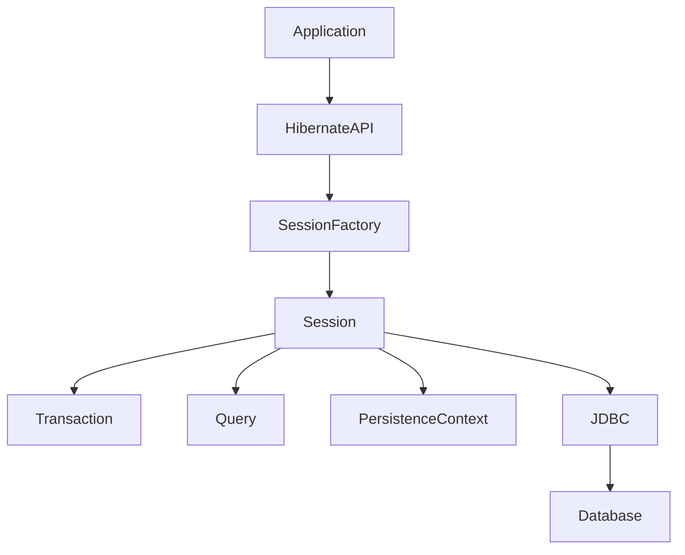
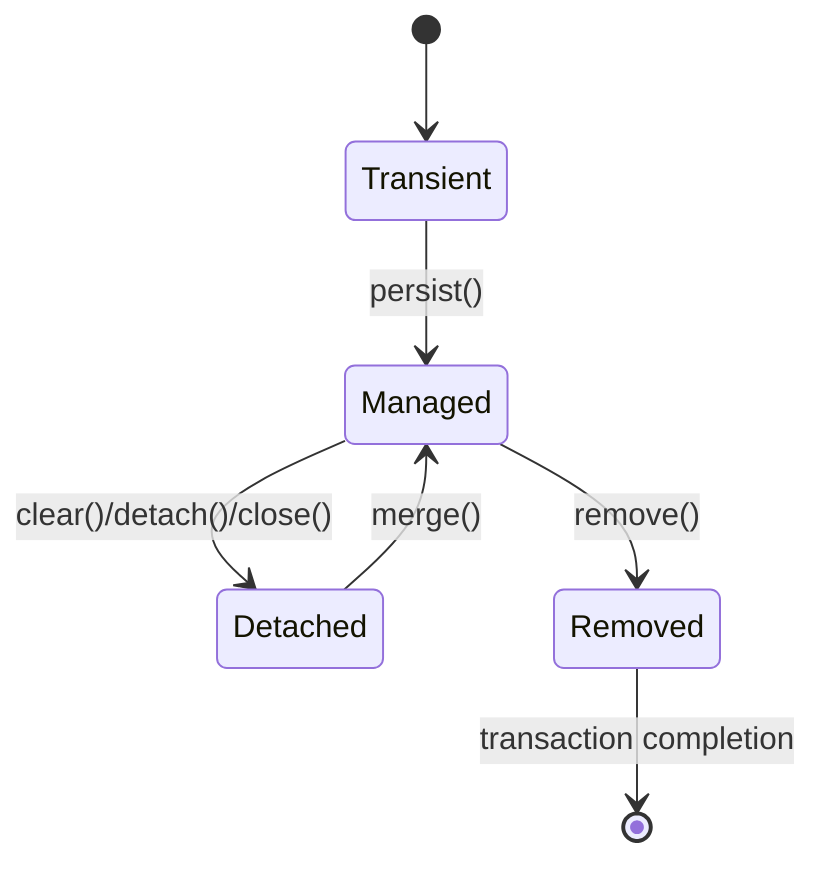
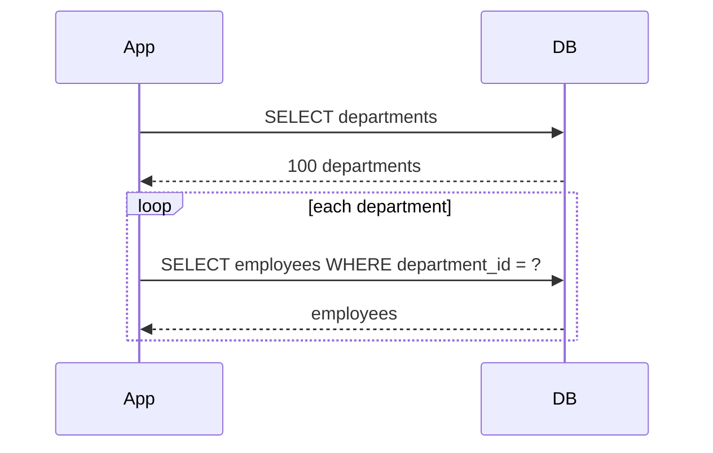
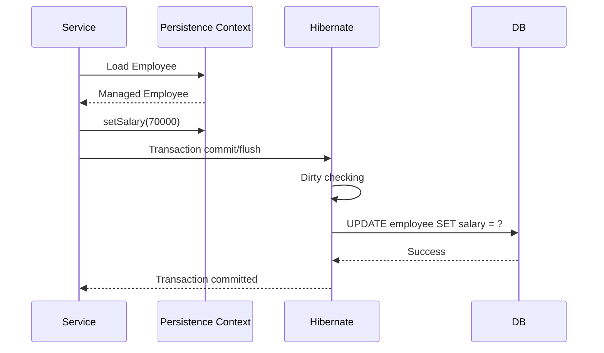

# Hibernate Interview Preparation Guide
## In-Depth Theory + Java Examples + Interview Q&A + Real-World Scenarios

> **Target:** Java / Spring / Spring Boot / Hibernate / JPA interviews  
> **Level:** Beginner → Intermediate → Advanced → Senior  
> **Format:** Copy-ready Markdown revision notes

---

# Table of Contents

1. What is Hibernate?
2. JPA vs Hibernate vs Spring Data JPA
3. What is ORM?
4. Why Hibernate?
5. Hibernate Architecture
6. Core Hibernate Components
7. Hibernate Configuration
8. SessionFactory
9. Session
10. Transaction
11. Query
12. Entity Mapping
13. Hibernate Entity Lifecycle
14. Persistence Context
15. First-Level Cache
16. Dirty Checking
17. persist vs save vs merge
18. get vs load
19. flush vs commit
20. Relationships
21. Owning Side and mappedBy
22. Cascade
23. orphanRemoval
24. Lazy Loading
25. LazyInitializationException
26. N+1 Query Problem
27. Fetch Join
28. EntityGraph
29. Inheritance Mapping
30. JPQL/HQL vs Native SQL
31. Second-Level Cache
32. Query Cache
33. Transactions and Isolation
34. Optimistic Locking
35. Pessimistic Locking
36. Pagination
37. Batch Processing
38. StatelessSession
39. Bulk Update/Delete
40. Entity equals/hashCode
41. Complete Employee/Department Example
42. CRUD Using Hibernate Session
43. Advantages
44. Limitations
45. Performance Tuning
46. Common Hibernate Mistakes
47. Interview Questions and Answers
48. Tricky Interview Questions
49. Scenario-Based Interview Questions
50. Rapid-Fire Revision
51. Memory Tricks
52. Final Hibernate Cheat Sheet

---

# 1. What is Hibernate?

Hibernate is a **Java ORM framework**.

ORM means:

> **Object Relational Mapping**

It maps Java objects to relational database tables.

For example:

```text
Java Object                         Database

Employee                            employee
---------                            --------
id       ----------------------->   id
name     ----------------------->   name
salary   ----------------------->   salary
```

Instead of writing SQL for every CRUD operation, Hibernate can generate SQL based on entity mappings.

Example:

```java
Employee employee = new Employee();

employee.setName("Rahul");
employee.setSalary(50000);

session.persist(employee);
```

Hibernate can generate something conceptually similar to:

```sql
INSERT INTO employee(name, salary)
VALUES (?, ?);
```

The application works primarily with Java objects while Hibernate handles much of the database interaction.

---

# 2. JPA vs Hibernate vs Spring Data JPA

This is extremely important for interviews.

## JPA

JPA = Java Persistence API.

Modern Jakarta Persistence is the standard specification.

It defines APIs and rules for ORM.

JPA itself is **not an implementation**.

Examples of JPA concepts:

```java
@Entity
@Id
@OneToMany
@ManyToOne
EntityManager
```

---

## Hibernate

Hibernate is an ORM implementation/provider.

It implements JPA and also provides Hibernate-specific features.

```text
                    Application
                         |
                         v
                  Spring Data JPA
                         |
                         v
                       JPA
                         |
                         v
                     Hibernate
                         |
                         v
                       JDBC
                         |
                         v
                     Database
```

---

## Spring Data JPA

Spring Data JPA is a Spring abstraction that makes working with JPA repositories easier.

Example:

```java
public interface EmployeeRepository
        extends JpaRepository<Employee, Long> {

}
```

You get methods such as:

```java
save()
findById()
findAll()
delete()
existsById()
```

without implementing them manually.

### Interview answer

> JPA is a specification, Hibernate is a JPA implementation/provider, and Spring Data JPA is a higher-level Spring abstraction built on top of JPA.

---

# 3. What is ORM?

ORM maps:

```text
Java Class      <---------> Database Table

Employee        <---------> employee

Java field      <---------> Column

employee.id     <---------> employee.id
employee.name   <---------> employee.name
```

Without ORM:

```java
PreparedStatement ps =
    connection.prepareStatement(
        "INSERT INTO employee(name, salary) VALUES (?, ?)"
    );
```

With Hibernate:

```java
Employee employee = new Employee();

employee.setName("Amit");
employee.setSalary(50000);

session.persist(employee);
```

Hibernate takes care of much of the JDBC boilerplate.

---

# 4. Why Hibernate?

## Without ORM

Typical application code may need to handle:

```text
Connection
PreparedStatement
ResultSet
SQL
Parameter binding
ResultSet mapping
Exception handling
Connection closing
Transaction handling
```

With Hibernate:

```text
Entity
   |
Repository/Session
   |
Hibernate
   |
JDBC
   |
Database
```

---

# 5. Hibernate Architecture

A simplified architecture:



Another way to visualize the request:

```text
Application
     |
     v
Hibernate API
     |
     v
SessionFactory
     |
     v
Session
     |
     +------> Persistence Context
     |
     +------> Transaction
     |
     +------> Query
     |
     v
JDBC
     |
     v
Database
```

---

# 6. Core Hibernate Components

Important components:

| Component | Responsibility |
|---|---|
| Configuration | Bootstrap/configuration |
| SessionFactory | Creates Sessions |
| Session | Represents interaction with persistence context/database |
| Transaction | Defines atomic unit of work |
| Query | Executes HQL/JPQL/native queries |
| Entity | Java object mapped to DB |
| Persistence Context | Tracks managed entities |
| Cache | Improves repeated data access |
| JDBC | Low-level DB communication |

---

# 7. Hibernate Configuration

Traditional Hibernate configuration can use:

```xml
<?xml version="1.0" encoding="UTF-8"?>

<!DOCTYPE hibernate-configuration PUBLIC
        "-//Hibernate/Hibernate Configuration DTD 3.0//EN"
        "http://hibernate.sourceforge.net/hibernate-configuration-3.0.dtd">

<hibernate-configuration>

    <session-factory>

        <property name="hibernate.connection.driver_class">
            com.mysql.cj.jdbc.Driver
        </property>

        <property name="hibernate.connection.url">
            jdbc:mysql://localhost:3306/company
        </property>

        <property name="hibernate.connection.username">
            root
        </property>

        <property name="hibernate.connection.password">
            password
        </property>

        <property name="hibernate.dialect">
            org.hibernate.dialect.MySQLDialect
        </property>

    </session-factory>

</hibernate-configuration>
```

In Spring Boot, configuration is normally placed in:

```properties
spring.datasource.url=jdbc:mysql://localhost:3306/company
spring.datasource.username=root
spring.datasource.password=password

spring.jpa.hibernate.ddl-auto=update
spring.jpa.show-sql=true
```

---

# 8. SessionFactory

`SessionFactory` is responsible for creating Hibernate `Session` objects.

Conceptually:

```text
Application
     |
     v
SessionFactory
     |
     +---- Session
     |
     +---- Session
     |
     +---- Session
```

## Important characteristics

`SessionFactory` is:

- heavyweight
- expensive to create
- thread-safe
- normally created once per database/configuration
- reused throughout application lifetime

Example:

```java
SessionFactory sessionFactory =
        new Configuration()
                .configure()
                .buildSessionFactory();
```

Usually:

```text
Application startup
       |
       v
Create SessionFactory
       |
       v
Reuse it
       |
       v
Application shutdown
       |
       v
Close SessionFactory
```

### Interview question

**Should we create SessionFactory for every request?**

No.

That is expensive and incorrect architecture.

Normally one `SessionFactory` is shared.

---

# 9. Session

`Session` is the main Hibernate API for interacting with persistent entities.

Example:

```java
Session session = sessionFactory.openSession();
```

A session provides operations such as:

```java
persist()
save()
get()
load()
merge()
remove()
delete()
flush()
createQuery()
```

The exact API available depends on whether you're using standard JPA APIs or Hibernate-specific APIs.

## Session is not thread-safe

Do not share one Hibernate Session across multiple application threads.

Typical model:

```text
Request 1 --> Session 1
Request 2 --> Session 2
Request 3 --> Session 3
```

---

# 10. Transaction

A transaction defines a unit of work.

Example:

```java
Transaction tx = session.beginTransaction();

try {

    session.persist(employee);

    tx.commit();

} catch (Exception e) {

    tx.rollback();
    throw e;
}
```

The idea is:

```text
BEGIN
  |
  +-- INSERT employee
  |
  +-- UPDATE department
  |
  +-- INSERT audit
  |
COMMIT
```

Either all required operations succeed or the transaction can be rolled back.

---

# 11. Query

Hibernate supports query APIs such as HQL/JPQL.

Example:

```java
List<Employee> employees =
        session.createQuery(
            "from Employee",
            Employee.class
        ).getResultList();
```

Notice:

```text
Employee
```

is an entity class, not a database table name.

---

# 12. Entity Mapping

An entity represents a persistent object.

Example:

```java
import jakarta.persistence.*;

@Entity
@Table(name = "employee")
public class Employee {

    @Id
    @GeneratedValue(strategy = GenerationType.IDENTITY)
    private Long id;

    @Column(nullable = false)
    private String name;

    private double salary;

    // getters and setters
}
```

---

## @Entity

Marks the class as a persistent entity.

```java
@Entity
public class Employee {
}
```

---

## @Table

Specifies database table name.

```java
@Table(name = "employee")
```

---

## @Id

Defines primary key.

```java
@Id
private Long id;
```

---

## @GeneratedValue

Defines ID generation strategy.

```java
@GeneratedValue(strategy = GenerationType.IDENTITY)
```

Common strategies:

```text
IDENTITY
SEQUENCE
TABLE
AUTO
```

---

# 13. Hibernate Entity Lifecycle

An entity commonly moves through these states:



---

## 13.1 Transient

Object exists only in Java memory.

```java
Employee e = new Employee();
e.setName("Rahul");
```

At this point:

```text
Java object = yes
Database row = no
Persistence Context = no
```

---

## 13.2 Managed

```java
session.persist(e);
```

Now Hibernate manages the entity.

```text
Java object
     |
     v
Persistence Context
     |
     v
Hibernate tracks changes
```

---

## 13.3 Detached

If the entity leaves the persistence context:

```java
session.detach(e);
```

or:

```java
session.clear();
```

or the session closes:

```java
session.close();
```

the object becomes detached.

---

## 13.4 Removed

```java
session.remove(e);
```

The managed entity is marked for deletion.

SQL is generally executed during flush.

---

# 14. Persistence Context

Persistence Context is one of the most important Hibernate/JPA concepts.

Think of it as:

> A managed workspace containing entity instances that Hibernate tracks.

Example:

```java
Employee e =
    entityManager.find(Employee.class, 1L);
```

Now:

```text
Persistence Context

Employee#1
   |
   +-- name = Rahul
   +-- salary = 50000
```

Hibernate knows the entity's state.

---

# 15. First-Level Cache

The persistence context acts as the **first-level cache**.

It is associated with a Session/EntityManager.

Example:

```java
Employee e1 =
    session.get(Employee.class, 1L);

Employee e2 =
    session.get(Employee.class, 1L);
```

Hibernate can return the same managed instance from the persistence context instead of issuing another SELECT.

Conceptually:

```text
session.get(Employee, 1)
        |
        v
First-level cache
        |
     exists?
      /    \
    yes     no
    |        |
 return     DB
             |
             v
       Persistence Context
```

Important:

> First-level cache is not a global application cache.

It is scoped to the persistence context/session.

---

# 16. Dirty Checking

Dirty checking means Hibernate detects changes made to managed entities.

Example:

```java
@Transactional
public void increaseSalary(Long id) {

    Employee employee =
        entityManager.find(Employee.class, id);

    employee.setSalary(
        employee.getSalary() + 5000
    );
}
```

Notice:

```java
entityManager.persist(employee);
```

is not required for the update.

Why?

Because the entity is already managed.

Hibernate detects:

```text
Original state:
salary = 50000

Current state:
salary = 55000

Difference detected
       |
       v
Generate UPDATE
```

Example SQL:

```sql
UPDATE employee
SET salary = ?
WHERE id = ?;
```

This generally occurs during flush.

---

# 17. persist vs save vs merge

Very common interview topic.

---

## 17.1 persist()

Standard JPA operation.

```java
entityManager.persist(employee);
```

Used primarily for a new entity.

```text
Transient
   |
persist()
   |
   v
Managed
```

It does not necessarily execute INSERT immediately.

---

## 17.2 save()

`save()` is a Hibernate-specific API historically used to make a new entity persistent and return its identifier.

Example:

```java
Serializable id = session.save(employee);
```

Modern applications using JPA usually prefer:

```java
entityManager.persist(employee);
```

or Spring Data:

```java
repository.save(employee);
```

Important:

> Spring Data `save()` is not the same API as Hibernate `Session.save()`.

Spring Data JPA's `save()` decides roughly whether to use `persist()` or `merge()` based on whether it considers the entity new.

---

## 17.3 merge()

Used when state from a detached entity needs to be copied into a managed entity.

```java
Employee managed =
    entityManager.merge(detachedEmployee);
```

Very important:

```text
detachedEmployee
       |
       | merge()
       v
managed copy
```

The original object does **not** become managed.

Example:

```java
Employee managedEmployee =
        entityManager.merge(detachedEmployee);
```

Use:

```java
managedEmployee
```

for subsequent managed operations.

---

# 18. get vs load

This is a classic Hibernate interview question.

Historically Hibernate-specific APIs had:

```java
session.get(Employee.class, id);
session.load(Employee.class, id);
```

## get()

Conceptually:

```java
Employee employee =
    session.get(Employee.class, 10L);
```

If the row does not exist:

```text
get()
 |
 v
null
```

It generally obtains the entity immediately as needed.

---

## load()

Historically:

```java
Employee employee =
    session.load(Employee.class, 10L);
```

It may return a proxy without immediately hitting the database.

If the entity does not exist, accessing it can result in an exception.

Modern Hibernate APIs have evolved, and `getReference()` is the standard JPA-style operation for obtaining a lazy reference.

### Memory trick

```text
GET       -> "Give me the entity"
REFERENCE -> "Give me a reference/proxy"
```

### Interview note

If asked about `get()` vs `load()`, mention that `load()` is a legacy Hibernate API and `EntityManager.getReference()` is the standard JPA counterpart.

---

# 19. flush vs commit

Extremely important.

## flush()

Synchronizes persistence-context changes with the database.

```java
entityManager.flush();
```

Think:

```text
Java managed state
       |
       v
Persistence Context
       |
     flush
       |
       v
SQL sent to DB
```

---

## commit()

Commits the database transaction.

```text
Transaction
    |
    +-- SQL operations
    |
    +-- flush
    |
    v
COMMIT
```

Simplified:

```text
flush()  = synchronize changes with DB

commit() = finalize transaction
```

Flush does **not** mean commit.

---

# 20. Relationships

JPA supports:

```text
@OneToOne
@OneToMany
@ManyToOne
@ManyToMany
```

---

# 20.1 ManyToOne

Suppose many employees belong to one department.

```text
Employee
   |
   +---- Department
   |
   +---- Department
   |
   +---- Department
```

Mapping:

```java
@ManyToOne(fetch = FetchType.LAZY)
@JoinColumn(name = "department_id")
private Department department;
```

Database:

```text
employee
--------------------------------
id | name | department_id
--------------------------------
1  | A    | 10
2  | B    | 10
3  | C    | 20
```

This is usually the side containing the foreign key.

---

# 20.2 OneToMany

Department has many employees.

```java
@OneToMany(
    mappedBy = "department",
    cascade = CascadeType.ALL
)
private List<Employee> employees =
        new ArrayList<>();
```

---

# 20.3 OneToOne

Example:

```text
Employee
   |
   +---- EmployeeProfile
```

```java
@OneToOne
@JoinColumn(name = "profile_id")
private EmployeeProfile profile;
```

---

# 20.4 ManyToMany

Example:

```text
Employee <----> Project
```

An employee can work on many projects.

A project can have many employees.

```java
@ManyToMany
@JoinTable(
    name = "employee_project",
    joinColumns = @JoinColumn(name = "employee_id"),
    inverseJoinColumns = @JoinColumn(name = "project_id")
)
private Set<Project> projects =
        new HashSet<>();
```

Database:

```text
employee
project
employee_project
```

---

# 21. Owning Side and mappedBy

Suppose:

```java
class Department {

    @OneToMany(mappedBy = "department")
    private List<Employee> employees;
}
```

and:

```java
class Employee {

    @ManyToOne
    @JoinColumn(name = "department_id")
    private Department department;
}
```

The `Employee.department` side owns the relationship.

Why?

Because it contains:

```java
@JoinColumn(name = "department_id")
```

`mappedBy` means:

> "The relationship is mapped by the other entity's field."

### Memory trick

```text
@JoinColumn -> owns FK mapping

mappedBy -> inverse side
```

---

# 22. Cascade

Cascade controls propagation of entity lifecycle operations.

Example:

```java
@OneToMany(
    mappedBy = "department",
    cascade = CascadeType.ALL
)
private List<Employee> employees;
```

`CascadeType.ALL` includes:

```text
PERSIST
MERGE
REMOVE
REFRESH
DETACH
```

Example:

```java
department.getEmployees().add(employee);

entityManager.persist(department);
```

With cascade persist:

```text
persist(department)
       |
       v
persist(employee)
```

---

## Cascade does NOT mean:

> "All database operations automatically cascade."

It propagates entity lifecycle operations.

---

# 23. orphanRemoval

Example:

```java
@OneToMany(
    mappedBy = "department",
    cascade = CascadeType.ALL,
    orphanRemoval = true
)
private List<Employee> employees;
```

If an employee is removed from the collection:

```java
department.getEmployees().remove(employee);
```

Hibernate can delete the orphan row.

Conceptually:

```text
Department
    |
    +-- Employee A
    +-- Employee B

remove Employee B from collection

Department
    |
    +-- Employee A

Employee B -> DELETE
```

---

## Cascade REMOVE vs orphanRemoval

### Cascade REMOVE

Parent is removed:

```text
DELETE parent
       |
       v
DELETE children
```

### orphanRemoval

Child is removed from relationship:

```text
remove child from collection
       |
       v
DELETE orphan
```

They solve related but different lifecycle problems.

---

# 24. Lazy Loading

Lazy loading means:

> Do not load associated data until it is actually needed.

Example:

```java
@ManyToOne(fetch = FetchType.LAZY)
private Department department;
```

Initially:

```text
Employee loaded

Department
   |
   v
not necessarily loaded
```

When:

```java
employee.getDepartment().getName();
```

is accessed, Hibernate may execute another SQL query.

---

## Fetch defaults

JPA defaults are important:

| Association | JPA default |
|---|---|
| @ManyToOne | EAGER |
| @OneToOne | EAGER |
| @OneToMany | LAZY |
| @ManyToMany | LAZY |

A common production recommendation is to avoid blindly relying on defaults and explicitly design fetch plans.

---

# 25. LazyInitializationException

Classic interview question.

Example:

```java
@Transactional
public Employee getEmployee(Long id) {

    return repository.findById(id)
            .orElseThrow();
}
```

Suppose the transaction/session closes.

Later:

```java
employee.getDepartment().getName();
```

If `department` was lazy and not initialized:

```text
Session closed
      |
      v
Lazy association accessed
      |
      v
LazyInitializationException
```

The problem is not simply "lazy loading is bad."

The real issue is:

> Hibernate needs an active persistence context to initialize an unloaded lazy association.

---

## Better solutions

### Option 1: Fetch required data in query

```java
@Query("""
    select e
    from Employee e
    join fetch e.department
    where e.id = :id
""")
Employee findEmployeeWithDepartment(Long id);
```

### Option 2: EntityGraph

```java
@EntityGraph(attributePaths = {"department"})
Optional<Employee> findById(Long id);
```

### Option 3: DTO projection

Load exactly what the API needs.

### Option 4: Explicit initialization inside transaction

Sometimes appropriate, but query design is often cleaner.

---

# 26. N+1 Query Problem

One of the most important Hibernate performance problems.

Suppose:

```java
List<Department> departments =
    repository.findAll();
```

Then:

```java
for (Department department : departments) {
    System.out.println(
        department.getEmployees().size()
    );
}
```

Suppose there are 100 departments.

Potential SQL:

```text
1 query:
SELECT * FROM department;

100 queries:
SELECT * FROM employee WHERE department_id = ?;
```

Total:

```text
1 + 100 = 101 queries
```

This is N+1.

---

## Mermaid visualization



---

# 27. Fixing N+1

Several strategies exist.

---

## 27.1 JOIN FETCH

```java
@Query("""
    select distinct d
    from Department d
    join fetch d.employees
""")
List<Department> findDepartmentsWithEmployees();
```

Conceptually:

```sql
SELECT ...
FROM department d
JOIN employee e
  ON e.department_id = d.id;
```

---

## 27.2 EntityGraph

```java
@EntityGraph(attributePaths = "employees")
List<Department> findAll();
```

EntityGraph lets you define the fetch plan without embedding `join fetch` into JPQL.

---

## 27.3 Batch fetching

Hibernate can fetch lazy associations in batches rather than one at a time.

Conceptually:

```text
Instead of:

employee WHERE department_id = 1
employee WHERE department_id = 2
employee WHERE department_id = 3

fetch:

employee WHERE department_id IN (1,2,3,...)
```

---

## 27.4 DTO projection

If the endpoint only needs:

```text
departmentId
departmentName
employeeCount
```

do not necessarily load full entity graphs.

---

# 28. Fetch Join

Example:

```java
List<Employee> employees =
    entityManager.createQuery("""
        select e
        from Employee e
        join fetch e.department
    """, Employee.class)
    .getResultList();
```

This fetches the department association as part of the query.

---

## Important trap

Collection fetch joins can produce duplicate SQL rows.

Suppose:

```text
Department A
   |
   +-- Employee 1
   +-- Employee 2
```

SQL result may contain:

```text
Department A | Employee 1
Department A | Employee 2
```

The same department appears in multiple SQL rows.

Therefore:

```java
select distinct d
```

may be appropriate when fetching collections.

---

## Another trap

Fetch join + pagination on a collection can be problematic.

Why?

The database paginates rows, while your application wants to paginate root entities.

For large datasets, consider:

1. paginate IDs/root entities first
2. fetch associated data in a second query

or use another carefully designed strategy.

---

# 29. EntityGraph

Example:

```java
@EntityGraph(attributePaths = {
    "department"
})
Optional<Employee> findById(Long id);
```

Instead of:

```java
@Query("""
    select e
    from Employee e
    join fetch e.department
    where e.id = :id
""")
```

EntityGraph separates:

```text
WHAT data to fetch
```

from:

```text
HOW repository query is written
```

---

# 30. Inheritance Mapping

Hibernate/JPA supports inheritance.

Suppose:

```text
Employee
   |
   +---- PermanentEmployee
   |
   +---- ContractEmployee
```

---

## 30.1 SINGLE_TABLE

All classes stored in one table.

```java
@Entity
@Inheritance(strategy = InheritanceType.SINGLE_TABLE)
@DiscriminatorColumn(name = "employee_type")
public class Employee {

    @Id
    private Long id;

    private String name;
}
```

Subclasses:

```java
@Entity
@DiscriminatorValue("PERMANENT")
public class PermanentEmployee extends Employee {

    private double annualSalary;
}
```

Conceptual table:

```text
employee
------------------------------------------------
id | name | employee_type | annual_salary | ...
------------------------------------------------
1  | A    | PERMANENT     | 100000        |
2  | B    | CONTRACT      | NULL          |
```

### Advantages

- simple querying
- fewer joins
- good performance for polymorphic queries

### Disadvantages

- many nullable columns
- table can become wide

---

# 30.2 JOINED

Parent table:

```text
employee
----------------
id
name
```

Child table:

```text
permanent_employee
------------------
id
annual_salary
```

Querying subclass requires joins.

### Advantages

- normalized structure
- fewer irrelevant nullable columns

### Disadvantages

- more joins
- potentially more expensive polymorphic queries

---

# 30.3 TABLE_PER_CLASS

Each concrete class has its own table.

Conceptually:

```text
permanent_employee
contract_employee
```

### Advantage

Concrete entity queries can be straightforward.

### Disadvantage

Polymorphic queries can require unions and become expensive.

---

## Interview memory trick

```text
SINGLE_TABLE
    = One table

JOINED
    = Parent + child tables

TABLE_PER_CLASS
    = Separate table per concrete class
```

---

# 31. JPQL/HQL vs Native SQL

## JPQL

Works with entity names and attributes.

```java
select e
from Employee e
where e.salary > :salary
```

This is not:

```sql
SELECT *
FROM employee
WHERE salary > ?
```

JPQL uses:

```text
Entity
Entity field
```

---

## HQL

Hibernate Query Language.

Similar to JPQL but historically has Hibernate-specific capabilities.

---

## Native SQL

Uses actual database tables/columns.

```java
entityManager.createNativeQuery("""
    SELECT *
    FROM employee
    WHERE salary > ?
""");
```

---

## Interview comparison

| JPQL/HQL | Native SQL |
|---|---|
| Entity-oriented | DB-oriented |
| Database-independent in many cases | DB-specific |
| Uses entity fields | Uses table/column names |
| ORM aware | Direct SQL |
| Good for most entity queries | Useful for DB-specific/complex queries |

---

# 32. Second-Level Cache

Hibernate has multiple cache concepts.

## First-Level Cache

Built into persistence context.

```text
Session / EntityManager
       |
       v
First-Level Cache
```

Scope:

```text
Persistence context
```

---

## Second-Level Cache

Optional.

It can be shared across sessions.

```text
Session 1 ----\
Session 2 -----+--> Second-Level Cache
Session 3 ----/
```

Potentially:

```text
Session
   |
   v
L1 Cache
   |
   | miss
   v
L2 Cache
   |
   | miss
   v
Database
```

---

## Good candidates

Second-level caching can be useful for data that is:

- frequently read
- relatively stable
- expensive to retrieve
- shared across sessions

Examples:

```text
Country
Currency
Product category
Configuration
Reference data
```

---

## Poor candidates

Be careful with highly volatile data such as:

```text
Bank balance
Stock quantity
Rapidly changing counters
```

because stale data and invalidation become important.

---

# 33. Query Cache

Query cache is different from entity caching.

Think:

```text
Query Cache

"select employees where department = 10"
              |
              v
       IDs/results metadata
```

The actual entities may still be obtained from the second-level cache.

Therefore:

```text
Query Cache != Entity Cache
```

---

# 34. Transactions and Isolation

Transaction isolation determines how concurrent transactions see each other's changes.

Common levels:

```text
READ_UNCOMMITTED
READ_COMMITTED
REPEATABLE_READ
SERIALIZABLE
```

Database behavior varies, so exact semantics should be understood for the specific database.

---

## Dirty Read

Transaction A reads uncommitted changes from transaction B.

```text
T1 writes salary = 100000
T2 reads salary = 100000
T1 rolls back
```

T2 saw data that never committed.

---

## Non-repeatable Read

Same row read twice returns different committed values.

```text
T1 reads salary = 50000

T2 updates salary = 60000
T2 commits

T1 reads again
salary = 60000
```

---

## Phantom Read

A repeated range query sees additional/deleted rows.

```text
T1:
SELECT employees WHERE salary > 50000

T2:
INSERT employee salary=70000
COMMIT

T1:
SELECT employees WHERE salary > 50000

Result count changed
```

---

# 35. Optimistic Locking

Optimistic locking assumes conflicts are relatively rare.

Use:

```java
@Version
private Long version;
```

Example:

```java
@Entity
public class Employee {

    @Id
    @GeneratedValue
    private Long id;

    private String name;

    private double salary;

    @Version
    private Long version;
}
```

Database:

```text
id | salary | version
---------------------
1  | 50000  | 3
```

Hibernate can generate:

```sql
UPDATE employee
SET salary = ?,
    version = ?
WHERE id = ?
  AND version = ?;
```

Suppose two users read:

```text
version = 3
```

User A updates first:

```text
version 3 -> 4
```

User B tries:

```text
WHERE version = 3
```

No row matches.

Hibernate detects the conflict and raises an optimistic locking exception.

---

## Important

`@Version`:

```text
does NOT automatically retry
```

The application must decide whether retrying is appropriate.

---

# 36. Pessimistic Locking

Pessimistic locking assumes conflicts may occur and asks the database to lock rows.

Example:

```java
Employee employee =
    entityManager.find(
        Employee.class,
        id,
        LockModeType.PESSIMISTIC_WRITE
    );
```

Conceptually:

```sql
SELECT ...
FROM employee
WHERE id = ?
FOR UPDATE;
```

Exact SQL depends on the database.

---

## Optimistic vs Pessimistic

| Optimistic | Pessimistic |
|---|---|
| @Version | DB locking |
| No long-held row lock by default | Can hold row lock |
| Good for low conflict | Good when conflicts must be serialized |
| Detect conflict later | Prevent/block conflicting access |
| Can require retry | Can cause blocking/deadlocks |

---

# 37. Pagination

Basic pagination:

```java
Page<Employee> findAll(Pageable pageable);
```

Offset pagination conceptually:

```sql
SELECT *
FROM employee
ORDER BY id
LIMIT 20 OFFSET 1000;
```

For deep pages this can become expensive because the database may scan/skip many rows.

---

## Keyset pagination

Instead of:

```text
page = 1000
```

use a known last ID:

```sql
SELECT *
FROM employee
WHERE id > ?
ORDER BY id
LIMIT 20;
```

This is often better for large datasets with suitable indexes and stable ordering.

---

# 38. Batch Processing

Suppose you need to insert:

```text
1 million employees
```

Naively:

```java
for (...) {
    entityManager.persist(employee);
}
```

The persistence context may grow very large.

---

## Better approach

Periodically:

```java
entityManager.flush();
entityManager.clear();
```

Example:

```java
for (int i = 1; i <= 100000; i++) {

    Employee employee = new Employee();

    employee.setName("Employee " + i);

    entityManager.persist(employee);

    if (i % 50 == 0) {
        entityManager.flush();
        entityManager.clear();
    }
}
```

Conceptually:

```text
Persist 50
   |
 flush
   |
 clear

Persist 50
   |
 flush
   |
 clear
```

This reduces memory pressure.

Hibernate JDBC batching can also reduce network round trips when configured appropriately.

---

# 39. StatelessSession

Hibernate provides `StatelessSession` for specialized bulk operations.

Unlike normal `Session`, it does not provide the normal first-level persistence context behavior and associated automatic dirty checking.

Conceptually:

```text
Normal Session

Session
 |
 +-- Persistence Context
 +-- First-level cache
 +-- Dirty checking
 +-- Cascading behavior
```

Whereas:

```text
StatelessSession

StatelessSession
 |
 +-- Direct-style operations
```

It can be useful for:

- ETL
- bulk processing
- streaming/import/export workloads

But it sacrifices normal ORM conveniences.

### Interview answer

> StatelessSession is useful when I want lightweight bulk processing and don't need the normal persistence-context features such as dirty checking and first-level caching.

---

# 40. Bulk Update/Delete

Consider:

```java
@Modifying
@Query("""
    update Employee e
    set e.salary = e.salary * 1.10
    where e.department.id = :departmentId
""")
int increaseSalary(Long departmentId);
```

This is efficient because it can execute one bulk SQL operation.

But there is an important problem.

Bulk updates bypass the normal entity-by-entity dirty checking mechanism.

Suppose:

```text
Persistence Context

Employee #1 salary = 50000
```

Bulk query changes database:

```text
salary = 60000
```

But the managed Java entity may still contain:

```text
salary = 50000
```

Now the persistence context is stale.

Therefore, after bulk operations, consider:

```java
flush();
clear();
```

when appropriate.

---

# 41. Entity equals/hashCode

Entity equality is surprisingly tricky.

Naive approach:

```java
@Override
public boolean equals(Object o) {
    return id.equals(((Employee) o).id);
}
```

Problems can occur because:

```text
new entity
id = null
```

and because Hibernate may use proxies/subclasses.

Also avoid mutable fields such as:

```java
name
salary
department
```

in `hashCode()` if those values can change while the object is stored in a `HashSet`.

### Interview answer

> Entity equality should be designed carefully around entity identity/business identity, generated IDs, proxies, and collection semantics. A naive ID-based implementation can fail for transient entities and proxy scenarios.

---

# 42. Complete Employee/Department Example

Let's build a realistic mapping.

Relationship:

```text
Department
    |
    | 1
    |
    |------------------<
    |                   |
 Employee           Employee
    |
    | N
    |
 Department
```

Database:

```text
department
----------------------
id
name


employee
----------------------
id
name
salary
department_id
```

---

## Department Entity

```java
import jakarta.persistence.*;
import java.util.ArrayList;
import java.util.List;

@Entity
@Table(name = "department")
public class Department {

    @Id
    @GeneratedValue(strategy = GenerationType.IDENTITY)
    private Long id;

    @Column(nullable = false)
    private String name;

    @OneToMany(
        mappedBy = "department",
        cascade = CascadeType.ALL,
        orphanRemoval = true
    )
    private List<Employee> employees =
            new ArrayList<>();

    public void addEmployee(Employee employee) {

        employees.add(employee);
        employee.setDepartment(this);
    }

    public void removeEmployee(Employee employee) {

        employees.remove(employee);
        employee.setDepartment(null);
    }

    // getters and setters
}
```

---

## Employee Entity

```java
import jakarta.persistence.*;

@Entity
@Table(name = "employee")
public class Employee {

    @Id
    @GeneratedValue(strategy = GenerationType.IDENTITY)
    private Long id;

    @Column(nullable = false)
    private String name;

    @Column(nullable = false)
    private double salary;

    @ManyToOne(fetch = FetchType.LAZY)
    @JoinColumn(name = "department_id")
    private Department department;

    public Long getId() {
        return id;
    }

    public String getName() {
        return name;
    }

    public double getSalary() {
        return salary;
    }

    public Department getDepartment() {
        return department;
    }

    public void setName(String name) {
        this.name = name;
    }

    public void setSalary(double salary) {
        this.salary = salary;
    }

    public void setDepartment(Department department) {
        this.department = department;
    }
}
```

---

# 43. CRUD Using Hibernate Session

This example uses the Hibernate `Session` API directly.

---

## Create

```java
Session session = sessionFactory.openSession();

Transaction tx = session.beginTransaction();

try {

    Employee employee = new Employee();

    employee.setName("Rahul");
    employee.setSalary(60000);

    session.persist(employee);

    tx.commit();

} catch (Exception e) {

    tx.rollback();
    throw e;

} finally {

    session.close();
}
```

---

# Read

```java
Session session = sessionFactory.openSession();

try {

    Employee employee =
            session.get(Employee.class, 1L);

    if (employee != null) {
        System.out.println(employee.getName());
    }

} finally {

    session.close();
}
```

---

# Update

```java
Session session = sessionFactory.openSession();

Transaction tx = session.beginTransaction();

try {

    Employee employee =
            session.get(Employee.class, 1L);

    if (employee != null) {

        employee.setSalary(75000);

    }

    tx.commit();

} catch (Exception e) {

    tx.rollback();
    throw e;

} finally {

    session.close();
}
```

Notice:

```java
session.update(employee);
```

is not necessarily required when the entity is already managed.

Dirty checking handles the change.

---

# Delete

```java
Session session = sessionFactory.openSession();

Transaction tx = session.beginTransaction();

try {

    Employee employee =
            session.get(Employee.class, 1L);

    if (employee != null) {
        session.remove(employee);
    }

    tx.commit();

} catch (Exception e) {

    tx.rollback();
    throw e;

} finally {

    session.close();
}
```

---

# 44. Query Examples

## HQL

```java
List<Employee> employees =
        session.createQuery(
            "from Employee",
            Employee.class
        ).getResultList();
```

---

## Parameterized query

```java
List<Employee> employees =
        session.createQuery("""
            from Employee e
            where e.salary > :salary
        """, Employee.class)
        .setParameter("salary", 50000)
        .getResultList();
```

---

## Join query

```java
List<Employee> employees =
        session.createQuery("""
            select e
            from Employee e
            join e.department d
            where d.name = :departmentName
        """, Employee.class)
        .setParameter("departmentName", "IT")
        .getResultList();
```

---

# 45. Many-to-Many Example

Suppose:

```text
Employee
   |
   +---- Project A
   |
   +---- Project B
```

and:

```text
Project
   |
   +---- Employee 1
   |
   +---- Employee 2
```

Entity:

```java
@Entity
public class Employee {

    @Id
    @GeneratedValue
    private Long id;

    private String name;

    @ManyToMany
    @JoinTable(
        name = "employee_project",
        joinColumns =
            @JoinColumn(name = "employee_id"),
        inverseJoinColumns =
            @JoinColumn(name = "project_id")
    )
    private Set<Project> projects =
            new HashSet<>();
}
```

Project:

```java
@Entity
public class Project {

    @Id
    @GeneratedValue
    private Long id;

    private String name;

    @ManyToMany(mappedBy = "projects")
    private Set<Employee> employees =
            new HashSet<>();
}
```

---

# 46. Better Alternative to Many-to-Many

A direct many-to-many mapping can become problematic if the relationship has attributes.

Suppose employee-project relationship needs:

```text
assignedDate
role
hoursPerWeek
```

Then don't use only:

```text
Employee <----> Project
```

Create:

```text
Employee
    |
    v
EmployeeProject
    |
    v
Project
```

Entity:

```java
@Entity
public class EmployeeProject {

    @Id
    @GeneratedValue
    private Long id;

    @ManyToOne(fetch = FetchType.LAZY)
    private Employee employee;

    @ManyToOne(fetch = FetchType.LAZY)
    private Project project;

    private String role;

    private LocalDate assignedDate;

    private int hoursPerWeek;
}
```

### Interview answer

> If a many-to-many relationship has its own attributes or lifecycle, model the join table as an explicit entity.

This is a very good senior-level answer.

---

# 47. Advantages of Hibernate

## 1. Reduces JDBC boilerplate

Instead of manually managing:

```text
Connection
PreparedStatement
ResultSet
```

you work primarily with entities.

---

## 2. Object-oriented data access

You can work with:

```java
employee.getDepartment()
```

rather than manually joining tables everywhere.

---

## 3. Automatic dirty checking

```java
employee.setSalary(70000);
```

Hibernate can detect the change.

---

## 4. First-level cache

Repeated access within the same persistence context can avoid redundant DB reads.

---

## 5. Lazy loading

Load related objects only when required.

---

## 6. Transaction support

Integrates well with Spring transactions.

---

## 7. Database portability

Hibernate can generate database-specific SQL through its dialect/provider mechanisms.

---

## 8. Powerful mappings

Supports:

```text
One-to-one
One-to-many
Many-to-one
Many-to-many
Inheritance
Embeddables
Converters
Caching
Locking
```

---

# 48. Limitations of Hibernate

Hibernate is not magic.

## 1. Learning curve

Concepts include:

```text
Persistence Context
Dirty Checking
Flush
Caching
Fetch Plans
Proxies
Transactions
Locking
```

---

## 2. Hidden SQL

Developers may forget that:

```java
employee.getDepartment()
```

can trigger SQL.

---

## 3. N+1 queries

Incorrect fetch design can create hundreds/thousands of queries.

---

## 4. Complex SQL

Sometimes SQL is clearer and more efficient than forcing everything through ORM.

---

## 5. Performance tuning requires knowledge

You need to understand:

```text
SQL
indexes
execution plans
transactions
connection pools
database locks
Hibernate fetching
```

---

## 6. Abstraction leakage

ORM does not eliminate relational database concepts.

A strong Hibernate developer must understand both:

```text
Object model
+
Relational model
```

---

# 49. Performance Tuning

When Hibernate is slow, don't immediately blame Hibernate.

Investigate:

```text
Application
    |
    +-- Too many queries?
    |
    +-- N+1?
    |
    +-- Slow SQL?
    |
    +-- Missing index?
    |
    +-- Huge result?
    |
    +-- Large persistence context?
    |
    +-- Connection pool?
    |
    +-- Lock contention?
    |
    +-- Network latency?
    |
    v
Database
```

---

## Important performance checklist

### 1. Detect N+1

Look at SQL logs.

---

### 2. Avoid unnecessary EAGER relationships

Especially for large collections.

---

### 3. Use DTO projections

If you only need:

```text
id
name
salary
```

don't load:

```text
Employee
Department
Projects
Address
Manager
...
```

---

### 4. Use indexes

For:

```sql
WHERE department_id = ?
```

consider an index on:

```text
department_id
```

---

### 5. Batch operations

Use JDBC batching where appropriate.

---

### 6. Flush/clear large loops

```java
if (i % 50 == 0) {
    entityManager.flush();
    entityManager.clear();
}
```

---

### 7. Analyze generated SQL

Enable SQL logging in development/test environments.

---

### 8. Check database execution plan

A Hibernate query may be logically correct but still produce poor SQL/database execution.

---

# 50. Common Hibernate Mistakes

## Mistake 1

Making every relationship:

```java
FetchType.EAGER
```

This can produce huge object graphs and unnecessary queries.

---

## Mistake 2

Returning entities directly from REST APIs.

Better:

```text
Entity
   |
   v
Service
   |
   v
DTO
   |
   v
API
```

This prevents accidental lazy loading, serialization cycles, and exposing persistence details.

---

## Mistake 3

Ignoring generated SQL.

Hibernate abstracts SQL generation, but production systems still execute SQL.

---

## Mistake 4

Using `CascadeType.ALL` everywhere.

Cascade should reflect actual ownership/lifecycle semantics.

---

## Mistake 5

Using `@ManyToMany` for every many-to-many database relationship.

If the relationship has attributes, create a join entity.

---

## Mistake 6

Putting external API calls inside long DB transactions.

Bad:

```text
BEGIN TRANSACTION
   |
   +-- UPDATE database
   |
   +-- Call payment API
   |
   +-- Wait 5 seconds
   |
COMMIT
```

This can hold DB resources/locks unnecessarily.

---

# 51. Interview Questions and Answers

# Basic Hibernate Questions

---

## Q1. What is Hibernate?

### Short answer

Hibernate is a Java ORM framework that maps Java objects to relational database tables and handles persistence operations.

### Deep answer

Hibernate:

- maps entities to tables
- generates SQL
- manages persistence contexts
- performs dirty checking
- supports lazy loading
- supports caching
- supports transactions and locking
- reduces JDBC boilerplate

### Interview trap

Do not say:

> Hibernate is JPA.

Correct:

> Hibernate is a JPA provider/ORM implementation. JPA is the specification.

---

# Q2. What is ORM?

### Answer

ORM stands for Object Relational Mapping.

It maps:

```text
Java Class      -> Table
Java Object     -> Row
Java Field      -> Column
Relationship    -> Foreign Key relationship
```

---

# Q3. What is JPA?

### Answer

JPA is a persistence/ORM specification defining standard APIs and annotations for mapping Java objects to relational databases.

Hibernate is one implementation of that specification.

---

# Q4. Hibernate vs JDBC?

| Hibernate | JDBC |
|---|---|
| ORM | Low-level DB API |
| Entity-oriented | SQL-oriented |
| Generates SQL | Developer writes SQL |
| Dirty checking | Manual |
| Mapping support | Manual mapping |
| Caching support | Not ORM cache |
| More abstraction | More control |

---

# Q5. Hibernate vs Spring Data JPA?

### Answer

Hibernate is the ORM provider.

Spring Data JPA provides repository abstractions on top of JPA.

Example:

```java
interface EmployeeRepository
        extends JpaRepository<Employee, Long> {
}
```

Under the hood:

```text
Spring Data JPA
       |
       v
JPA
       |
       v
Hibernate
       |
       v
JDBC
       |
       v
Database
```

---

# Q6. What is SessionFactory?

### Answer

`SessionFactory` is a heavyweight, thread-safe object responsible for creating Hibernate sessions.

Normally:

```text
one SessionFactory
        |
        +-- Session
        +-- Session
        +-- Session
```

It is usually created once and reused.

---

# Q7. Is SessionFactory thread-safe?

Yes.

It is designed to be shared.

---

# Q8. Is Session thread-safe?

No.

A Session should not be shared between concurrent application threads.

---

# Q9. What is a Session?

A Hibernate Session provides an API for interacting with persistent entities and maintains a persistence context.

It supports operations such as:

```text
persist
get
merge
remove
flush
createQuery
```

---

# Q10. What is persistence context?

### Answer

A persistence context is a managed set of entity instances associated with an EntityManager/session.

Hibernate tracks changes to managed entities.

---

# Persistence Context Questions

---

# Q11. What is first-level cache?

### Answer

The persistence context acts as Hibernate's first-level cache.

It is:

```text
mandatory
session-scoped
automatic
```

Example:

```java
session.get(Employee.class, 1L);
session.get(Employee.class, 1L);
```

The second lookup can be served from the same persistence context.

---

# Q12. Is first-level cache shared between sessions?

No.

```text
Session A -> L1 Cache A

Session B -> L1 Cache B
```

They are separate.

---

# Q13. What is dirty checking?

### Answer

Dirty checking is Hibernate's mechanism for detecting changes made to managed entities and generating appropriate SQL during flush.

Example:

```java
Employee e =
    entityManager.find(Employee.class, 1L);

e.setSalary(70000);
```

Hibernate detects the changed salary and can generate an UPDATE.

---

# Q14. Do we need save() after modifying a managed entity?

Usually no.

Example:

```java
@Transactional
public void update(Long id) {

    Employee e =
        entityManager.find(Employee.class, id);

    e.setSalary(70000);
}
```

The entity is managed.

Dirty checking handles the update during flush.

---

# Q15. What happens if we modify a detached entity?

Hibernate does not automatically track changes to a detached entity.

You generally need to merge its state:

```java
Employee managed =
    entityManager.merge(detachedEmployee);
```

---

# Q16. Does merge make the original entity managed?

No.

This is a classic trick question.

```java
Employee managed =
        entityManager.merge(detachedEmployee);
```

The returned object is managed.

The original remains detached.

---

# Q17. Does persist immediately execute INSERT?

Not necessarily.

`persist()` makes the entity managed.

SQL may be delayed until:

```text
flush
```

or another point where Hibernate needs to synchronize with the database.

---

# Q18. flush vs commit?

### flush

Synchronizes persistence context with database.

### commit

Commits the database transaction.

Remember:

```text
flush != commit
```

---

# Q19. When does Hibernate flush?

Depending on configuration and transaction context, flushing can happen:

- explicitly
- before transaction commit
- before certain queries under AUTO flush behavior
- when required to maintain consistency

Exact SQL timing can depend on flush mode and provider behavior.

---

# Mapping Questions

---

# Q20. What is @Entity?

Marks a Java class as a persistent entity.

```java
@Entity
public class Employee {
}
```

---

# Q21. What is @Id?

Defines the primary key.

```java
@Id
private Long id;
```

---

# Q22. What is @GeneratedValue?

Controls primary-key generation strategy.

```java
@GeneratedValue(
    strategy = GenerationType.IDENTITY
)
```

---

# Q23. Explain @ManyToOne.

Many records reference one parent.

Example:

```text
Many Employees
      |
      v
One Department
```

```java
@ManyToOne(fetch = FetchType.LAZY)
@JoinColumn(name = "department_id")
private Department department;
```

---

# Q24. Which side owns a bidirectional relationship?

Usually the side containing the foreign-key mapping, commonly the side with `@JoinColumn`.

Example:

```java
Employee.department
```

owns:

```text
department_id
```

while:

```java
Department.employees
```

uses:

```java
mappedBy = "department"
```

---

# Q25. What does mappedBy mean?

It identifies the inverse side of a bidirectional relationship.

```java
@OneToMany(mappedBy = "department")
```

means the relationship is mapped by:

```java
Employee.department
```

---

# Q26. Cascade vs orphanRemoval?

### Cascade

Propagates lifecycle operations.

```text
persist parent
   |
   v
persist children
```

### orphanRemoval

Removes children that become orphans from the relationship.

---

# Q27. Why is CascadeType.ALL dangerous?

Because it includes:

```text
REMOVE
```

If the child entity is shared/referenced elsewhere, cascading delete may remove data unexpectedly.

Use cascade according to actual ownership semantics.

---

# Fetching Questions

---

# Q28. What is lazy loading?

Associated data is loaded only when accessed/needed.

Example:

```java
@ManyToOne(fetch = FetchType.LAZY)
private Department department;
```

---

# Q29. What is eager loading?

Association is fetched eagerly as part of the entity loading plan.

It can cause unnecessary data retrieval and large object graphs.

---

# Q30. Why is lazy loading generally preferred?

Because it avoids loading unnecessary data.

But lazy loading alone does not solve performance problems.

You still need appropriate query/fetch design.

---

# Q31. What causes LazyInitializationException?

Usually:

```text
lazy association not initialized
+
persistence context/session closed
+
association accessed
```

---

# Q32. How do you fix LazyInitializationException?

Preferred approaches:

```text
1. Fetch required data in transaction
2. JOIN FETCH
3. EntityGraph
4. DTO projection
5. Explicit initialization when appropriate
```

Avoid treating Open Session in View as the universal solution.

---

# Q33. What is Open Session in View?

Open Session in View keeps the persistence context/session available during the web request, potentially allowing lazy associations to initialize during view/serialization.

It can be convenient but can also:

- hide N+1 queries
- cause database access during serialization
- make transaction boundaries unclear
- increase DB usage

Use it intentionally.

---

# Q34. What is N+1?

One query retrieves N parent entities, then accessing an association causes one additional query for each parent.

```text
1 + N queries
```

Example:

```text
SELECT departments

SELECT employees WHERE department_id = 1
SELECT employees WHERE department_id = 2
SELECT employees WHERE department_id = 3
...
```

---

# Q35. How do you solve N+1?

Possible approaches:

```text
JOIN FETCH
EntityGraph
Batch fetching
DTO projection
Query redesign
```

---

# Q36. Is JOIN FETCH always the best solution?

No.

For example, fetching multiple collections can create a huge Cartesian-like result and duplicate rows.

Also collection fetch joins and pagination require care.

The correct solution depends on the use case.

---

# Caching Questions

---

# Q37. Explain Hibernate cache levels.

### First-level cache

```text
Session/EntityManager
```

Mandatory and automatic.

### Second-level cache

```text
Shared across persistence contexts
```

Optional/provider/configuration dependent.

### Query cache

Caches query result information; it is distinct from entity caching.

---

# Q38. When should second-level cache be used?

Good candidates:

```text
Reference data
Country
Currency
Stable product metadata
Configuration
Frequently read data
```

Be careful with:

```text
Highly volatile records
Inventory counts
Financial balances
```

---

# Q39. Is second-level cache always faster?

No.

Cache has costs:

```text
memory
serialization
invalidation
staleness concerns
coordination
```

If data changes frequently, caching may not provide the desired benefit.

---

# Transaction Questions

---

# Q40. Why should transaction boundaries usually be at service layer?

A service method often represents a business use case.

Example:

```java
@Transactional
public void transferMoney(...) {

    debitAccount();

    creditAccount();

    saveAudit();
}
```

All operations belong to one business transaction.

---

# Q41. What happens if a transaction fails?

Depending on the transaction manager and exception type/configuration, the transaction can roll back.

With Spring's default behavior, unchecked exceptions generally trigger rollback, while checked exceptions do not unless configured.

Example:

```java
@Transactional(
    rollbackFor = Exception.class
)
```

---

# Q42. Can a private method use @Transactional?

A common interview answer:

> Spring's proxy-based transaction interception does not apply to private methods in the usual way.

Also, self-invocation is a common trap.

Example:

```java
public void methodA() {
    methodB();
}

@Transactional
public void methodB() {
}
```

If `methodA()` calls `methodB()` directly on `this`, the proxy may be bypassed.

---

# Q43. What is transaction isolation?

It defines how concurrent transactions interact with each other's database changes.

Typical levels:

```text
READ_UNCOMMITTED
READ_COMMITTED
REPEATABLE_READ
SERIALIZABLE
```

---

# Q44. Which isolation level is safest?

`SERIALIZABLE` provides the strongest isolation in the standard model, but can significantly reduce concurrency and increase contention.

Therefore:

> Highest isolation is not automatically best.

Choose according to business consistency requirements.

---

# Locking Questions

---

# Q45. What is optimistic locking?

Optimistic locking detects conflicting updates.

Usually:

```java
@Version
private Long version;
```

It is useful when conflicts are relatively rare.

---

# Q46. What is pessimistic locking?

Pessimistic locking asks the database to lock rows.

Example:

```java
entityManager.find(
    Employee.class,
    id,
    LockModeType.PESSIMISTIC_WRITE
);
```

It can prevent conflicting operations but can introduce blocking/deadlocks.

---

# Q47. Does @Version prevent concurrent reads?

No.

It is primarily used to detect conflicting updates.

---

# Q48. What happens if optimistic locking fails?

Hibernate/JPA detects that the expected version no longer matches.

An optimistic locking exception is raised.

The application can:

```text
retry
reject update
reload data
ask user to resolve conflict
```

depending on business requirements.

---

# Spring Data JPA Questions

---

# Q49. What does repository.save() do?

Spring Data JPA's `save()` roughly chooses:

```text
new entity
   -> persist()

existing entity
   -> merge()
```

The exact determination of "new" is based on entity metadata and Spring Data's new-entity detection strategy.

---

# Q50. Is save() required for every update?

Not necessarily.

Inside a transaction:

```java
Employee e =
    repository.findById(id)
              .orElseThrow();

e.setSalary(70000);
```

Because `e` is managed, dirty checking can update it at flush.

---

# Q51. Why use DTOs instead of exposing entities?

DTOs provide:

- API isolation
- controlled fields
- no accidental lazy loading
- prevention of recursive relationships
- protection from exposing internal schema
- easier API versioning

---

# Advanced Questions

---

# Q52. What happens internally when Hibernate loads an entity?

Simplified:

```text
Application
     |
     v
Session / EntityManager
     |
     v
Persistence Context
     |
     | cache miss
     v
Hibernate
     |
     v
SQL generation
     |
     v
JDBC
     |
     v
Database
     |
     v
ResultSet
     |
     v
Entity materialization
     |
     v
Persistence Context
```

---

# Q53. Why can one entity ID correspond to one Java instance within a persistence context?

The persistence context follows an identity-map-like behavior.

Conceptually:

```text
Entity type + ID
       |
       v
Managed instance
```

This prevents multiple managed Java objects representing the same database identity inside the same persistence context.

---

# Q54. What happens when a query returns 1000 entities?

Hibernate may create/manage those entity instances in the persistence context.

This can consume significant memory.

For large processing jobs:

```text
batch
flush
clear
```

or a specialized approach such as `StatelessSession` may be appropriate.

---

# Q55. Why does clearing the persistence context help?

```java
entityManager.clear();
```

detaches all managed entities.

This reduces the number of objects Hibernate must keep tracking.

---

# Q56. Difference between detach() and clear()?

```java
entityManager.detach(entity);
```

detaches one entity.

```java
entityManager.clear();
```

detaches all managed entities.

---

# Q57. What does refresh() do?

```java
entityManager.refresh(entity);
```

Reloads the entity state from the database.

It can overwrite changes currently present in the managed object.

---

# Q58. What happens if a bulk update runs while entities are managed?

The persistence context can become stale because bulk operations bypass normal dirty checking.

Consider:

```java
flush();
clear();
```

when appropriate.

---

# Q59. Why can merge() be dangerous?

Suppose:

```text
DB:
name = Rahul
salary = 50000
department = IT
```

Detached object:

```text
name = Rahul
salary = null
department = null
```

A careless merge/mapping operation can propagate stale/null state.

Therefore:

> Don't blindly map partial API requests into detached entities and merge them.

For partial updates, carefully load the managed entity and update only intended fields.

---

# Q60. Why can EAGER fetching be dangerous?

Suppose:

```text
Employee
 |
 +-- Department
 |
 +-- Projects
 |
 +-- Address
 |
 +-- Manager
 |
 +-- Permissions
```

EAGER relationships can cause:

```text
large joins
many queries
large memory usage
slow response
```

Fetch data according to use case.

---

# 52. Tricky Interview Questions

# Q61. Does Hibernate execute SQL immediately after persist()?

Not necessarily.

```text
persist()
   |
   v
managed entity
   |
   v
flush
   |
   v
INSERT
```

---

# Q62. Does flush commit the transaction?

No.

```text
flush != commit
```

Flush sends synchronization work to the database.

Commit finalizes the transaction.

---

# Q63. Is SessionFactory expensive?

Yes.

It is heavyweight and should normally be reused.

---

# Q64. Is Session thread-safe?

No.

---

# Q65. Is SessionFactory thread-safe?

Yes, designed for concurrent use.

---

# Q66. Is first-level cache optional?

No.

The persistence context provides first-level caching behavior.

---

# Q67. Is second-level cache mandatory?

No.

It is optional.

---

# Q68. Does lazy loading always mean one additional query?

No.

It depends on the fetch plan, already initialized state, batching, join fetches, entity graphs, and other configuration.

---

# Q69. Does JOIN FETCH eliminate all N+1 problems?

No.

It can solve a particular N+1 caused by an association, but poorly designed fetch joins can create other performance problems.

---

# Q70. Can we fetch multiple collections with JOIN FETCH?

Technically possible in some cases, but it can produce very large result sets and, depending on Hibernate/database/query shape, multiple bag fetching can cause specific problems.

Better to design fetch plans carefully.

---

# Q71. Why use Set instead of List?

For relationships where uniqueness matters, `Set` can express that semantic.

But don't choose blindly.

Entity equality/hashCode must be correct, and Hibernate has special considerations around bags/lists/sets.

---

# Q72. What is the N+1 problem in serialization?

Example:

```text
Controller
    |
    v
return entities
    |
    v
JSON serializer
    |
    v
getDepartment()
    |
    v
Lazy SQL queries
```

The application may unexpectedly execute database queries while serializing the response.

This is one reason DTOs are often preferable for APIs.

---

# Q73. Why can returning entities directly cause infinite recursion?

Bidirectional relationship:

```text
Department
   |
   v
Employee
   |
   v
Department
   |
   v
Employee
```

JSON serialization can repeatedly traverse the relationship.

DTOs avoid this problem more cleanly.

---

# Q74. Can Hibernate prevent database-level race conditions?

Not by itself.

For important invariants use:

```text
database constraints
transactions
optimistic locking
pessimistic locking
atomic SQL
proper isolation
```

For example, don't rely only on:

```java
if (stock > 0) {
    stock--;
}
```

in Java.

Two concurrent requests can both observe the same stock.

---

# Q75. How would you prevent overselling inventory?

Possible approach:

```sql
UPDATE product
SET stock = stock - 1
WHERE id = ?
  AND stock > 0;
```

Then check:

```text
rows updated == 1
```

This is atomic at the database level.

Other options:

```text
@Version
PESSIMISTIC_WRITE
```

depending on workload.

---

# 53. Scenario-Based Interview Questions

# Scenario 1: Employee and Department

### Requirement

One department has many employees.

### Mapping

```java
@OneToMany(mappedBy = "department")
private List<Employee> employees;
```

Employee:

```java
@ManyToOne(fetch = FetchType.LAZY)
@JoinColumn(name = "department_id")
private Department department;
```

### Question

Which side owns the relationship?

### Answer

Employee.

Because:

```java
@JoinColumn(name = "department_id")
```

defines the foreign-key mapping.

---

# Scenario 2: Delete Department

Question:

> If I delete a department, should all employees be deleted?

Answer:

It depends on business ownership.

If employees cannot exist without the department:

```java
cascade = CascadeType.REMOVE
```

or appropriate lifecycle mapping may be justified.

But if employees can move to another department, blindly using:

```java
CascadeType.ALL
```

could be dangerous.

---

# Scenario 3: 100 Departments, 1000 Employees

API:

```text
GET /departments
```

Each department contains employees.

Problem:

```text
1 query departments
100 queries employees
```

N+1.

Solutions:

```text
JOIN FETCH
EntityGraph
Batch fetching
DTO projection
```

---

# Scenario 4: Slow Employee API

API:

```text
GET /employees
```

returns:

```text
10,000 employees
```

with:

```text
department
projects
manager
address
```

### Diagnosis

Likely issues:

```text
huge object graph
too many queries
large joins
large JSON
memory consumption
```

### Better design

Return a DTO:

```java
public record EmployeeResponse(
    Long id,
    String name,
    double salary,
    String departmentName
) {}
```

Fetch only required fields.

---

# Scenario 5: Million Employee Import

Naive:

```java
for (...) {
    entityManager.persist(employee);
}
```

Problem:

```text
Persistence Context
       |
       v
1,000,000 managed objects
       |
       v
Huge memory usage
```

Better:

```java
for (int i = 1; i <= 1_000_000; i++) {

    entityManager.persist(createEmployee());

    if (i % 100 == 0) {
        entityManager.flush();
        entityManager.clear();
    }
}
```

Also configure JDBC batching appropriately.

For specialized bulk processing, consider `StatelessSession`.

---

# Scenario 6: Concurrent Salary Update

Two users edit:

```text
Employee #1
salary = 50000
version = 5
```

User A changes:

```text
50000 -> 60000
```

User B changes:

```text
50000 -> 70000
```

Use:

```java
@Version
private Long version;
```

Result:

```text
User A -> version 5 -> 6

User B -> expected version 5
          |
          v
        conflict
```

This prevents silent lost updates.

---

# Scenario 7: LazyInitializationException

Service returns entity:

```java
Employee employee =
    repository.findById(id).orElseThrow();
```

Controller/serializer accesses:

```java
employee.getDepartment();
```

Session is already closed.

Result:

```text
LazyInitializationException
```

Solution:

Fetch department within the transaction using:

```text
JOIN FETCH
EntityGraph
DTO projection
```

---

# Scenario 8: External API Inside Transaction

Bad:

```java
@Transactional
public void createOrder() {

    saveOrder();

    paymentClient.charge();

    sendNotification();
}
```

Problem:

```text
DB transaction
    |
    +-- holds DB resources
    |
    +-- HTTP call
    |
    +-- waits
    |
    +-- another HTTP call
    |
    v
commit
```

If payment takes 5 seconds, the database transaction may remain open unnecessarily.

Better architecture can involve:

```text
DB transaction
    |
    +-- save order
    +-- save outbox event
    |
    v
commit
    |
    v
Background worker
    |
    +-- payment
    +-- notification
```

This leads into the Outbox/Saga patterns for distributed workflows.

---

# Scenario 9: Database Connection Pool Exhaustion

Symptoms:

```text
Connection timeout
Slow requests
Threads waiting
DB connections at maximum
```

Possible Hibernate causes:

```text
Long transactions
Slow SQL
N+1
External calls inside transactions
Too much concurrency
Nested REQUIRES_NEW
DB locks
```

Don't simply increase the connection pool.

First identify why connections are being held.

---

# Scenario 10: Cache Gives Stale Employee Data

Suppose salary changes frequently.

Using aggressive caching may return stale values.

Question:

> Should we cache employee salary?

Usually be cautious.

Highly volatile/consistency-sensitive data is often a poor cache candidate unless the application has a clear invalidation/consistency strategy.

---

# 54. Senior-Level Scenario

## Requirement

Build an employee salary update API.

```text
PUT /employees/{id}/salary
```

Two users can update simultaneously.

### Bad implementation

```java
Employee employee =
    repository.findById(id).orElseThrow();

employee.setSalary(newSalary);

repository.save(employee);
```

Potential issue:

```text
User A reads version 1
User B reads version 1

A writes
B writes

B can overwrite A
```

### Better

```java
@Entity
public class Employee {

    @Id
    private Long id;

    private double salary;

    @Version
    private Long version;
}
```

Now:

```text
A:
version 1 -> 2

B:
expected version 1
       |
       v
conflict
```

The API can return a conflict response such as:

```text
409 CONFLICT
```

depending on API design.

---

# 55. Hibernate Internal Flow

When executing:

```java
employee.setSalary(70000);
```

inside a transaction:



The exact SQL timing can vary because flush can also happen before commit or before certain queries.

---

# 56. Hibernate and Spring Boot

In Spring Boot, you commonly see:

```text
Controller
   |
   v
Service
   |
   v
Spring Data JPA Repository
   |
   v
JPA EntityManager
   |
   v
Hibernate
   |
   v
JDBC
   |
   v
Database
```

Example:

```java
@Service
public class EmployeeService {

    private final EmployeeRepository repository;

    public EmployeeService(EmployeeRepository repository) {
        this.repository = repository;
    }

    @Transactional
    public void increaseSalary(
            Long employeeId,
            double amount) {

        Employee employee =
                repository.findById(employeeId)
                          .orElseThrow();

        employee.setSalary(
                employee.getSalary() + amount
        );
    }
}
```

No explicit:

```java
repository.save(employee);
```

is required if the entity is already managed and the transaction remains active.

---

# 57. Recommended Spring Boot Entity Design

Example:

```java
@Entity
@Table(name = "employee")
public class Employee {

    @Id
    @GeneratedValue(strategy = GenerationType.IDENTITY)
    private Long id;

    @Column(nullable = false)
    private String name;

    @Column(nullable = false)
    private BigDecimal salary;

    @ManyToOne(fetch = FetchType.LAZY)
    @JoinColumn(name = "department_id")
    private Department department;

    @Version
    private Long version;
}
```

Good interview points:

```text
@Entity
@Id
GeneratedValue
LAZY association
JoinColumn
Version
Column constraints
```

---

# 58. Best Practices

## 1. Prefer LAZY for large associations

Don't load data that isn't required.

---

## 2. Keep transaction boundaries clear

Usually at service/use-case level.

---

## 3. Don't expose entities directly from APIs

Use DTOs.

---

## 4. Monitor SQL

Know what Hibernate is actually doing.

---

## 5. Watch for N+1

Especially:

```text
collections
serialization
loops
lazy relationships
```

---

## 6. Use database constraints

For example:

```sql
UNIQUE
FOREIGN KEY
NOT NULL
CHECK
```

Application validation alone is not enough for concurrency-sensitive invariants.

---

## 7. Use optimistic locking where appropriate

```java
@Version
```

---

## 8. Avoid huge persistence contexts

For bulk processing:

```text
flush
clear
batch
```

---

## 9. Avoid unnecessary cascading

Cascade only when lifecycle ownership makes sense.

---

## 10. Design queries around use cases

Don't blindly load an entire aggregate graph.

---

# 59. Rapid-Fire Interview Questions

| Question | Answer |
|---|---|
| What is Hibernate? | ORM framework |
| What is JPA? | Persistence specification |
| Is JPA an implementation? | No |
| Is Hibernate JPA? | Hibernate implements JPA |
| What is SessionFactory? | Creates Sessions; heavyweight |
| Is SessionFactory thread-safe? | Yes |
| Is Session thread-safe? | No |
| What is Session? | Persistence interaction/context |
| What is persistence context? | Set of managed entities |
| First-level cache scope? | Persistence context |
| Second-level cache scope? | Shared across persistence contexts |
| Is L1 cache optional? | No |
| Is L2 cache optional? | Yes |
| What is dirty checking? | Detecting changes to managed entities |
| Does dirty checking need save()? | No |
| What does persist() do? | Makes new entity managed |
| What does merge() do? | Copies state into managed instance |
| Does merge manage original object? | No |
| What is flush? | Synchronizes changes with DB |
| Does flush commit? | No |
| What is lazy loading? | Load association when needed |
| LazyInitializationException cause? | Accessing uninitialized lazy state after context closes |
| What is N+1? | 1 + N queries |
| N+1 fixes? | Fetch join, EntityGraph, batching, projection |
| What is mappedBy? | Inverse relationship mapping |
| What is owning side? | Side controlling relationship mapping |
| Cascade ALL includes REMOVE? | Yes |
| What is orphanRemoval? | Deletes orphaned relationship child |
| What is @Version? | Optimistic locking |
| Pessimistic lock? | DB-level row locking |
| JPQL works with? | Entities/attributes |
| Native SQL works with? | Tables/columns |
| What is StatelessSession? | Lightweight session without normal persistence-context features |
| Why flush/clear in batch? | Control memory and synchronize in chunks |
| Why DTO? | Control API data/fetching |
| Why avoid EAGER? | Unnecessary data and performance issues |

---

# 60. Memory Tricks

## Hibernate architecture

Remember:

```text
C S S T Q
```

```text
C = Configuration
S = SessionFactory
S = Session
T = Transaction
Q = Query
```

---

## Entity lifecycle

Remember:

```text
T M D R
```

```text
T = Transient
M = Managed
D = Detached
R = Removed
```

---

## Cache

Remember:

```text
L1 = Local
L2 = Larger/shared
Query = Query result information
```

```text
L1 -> Session
L2 -> shared
Query -> query result
```

---

## Relationship ownership

Remember:

```text
@JoinColumn -> Owner
mappedBy    -> Inverse
```

---

## Fetch types

Remember JPA defaults:

```text
ManyToOne  -> EAGER
OneToOne   -> EAGER
OneToMany  -> LAZY
ManyToMany -> LAZY
```

But for interviews add:

> In real applications, explicitly design fetch plans rather than relying blindly on defaults.

---

## Dirty checking

Remember:

```text
Managed + changed
       |
       v
Dirty checking
       |
       v
UPDATE
```

---

## merge()

Remember:

```text
merge(source)
       |
       v
managed COPY
```

Not:

```text
source becomes managed
```

---

## flush vs commit

Remember:

```text
FLUSH = Send/synchronize

COMMIT = Finish transaction
```

---

## N+1

Remember:

```text
1 parent query
+
N child queries
=
N+1
```

---

## Optimistic vs Pessimistic

```text
Optimistic = "I'll detect conflict"

Pessimistic = "I'll lock it"
```

---

# 61. Interview Answer Framework

For advanced Hibernate questions, use this structure:

```text
1. Definition
2. Why it exists
3. How it works internally
4. Example
5. Advantages
6. Problems/trade-offs
7. Real-world usage
```

Example:

### Question

> Explain dirty checking.

### Strong answer

> Dirty checking is Hibernate's mechanism for detecting changes to managed entities. When an entity is loaded into the persistence context, Hibernate tracks its state. During flush, Hibernate compares the current state with the tracked state and generates SQL for detected changes. Therefore, inside a transaction, changing a managed entity usually does not require an explicit save call. The trade-off is that a large persistence context can increase memory and dirty-checking overhead, so bulk operations should use batching and periodic flush/clear.

That is much stronger than:

> Hibernate automatically updates objects.

---

# 62. What Interviewers Really Test

A beginner may know:

```text
@Entity
@OneToMany
@ManyToOne
```

A senior interviewer wants to know whether you understand:

```text
SQL
+
Transactions
+
Persistence Context
+
Dirty Checking
+
Fetching
+
Concurrency
+
Database indexes
+
Caching
+
Performance
```

For example:

> "Why is this endpoint slow?"

Don't immediately answer:

> "Use cache."

Instead investigate:

```text
1. How many SQL queries?
2. Is there N+1?
3. What SQL is generated?
4. Are indexes available?
5. How many rows are returned?
6. Is pagination correct?
7. Are joins exploding the result?
8. Is DB CPU high?
9. Is connection pool exhausted?
10. Is transaction too long?
```

That demonstrates senior-level thinking.

---

# 63. Most Important Hibernate Topics to Master

If you have limited preparation time, prioritize these:

## Tier 1 — Must Know

```text
1. JPA vs Hibernate
2. ORM
3. SessionFactory
4. Session
5. Transaction
6. Entity lifecycle
7. Persistence Context
8. First-level cache
9. Dirty checking
10. persist vs merge
11. flush vs commit
12. Relationships
13. mappedBy
14. Cascade
15. Lazy/Eager
16. LazyInitializationException
17. N+1
```

---

## Tier 2 — Strong Interview Level

```text
18. JOIN FETCH
19. EntityGraph
20. DTO projections
21. Second-level cache
22. Query cache
23. JPQL/HQL
24. Native SQL
25. Optimistic locking
26. Pessimistic locking
27. Transaction isolation
28. Pagination
29. Batch processing
30. Persistence context clearing
31. Bulk updates
32. StatelessSession
```

---

## Tier 3 — Senior Level

```text
33. Fetch plan design
34. Collection fetching
35. Cartesian explosion
36. Multiple collection fetching
37. Entity equality/proxy issues
38. Connection pool exhaustion
39. Long transactions
40. Lock contention
41. Deadlocks
42. Database constraints
43. Atomic updates
44. Distributed transaction limitations
45. Outbox pattern
46. Caching consistency
47. Large dataset pagination
48. Keyset pagination
49. SQL execution plans
50. Hibernate performance diagnostics
```

---

# 64. Final Hibernate Cheat Sheet

```text
========================================================
                    HIBERNATE CHEAT SHEET
========================================================

JPA
    -> Specification

Hibernate
    -> ORM implementation/provider

Spring Data JPA
    -> Repository abstraction over JPA

--------------------------------------------------------

SessionFactory
    -> Heavyweight
    -> Usually one/shared
    -> Thread-safe
    -> Creates Sessions

Session
    -> Persistence interaction
    -> Not thread-safe
    -> Contains persistence context

--------------------------------------------------------

Persistence Context
    -> Managed entities
    -> Identity map behavior
    -> First-level cache
    -> Dirty checking

--------------------------------------------------------

Entity States

Transient
    |
persist()
    v
Managed
    |
    +--> Detached
    |
    +--> Removed

Detached
    |
merge()
    v
Managed COPY

--------------------------------------------------------

persist()
    -> New entity -> Managed

merge()
    -> Copies detached state -> Managed entity
    -> Original remains detached

save()
    -> Hibernate-specific historical API
    -> Don't confuse with Spring Data save()

--------------------------------------------------------

flush()
    -> Synchronize persistence context with DB

commit()
    -> Commit transaction

flush != commit

--------------------------------------------------------

Relationships

@ManyToOne
@OneToMany
@OneToOne
@ManyToMany

@JoinColumn
    -> Owning side / FK mapping

mappedBy
    -> Inverse side

--------------------------------------------------------

Cascade

PERSIST
MERGE
REMOVE
REFRESH
DETACH
ALL

--------------------------------------------------------

orphanRemoval
    -> Delete child when it becomes orphaned

--------------------------------------------------------

Fetch

LAZY
    -> Load when needed

EAGER
    -> Fetch eagerly

JPA defaults:

ManyToOne -> EAGER
OneToOne  -> EAGER
OneToMany -> LAZY
ManyToMany -> LAZY

--------------------------------------------------------

N+1

1 parent query
+
N child queries

Fix:

JOIN FETCH
EntityGraph
Batch fetching
DTO projection
Query redesign

--------------------------------------------------------

Caching

L1
    -> Persistence Context
    -> Session scoped
    -> Mandatory

L2
    -> Optional
    -> Shared

Query Cache
    -> Query result information
    -> Separate from entity cache

--------------------------------------------------------

Concurrency

Optimistic
    -> @Version
    -> Detect conflict

Pessimistic
    -> DB row locking
    -> Can block

--------------------------------------------------------

Transactions

READ_UNCOMMITTED
READ_COMMITTED
REPEATABLE_READ
SERIALIZABLE

--------------------------------------------------------

Bulk Processing

flush()
clear()
batching

StatelessSession
    -> Specialized bulk operations
    -> No normal persistence-context behavior

--------------------------------------------------------

Performance

Watch:

N+1
EAGER loading
Large object graphs
Huge persistence contexts
Missing indexes
Slow SQL
Large result sets
Bad pagination
Long transactions
Connection pool exhaustion
Lock contention

========================================================
```

# 65. Final Interview Golden Rules

```text
Rule 1:
JPA is specification.
Hibernate is implementation/provider.

Rule 2:
SessionFactory is heavyweight.
Session is not thread-safe.

Rule 3:
Persistence Context = managed entity workspace + L1 cache.

Rule 4:
Managed entity changes are detected by dirty checking.

Rule 5:
flush != commit.

Rule 6:
merge() returns managed copy.
Original detached entity remains detached.

Rule 7:
@ManyToOne is usually the FK-owning side.

Rule 8:
mappedBy means "relationship is mapped elsewhere."

Rule 9:
Do not blindly use CascadeType.ALL.

Rule 10:
Do not blindly make relationships EAGER.

Rule 11:
LazyInitializationException usually means
lazy data was accessed after the persistence context closed.

Rule 12:
Always watch for N+1.

Rule 13:
JOIN FETCH is powerful but not a universal solution.

Rule 14:
Collection fetch + pagination requires special care.

Rule 15:
@Version detects optimistic concurrency conflicts.

Rule 16:
Bulk updates bypass normal dirty checking.

Rule 17:
flush/clear are important for large batch processing.

Rule 18:
Use DTOs for API boundaries.

Rule 19:
For performance problems, inspect SQL before guessing.

Rule 20:
Hibernate knowledge without SQL/database knowledge is incomplete.
```

---

# 66. Final Revision Strategy

For a Hibernate interview, be able to explain this flow without notes:

```text
HTTP Request
     |
     v
Controller
     |
     v
Service
     |
 @Transactional
     |
     v
Repository
     |
     v
EntityManager
     |
     v
Persistence Context
     |
     +---- First-Level Cache
     |
     +---- Dirty Checking
     |
     +---- Lazy Loading
     |
     v
Hibernate
     |
     v
JDBC
     |
     v
Database
```

Then be able to answer:

```text
What happens if entity already exists in L1 cache?

What happens when entity changes?

When is SQL generated?

What happens at flush?

What happens at commit?

What if the entity is detached?

What does merge do?

What if a lazy association is accessed after the session closes?

What if 100 departments each load employees?

What if two users update the same employee?

What if 1 million rows need to be inserted?

What if the database is slow?

What if connection pool is exhausted?

What if cache contains stale data?
```

If you can answer those questions clearly, you are moving from **"I know Hibernate annotations"** to **"I understand Hibernate."**

---

# End of Hibernate Interview Preparation Guide