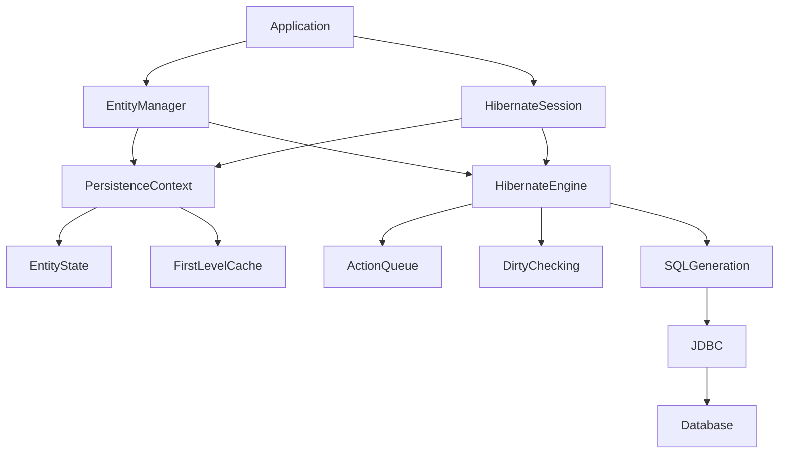
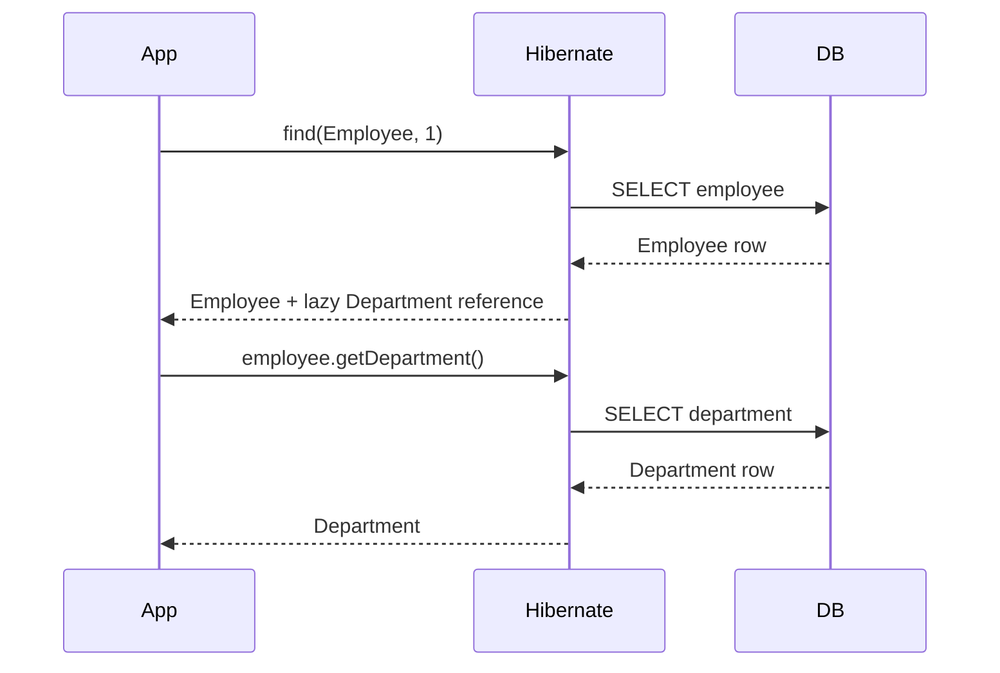
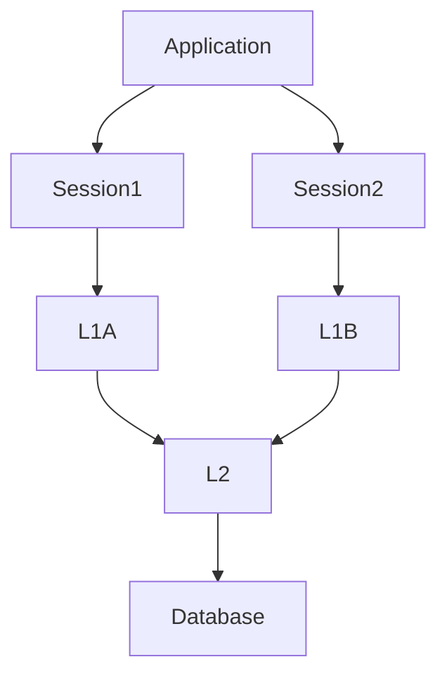

# Hibernate Interview Preparation — Part 2
## Advanced Hibernate, Internals, Performance, Transactions, Caching & Senior-Level Interview Questions

> **Prerequisite:** Hibernate/JPA fundamentals covered in Part 1  
> **Level:** Intermediate → Advanced → Senior  
> **Focus:** Internal working, performance tuning, tricky questions, production scenarios, and interview depth

---

# Table of Contents

1. [Hibernate Internal Architecture](#1-hibernate-internal-architecture)
2. [Session vs EntityManager](#2-session-vs-entitymanager)
3. [Persistence Context Internals](#3-persistence-context-internals)
4. [Entity Identity Map](#4-entity-identity-map)
5. [Hibernate Proxies](#5-hibernate-proxies)
6. [Bytecode Enhancement](#6-bytecode-enhancement)
7. [Lazy Loading Internals](#7-lazy-loading-internals)
8. [Flush Modes](#8-flush-modes)
9. [Flush and Dirty Checking Internals](#9-flush-and-dirty-checking-internals)
10. [Hibernate Action Queue](#10-hibernate-action-queue)
11. [SQL Generation](#11-sql-generation)
12. [Hibernate Dialect](#12-hibernate-dialect)
13. [JDBC Batching](#13-jdbc-batching)
14. [Batch Insert Example](#14-batch-insert-example)
15. [Batch Fetching](#15-batch-fetching)
16. [@BatchSize](#16-batchsize)
17. [FetchMode](#17-fetchmode)
18. [EntityGraph in Depth](#18-entitygraph-in-depth)
19. [JOIN FETCH vs EntityGraph vs Projection](#19-join-fetch-vs-entitygraph-vs-projection)
20. [Multiple Collection Fetching](#20-multiple-collection-fetching)
21. [Cartesian Product Problem](#21-cartesian-product-problem)
22. [Hibernate Collections](#22-hibernate-collections)
23. [Bag vs List vs Set](#23-bag-vs-list-vs-set)
24. [Orphan Removal Internals](#24-orphan-removal-internals)
25. [Cascade Internals](#25-cascade-internals)
26. [Second-Level Cache in Depth](#26-second-level-cache-in-depth)
27. [Cache Concurrency Strategies](#27-cache-concurrency-strategies)
28. [Query Cache](#28-query-cache)
29. [Cache Invalidation](#29-cache-invalidation)
30. [Transaction Propagation](#30-transaction-propagation)
31. [REQUIRED vs REQUIRES_NEW](#31-required-vs-requires_new)
32. [NESTED Transactions](#32-nested-transactions)
33. [UnexpectedRollbackException](#33-unexpectedrollbackexception)
34. [Self Invocation Trap](#34-self-invocation-trap)
35. [Read-Only Transactions](#35-read-only-transactions)
36. [Optimistic Locking in Depth](#36-optimistic-locking-in-depth)
37. [Pessimistic Locking in Depth](#37-pessimistic-locking-in-depth)
38. [Deadlocks](#38-deadlocks)
39. [Lost Updates](#39-lost-updates)
40. [Isolation vs Locking](#40-isolation-vs-locking)
41. [Bulk Operations](#41-bulk-operations)
42. [Large Dataset Processing](#42-large-dataset-processing)
43. [StatelessSession](#43-statelesssession)
44. [Offset vs Keyset Pagination](#44-offset-vs-keyset-pagination)
45. [Projection Strategies](#45-projection-strategies)
46. [Native SQL](#46-native-sql)
47. [Database Constraints](#47-database-constraints)
48. [Connection Pool Problems](#48-connection-pool-problems)
49. [Long Transactions](#49-long-transactions)
50. [External API Calls Inside Transactions](#50-external-api-calls-inside-transactions)
51. [Hibernate Performance Debugging](#51-hibernate-performance-debugging)
52. [Advanced Interview Questions](#52-advanced-interview-questions)
53. [Tricky Questions](#53-tricky-questions)
54. [Senior Scenario Questions](#54-senior-scenario-questions)
55. [Production Debugging Scenarios](#55-production-debugging-scenarios)
56. [Rapid-Fire Questions](#56-rapid-fire-questions)
57. [Senior Interview Cheat Sheet](#57-senior-interview-cheat-sheet)

---

# 1. Hibernate Internal Architecture

Let's go deeper than the basic architecture.



A simplified request flow:

```text
Application
     |
     v
EntityManager / Session
     |
     v
Persistence Context
     |
     +---- First-Level Cache
     |
     +---- Managed Entities
     |
     +---- Dirty Checking
     |
     v
Hibernate Engine
     |
     +---- Action Queue
     |
     +---- SQL Generation
     |
     v
JDBC
     |
     v
Database
```

---

# 2. Session vs EntityManager

This is a common interview question.

## EntityManager

`EntityManager` is the standard JPA API.

```java
EntityManager entityManager;
```

Common methods:

```java
persist()
find()
merge()
remove()
flush()
clear()
detach()
refresh()
```

---

## Hibernate Session

`Session` is Hibernate-specific.

```java
Session session;
```

It provides Hibernate-specific capabilities in addition to standard persistence functionality.

Conceptually:

```text
JPA
 |
 v
EntityManager
 |
 v
Standard API

Hibernate
 |
 v
Session
 |
 v
Hibernate-specific API
```

---

## Interview answer

> EntityManager is the standard JPA persistence API, while Session is Hibernate's native API. Hibernate supports both, and Session exposes Hibernate-specific capabilities beyond the standard JPA abstraction.

---

# 3. Persistence Context Internals

Think of the persistence context as a managed object registry.

Suppose:

```java
Employee employee =
    entityManager.find(Employee.class, 1L);
```

Internally, conceptually:

```text
Persistence Context

Key:
(Employee.class, 1)

Value:
Employee Java object
```

Example:

```text
┌──────────────────────────────┐
│      Persistence Context     │
├──────────────────────────────┤
│ Employee#1 -> object A       │
│ Employee#2 -> object B       │
│ Department#10 -> object C    │
└──────────────────────────────┘
```

Hibernate uses this managed state for:

- identity management
- dirty checking
- cascading
- lifecycle management
- first-level caching

---

# 4. Entity Identity Map

Suppose:

```java
Employee e1 =
    entityManager.find(Employee.class, 1L);

Employee e2 =
    entityManager.find(Employee.class, 1L);
```

Within the same persistence context:

```java
e1 == e2
```

can be true.

Why?

Because the persistence context maintains one managed representation for the same entity identity.

```text
Employee#1
    |
    v
Same managed Java instance
```

This is why persistence-context boundaries matter.

---

# 5. Hibernate Proxies

Lazy loading historically often uses proxies.

Suppose:

```java
@ManyToOne(fetch = FetchType.LAZY)
private Department department;
```

When Employee is loaded:

```text
Employee
 |
 +-- id = 1
 +-- name = Rahul
 +-- department = proxy
```

The actual Department data may not yet have been loaded.

Conceptually:

```text
employee.getDepartment()
          |
          v
      Proxy object
          |
          | method requiring data
          v
      Hibernate
          |
          v
       Database
```

---

# 6. Bytecode Enhancement

Hibernate can also use bytecode enhancement to support features such as:

- lazy attribute loading
- dirty tracking enhancements
- association management

Conceptually:

```text
Normal Java Class
       |
       v
Bytecode Enhancement
       |
       v
Hibernate-aware Class
```

This is different from simply creating a proxy subclass.

---

# 7. Lazy Loading Internals

Suppose:

```java
Employee employee =
    entityManager.find(Employee.class, 1L);
```

with:

```java
@ManyToOne(fetch = FetchType.LAZY)
private Department department;
```

Potential flow:



Important:

> Lazy loading is not guaranteed to mean "one extra SELECT." Hibernate can use different fetching mechanisms depending on mappings, query plans, batching, enhancement, and provider behavior.

---

# 8. Flush Modes

Flush timing is an advanced Hibernate topic.

JPA defines flush modes such as:

```text
AUTO
COMMIT
```

Hibernate also has provider-specific flush modes and behavior.

---

## AUTO

The persistence context is normally flushed when necessary to maintain query/transaction consistency and before commit.

For example:

```java
employee.setSalary(70000);

entityManager.createQuery("""
    select e
    from Employee e
    where e.salary > 60000
""");
```

Hibernate may flush before executing the query if required by its flush strategy.

---

## COMMIT

Flush is primarily associated with transaction completion.

However, exact behavior can depend on provider/query circumstances.

### Interview answer

> Flush mode controls when Hibernate synchronizes the persistence context with the database. It should not be confused with transaction commit.

---

# 9. Flush and Dirty Checking Internals

Consider:

```java
Employee employee =
    entityManager.find(Employee.class, 1L);

employee.setSalary(70000);
```

Hibernate needs to detect:

```text
old salary = 50000
new salary = 70000
```

Conceptually:

```text
Load entity
    |
    v
Managed state snapshot
    |
    v
Application modifies entity
    |
    v
flush()
    |
    v
Dirty checking
    |
    v
Compare state
    |
    v
Generate UPDATE
```

---

# 10. Hibernate Action Queue

Hibernate does not necessarily execute every SQL statement at the exact moment the Java method is called.

It can accumulate persistence actions.

Conceptually:

```text
Persistence Context
       |
       v
Action Queue
       |
       +-- INSERT Employee
       +-- UPDATE Department
       +-- DELETE Employee
       +-- UPDATE Project
       |
       v
Flush
       |
       v
SQL execution
```

This allows Hibernate to:

- order operations
- batch statements
- maintain consistency
- optimize JDBC communication

---

# 11. SQL Generation

Hibernate uses mapping metadata.

Suppose:

```java
@Entity
@Table(name = "employee")
public class Employee {

    @Id
    private Long id;

    private String name;
}
```

Hibernate knows:

```text
Entity: Employee
Table: employee
Fields:
    id   -> id
    name -> name
```

Then:

```java
entityManager.persist(employee);
```

can result in:

```sql
INSERT INTO employee
(id, name)
VALUES (?, ?);
```

Hibernate generally uses parameter binding rather than string concatenation.

---

# 12. Hibernate Dialect

Hibernate needs to generate SQL appropriate for the database.

For example:

```text
MySQL
PostgreSQL
Oracle
SQL Server
```

can have differences in:

- pagination syntax
- generated keys
- data types
- locking syntax
- database functions

Hibernate's dialect/capability system helps account for these differences.

---

# 13. JDBC Batching

Suppose:

```text
10,000 employees
```

are inserted.

Without batching:

```text
INSERT
INSERT
INSERT
INSERT
...
```

Potentially many database round trips.

With JDBC batching:

```text
Java
 |
 +-- INSERT
 +-- INSERT
 +-- INSERT
 +-- INSERT
 |
 v
JDBC batch
 |
 v
Database
```

This can significantly reduce network round trips.

---

# 14. Batch Insert Example

Example:

```java
@Transactional
public void importEmployees(
        List<Employee> employees) {

    int batchSize = 50;

    for (int i = 0;
         i < employees.size();
         i++) {

        entityManager.persist(employees.get(i));

        if ((i + 1) % batchSize == 0) {

            entityManager.flush();
            entityManager.clear();
        }
    }
}
```

Potential configuration varies by Hibernate version and application setup, but commonly includes JDBC batching settings.

For example:

```properties
spring.jpa.properties.hibernate.jdbc.batch_size=50
```

### Important

Batching is not just:

```java
flush();
clear();
```

Those control persistence-context size.

JDBC batching reduces database round trips.

They solve related but different problems.

---

# 15. Batch Fetching

Batch fetching is different from JDBC batching.

## JDBC batching

Used for:

```text
INSERT
UPDATE
DELETE
```

## Batch fetching

Used when loading multiple lazy associations/entities.

Example:

```text
Need department for:

Employee 1
Employee 2
Employee 3
Employee 4
```

Instead of:

```sql
SELECT * FROM department WHERE id = 10;
SELECT * FROM department WHERE id = 20;
SELECT * FROM department WHERE id = 30;
SELECT * FROM department WHERE id = 40;
```

Hibernate can potentially batch:

```sql
SELECT *
FROM department
WHERE id IN (?, ?, ?, ?);
```

---

# 16. @BatchSize

Hibernate-specific example:

```java
@ManyToOne(fetch = FetchType.LAZY)
@org.hibernate.annotations.BatchSize(size = 20)
private Department department;
```

Or on an entity:

```java
@Entity
@org.hibernate.annotations.BatchSize(size = 20)
public class Department {
}
```

The exact behavior depends on what is being loaded and Hibernate configuration.

---

# 17. FetchMode

Hibernate provides provider-specific fetch strategies.

Common concepts include:

```text
SELECT
JOIN
SUBSELECT
```

Example:

```java
@Fetch(FetchMode.SUBSELECT)
@OneToMany(mappedBy = "department")
private List<Employee> employees;
```

The goal is to avoid one query per parent.

---

# 18. EntityGraph in Depth

EntityGraph defines which relationships should be fetched for a particular use case.

Example:

```java
@EntityGraph(attributePaths = {
    "department",
    "department.manager"
})
Optional<Employee> findById(Long id);
```

This is useful because the same entity can have different fetch requirements.

Example:

```text
Use Case A:
Employee only

Use Case B:
Employee + Department

Use Case C:
Employee + Department + Manager
```

Instead of globally making relationships EAGER, define use-case-specific fetch plans.

---

# 19. JOIN FETCH vs EntityGraph vs Projection

| Technique | Best Use |
|---|---|
| JOIN FETCH | Explicit association fetching in query |
| EntityGraph | Dynamic/query-specific fetch plan |
| DTO Projection | Return only required fields |
| Batch Fetching | Reduce repeated lazy loads |
| EAGER | Usually avoid as global solution |

---

## Example: JOIN FETCH

```java
@Query("""
    select e
    from Employee e
    join fetch e.department
    where e.id = :id
""")
Optional<Employee> findWithDepartment(Long id);
```

---

## Example: DTO Projection

```java
@Query("""
    select new com.example.EmployeeSummary(
        e.id,
        e.name,
        d.name
    )
    from Employee e
    join e.department d
""")
List<EmployeeSummary> findEmployeeSummaries();
```

Projection avoids loading unnecessary entity graphs.

---

# 20. Multiple Collection Fetching

Suppose:

```text
Department
   |
   +-- Employees
   |
   +-- Projects
```

Trying to fetch both collections in one query can produce a huge result.

Example:

```text
Department A

Employees:
E1
E2
E3

Projects:
P1
P2
P3
```

A join can produce:

```text
E1 P1
E1 P2
E1 P3
E2 P1
E2 P2
E2 P3
E3 P1
E3 P2
E3 P3
```

That is:

```text
3 employees × 3 projects = 9 rows
```

For large collections:

```text
100 employees × 100 projects = 10,000 rows
```

This is a form of result-set explosion.

---

# 21. Cartesian Product Problem

The important lesson:

> One huge query is not always better than multiple carefully designed queries.

Instead of:

```text
Department
 + Employees
 + Projects
 + Permissions
 + Addresses
```

consider:

```text
Query 1:
Departments

Query 2:
Employees

Query 3:
Projects
```

or use DTOs/use-case-specific queries.

Performance optimization means minimizing total work, not blindly minimizing query count.

---

# 22. Hibernate Collections

Hibernate supports collections such as:

```text
List
Set
Map
```

They have different semantics.

---

# 23. Bag vs List vs Set

This is an advanced Hibernate interview topic.

## Set

Represents unique elements.

```java
private Set<Employee> employees =
        new HashSet<>();
```

Uniqueness depends on proper equality/hashCode semantics.

---

## List

Ordered collection.

```java
private List<Employee> employees =
        new ArrayList<>();
```

If persistent ordering/index matters, JPA can use `@OrderColumn`.

---

## @OrderBy

```java
@OrderBy("name ASC")
private List<Employee> employees;
```

This defines ordering of retrieved elements based on entity attributes.

---

## @OrderColumn

Persists list position in a database column.

Conceptually:

```text
employee
-------------------------
id
name
department_id
position
```

---

# 24. Orphan Removal Internals

Consider:

```java
@OneToMany(
    mappedBy = "department",
    orphanRemoval = true
)
private List<Employee> employees;
```

If:

```java
department.removeEmployee(employee);
```

Hibernate may schedule:

```sql
DELETE FROM employee
WHERE id = ?;
```

during flush.

Important:

> orphanRemoval is about relationship ownership/lifecycle, not generic cascade behavior.

---

# 25. Cascade Internals

Consider:

```java
@OneToMany(
    cascade = CascadeType.PERSIST
)
private List<Employee> employees;
```

Calling:

```java
entityManager.persist(department);
```

can cascade persist to employees.

But:

```text
Cascade PERSIST
```

does not mean:

```text
all queries propagate
```

Cascade applies to lifecycle operations.

---

# 26. Second-Level Cache in Depth

Architecture:



Flow:

```text
Session
   |
   v
L1 Cache
   |
   | miss
   v
L2 Cache
   |
   | miss
   v
Database
```

---

# 27. Cache Concurrency Strategies

Second-level cache requires careful consistency decisions.

Common concepts include:

```text
READ_ONLY
NONSTRICT_READ_WRITE
READ_WRITE
TRANSACTIONAL
```

Exact availability and semantics depend on Hibernate version and cache provider.

---

## READ_ONLY

Good for immutable data.

Examples:

```text
Country
Currency
Static reference data
```

---

## READ_WRITE

Attempts to maintain stronger consistency for mutable cached entities using cache coordination/locking mechanisms.

---

## NONSTRICT_READ_WRITE

Allows some stale data.

Useful when:

```text
small staleness acceptable
```

---

## TRANSACTIONAL

Provides transactional cache semantics when supported by the cache/provider/environment.

---

# 28. Query Cache

Entity cache:

```text
Employee#1
```

Query cache:

```text
"employees where department = IT"
```

These are not the same thing.

Conceptually:

```text
Query
 |
 v
Query Cache
 |
 +-- result IDs / result information
 |
 v
Second-Level Entity Cache
 |
 v
Employee entities
```

Query cache can be beneficial for repeated stable queries but can be expensive to invalidate when underlying data changes frequently.

---

# 29. Cache Invalidation

Suppose:

```text
L2 Cache:
Employee#1 salary = 50000
```

Database changes:

```text
salary = 60000
```

If cache isn't invalidated/updated correctly:

```text
DB = 60000
Cache = 50000
```

Now users can receive stale data.

Therefore:

> Caching is a consistency problem as much as it is a performance feature.

---

# 30. Transaction Propagation

Spring transaction propagation is critical when Hibernate is used with Spring.

Common propagation modes:

```text
REQUIRED
REQUIRES_NEW
NESTED
SUPPORTS
NOT_SUPPORTED
MANDATORY
NEVER
```

Most interview questions focus on:

```text
REQUIRED
REQUIRES_NEW
NESTED
```

---

# 31. REQUIRED vs REQUIRES_NEW

## REQUIRED

Default in Spring.

```text
If transaction exists:
    join it

Otherwise:
    create one
```

Diagram:

```text
Service A
  |
  | Transaction T1
  v
Service B
  |
  +--> joins T1
```

---

## REQUIRES_NEW

Suspends current transaction and starts another.

```text
Service A
 |
 | T1
 v
Service B
 |
 | suspend T1
 | start T2
 v
commit T2
 |
resume T1
```

---

## Why is this dangerous?

Suppose:

```text
T1 holds connection A

REQUIRES_NEW
   |
   v
needs connection B
```

With high concurrency, nested `REQUIRES_NEW` transactions can contribute to connection pool exhaustion.

---

# 32. NESTED Transactions

Nested transactions generally use savepoints when supported.

Conceptually:

```text
T1
 |
 +-- operation A
 |
 +-- SAVEPOINT
 |
 +-- operation B
 |
 rollback to savepoint
 |
 +-- continue T1
 |
COMMIT
```

This is different from `REQUIRES_NEW`.

`REQUIRES_NEW` uses an independent transaction.

`NESTED` generally operates inside the existing transaction using savepoints where supported.

---

# 33. UnexpectedRollbackException

Classic tricky question.

Suppose:

```java
@Transactional
public void outer() {

    try {
        inner();
    } catch (Exception e) {
        // ignore
    }
}
```

and:

```java
@Transactional
public void inner() {

    throw new RuntimeException();
}
```

If both use `REQUIRED`, they can participate in the same transaction.

The inner failure can mark the transaction rollback-only.

Outer catches the exception and continues.

At commit:

```text
Outer thinks:
"Everything is fine."

Transaction:
"Rollback only."

Result:
UnexpectedRollbackException
```

Important lesson:

> Catching an exception does not necessarily make the transaction healthy again.

---

# 34. Self Invocation Trap

Example:

```java
@Service
public class EmployeeService {

    public void methodA() {
        methodB();
    }

    @Transactional
    public void methodB() {
        // transactional work
    }
}
```

Calling:

```java
methodA();
```

causes:

```text
methodA()
   |
   v
this.methodB()
```

The internal call may bypass the Spring proxy.

Therefore `@Transactional` behavior on `methodB()` may not be applied as expected.

---

# 35. Read-Only Transactions

Example:

```java
@Transactional(readOnly = true)
public List<Employee> getEmployees() {
    return repository.findAll();
}
```

`readOnly=true` is a hint/optimization rather than a universal guarantee that no SQL write can ever occur.

Behavior depends on:

- transaction manager
- JDBC/database
- Hibernate/provider
- actual code

Don't answer:

> readOnly means database physically prevents writes.

That is too strong.

---

# 36. Optimistic Locking in Depth

Entity:

```java
@Entity
public class Employee {

    @Id
    private Long id;

    private BigDecimal salary;

    @Version
    private Long version;
}
```

Suppose:

```text
DB

id | salary | version
---------------------
1  | 50000  | 10
```

Two transactions load it.

```text
T1 -> version 10
T2 -> version 10
```

T1 updates:

```text
version 10 -> 11
```

T2 attempts:

```sql
UPDATE employee
SET salary = ?,
    version = 11
WHERE id = ?
AND version = 10;
```

No row matches.

Hibernate detects the conflict.

---

# 37. Pessimistic Locking in Depth

Example:

```java
Employee employee =
    entityManager.find(
        Employee.class,
        employeeId,
        LockModeType.PESSIMISTIC_WRITE
    );
```

Conceptually:

```text
Transaction A
    |
    v
Lock Employee #1
    |
    v
Update
    |
    v
Commit
```

Transaction B:

```text
Try Employee #1
       |
       v
Wait/block
```

Potential problems:

```text
deadlocks
timeouts
reduced concurrency
long lock duration
```

---

# 38. Deadlocks

Suppose:

```text
Transaction A:

Lock Employee 1
then lock Employee 2
```

Transaction B:

```text
Lock Employee 2
then lock Employee 1
```

Result:

```text
A holds 1 -> waits for 2
B holds 2 -> waits for 1
```

Diagram:

```text
      Employee 1
       ^       |
       |       v
Transaction A  Transaction B
       ^       |
       |       v
      Employee 2
```

Database may detect the deadlock and abort one transaction.

---

## Prevention

Use consistent lock ordering.

For example:

```text
Always lock Employee by ascending ID
```

instead of arbitrary ordering.

Also:

- keep transactions short
- avoid unnecessary locks
- index queries appropriately
- avoid user interaction inside transactions
- handle retryable deadlock failures carefully

---

# 39. Lost Updates

Scenario:

```text
Initial salary = 50000
```

T1:

```text
reads 50000
```

T2:

```text
reads 50000
```

T1:

```text
writes 60000
```

T2:

```text
writes 70000
```

T1's update is effectively lost.

Solutions include:

```text
@Version
pessimistic locking
atomic SQL
appropriate isolation/locking strategy
```

---

# 40. Isolation vs Locking

These concepts are related but different.

## Isolation

Defines visibility/concurrency semantics between transactions.

```text
READ_COMMITTED
REPEATABLE_READ
SERIALIZABLE
```

## Locking

Controls access to specific rows/resources.

```text
optimistic
pessimistic
```

Example:

```text
Isolation = overall transaction visibility rules

Locking = how specific resources are coordinated
```

---

# 41. Bulk Operations

Example:

```java
@Modifying
@Query("""
    update Employee e
    set e.salary = e.salary * 1.10
    where e.department.id = :departmentId
""")
int increaseSalary(Long departmentId);
```

This may generate one SQL UPDATE.

That's efficient.

But managed entities can become stale.

Example:

```text
Persistence Context

Employee#1
salary = 50000
```

Bulk SQL:

```text
Database
salary = 60000
```

Persistence context still:

```text
salary = 50000
```

Potential solution:

```java
entityManager.flush();
entityManager.clear();
```

before/after the bulk operation as appropriate for the use case.

---

# 42. Large Dataset Processing

Suppose:

```text
10 million rows
```

Don't do:

```java
List<Employee> employees =
    repository.findAll();
```

and then:

```java
employees.forEach(...);
```

Problems:

```text
huge memory
long transaction
large persistence context
slow dirty checking
connection/resource pressure
```

Better strategies:

```text
pagination
streaming
batch processing
DTO projection
StatelessSession
database-side operations
```

---

# 43. StatelessSession

Example concept:

```java
StatelessSession session =
    sessionFactory.openStatelessSession();
```

It does not provide the normal stateful persistence-context behavior.

Therefore, you don't get the normal combination of:

```text
first-level cache
dirty checking
managed entity lifecycle
```

as with a regular Session.

Useful for specialized bulk operations.

---

# 44. Offset vs Keyset Pagination

## Offset

```sql
SELECT *
FROM employee
ORDER BY id
LIMIT 50 OFFSET 500000;
```

Deep offsets can become expensive.

---

## Keyset

```sql
SELECT *
FROM employee
WHERE id > :lastSeenId
ORDER BY id
LIMIT 50;
```

Conceptually:

```text
Page 1:
id > 0

Page 2:
id > 50

Page 3:
id > 100
```

The actual implementation should use a stable ordering and suitable index.

---

# 45. Projection Strategies

Suppose API needs:

```text
employeeId
employeeName
departmentName
```

Don't necessarily load:

```text
Employee
Department
Projects
Address
Manager
Permissions
```

DTO:

```java
public record EmployeeSummary(
        Long id,
        String name,
        String departmentName
) {
}
```

Query:

```java
@Query("""
    select new com.example.EmployeeSummary(
        e.id,
        e.name,
        d.name
    )
    from Employee e
    join e.department d
""")
List<EmployeeSummary> findSummaries();
```

Benefits:

```text
less data
less memory
smaller result set
less serialization work
often better performance
```

---

# 46. Native SQL

Sometimes native SQL is the correct choice.

Example:

```java
@Query(
    value = """
        SELECT *
        FROM employee
        WHERE salary > :salary
    """,
    nativeQuery = true
)
List<Employee> findEmployees(
        BigDecimal salary
);
```

Use native SQL when you need:

- DB-specific features
- complex SQL
- window functions
- CTEs
- specialized reporting
- vendor-specific functionality

But don't use native SQL simply because you haven't learned JPQL.

---

# 47. Database Constraints

Application validation:

```java
if (employeeExists) {
    throw new Exception();
}
```

is not enough for concurrency.

Two requests can both execute:

```text
check
   |
   v
"doesn't exist"
```

then both insert.

Better:

```sql
ALTER TABLE employee
ADD CONSTRAINT uk_employee_email
UNIQUE (email);
```

Database becomes the final enforcement layer.

---

# 48. Connection Pool Problems

Hibernate normally obtains JDBC connections through the application's data source/pool.

Examples:

```text
HikariCP
```

A connection pool might have:

```text
maximumPoolSize = 20
```

If 20 transactions hold connections for too long:

```text
Request 21
   |
   v
wait for connection
```

Symptoms:

```text
connection timeout
slow requests
thread waiting
high request latency
```

---

# 49. Long Transactions

Bad:

```java
@Transactional
public void processOrder() {

    saveOrder();

    callExternalService();

    generateLargeReport();

    waitForUserSomething();

    updateDatabase();
}
```

The transaction may hold DB resources for too long.

Better:

```text
Short transaction
     |
     v
Commit
     |
     v
External processing
     |
     v
Another short transaction
```

Use workflow/outbox/event patterns when the business process spans multiple systems.

---

# 50. External API Calls Inside Transactions

This is a very important senior interview question.

Bad:

```java
@Transactional
public void processPayment() {

    Order order = findOrder();

    paymentClient.charge();

    order.setStatus("PAID");
}
```

Problem:

```text
DB transaction
    |
    +-- DB connection
    |
    +-- payment HTTP call
    |
    +-- network delay
    |
    +-- remote service failure
    |
    v
commit/rollback
```

The DB transaction is coupled to external network latency.

---

## Better

Consider:

```text
Create order
     |
     v
Save order + outbox event
     |
     v
COMMIT
     |
     v
Worker
     |
     v
Payment service
     |
     v
Update order
```

This separates local DB transaction from distributed workflow.

---

# 51. Hibernate Performance Debugging

When an API is slow, follow a systematic process.

## Step 1 — Measure

Don't guess.

Measure:

```text
request latency
DB latency
SQL execution time
query count
connection wait time
CPU
memory
GC
```

---

## Step 2 — Count SQL queries

Suppose:

```text
GET /employees
```

generates:

```text
1 + 500 queries
```

N+1 is likely.

---

## Step 3 — Inspect generated SQL

Look for:

```text
unnecessary joins
SELECT *
huge result sets
repeated queries
missing predicates
```

---

## Step 4 — Examine execution plan

Use the database's:

```text
EXPLAIN
EXPLAIN ANALYZE
```

as appropriate.

Check:

```text
indexes
full table scans
join strategy
estimated vs actual rows
sorts
temporary tables
```

---

## Step 5 — Check transaction duration

Long transaction?

```text
YES -> investigate
```

---

## Step 6 — Check connection pool

```text
active connections
idle connections
pending threads
connection acquisition time
```

---

# 52. Advanced Interview Questions

## Q1. Why doesn't Hibernate immediately execute INSERT after persist()?

### Answer

Because `persist()` primarily changes the entity's lifecycle to managed.

Hibernate can delay SQL until flush.

Reasons include:

- batching
- action ordering
- transaction semantics
- flush strategy

---

# Q2. What is the difference between persistence context and first-level cache?

### Answer

They are closely related but conceptually not identical.

The persistence context is the managed entity context.

Its identity-management behavior also acts as Hibernate's first-level cache.

Strong interview answer:

> The first-level cache is effectively the caching behavior provided by the persistence context.

---

# Q3. Why can a SELECT trigger an INSERT?

### Answer

Because Hibernate may flush pending changes before executing a query.

Example:

```java
employee.setSalary(70000);

entityManager.createQuery("""
    select e
    from Employee e
""").getResultList();
```

Depending on flush mode and query synchronization requirements, Hibernate may flush the pending UPDATE before executing the SELECT.

---

# Q4. Why can Hibernate execute SQL in an unexpected order?

### Answer

Hibernate manages persistence actions internally and may reorder operations during flush to satisfy dependencies and optimize execution.

Therefore:

> Java method call order is not necessarily identical to SQL execution order.

---

# Q5. Why is flush important for foreign-key relationships?

Suppose:

```text
Parent
  |
  v
Child
```

Hibernate may need to order:

```text
INSERT parent
INSERT child
```

to satisfy the foreign key.

The action queue and flush process help manage this.

---

# Q6. What is a managed entity?

An entity currently associated with a persistence context and tracked by Hibernate.

---

# Q7. What happens when session.clear() is called?

All entities in the persistence context become detached.

Hibernate stops tracking their changes.

---

# Q8. What happens after clear()?

Suppose:

```java
Employee e =
    entityManager.find(Employee.class, 1L);

entityManager.clear();

e.setSalary(90000);
```

The entity is now detached.

Changing it does not automatically trigger dirty checking.

---

# Q9. What does refresh() do?

```java
entityManager.refresh(employee);
```

Reloads the current database state into the managed entity.

Local changes can be overwritten.

---

# Q10. Why shouldn't we call refresh() everywhere?

Because it causes database access and discards local in-memory changes.

It should be used intentionally.

---

# Q11. Can Hibernate guarantee no duplicate database rows?

No.

Database constraints should enforce uniqueness.

Example:

```sql
UNIQUE(email)
```

Hibernate/application logic alone is insufficient under concurrency.

---

# Q12. Why is synchronized not enough to protect database inventory?

Consider:

```java
synchronized void reduceStock() {
    if (stock > 0) {
        stock--;
    }
}
```

This only coordinates threads within a single JVM instance.

In multiple application instances:

```text
Server A
Server B
Server C
```

each has its own JVM lock.

Use database-level concurrency controls.

---

# Q13. How would you prevent duplicate order creation?

Use an idempotency key.

Example:

```text
POST /orders
Idempotency-Key: abc-123
```

Store the key with a unique database constraint.

Then:

```text
Request 1 -> create order
Request 2 -> same key
             |
             v
       return existing result
```

---

# Q14. Why can database indexes improve Hibernate performance?

Hibernate generates SQL.

The database executes SQL.

Therefore Hibernate performance is heavily influenced by:

```text
indexes
execution plans
cardinality
joins
statistics
```

ORM does not eliminate database optimization.

---

# Q15. Why is SELECT * undesirable for some APIs?

It may retrieve unnecessary columns.

Projection:

```text
id
name
department_name
```

can be much cheaper than loading a wide entity.

---

# 53. Tricky Questions

## Q16. Is lazy loading a performance optimization?

Usually it can be, but not automatically.

Lazy loading reduces unnecessary initial loading.

However, careless lazy access can create:

```text
N+1
```

Therefore:

```text
LAZY != automatically fast
```

---

# Q17. Is EAGER always bad?

No.

Small, always-required relationships may be reasonable to fetch eagerly.

The problem is:

> Blindly using EAGER everywhere.

---

# Q18. Is JOIN FETCH always faster?

No.

A fetch join can create:

```text
duplicate rows
large result sets
Cartesian multiplication
pagination problems
```

---

# Q19. Is fewer SQL queries always faster?

No.

One gigantic query can be slower than several efficient queries.

Optimize:

```text
total DB work
+
network traffic
+
result size
+
CPU
+
memory
```

---

# Q20. Is caching always a performance improvement?

No.

Cache has:

```text
memory cost
invalidation cost
staleness risk
coordination cost
```

---

# Q21. Is @Transactional enough to make code thread-safe?

No.

Transactions provide database transactional semantics.

They do not make arbitrary Java mutable state thread-safe.

---

# Q22. Does @Version eliminate all concurrency problems?

No.

It handles a particular class of lost-update conflicts.

You still need:

```text
transactions
constraints
appropriate locking
business validation
```

---

# Q23. Does SERIALIZABLE solve everything?

No.

It provides stronger isolation but can cause:

```text
blocking
deadlocks
lower throughput
timeouts
```

It is not a magic "make everything safe" switch.

---

# Q24. Can a transaction span multiple microservices?

A normal local DB transaction does not automatically become a distributed transaction across independent services.

For distributed workflows, patterns such as:

```text
Saga
Outbox
event-driven coordination
```

are often considered.

---

# Q25. Does rollback undo external HTTP calls?

No.

Example:

```text
DB transaction
  |
  +-- save order
  |
  +-- call payment API
  |
  +-- payment succeeds
  |
  +-- DB transaction fails
```

Database rollback does not magically undo the remote payment.

This is why distributed transaction design matters.

---

# 54. Senior Scenario Questions

# Scenario 1 — API Suddenly Becomes Slow

### Symptoms

```text
Previously:
200 ms

Now:
4 seconds
```

### Investigation

Check:

```text
1. Query count
2. N+1
3. SQL duration
4. DB execution plan
5. DB CPU
6. connection pool
7. locks
8. network
9. result size
10. recent code/config changes
```

### Strong interview answer

> I would first measure rather than immediately change Hibernate configuration. I'd compare query count and latency, inspect generated SQL, check for N+1, inspect the database execution plan and connection-pool wait time, then identify whether the bottleneck is ORM, SQL, database contention, or infrastructure.

---

# Scenario 2 — 500 SQL Queries for One API

Likely:

```text
N+1
```

Check:

```text
lazy collections
loops
serialization
```

Fix with:

```text
JOIN FETCH
EntityGraph
batch fetching
DTO projection
```

depending on requirements.

---

# Scenario 3 — Database CPU at 100%

Don't immediately increase Hibernate pool size.

Investigate:

```text
slow queries
missing indexes
N+1
large joins
full scans
high concurrency
expensive reports
lock contention
```

Increasing connections can make an overloaded DB even worse.

---

# Scenario 4 — Connection Pool Exhausted

Symptoms:

```text
Hikari timeout
requests waiting
DB connections maxed
```

Potential causes:

```text
long transactions
slow queries
external calls inside transaction
deadlocks
too many concurrent transactions
REQUIRES_NEW
connection leaks
```

---

# Scenario 5 — Duplicate Employees

Application:

```java
if (!repository.existsByEmail(email)) {
    repository.save(employee);
}
```

Two concurrent requests:

```text
T1 -> exists? NO
T2 -> exists? NO

T1 -> INSERT
T2 -> INSERT
```

Solution:

```sql
UNIQUE(email)
```

and handle the resulting constraint violation appropriately.

---

# Scenario 6 — Inventory Overselling

Bad:

```java
Product product =
    repository.findById(id).orElseThrow();

if (product.getStock() > 0) {
    product.setStock(
        product.getStock() - 1
    );
}
```

Concurrent requests can read the same stock.

Better options:

### Atomic update

```sql
UPDATE product
SET stock = stock - 1
WHERE id = ?
AND stock > 0;
```

Check affected rows.

### Optimistic locking

```java
@Version
private Long version;
```

### Pessimistic locking

```java
LockModeType.PESSIMISTIC_WRITE
```

Choice depends on workload and contention.

---

# Scenario 7 — Huge Employee Import

Requirements:

```text
5 million records
```

Strategy:

```text
batch inserts
JDBC batching
flush/clear
appropriate transaction size
possibly StatelessSession
```

Avoid:

```text
5 million managed entities
```

inside one persistence context.

---

# Scenario 8 — Reporting Query Is Slow

Don't necessarily map everything into entities.

Use:

```text
DTO projection
native SQL
database views
materialized views
reporting database
read replica
```

depending on architecture.

ORM is not mandatory for every database access pattern.

---

# Scenario 9 — Two Users Edit Same Employee

Use:

```java
@Version
private Long version;
```

Then expose a meaningful conflict response.

Potentially:

```text
HTTP 409 Conflict
```

depending on API semantics.

---

# Scenario 10 — Payment and Order

Requirement:

```text
Create order
Charge payment
Mark order paid
```

Do not assume one local DB transaction can safely encompass a remote payment API.

Consider:

```text
Order CREATED
    |
    v
Outbox event
    |
    v
Payment processing
    |
    +-- success -> PAID
    |
    +-- failure -> PAYMENT_FAILED
```

This is a distributed workflow.

---

# 55. Production Debugging Scenarios

# Problem: Too Many SELECT Queries

Check:

```text
N+1
lazy associations
serialization
EntityGraph
fetch joins
batch fetching
```

---

# Problem: Huge Memory Usage

Check:

```text
large result set
large persistence context
missing clear()
eager relationships
entity graph size
large collections
```

---

# Problem: Database Deadlocks

Check:

```text
transaction ordering
lock ordering
transaction duration
indexes
pessimistic locks
concurrent updates
```

Use consistent resource ordering.

---

# Problem: Stale Cache

Check:

```text
cache strategy
invalidation
transaction boundaries
data volatility
multiple application nodes
cache provider configuration
```

---

# Problem: Slow Batch Job

Check:

```text
JDBC batching
flush frequency
clear frequency
transaction size
ID generation strategy
indexes
database constraints
logging
```

---

# Problem: LazyInitializationException

Check:

```text
Where transaction ends
Where association is accessed
Fetch plan
DTO conversion
Serialization
```

Don't simply say:

```text
"Make everything EAGER."
```

---

# Problem: OutOfMemoryError

Possible Hibernate causes:

```text
millions of managed entities
huge collection
large query result
missing pagination
long persistence context
```

Solution:

```text
pagination
streaming
batch processing
flush/clear
projection
StatelessSession
```

---

# 56. Rapid-Fire Questions

| Question | Strong Answer |
|---|---|
| JPA? | Specification |
| Hibernate? | ORM implementation/provider |
| Spring Data JPA? | Repository abstraction |
| SessionFactory? | Heavyweight factory for Sessions |
| Session thread-safe? | No |
| SessionFactory thread-safe? | Yes |
| Persistence Context? | Managed entity context |
| L1 cache? | Persistence-context scoped |
| L2 cache? | Optional shared cache |
| Dirty checking? | Detect changes to managed entities |
| persist()? | Makes new entity managed |
| merge()? | Copies state into managed entity |
| merge source managed? | No |
| flush()? | Synchronizes persistence state with DB |
| commit()? | Finalizes transaction |
| flush = commit? | No |
| LAZY? | Delayed association loading |
| EAGER? | Eager fetching |
| N+1? | 1 + N SQL queries |
| JOIN FETCH? | Fetch association in query |
| EntityGraph? | Fetch plan |
| DTO projection? | Load only required data |
| mappedBy? | Inverse relationship mapping |
| @JoinColumn? | FK mapping/owning side commonly |
| @Version? | Optimistic locking |
| Pessimistic lock? | DB row locking |
| Bulk update issue? | Persistence context may become stale |
| clear()? | Detach all managed entities |
| detach()? | Detach one entity |
| refresh()? | Reload DB state |
| StatelessSession? | Lightweight state-less bulk API |
| JDBC batching? | Reduce DB round trips for batches |
| Batch fetching? | Batch lazy loads |
| Query cache? | Caches query-result information |
| Entity cache? | Caches entity state |
| Deadlock? | Transactions wait on each other's locks |
| Keyset pagination? | Pagination using last-seen key |
| Offset pagination? | LIMIT/OFFSET |
| readOnly=true? | Transaction optimization/hint, not universal write prohibition |
| REQUIRED? | Join/create transaction |
| REQUIRES_NEW? | Suspend existing/start independent |
| NESTED? | Savepoint-based nested work when supported |
| Self invocation? | Can bypass Spring proxy |
| LazyInitializationException? | Lazy access after context unavailable |

---

# 57. Senior Interview Cheat Sheet

## Hibernate Architecture

```text
Application
    |
    v
EntityManager / Session
    |
    v
Persistence Context
    |
    +-- L1 Cache
    +-- Managed Entities
    +-- Dirty Checking
    |
    v
Hibernate
    |
    +-- Action Queue
    +-- SQL Generation
    +-- Fetching
    +-- Caching
    |
    v
JDBC
    |
    v
Database
```

---

# Entity Lifecycle

```text
Transient
   |
persist()
   v
Managed
   |
   +---- detach/clear/close ---> Detached
   |
   +---- remove() -------------> Removed

Detached
   |
merge()
   v
Managed COPY
```

---

# Cache Hierarchy

```text
L1
 |
 | miss
 v
L2
 |
 | miss
 v
Database
```

Query cache is separate.

---

# Fetching

```text
LAZY
    |
    +-- efficient initial load
    |
    +-- can cause N+1

EAGER
    |
    +-- convenient
    |
    +-- can cause unnecessary loading

JOIN FETCH
    |
    +-- explicit query fetch

EntityGraph
    |
    +-- query-specific fetch plan

Projection
    |
    +-- only required columns
```

---

# Concurrency

```text
Optimistic
    |
    v
@Version
    |
    v
Detect conflict

Pessimistic
    |
    v
DB Lock
    |
    v
Block competing access
```

---

# Performance

Always investigate:

```text
1. SQL query count
2. N+1
3. Query execution time
4. Execution plan
5. Indexes
6. Result size
7. Fetch strategy
8. Persistence-context size
9. Transaction duration
10. Connection pool
11. Lock contention
12. Cache effectiveness
```

---

# Golden Senior-Level Answers

## "Hibernate is slow."

Don't answer:

```text
Increase connection pool.
```

Answer:

```text
Measure first.

Check:
- SQL count
- N+1
- SQL execution time
- execution plans
- indexes
- transaction duration
- connection pool
- lock contention
- result-set size
```

---

## "Fix LazyInitializationException."

Don't answer:

```text
Make relationship EAGER.
```

Answer:

```text
Understand why the association is required.

Then use:
- JOIN FETCH
- EntityGraph
- DTO projection
- explicit initialization inside transaction when appropriate
```

---

## "Fix N+1."

Don't answer:

```text
JOIN FETCH everything.
```

Answer:

```text
Identify the access pattern.

Then choose:
- JOIN FETCH
- EntityGraph
- batch fetching
- DTO projection
- query redesign

Also consider pagination and collection size.
```

---

## "Prevent concurrent update."

Don't answer:

```text
synchronized
```

Answer:

```text
Use database-aware concurrency control:

@Version
or pessimistic locking
or atomic SQL

plus appropriate constraints and transaction boundaries.
```

---

## "Process millions of records."

Don't answer:

```text
findAll()
```

Answer:

```text
Batching
+
flush/clear
+
pagination/streaming
+
JDBC batching
+
possibly StatelessSession
+
appropriate transaction sizing
```

---

# 58. Top 30 Advanced Questions to Practice

Before a senior Hibernate interview, practice explaining these without notes:

```text
1. Explain Persistence Context internally.

2. How does first-level cache work?

3. How does dirty checking work?

4. When exactly does Hibernate execute SQL?

5. Why can a SELECT trigger a flush?

6. What is Hibernate's Action Queue?

7. How does lazy loading work?

8. Proxy vs bytecode enhancement?

9. Why does LazyInitializationException occur?

10. How do you solve N+1?

11. Why is JOIN FETCH not always the solution?

12. Why can multiple collection fetches be dangerous?

13. JOIN FETCH vs EntityGraph?

14. EntityGraph vs DTO projection?

15. JDBC batching vs batch fetching?

16. Why flush/clear during batch processing?

17. When would you use StatelessSession?

18. How does second-level cache work?

19. L1 vs L2 vs Query Cache?

20. When should data not be cached?

21. Optimistic vs pessimistic locking?

22. How does @Version work?

23. How do deadlocks happen?

24. How do you prevent deadlocks?

25. Isolation vs locking?

26. REQUIRED vs REQUIRES_NEW?

27. What causes UnexpectedRollbackException?

28. Why does self-invocation break @Transactional?

29. Why should external API calls usually not occur inside DB transactions?

30. How would you debug a Hibernate API that suddenly became slow?
```

---

# 59. Ultimate Hibernate Mental Model

The most important concept to remember is this:

```text
                YOUR JAVA OBJECT
                       |
                       v
              Persistence Context
                       |
             +---------+---------+
             |                   |
             v                   v
       First-Level Cache    Dirty Checking
             |                   |
             +---------+---------+
                       |
                       v
                 Flush Process
                       |
                       v
                  Action Queue
                       |
                       v
                 SQL Generation
                       |
                       v
                     JDBC
                       |
                       v
                   Database
```

And when relationships are involved:

```text
Entity
  |
  +-- LAZY association
  |       |
  |       v
  |     Proxy
  |       |
  |       v
  |   DB query when needed
  |
  +-- EAGER association
  |       |
  |       v
  |   fetched earlier
  |
  +-- JOIN FETCH
  |       |
  |       v
  |   explicit query fetch
  |
  +-- EntityGraph
          |
          v
      fetch plan
```

---

# 60. The Most Important Interview Distinctions

Memorize these:

```text
========================================================

JPA
    = Specification

Hibernate
    = Implementation / ORM provider

Spring Data JPA
    = Repository abstraction

--------------------------------------------------------

SessionFactory
    = Heavyweight
    = Shared
    = Thread-safe

Session
    = Lightweight relative to SessionFactory
    = Not thread-safe

--------------------------------------------------------

Persistence Context
    = Managed entities
    = Identity management
    = L1 cache
    = Dirty checking

--------------------------------------------------------

persist()
    = Make new entity managed

merge()
    = Copy state into managed entity
    = Returns managed instance
    = Original remains detached

--------------------------------------------------------

flush()
    = Synchronize changes with DB

commit()
    = Complete transaction

--------------------------------------------------------

LAZY
    = Don't load association until required

EAGER
    = Fetch association eagerly

--------------------------------------------------------

N+1
    = 1 parent query + N child queries

JOIN FETCH
    = Fetch association with query

EntityGraph
    = Define fetch plan

DTO Projection
    = Fetch only required data

--------------------------------------------------------

L1 Cache
    = Persistence context

L2 Cache
    = Shared optional cache

Query Cache
    = Query result information

--------------------------------------------------------

Optimistic
    = @Version
    = Detect conflict

Pessimistic
    = Database lock
    = Block competing access

--------------------------------------------------------

REQUIRED
    = Join existing transaction or create one

REQUIRES_NEW
    = Suspend existing transaction
    = Start independent transaction

NESTED
    = Savepoint-based nested work where supported

--------------------------------------------------------

JDBC Batching
    = Batch INSERT/UPDATE/DELETE operations

Batch Fetching
    = Batch SELECTs for lazy loading

--------------------------------------------------------

flush()
    = Send synchronization work

clear()
    = Detach managed entities

detach()
    = Detach one entity

refresh()
    = Reload entity from DB

--------------------------------------------------------

Bulk UPDATE
    = Efficient
    = Bypasses normal entity dirty checking
    = Can make persistence context stale

========================================================
```

---

# 61. Final Senior-Level Interview Advice

When answering Hibernate questions, avoid absolute statements such as:

```text
"Hibernate always does X."

"LAZY always creates one query."

"EAGER is always bad."

"JOIN FETCH is always faster."

"flush means commit."

"save is required after every update."

"@Transactional makes everything thread-safe."

"Cache always improves performance."
```

Prefer:

```text
"Typically..."

"Depending on flush mode..."

"Depending on the provider/version..."

"Depending on the fetch plan..."

"Depending on the database..."

"For this workload..."

"From a production perspective..."
```

This demonstrates that you understand **trade-offs rather than memorized annotations**.

---

# 62. Final Preparation Checklist

Before a Hibernate interview, make sure you can explain:

## Fundamentals

- [ ] ORM
- [ ] JPA
- [ ] Hibernate
- [ ] Spring Data JPA
- [ ] SessionFactory
- [ ] Session
- [ ] EntityManager
- [ ] Transaction
- [ ] Query

## Persistence

- [ ] Persistence Context
- [ ] Entity states
- [ ] First-level cache
- [ ] Dirty checking
- [ ] flush
- [ ] clear
- [ ] detach
- [ ] refresh
- [ ] merge

## Relationships

- [ ] One-to-one
- [ ] One-to-many
- [ ] Many-to-one
- [ ] Many-to-many
- [ ] mappedBy
- [ ] owning side
- [ ] cascade
- [ ] orphanRemoval

## Fetching

- [ ] Lazy loading
- [ ] Eager loading
- [ ] LazyInitializationException
- [ ] N+1
- [ ] JOIN FETCH
- [ ] EntityGraph
- [ ] Batch fetching
- [ ] DTO projection
- [ ] Cartesian explosion

## Performance

- [ ] JDBC batching
- [ ] flush/clear
- [ ] StatelessSession
- [ ] pagination
- [ ] keyset pagination
- [ ] indexes
- [ ] execution plans
- [ ] connection pools
- [ ] transaction duration

## Concurrency

- [ ] Optimistic locking
- [ ] @Version
- [ ] Pessimistic locking
- [ ] Lost updates
- [ ] Deadlocks
- [ ] Isolation
- [ ] Atomic SQL

## Caching

- [ ] L1 cache
- [ ] L2 cache
- [ ] Query cache
- [ ] Cache invalidation
- [ ] Cache concurrency strategies

## Spring Transactions

- [ ] @Transactional
- [ ] REQUIRED
- [ ] REQUIRES_NEW
- [ ] NESTED
- [ ] Rollback rules
- [ ] UnexpectedRollbackException
- [ ] Self invocation
- [ ] readOnly

## Production

- [ ] SQL logging
- [ ] N+1 detection
- [ ] slow query analysis
- [ ] DB execution plans
- [ ] connection pool exhaustion
- [ ] long transactions
- [ ] external calls inside transactions
- [ ] distributed transaction problems

---

# End of Hibernate Interview Preparation — Part 2