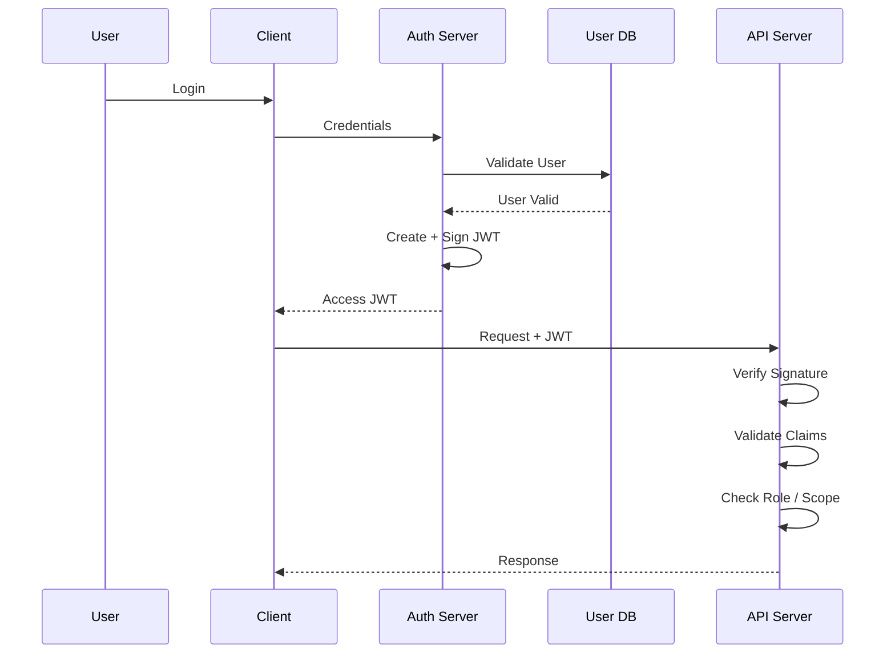
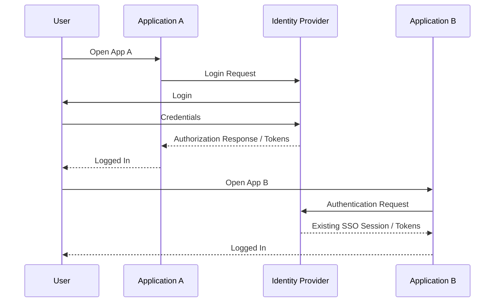

# JWT — JSON Web Token
## JWT vs SessionID | Flow | Structure | SSO | Security Challenges | Interview Q&A

---

# 1. What is JWT?

**JWT (JSON Web Token)** is a compact, URL-safe way of representing **claims** between two parties.

A JWT is commonly used for:

- Authentication
- Authorization
- API access
- Microservices
- SSO / identity systems
- OAuth 2.0 access tokens

A typical signed JWT looks like:

```text
xxxxx.yyyyy.zzzzz
```

JWT consists of:

```text
Header.Payload.Signature
```

> Important: JWT is a **token format**, not an authentication protocol.

---

# 2. Why Do We Need JWT?

Consider a traditional session-based system.

```text
Client
   |
   | Login
   v
Server
   |
   | Create Session
   v
Session Store / Redis
   |
   | Session ID
   v
Client
```

For every request:

```text
Client
  |
  | Session ID
  v
Server
  |
  | Lookup Session
  v
Redis / DB
  |
  v
User Information
```

This works well, but the server must maintain session state.

With JWT:

```text
Client
   |
   | JWT
   v
Server
   |
   | Verify Signature
   v
Authenticated User
```

The server can often validate the token locally without looking up a session for every request.

---

# 3. JWT Authentication Flow



### Flow

```text
1. User logs in
2. Auth Server validates credentials
3. Auth Server creates JWT
4. JWT is signed
5. Client receives JWT
6. Client sends JWT with API requests
7. API verifies JWT
8. API checks authorization
9. API returns response
```

---

# 4. JWT vs SessionID

| Feature | SessionID | JWT |
|---|---|---|
| Server state | Usually required | Can be mostly stateless |
| Client stores | Session ID | JWT |
| Server lookup | Usually yes | Often no for access-token validation |
| Scaling | Requires shared session store or sticky sessions | Easier local validation |
| Revocation | Easy | More difficult |
| Token size | Small | Larger |
| User data in token | No | Claims can contain data |
| Tamper protection | Server-side state | Signature |
| Logout | Easy server-side invalidation | Requires expiry/revocation strategy |
| Best use | Traditional web sessions | Distributed APIs/microservices |

### Key Trade-off

```text
SessionID
   ↓
More server-side state
   ↓
Easy revocation

JWT
   ↓
Less per-request server state
   ↓
Harder immediate revocation
```

JWT does **not automatically make an entire authentication system stateless**. Refresh tokens, revocation, user state, and other controls may still require server-side state.

---

# 5. JWT Structure

A JWT has three parts:

```text
HEADER.PAYLOAD.SIGNATURE
```

Example:

```text
eyJhbGciOiJSUzI1NiIsInR5cCI6IkpXVCJ9
.
eyJzdWIiOiIxMjMiLCJyb2xlIjoidXNlciJ9
.
SIGNATURE
```

---

## 5.1 Header

Contains information about how the JWT is protected.

```json
{
  "alg": "RS256",
  "typ": "JWT",
  "kid": "key-2026-01"
}
```

Common fields:

- `alg` → signing algorithm
- `typ` → token type
- `kid` → key identifier

---

## 5.2 Payload

Contains **claims**.

Example:

```json
{
  "sub": "12345",
  "iss": "auth.example.com",
  "aud": "orders-api",
  "role": "user",
  "scope": "orders:read",
  "exp": 1780000000
}
```

Important claims:

| Claim | Meaning |
|---|---|
| `iss` | Issuer |
| `sub` | Subject/User |
| `aud` | Audience |
| `exp` | Expiration |
| `iat` | Issued At |
| `nbf` | Not Before |
| `jti` | JWT ID |
| `scope` | Permissions |

### Important

Normal signed JWT payloads are **not encrypted**.

Anyone who obtains the token can generally decode the payload.

Therefore:

```text
DO NOT PUT

Password
Credit Card
Private Key
Secret
Sensitive Personal Data
```

inside a normal JWT.

A JWT can be encrypted using JWE, but a normal JWS JWT is primarily about integrity/authenticity.

---

# 6. Signature

The signature protects the header and payload from modification.

Conceptually:

```text
Signature =
Sign(
    Base64URL(Header) +
    "." +
    Base64URL(Payload),
    Private Key
)
```

If an attacker changes:

```json
{
  "role": "user"
}
```

to:

```json
{
  "role": "admin"
}
```

the signature becomes invalid.

Therefore:

```text
Decode JWT
    ≠
Validate JWT
```

The API must verify the signature and relevant claims.

---

# 7. Symmetric vs Asymmetric Signing

## HS256

```text
Auth Server
    |
    | Shared Secret
    v
API Server
```

Both sides have the same secret.

Problem:

```text
Every service that can verify
can potentially create tokens too.
```

---

## RS256 / ES256 / EdDSA

```text
Auth Server
    |
    | Private Key
    v
Sign JWT

Microservices
    |
    | Public Key
    v
Verify JWT
```

This is often a better fit for microservices because services only need the public key to verify tokens.

OWASP recommends preferring signatures over shared MACs in many JWT deployments because shared MAC keys mean every validator can also potentially mint tokens.

---

# 8. JWT Microservices Architecture

```text
                         ┌─────────────────┐
                         │   Auth Service  │
                         │                 │
                         │ Private Key     │
                         │ JWT Generation  │
                         └────────┬────────┘
                                  |
                                  | JWT
                                  v
Client ────────> API Gateway ────────> Order Service
                     |                       |
                     |                       |
                     └──────────────────────> Payment Service
                                             |
                                             v
                                            DB
```

For asymmetric signing:

```text
Auth Service
    |
    | Private Key
    v
Sign JWT

        Public Key
           |
    ┌──────┼─────────┐
    v      v         v
 Order  Payment    User
Service Service   Service
```

---

# 9. JWT Validation at API

When a request arrives:

```text
Client
   |
   | Authorization: Bearer <JWT>
   v
API Gateway / Service
   |
   +--> Verify Signature
   |
   +--> Validate Algorithm
   |
   +--> Validate Issuer
   |
   +--> Validate Audience
   |
   +--> Validate Expiry
   |
   +--> Validate nbf
   |
   +--> Check Scope / Role
   |
   v
Allow / Reject
```

### Validation Checklist

```text
✓ Token exists
✓ Correct format
✓ Allowed algorithm
✓ Signature valid
✓ iss is trusted
✓ aud is correct
✓ exp is valid
✓ nbf is valid if present
✓ Required claims exist
✓ Scope/role is sufficient
✓ Resource-level authorization passes
```

Do not blindly trust the `alg` value supplied by the token header; the application should define which algorithms it accepts.

---

# 10. Access Token vs Refresh Token

Usually:

```text
Access Token
    ↓
Short-lived
    ↓
Used for APIs
```

```text
Refresh Token
    ↓
Longer-lived
    ↓
Used to obtain new access tokens
```

Flow:

```text
Client
  |
  | Access Token
  v
API

Access Token expires
  |
  v
Client
  |
  | Refresh Token
  v
Auth Server
  |
  v
New Access Token
```

A refresh token does **not** have to be a JWT; opaque random refresh tokens are common.

---

# 11. JWT Security Challenges

## Challenge 1: Token Theft

If an attacker steals a valid JWT:

```text
Attacker
   |
   | Stolen JWT
   v
API
```

The API may accept it until it expires.

### Solution

```text
Short-lived Access Token
        +
Secure Token Storage
        +
Refresh Token Rotation
        +
HTTPS
```

---

# 12. Challenge 2: Revocation

SessionID:

```text
SessionID
    |
    v
Delete from Redis
    |
    v
Immediately Invalid
```

JWT:

```text
JWT
 |
 | Already issued
 v
Valid until expiration
```

### Solutions

- Short access-token TTL
- Refresh-token revocation
- Refresh-token rotation
- Token version
- Denylist when necessary
- Introspection/central validation when immediate control is required

OWASP specifically notes that using JWTs for sessions introduces session-invalidation complexity; a denylist can provide revocation but adds server-side state.

---

# 13. Challenge 3: Key Compromise

Suppose the private signing key is stolen.

```text
Attacker
   |
   | Stolen Private Key
   v
Creates Fake JWT
   |
   v
API accepts it
```

### Solution

```text
Private Key
    ↓
KMS / HSM / Secrets Manager
    ↓
Never expose directly
    ↓
Key Rotation
```

Use `kid` to identify signing keys.

---

# 14. Key Rotation

Example:

```text
Old Key: key-1
New Key: key-2
```

During rotation:

```text
JWKS

key-1 → available
key-2 → available

New tokens → signed with key-2
Old tokens → still validated with key-1
```

After old tokens expire:

```text
Remove key-1
```

This prevents existing tokens from suddenly becoming invalid during normal rotation.

---

# 15. Challenge 4: Token Storage

For browser applications, token storage is a major security decision.

Avoid storing authentication tokens in `localStorage`/`sessionStorage` when possible because JavaScript running in the origin can access them if an XSS vulnerability exists. OWASP recommends secure `HttpOnly`, `Secure`, appropriately configured `SameSite` cookies or a BFF pattern for many browser architectures.

A common browser pattern:

```text
Browser
   |
   | Secure + HttpOnly Cookie
   v
Backend / BFF
   |
   v
APIs
```

With cookies, protect against **CSRF** as appropriate.

---

# 16. Challenge 5: Algorithm Confusion

Bad implementation:

```text
Trust token's "alg"
        ↓
Choose verification method
```

Better:

```text
Application Configuration
        ↓
Allowed Algorithms
        ↓
Verify JWT
```

Never allow:

```text
alg = none
```

or blindly switch algorithms based only on attacker-controlled token headers.

---

# 17. Challenge 6: Stale Permissions

Suppose:

```text
JWT:
role = admin
```

Later:

```text
Admin → User
```

Existing JWT may still contain:

```text
role = admin
```

until it expires.

### Solutions

```text
Short JWT TTL
+
Token Version
+
Revocation
+
Introspection for high-risk operations
```

For highly sensitive authorization decisions, do not rely only on stale claims.

---

# 18. SSO Using JWT

SSO means:

> Login once and access multiple applications.

Example:

```text
                 ┌──────────────┐
                 │ Identity /   │
                 │ Auth Server  │
                 └──────┬───────┘
                        |
                    Login Once
                        |
              ┌─────────┼─────────┐
              v         v         v
           App A      App B      App C
```

Typical modern SSO uses **OAuth 2.0 + OpenID Connect (OIDC)**.

OIDC provides the authentication/identity layer on top of OAuth 2.0, and the ID token is commonly a JWT.

---

# 19. SSO Flow



The important point is that **JWT itself does not provide SSO**. An identity/authorization system such as OIDC/OAuth is responsible for the overall protocol flow.

---

# 20. JWT + OAuth 2.0

These are frequently confused.

```text
OAuth 2.0
    ↓
Authorization Framework
    ↓
Access Token
    ↓
Can be JWT
```

Therefore:

```text
JWT ≠ OAuth 2.0
```

Example:

```text
OAuth 2.0
    |
    | Access Token
    v
JWT
    |
    v
Order API
```

OAuth defines **how authorization works**.

JWT defines **how the token is represented**.

---

# 21. JWT vs Opaque Token

| JWT | Opaque Token |
|---|---|
| Contains claims | Random identifier |
| Can be validated locally | Usually requires introspection/server lookup |
| Larger | Smaller |
| Easier distributed validation | Easier central control |
| Revocation is harder | Revocation can be easier |
| Good for distributed APIs | Good when central token control is important |

---

# 22. JWT Failure Scenarios

### Scenario 1: Auth Service is Down

If existing JWTs can be locally verified:

```text
Auth Service DOWN
       |
       v
Existing JWT
       |
       v
API can continue validation
```

New logins/token refreshes may fail.

---

### Scenario 2: JWKS Endpoint is Down

If services cache public keys:

```text
JWKS
 ↓
Public Key Cache
 ↓
Microservice
```

Existing tokens may continue working.

Therefore public keys should be cached with sensible refresh behavior.

---

### Scenario 3: JWT Expired

```text
API
 ↓
exp < current time
 ↓
401 Unauthorized
```

Client can use refresh flow if applicable.

---

### Scenario 4: Wrong Audience

```text
Token:
aud = payment-api

Request:
orders-api

Orders API
   ↓
Audience mismatch
   ↓
Reject
```

Always validate `aud` where applicable.

---

### Scenario 5: User Logout

```text
User Logout
    |
    +--> Revoke refresh token
    |
    +--> Access JWT expires soon
    |
    +--> Optional denylist for high-risk/immediate revocation
```

Simply deleting a token from the client does not invalidate a stolen copy already held by an attacker.

---

# 23. Scenario-Based Interview Questions

## Scenario 1: JWT is stolen. What happens?

**Answer:**

The attacker may use the JWT until it expires or is otherwise rejected.

Use:

```text
Short-lived access tokens
+
Secure storage
+
Refresh-token rotation
+
Revocation for high-risk cases
```

---

## Scenario 2: Admin role is removed but JWT still says admin. What do you do?

**Answer:**

Use short-lived JWTs and, when immediate enforcement is required:

```text
Token version
or
Revocation
or
Introspection
```

Also enforce authorization against the current resource state for sensitive operations.

---

## Scenario 3: How do you scale JWT authentication to 100K requests/sec?

**Answer:**

Use:

```text
API Gateway
      ↓
Stateless API instances
      ↓
Local JWT verification
      ↓
Horizontal scaling
```

Use asymmetric signing so services verify using public keys.

But remember that cryptographic verification still consumes CPU; measure and scale accordingly.

---

## Scenario 4: How do you rotate JWT keys without downtime?

**Answer:**

```text
Publish New Public Key
        ↓
Start Signing with New Private Key
        ↓
Keep Old Public Key Available
        ↓
Wait for Old Tokens to Expire
        ↓
Remove Old Public Key
```

Use `kid` to identify the correct key.

---

## Scenario 5: One microservice is compromised. Should it be able to create JWTs?

**Answer:**

Prefer asymmetric signing.

```text
Auth Service
    |
    | Private Key
    v
Create JWT

Microservices
    |
    | Public Key
    v
Only Verify
```

This limits the ability of a compromised service to mint valid tokens.

---

## Scenario 6: Why not make JWT valid for 30 days?

**Answer:**

If the token is stolen, the attacker may have a long period of access.

Better:

```text
Short-lived Access Token
        +
Longer-lived Refresh Token
        +
Refresh Rotation
```

---

## Scenario 7: JWT payload is Base64 encoded. Is it secure?

**Answer:**

No.

Base64 is encoding, not encryption.

```text
Base64 ≠ Encryption
```

A normal JWT payload should be considered readable.

---

## Scenario 8: Can we store passwords inside JWT?

**Answer:**

Absolutely not.

JWT should contain only the minimum information required for authentication/authorization.

---

# 24. Interview Q&A

### Q1. What is JWT?

> JWT is a compact token format used to represent claims between parties. A signed JWT can provide integrity and authenticity of those claims.

### Q2. What are the three parts?

```text
Header
Payload
Signature
```

### Q3. Is JWT encrypted?

> Normally no. A signed JWT is readable but protected against tampering. Encryption requires JWE or another encryption mechanism.

### Q4. JWT vs SessionID?

> SessionID stores the actual session state on the server, while JWT can carry signed claims and often be validated without a session lookup.

### Q5. Biggest JWT disadvantage?

> Immediate revocation is harder because already-issued tokens can remain valid until expiration unless additional revocation controls are used.

### Q6. Why use RS256 instead of HS256?

> With RS256, only the authentication service needs the private key to sign tokens; other services can use the public key to verify them.

### Q7. What is `exp`?

> Expiration time of the token.

### Q8. What is `iss`?

> Identifies the issuer of the token.

### Q9. What is `aud`?

> Identifies the intended audience/resource server.

### Q10. What is `jti`?

> A unique identifier for a JWT, useful for tracking/revocation/auditing use cases.

### Q11. What is `kid`?

> Key ID that helps the verifier select the correct public key during key rotation.

### Q12. Can JWT be used without OAuth?

> Yes. JWT is a token format and can be used independently.

### Q13. Can OAuth 2.0 work without JWT?

> Yes. OAuth 2.0 can use opaque access tokens.

### Q14. What is PKCE?

> PKCE protects the OAuth 2.0 Authorization Code flow, especially for public clients such as mobile applications and SPAs.

### Q15. What is OIDC?

> OpenID Connect adds an authentication/identity layer on top of OAuth 2.0. Its ID token is commonly a JWT.

---

# 25. Production JWT Architecture

```text
                         ┌──────────────────────┐
                         │   Identity / Auth    │
                         │      Service        │
                         │                      │
                         │ Login                │
                         │ Token Issuing        │
                         │ Refresh              │
                         │ Key Management       │
                         └──────────┬───────────┘
                                    |
                              Private Key
                                    |
                                    v
                              Sign JWT
                                    |
                                    v
                              ┌──────────┐
                              │  Client  │
                              └────┬─────┘
                                   |
                             Bearer JWT
                                   |
                                   v
                         ┌──────────────────┐
                         │  API Gateway     │
                         │                  │
                         │ Authentication   │
                         │ Rate Limiting    │
                         └────────┬─────────┘
                                  |
                    ┌─────────────┼─────────────┐
                    v             v             v
              Order Service  User Service  Payment Service
                    |             |             |
                    └─────────────┼─────────────┘
                                  |
                                  v
                             Databases

                  Public Keys ← JWKS / Key Distribution
```

---

# 26. Production Best Practices

```text
✓ HTTPS everywhere

✓ Short-lived access JWTs

✓ Refresh-token rotation

✓ Secure refresh-token storage

✓ Asymmetric signing where appropriate

✓ Protect private keys with KMS/HSM/etc.

✓ Key rotation

✓ Validate signature

✓ Validate iss

✓ Validate aud

✓ Validate exp / nbf

✓ Allowlist algorithms

✓ Minimal JWT claims

✓ Never log complete tokens

✓ Rate-limit login/refresh endpoints

✓ Monitor authentication failures

✓ Have a revocation strategy

✓ Enforce authorization at the resource level
```

OWASP highlights signature validation, trusted issuer/audience, expiration checks, algorithm restrictions, revocation, and careful token handling as important JWT security controls.

---

# 27. Quick Comparison

```text
                 SessionID              JWT
                    │                    │
                    │                    │
             Server stores          Claims in token
                session                 │
                    │                   │
                    v                   v
              Session Store       Signature Verify
                    │                   │
                    v                   v
              Easy Revocation      Harder Revocation
                    │                   │
                    v                   v
              Stateful             Can be mostly
                                   stateless
```

---

# 28. Final Mental Model

```text
                         USER
                           |
                         LOGIN
                           |
                           v
                    AUTH / IDENTITY
                         SERVICE
                           |
                           | Sign
                           v
                         JWT
                           |
                           v
                        CLIENT
                           |
                    Bearer Token
                           |
                           v
                     API GATEWAY
                           |
                  Verify + Authorize
                           |
              ┌────────────┼────────────┐
              v            v            v
            USER         ORDER       PAYMENT
           SERVICE       SERVICE      SERVICE
```

### Remember These 7 Points

```text
1. JWT = Token Format

2. JWT = Header + Payload + Signature

3. Signed JWT is normally NOT encrypted

4. Verify JWT; don't just decode it

5. JWT makes distributed validation easier,
   but revocation becomes harder

6. OAuth 2.0 can use JWT as an access token

7. OIDC + OAuth 2.0 is commonly used for SSO
```

### Best Interview Closing Answer

> **“JWT is a compact token format containing claims, normally represented as Header.Payload.Signature. It is useful for distributed authentication and authorization because services can verify a signed token locally. Compared with SessionID, JWT reduces the need for a central session lookup, which can simplify horizontal scaling, but immediate revocation becomes harder. In production I would use short-lived access tokens, refresh-token rotation, asymmetric signing, secure key management and rotation, strict validation of signature/issuer/audience/expiry, and a suitable revocation strategy. For SSO, I would normally use OAuth 2.0 with OpenID Connect rather than JWT alone.”**