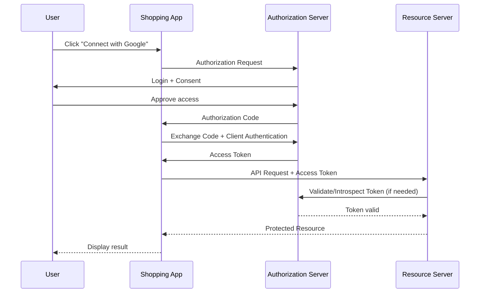
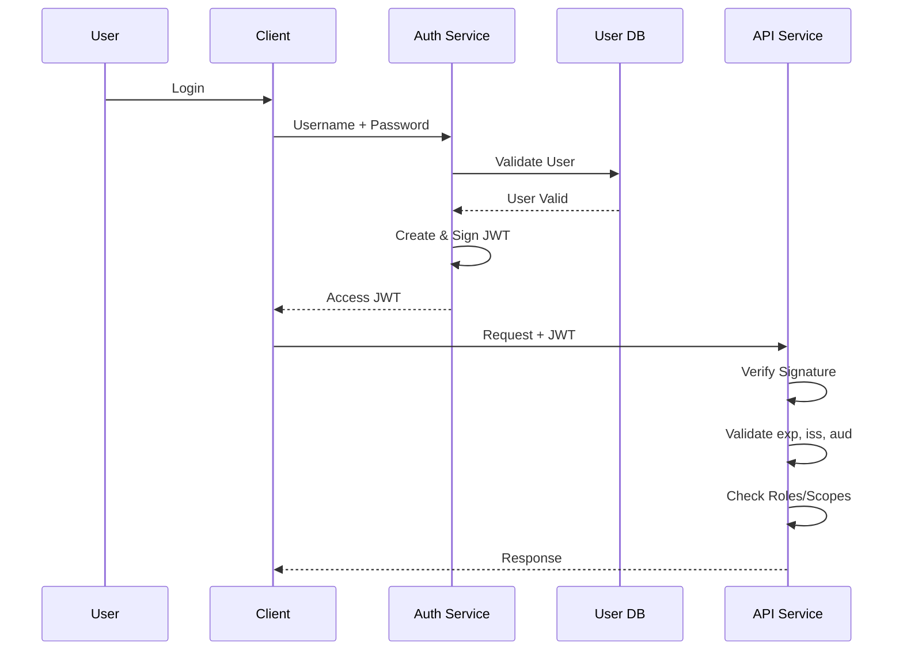

# OAuth 2.0 vs JWT — System Design

## 1. Basic Definition

### OAuth 2.0

**OAuth 2.0 is an authorization framework.**

It defines **how a client gets permission to access a user's resources** without sharing the user's password.

Example:

```text
User → Shopping App → Google
                     ↓
              User gives permission
                     ↓
                Access Token
                     ↓
Shopping App → Google API
```

### JWT

**JWT (JSON Web Token) is a token format.**

It defines how information is packaged into:

```text
HEADER.PAYLOAD.SIGNATURE
```

A JWT is commonly used for authentication/authorization because services can verify its signature without querying a session database for every request.

---

# 2. Important Point

OAuth 2.0 and JWT are **not alternatives**.

They solve different problems:

```text
OAuth 2.0
    ↓
Authorization framework
    ↓
Issues an Access Token
    ↓
Access Token can be a JWT
```

The access token could also be an **opaque/random token**.

---

# 3. OAuth 2.0 Sequence Diagram

Example: Shopping application wants to access a user's Google resources.



### Authorization Code Flow

The common flow is:

```text
1. User → Client
2. Client → Authorization Server
3. User logs in + gives consent
4. Authorization Server → Authorization Code
5. Client → Authorization Server
6. Authorization Server → Access Token
7. Client → Resource Server
8. Resource Server → Protected Resource
```

For modern public clients such as SPAs/mobile apps, **PKCE** is commonly used with the Authorization Code flow.

---

# 4. JWT Authentication Sequence Diagram

Here the application uses JWT as an access token.



### Important Difference

With a self-contained JWT:

```text
Request
   ↓
API Service
   ↓
Verify JWT locally
   ↓
Authorize request
```

The API does not necessarily need to query a central session store for every request.

---

# 5. JWT Structure

A JWT normally looks like:

```text
xxxxx.yyyyy.zzzzz
  ↓     ↓      ↓
Header Payload Signature
```

Example payload:

```json
{
  "sub": "12345",
  "iss": "auth.example.com",
  "aud": "orders-api",
  "exp": 1780000000,
  "scope": "orders:read orders:write"
}
```

### Important Claims

| Claim | Meaning |
|---|---|
| `iss` | Issuer |
| `sub` | Subject/user ID |
| `aud` | Intended audience |
| `exp` | Expiration time |
| `iat` | Issued-at time |
| `nbf` | Not valid before |
| `jti` | Unique token ID |
| `scope` | Permissions |

---

# 6. OAuth 2.0 vs JWT

| Feature | OAuth 2.0 | JWT |
|---|---|---|
| Type | Authorization framework | Token format |
| Main purpose | Delegated authorization | Represent claims/token data |
| Defines flows | Yes | No |
| Defines token format | No | Yes |
| Can use JWT? | Yes | N/A |
| Can use opaque token? | Yes | No |
| Requires login? | Not necessarily | Not inherently |
| Handles consent? | Yes | No |
| Handles scopes? | Yes | JWT can carry scopes |
| Revocation | Framework-dependent | More difficult for self-contained tokens |
| Example | Google authorization | `header.payload.signature` |

---

# 7. OAuth 2.0 Architecture

```text
                    ┌──────────────────────┐
                    │ Authorization Server │
                    │                      │
                    │ Login                │
                    │ Consent              │
                    │ Token Issuing        │
                    └──────────┬───────────┘
                               │
                         Access Token
                               │
                               ▼
┌──────────┐             ┌──────────────┐
│  Client  │────────────▶│ Resource     │
│ App      │   Token     │ Server / API │
└──────────┘             └──────────────┘
                               │
                               ▼
                         Protected Data
```

OAuth terminology:

- **Resource Owner** → User
- **Client** → Application requesting access
- **Authorization Server** → Issues tokens
- **Resource Server** → API containing protected resources

---

# 8. JWT-Based Microservices Architecture

```text
                    ┌─────────────────┐
                    │   Auth Service  │
                    │                 │
                    │ Sign JWT        │
                    └────────┬────────┘
                             │
                          JWT/JWKS
                             │
                             ▼
Client ────────▶ API Gateway ─────────▶ Order Service
                     │                       │
                     │                       │
                     └──────────────────────▶ Payment Service
                                             │
                                             ▼
                                           DB
```

For microservices, asymmetric signing such as **RS256/ES256/EdDSA** is often useful:

```text
Auth Service
    │
    │ Private Key
    ▼
Signs JWT

Microservices
    │
    │ Public Key
    ▼
Verify JWT
```

The private key should **never be distributed to every service**.

---

# 9. OAuth 2.0 Access Token Can Be JWT

This is the important relationship:

```text
                OAuth 2.0
                   │
                   ▼
          Access Token issued
                   │
          ┌────────┴────────┐
          │                 │
          ▼                 ▼
       JWT Token       Opaque Token
```

So:

```text
OAuth 2.0 + JWT
```

is completely valid.

But:

```text
JWT ≠ OAuth 2.0
```

---

# 10. Access Token vs Refresh Token

A common OAuth architecture uses:

```text
Access Token
    ↓
Short-lived
    ↓
Used for API requests

Refresh Token
    ↓
Longer-lived
    ↓
Used to obtain a new access token
```

Example:

```text
Client
  │
  │ Access Token
  ▼
API

Access Token expires
  │
  ▼
Client
  │
  │ Refresh Token
  ▼
Authorization Server
  │
  ▼
New Access Token
```

Refresh tokens are often **opaque random values** rather than JWTs.

---

# 11. Authentication vs Authorization

This is frequently asked in interviews.

### Authentication

> **Who are you?**

Example:

```text
Username + Password
       ↓
Authentication
       ↓
User = Alice
```

### Authorization

> **What are you allowed to do?**

Example:

```text
Alice
 ↓
Role = Admin
 ↓
Can delete orders
```

JWT can carry authorization information such as:

```json
{
  "sub": "123",
  "role": "admin",
  "scope": "orders:read orders:delete"
}
```

But the application must still **enforce authorization**.

---

# 12. OAuth 2.0 Scopes

Scopes limit what the access token can do.

Example:

```text
scope = orders:read
```

The API may allow:

```text
GET /orders
```

but reject:

```text
DELETE /orders/123
```

if the token does not have:

```text
orders:delete
```

---

# 13. JWT Validation

An API should not simply decode a JWT and trust it.

It should verify:

```text
1. Token exists
2. Correct format
3. Allowed algorithm
4. Signature
5. Issuer (iss)
6. Audience (aud)
7. Expiration (exp)
8. Not-before (nbf), if used
9. Required claims
10. Roles/scopes
11. Resource-level authorization
```

### Very Important

```text
Decode JWT ≠ Validate JWT
```

The payload is readable in a normal signed JWT.

JWT provides **integrity/authenticity**, not confidentiality.

---

# 14. 401 vs 403

Another common interview question.

### 401 Unauthorized

Authentication is missing or invalid.

```text
No token
Invalid token
Expired token
Invalid signature
```

### 403 Forbidden

User is authenticated but does not have permission.

```text
Valid token
      ↓
Role = user
      ↓
Trying admin operation
      ↓
403 Forbidden
```

---

# 15. JWT Security

Important production practices:

```text
✓ HTTPS
✓ Short-lived access tokens
✓ Strong signing algorithms
✓ Algorithm allowlist
✓ Validate iss/aud/exp
✓ Secure private-key storage
✓ Key rotation
✓ Refresh-token rotation
✓ Minimal claims
✓ Never log complete tokens
✓ Rate limiting
✓ Proper authorization checks
```

Do not put sensitive information such as:

```text
Passwords
Credit card data
Private keys
Secrets
```

inside a normal JWT payload.

---

# 16. JWT Revocation Problem

One major drawback of self-contained JWTs:

```text
JWT issued
   ↓
Valid for 15 minutes
   ↓
User account disabled
   ↓
JWT may still work
   ↓
Until it expires
```

Common solutions:

```text
Short JWT expiry
      +
Refresh token revocation
      +
Token version / blocklist when necessary
```

For stronger immediate control, use **token introspection or a centralized authorization mechanism**.

---

# 17. OAuth 2.0 vs Session

Traditional session authentication:

```text
Client
  ↓
Session ID
  ↓
Server
  ↓
Session DB / Redis
```

JWT-based authentication:

```text
Client
  ↓
JWT
  ↓
API
  ↓
Local signature validation
```

### Trade-off

JWT:

- Easier horizontal scaling for access-token validation
- No session lookup for every request
- Harder immediate revocation
- Token size can be larger

Session:

- Easy revocation
- Centralized state
- Requires shared/session storage
- Can add lookup overhead

---

# 18. When to Use What?

### Use OAuth 2.0 when:

```text
✓ One application needs access to another service
✓ Third-party API access
✓ Delegated user permissions
✓ SSO/identity integrations
✓ Need scopes and consent
```

### Use JWT when:

```text
✓ Need a self-contained signed token
✓ Microservices need local validation
✓ Distributed APIs
✓ Stateless access-token validation is useful
```

They can be combined:

```text
OAuth 2.0
    ↓
Authorization Server
    ↓
JWT Access Token
    ↓
API Gateway / Microservices
```

---

# 19. Common Interview Questions

### Q1. Is JWT an authentication protocol?

**No.** JWT is a token format.

---

### Q2. Is OAuth 2.0 a token format?

**No.** OAuth 2.0 is an authorization framework.

---

### Q3. Can OAuth 2.0 work without JWT?

**Yes.** OAuth 2.0 can use opaque access tokens.

---

### Q4. Can JWT work without OAuth?

**Yes.** JWT can be used in a custom authentication system or other protocols.

---

### Q5. Is JWT encrypted?

**Normally, no.**

A standard signed JWT (JWS) is readable but protected against modification through its signature.

---

### Q6. Why use JWT in microservices?

Because services can often validate the token locally using a public key instead of calling a central session store for every request.

---

### Q7. What is the biggest JWT drawback?

**Revocation is harder** than with server-side sessions.

---

### Q8. What is PKCE?

PKCE adds protection to the OAuth 2.0 Authorization Code flow, especially for public clients such as mobile apps and SPAs.

---

# 20. One-Minute Interview Answer

> **OAuth 2.0 and JWT solve different problems. OAuth 2.0 is an authorization framework that defines how a client obtains permission and access tokens. JWT is a token format containing claims that can be signed and verified. OAuth 2.0 can issue a JWT access token, but it can also issue an opaque token. In a microservices architecture, we can use OAuth 2.0 for authorization and JWT access tokens for API calls, with services validating the JWT signature, issuer, audience, expiry, and scopes. The main JWT trade-off is that immediate revocation is harder, so short-lived access tokens and controlled refresh-token handling are commonly used.**

## Final Mental Model

```text
                AUTHORIZATION
                     │
                 OAuth 2.0
                     │
                     ▼
              Access Token
                /        \
               /          \
             JWT         Opaque
              │
              ▼
       API / Microservices
              │
       Verify + Authorize
              │
              ▼
          Protected Data
```

### Remember

```text
OAuth 2.0 = HOW authorization happens

JWT       = HOW token information is represented

OAuth 2.0 + JWT = Very common combination
```

---
---


## Short Definition

- **OAuth 2.0** = Authorization framework → defines **how an application gets permission to access resources**.
- **JWT (JSON Web Token)** = Token format → defines **how token data is structured and signed**.

## Example

Suppose you use **Login/Connect with Google** for a shopping app:

```text
User
  ↓
Shopping App
  ↓
Google Authorization Server
  ↓
User gives permission
  ↓
Access Token
  ↓
Shopping App → Google APIs
```

The **Access Token can be a JWT**, but OAuth 2.0 does not require JWT. It can also use an opaque token.

## Key Difference

| OAuth 2.0 | JWT |
|---|---|
| Authorization framework | Token format |
| Defines authorization flows | Defines token structure |
| Handles access delegation | Carries claims/data |
| Can use JWT or opaque tokens | Can be used with or without OAuth |
| Example: Google OAuth flow | Example: `header.payload.signature` |

## Easy Way to Remember

```text
OAuth 2.0
   ↓
Defines HOW authorization happens
   ↓
Issues an access token
   ↓
Token can be a JWT
```

> **OAuth 2.0 tells you how authorization works.**  
> **JWT tells you what the token looks like.**

### Interview Answer

> “OAuth 2.0 is an authorization framework, while JWT is a token format. OAuth 2.0 can use JWT as an access token, but OAuth 2.0 does not require JWT.”