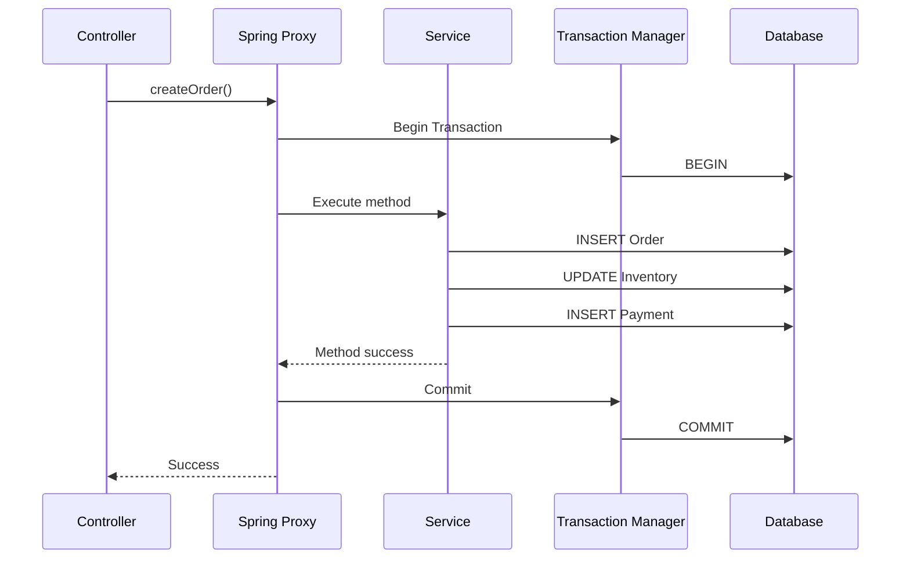
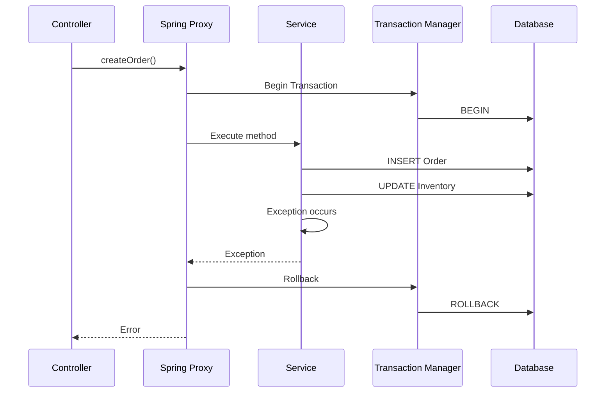
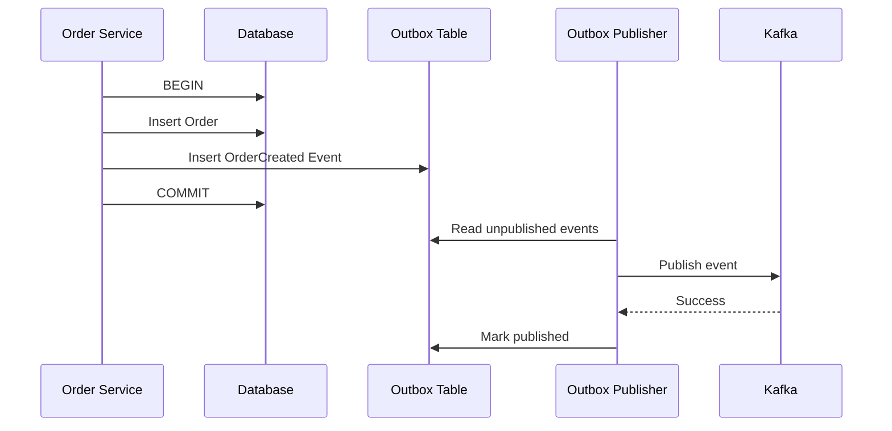

# Spring Boot `@Transactional` — Complete Guide

## Transactions | Repository | Propagation | Isolation | Rollback | Locking | Interview Q&A | Scenarios

---

# 1. What is a Transaction?

A **transaction** is a group of database operations treated as one logical unit of work.

Example:

```text
Transfer ₹1000 from Account A to Account B

1. Debit ₹1000 from A
2. Credit ₹1000 to B
```

Both operations should succeed, or both should fail.

```text
A: ₹5000
B: ₹3000

Transaction:
A → -₹1000
B → +₹1000
```

If the application crashes after step 1:

```text
A → ₹4000
B → ₹3000
```

This is incorrect.

A transaction ensures:

```text
SUCCESS:
A → ₹4000
B → ₹4000

OR

FAILURE:
A → ₹5000
B → ₹3000
```

---

# 2. What is `@Transactional`?

Spring's:

```java
@Transactional
```

is used to define a **transaction boundary** around a method/class.

Example:

```java
@Service
public class PaymentService {

    @Transactional
    public void transferMoney() {

        debitAccount();

        creditAccount();
    }
}
```

Conceptually:

```text
Method starts
      ↓
Transaction begins
      ↓
DB operations
      ↓
Method successful?
   /          \
 YES          NO
  ↓            ↓
COMMIT       ROLLBACK
```

---

# 3. Why Do We Need `@Transactional`?

Without a transaction:

```java
public void transferMoney() {

    accountRepository.debit(from, amount);

    accountRepository.credit(to, amount);
}
```

If the second operation fails:

```text
Debit → SUCCESS
Credit → FAILURE

Database:
Money deducted but not credited
```

With:

```java
@Transactional
public void transferMoney() {

    accountRepository.debit(from, amount);

    accountRepository.credit(to, amount);
}
```

If the transaction fails:

```text
Debit → SUCCESS
Credit → FAILURE
       ↓
ROLLBACK
       ↓
Debit also undone
```

---

# 4. Transaction ACID Properties

A database transaction follows the ACID principles.

## A — Atomicity

All operations succeed or all fail.

```text
Debit
 +
Credit
 ↓
Both succeed
OR
Both rollback
```

---

## C — Consistency

Transaction moves the database from one valid state to another valid state.

Example:

```text
Account balance cannot become negative
```

if the business/database rules prohibit it.

---

## I — Isolation

Concurrent transactions should not incorrectly interfere with each other.

Example:

```text
Transaction A
Transaction B
```

should not see invalid intermediate states depending on the configured isolation level.

---

## D — Durability

Once committed, the database should preserve the changes even after a crash.

```text
COMMIT
  ↓
Data persisted
  ↓
Application restart
  ↓
Data remains
```

---

# 5. Where Should `@Transactional` Be Used?

Usually, put the transaction boundary in the **Service layer**.

Recommended:

```text
Controller
    ↓
Service
    ↓
Repository
    ↓
Database
```

Example:

```java
@Service
public class OrderService {

    @Transactional
    public void createOrder(OrderRequest request) {

        orderRepository.save(order);

        paymentRepository.save(payment);

        inventoryRepository.updateStock(...);
    }
}
```

### Why Service Layer?

Because a business operation may involve multiple repositories.

```text
createOrder()
   |
   +--> OrderRepository
   |
   +--> PaymentRepository
   |
   +--> InventoryRepository
```

All should participate in one transaction.

---

# 6. Should We Put `@Transactional` on Repository?

You **can**, but generally the service layer is a better transaction boundary for business operations.

Repository:

```java
@Repository
public interface OrderRepository
        extends JpaRepository<Order, Long> {
}
```

Service:

```java
@Service
public class OrderService {

    @Transactional
    public void placeOrder() {

        orderRepository.save(order);

        inventoryRepository.decreaseStock();

        paymentRepository.save(payment);
    }
}
```

The service defines the business transaction.

---

# 7. Spring Transaction Architecture

Conceptually:

```text
Controller
    ↓
Service
    ↓
@Transactional
    ↓
Spring Transaction Manager
    ↓
JPA / Hibernate
    ↓
JDBC
    ↓
Database
```

For a typical Spring Boot + JPA application:

```text
@Transactional
      ↓
JpaTransactionManager
      ↓
EntityManager
      ↓
Hibernate
      ↓
JDBC Connection
      ↓
Database
```

Spring Boot auto-configures much of this infrastructure when the appropriate database/JPA dependencies are present.

---

# 8. Transaction Sequence Diagram



If an exception occurs:



---

# 9. Very Important: Spring Uses Proxies

A major interview topic.

When you write:

```java
@Transactional
public void createOrder() {
}
```

Spring generally creates a proxy around the bean.

Conceptually:

```text
Client
  ↓
Spring Proxy
  ↓
Begin Transaction
  ↓
Real Service Method
  ↓
Commit / Rollback
```

Not:

```text
Client
  ↓
Real Service directly
```

---

# 10. Self-Invocation Problem

Consider:

```java
@Service
public class OrderService {

    public void methodA() {
        methodB();
    }

    @Transactional
    public void methodB() {
        // DB operations
    }
}
```

If:

```java
methodA()
```

calls:

```java
this.methodB()
```

the call may bypass the Spring proxy.

Therefore the `@Transactional` behavior on `methodB()` may **not be applied as expected**.

### Better Design

Move the transactional method to another bean:

```java
@Service
public class OrderService {

    private final TransactionalOrderService txService;

    public void methodA() {
        txService.methodB();
    }
}
```

Or put the transaction boundary on the outer service method when appropriate.

---

# 11. `@Transactional` Properties

Important properties:

```java
@Transactional(
    propagation = Propagation.REQUIRED,
    isolation = Isolation.DEFAULT,
    timeout = 30,
    readOnly = false,
    rollbackFor = Exception.class
)
```

The most important properties are:

```text
propagation
isolation
timeout
readOnly
rollbackFor
noRollbackFor
```

---

# 12. Propagation

Propagation defines:

> What should happen if a transactional method calls another transactional method?

Main propagation modes:

```text
REQUIRED
REQUIRES_NEW
NESTED
SUPPORTS
NOT_SUPPORTED
MANDATORY
NEVER
```

The most important for interviews:

```text
REQUIRED
REQUIRES_NEW
NESTED
```

---

# 13. `Propagation.REQUIRED`

Default propagation.

```java
@Transactional(
    propagation = Propagation.REQUIRED
)
```

Meaning:

> Use the existing transaction if one exists; otherwise create a new transaction.

Example:

```text
Service A
@Transactional
    |
    v
Service B
@Transactional(REQUIRED)
```

Result:

```text
Transaction A
     |
     +--> Service A
     |
     +--> Service B
```

Both use the same transaction.

---

# 14. REQUIRED Example

```java
@Transactional
public void createOrder() {

    orderRepository.save(order);

    paymentService.processPayment();
}
```

Payment:

```java
@Transactional
public void processPayment() {

    paymentRepository.save(payment);
}
```

Because both use `REQUIRED`:

```text
Transaction T1
   |
   +--> createOrder()
   |
   +--> processPayment()
```

If payment fails:

```text
ROLLBACK T1
```

The order insertion also rolls back.

---

# 15. `REQUIRES_NEW`

```java
@Transactional(
    propagation = Propagation.REQUIRES_NEW
)
```

Meaning:

> Always create a new transaction.

If an existing transaction exists, Spring suspends it.

```text
Transaction T1
     |
     | call
     v
Suspend T1
     |
     v
Transaction T2
     |
     v
Commit T2
     |
     v
Resume T1
```

---

# 16. REQUIRES_NEW Example

```java
@Transactional
public void createOrder() {

    orderRepository.save(order);

    auditService.saveAudit();
}
```

Audit:

```java
@Transactional(
    propagation = Propagation.REQUIRES_NEW
)
public void saveAudit() {

    auditRepository.save(audit);
}
```

Flow:

```text
T1: Order Transaction
 |
 | suspend
 v
T2: Audit Transaction
 |
 | commit
 v
Resume T1
```

If T1 later fails:

```text
T1 → ROLLBACK
T2 → already COMMITTED
```

Therefore audit can remain even though order creation failed.

---

# 17. REQUIRES_NEW Disadvantage

It can increase database connection usage.

Example:

```text
T1 holds Connection 1

T1 → REQUIRES_NEW

T2 needs Connection 2
```

With many concurrent requests:

```text
Connection Pool
 ├── T1
 ├── T2
 ├── T3
 ├── T4
 └── ...
```

Nested `REQUIRES_NEW` calls can contribute to connection pool exhaustion.

---

# 18. `NESTED`

Nested transactions typically use a database savepoint when supported by the transaction manager/database setup.

Conceptually:

```text
T1
 |
 | Savepoint
 v
Nested Operation
 |
 +--> Failure
 |
 v
Rollback to Savepoint
 |
 v
Continue T1
```

Example:

```text
T1
 |
 +--> Savepoint
 |
 +--> Operation B fails
 |
 +--> Rollback B
 |
 +--> Continue T1
 |
 +--> Commit T1
```

Important:

> `NESTED` is not the same as `REQUIRES_NEW`.

`REQUIRES_NEW` creates an independent transaction.

`NESTED` typically uses a savepoint inside the existing transaction.

Support depends on the transaction manager and underlying database capabilities.

---

# 19. Propagation Comparison

| Propagation | Existing Transaction | New Transaction? |
|---|---|---|
| REQUIRED | Join | If none exists |
| REQUIRES_NEW | Suspend existing | Yes |
| NESTED | Use existing | Savepoint |
| SUPPORTS | Join if exists | No |
| NOT_SUPPORTED | Suspend | Runs without transaction |
| MANDATORY | Must already exist | No |
| NEVER | Must not exist | No |

---

# 20. Isolation Level

Isolation defines how concurrent transactions interact.

Common levels:

```text
READ_UNCOMMITTED
READ_COMMITTED
REPEATABLE_READ
SERIALIZABLE
```

---

# 21. Dirty Read

Example:

```text
T1:
UPDATE balance = 5000
Not committed

T2:
Reads balance = 5000
```

If T1 rolls back:

```text
Actual balance ≠ 5000
```

T2 saw uncommitted data.

This is a **dirty read**.

---

# 22. READ_UNCOMMITTED

Allows dirty reads.

```text
T1 → UPDATE
       |
       | not committed
       v
T2 → READ
```

Very weak isolation.

Usually avoided for business-critical financial operations.

---

# 23. READ_COMMITTED

A transaction can only read committed data.

```text
T1 → UPDATE
     |
     | not committed
     v
T2 → READ old committed value
```

After T1 commits, a later read may see the new value.

Commonly used isolation level.

---

# 24. Non-Repeatable Read

Example:

```text
T1:
SELECT balance → 5000

T2:
UPDATE balance → 4000
COMMIT

T1:
SELECT balance → 4000
```

Same query in T1 returned different results.

This is a **non-repeatable read**.

---

# 25. REPEATABLE_READ

Guarantees stronger consistency for repeated reads within a transaction, with exact behavior depending on the database.

Conceptually:

```text
T1:
READ → 5000

T2:
UPDATE → 4000
COMMIT

T1:
READ → still consistent with T1's isolation model
```

---

# 26. Phantom Read

Example:

```text
T1:
SELECT users WHERE age > 30
→ 10 rows

T2:
INSERT user age=35
COMMIT

T1:
SELECT users WHERE age > 30
→ 11 rows
```

A new row appeared.

This is a **phantom read**.

---

# 27. SERIALIZABLE

Strongest standard isolation level.

Conceptually:

```text
T1
 ↓
Execute

T2
 ↓
Must wait / serialize depending on DB
```

Advantages:

- Strong consistency
- Prevents many concurrency anomalies

Disadvantages:

- More locking/conflicts
- Lower concurrency
- Higher latency
- Possible deadlocks/timeouts

Use only when the business requirement justifies it.

---

# 28. Isolation Comparison

| Isolation | Dirty Read | Non-repeatable Read | Phantom Read |
|---|---|---|---|
| READ_UNCOMMITTED | Possible | Possible | Possible |
| READ_COMMITTED | No | Possible | Possible |
| REPEATABLE_READ | No | No | DB-dependent |
| SERIALIZABLE | No | No | No |

Exact behavior can vary by database engine and implementation.

---

# 29. Setting Isolation

```java
@Transactional(
    isolation = Isolation.READ_COMMITTED
)
public void processOrder() {
}
```

Or:

```java
@Transactional(
    isolation = Isolation.SERIALIZABLE
)
public void processPayment() {
}
```

Do not blindly use `SERIALIZABLE`.

---

# 30. Rollback Behavior

By default, Spring's declarative transaction management rolls back for:

```text
RuntimeException
Error
```

and generally does **not** automatically roll back for checked exceptions.

Example:

```java
@Transactional
public void createOrder() {

    saveOrder();

    throw new RuntimeException();
}
```

Result:

```text
ROLLBACK
```

---

# 31. Checked Exception

Example:

```java
@Transactional
public void createOrder() throws Exception {

    saveOrder();

    throw new Exception();
}
```

By default, this may **not** trigger rollback.

If rollback is required:

```java
@Transactional(
    rollbackFor = Exception.class
)
public void createOrder() throws Exception {
}
```

---

# 32. `rollbackFor`

Use:

```java
@Transactional(
    rollbackFor = Exception.class
)
```

when the business operation must roll back for checked exceptions too.

Example:

```java
@Transactional(
    rollbackFor = PaymentException.class
)
public void processPayment() throws PaymentException {

    debitAccount();

    throw new PaymentException();
}
```

---

# 33. `noRollbackFor`

Sometimes a particular exception should not cause rollback.

```java
@Transactional(
    noRollbackFor = SomeException.class
)
public void process() {
}
```

Use carefully because rollback behavior is part of business correctness.

---

# 34. Exception Handling Pitfall

Consider:

```java
@Transactional
public void createOrder() {

    try {
        saveOrder();

        throw new RuntimeException();

    } catch (RuntimeException e) {
        log.error("Error", e);
    }
}
```

The exception is caught.

The method may return normally.

Therefore the transaction may commit.

```text
Exception occurs
      ↓
Caught inside method
      ↓
Method returns normally
      ↓
Commit
```

If you need rollback, either rethrow the exception or explicitly mark the transaction rollback-only.

Example:

```java
catch (RuntimeException e) {
    log.error("Error", e);
    throw e;
}
```

---

# 35. `readOnly = true`

Example:

```java
@Transactional(readOnly = true)
public List<Order> getOrders() {
    return orderRepository.findAll();
}
```

It indicates that the transaction is intended for reads.

Potential benefits depend on the database/JPA/provider:

- Can communicate read intent
- May reduce unnecessary flush work
- Can provide provider-specific optimizations

Important:

> `readOnly = true` is not a universal guarantee that writes will be impossible.

Do not use it as a security mechanism.

---

# 36. Read-Only Example

```java
@Service
public class OrderService {

    @Transactional(readOnly = true)
    public Order getOrder(Long id) {
        return orderRepository.findById(id)
                .orElseThrow();
    }

    @Transactional
    public void updateOrder(Order order) {
        orderRepository.save(order);
    }
}
```

---

# 37. Timeout

Example:

```java
@Transactional(timeout = 5)
public void processOrder() {
}
```

The transaction is given a timeout of approximately 5 seconds, subject to transaction manager/database behavior.

Useful for preventing transactions from remaining open too long.

Long transactions can:

```text
Hold DB connections
Hold locks
Increase contention
Reduce throughput
```

---

# 38. Transaction Boundary

A transaction should usually be:

```text
Small
Focused
Business-oriented
```

Good:

```text
@Transactional
createOrder()
```

Bad:

```text
@Transactional
callExternalAPI()
wait 30 seconds
sendEmail()
performLargeFileOperation()
update DB
```

Why?

Because the transaction may hold:

```text
DB Connection
Locks
Resources
```

for too long.

---

# 39. External API Inside Transaction

Bad pattern:

```java
@Transactional
public void processOrder() {

    orderRepository.save(order);

    paymentClient.callExternalPaymentAPI();

    inventoryRepository.updateStock();
}
```

Potential problem:

```text
BEGIN
 ↓
DB lock
 ↓
External API
 ↓
Network delay
 ↓
DB lock held
 ↓
COMMIT
```

If the external API takes 10 seconds, the database transaction may remain open for 10 seconds.

---

# 40. Better Pattern

Separate database transaction and external communication where appropriate.

Example:

```text
Create Order
    ↓
Commit DB Transaction
    ↓
Publish Event
    ↓
Payment Service
    ↓
External Payment Provider
```

For reliable event publishing, consider the **Transactional Outbox Pattern**.

---

# 41. Transactional Outbox

Problem:

```text
DB Transaction
      +
Message Broker
```

You don't want:

```text
DB COMMIT → SUCCESS
Kafka publish → FAILURE
```

because the database changed but the event was lost.

Outbox solution:

```text
@Transactional
    |
    +--> Save Order
    |
    +--> Save Outbox Event
    |
    v
COMMIT
```

Then:

```text
Outbox Table
     ↓
Publisher / Relay
     ↓
Kafka / RabbitMQ
     ↓
Consumer
```

Sequence:



---

# 42. Transaction + Message Queue

Do not assume:

```text
@Transactional
sendKafkaMessage()
```

automatically creates one atomic transaction spanning your database and Kafka.

Database and broker transactions are separate concerns unless you deliberately configure a suitable transaction strategy.

For many distributed systems, prefer:

```text
DB Transaction
     ↓
Outbox
     ↓
Message Broker
```

This gives reliable eventual delivery.

---

# 43. Distributed Transactions

Suppose:

```text
Order DB
Payment DB
Inventory DB
```

One business operation touches all three.

A local Spring transaction generally cannot magically make three independent databases one ACID transaction.

Options include:

### 1. XA / 2-Phase Commit

```text
Coordinator
   |
 ┌─┼────────┐
 ↓ ↓        ↓
DB1 DB2     DB3
```

Strong coordination but:

- More complex
- Higher latency
- Resource intensive
- Operationally difficult at scale

### 2. Saga Pattern

Break operation into local transactions.

```text
Order
 ↓
Payment
 ↓
Inventory
```

If a later operation fails:

```text
Compensating Action
```

Example:

```text
Payment SUCCESS
Inventory FAILED
       ↓
Refund Payment
```

For microservices, Saga + events is often preferred over distributed XA transactions.

---

# 44. Optimistic Locking

Useful when multiple users may update the same row.

Entity:

```java
@Entity
public class Product {

    @Id
    private Long id;

    @Version
    private Long version;
}
```

Example:

```text
Product version = 5

Transaction A → reads version 5
Transaction B → reads version 5

A updates → version 6
B updates → version mismatch
           ↓
OptimisticLockException
```

Useful when conflicts are relatively rare.

---

# 45. Pessimistic Locking

Pessimistic locking assumes conflicts may happen and locks the database row.

Example:

```java
@Lock(LockModeType.PESSIMISTIC_WRITE)
Optional<Account> findById(Long id);
```

Conceptually:

```text
T1
 ↓
SELECT ... FOR UPDATE
 ↓
Row Locked
 ↓
T2 waits
```

Useful for critical concurrent updates, but can reduce concurrency and increase deadlock risk.

---

# 46. Optimistic vs Pessimistic Locking

| Optimistic | Pessimistic |
|---|---|
| Doesn't usually lock during read | Locks row/resource |
| Detects conflict later | Prevents competing update |
| Better for low contention | Useful for high contention |
| Higher retry possibility | Higher blocking |
| `@Version` common | DB locking common |

---

# 47. Lost Update Problem

Suppose:

```text
Balance = 1000
```

Two transactions:

```text
T1 reads 1000
T2 reads 1000

T1 writes 900
T2 writes 800
```

T1's update may be lost.

Solutions:

```text
Optimistic Locking
Pessimistic Locking
Atomic SQL UPDATE
Appropriate Isolation
```

Example atomic update:

```sql
UPDATE account
SET balance = balance - 100
WHERE id = 1
  AND balance >= 100;
```

---

# 48. Transaction and Lazy Loading

Example:

```java
@Transactional
public Order getOrder(Long id) {
    return orderRepository.findById(id).orElseThrow();
}
```

If relationships are lazy:

```java
order.getItems()
```

may require an active persistence context/session.

Accessing lazy data after the transaction/session is closed can cause:

```text
LazyInitializationException
```

Better approaches include:

- Fetch join
- Entity graph
- DTO projection
- Explicitly loading required data inside transaction

---

# 49. Transaction and Entity Lifecycle

Within a JPA transaction:

```text
Entity
  ↓
Managed by Persistence Context
  ↓
Change entity
  ↓
Dirty Checking
  ↓
Flush
  ↓
SQL
  ↓
Commit
```

Example:

```java
@Transactional
public void updateUser(Long id) {

    User user = userRepository.findById(id).orElseThrow();

    user.setName("John");
}
```

You may not need:

```java
userRepository.save(user);
```

because the entity is managed and Hibernate can detect the change through dirty checking.

The exact SQL timing depends on flush behavior.

---

# 50. Flush vs Commit

These are not the same.

### Flush

Synchronizes pending persistence changes with the database.

```text
Persistence Context
      ↓
     Flush
      ↓
SQL sent to DB
```

### Commit

Completes the database transaction.

```text
SQL changes
     ↓
COMMIT
     ↓
Transaction completed
```

A flush does **not** mean the transaction is committed.

---

# 51. Transaction and `save()`

Calling:

```java
repository.save(entity);
```

does not necessarily mean:

```text
COMMIT NOW
```

It participates in the current transaction.

Example:

```java
@Transactional
public void process() {

    repository.save(order);

    repository.save(payment);

    // commit occurs after method successfully completes
}
```

---

# 52. Multiple Repositories, One Transaction

Example:

```java
@Transactional
public void placeOrder() {

    orderRepository.save(order);

    inventoryRepository.decreaseStock();

    paymentRepository.save(payment);
}
```

Conceptually:

```text
              Transaction T1
                   |
       ┌───────────┼───────────┐
       ↓           ↓           ↓
   Order DB    Inventory DB   Payment DB
```

This works as one local transaction when these operations participate in the same transactional resource/context.

Do not assume the same behavior across unrelated databases/resources.

---

# 53. Transaction Synchronization

Spring binds transactional resources to the current execution context.

For a typical JDBC/JPA transaction:

```text
Thread
  |
  +--> Transaction Context
         |
         +--> JDBC Connection
         |
         +--> EntityManager
```

This allows repository operations within the transaction to participate in the same resource transaction.

---

# 54. `@Transactional` on Class

You can annotate the class:

```java
@Service
@Transactional
public class OrderService {

    public void createOrder() {
    }

    public void updateOrder() {
    }
}
```

All applicable public methods inherit the transactional behavior unless overridden.

You can override specific methods:

```java
@Transactional(readOnly = true)
public Order getOrder() {
}
```

---

# 55. Interface vs Implementation

Common practice:

```java
@Service
public class OrderServiceImpl {

    @Transactional
    public void createOrder() {
    }
}
```

Transaction annotations are commonly placed on service implementation methods/classes.

The exact proxying behavior depends on Spring configuration and proxy type.

---

# 56. Public vs Private Methods

A common interview answer:

```java
@Transactional
private void process() {
}
```

should not be relied upon for Spring proxy-based transaction interception.

Similarly, direct internal calls can bypass the proxy.

Recommended:

```java
@Transactional
public void process() {
}
```

and call it through the Spring-managed bean/proxy.

---

# 57. Async + Transaction

Consider:

```java
@Transactional
public void process() {

    repository.save(order);

    asyncService.processAsync();
}
```

`@Async` runs in another thread.

The original transaction context generally does **not automatically propagate to the async thread**.

Conceptually:

```text
Thread 1
Transaction T1
     |
     +--> save()

Thread 2
     |
     +--> @Async
     |
     +--> Different transaction/context
```

If the async method needs a transaction:

```java
@Async
@Transactional
public void processAsync() {
}
```

it creates/joins a transaction according to its own transactional configuration and resource context.

---

# 58. Transaction + Thread

Do not assume a transaction can simply move between arbitrary threads.

Typical model:

```text
Request Thread
      |
      +--> Transaction
```

If you start another thread:

```text
Request Thread
      |
      +--> Worker Thread
```

the transaction context is not automatically transferred in the same way.

This is an important reason asynchronous processing should be designed carefully.

---

# 59. Transaction + REST Call

Avoid:

```java
@Transactional
public void process() {

    repository.save(order);

    restTemplate.postForObject(...);

    repository.save(payment);
}
```

Potential issue:

```text
DB transaction open
       ↓
Network call
       ↓
Slow / timeout / retry
       ↓
DB connection held
```

Better:

```text
DB Transaction
 ↓
Commit
 ↓
Outbox/Event
 ↓
Async Consumer
 ↓
External API
```

---

# 60. Transaction and Retry

Be careful with:

```text
@Transactional
+
Retry
```

A failed transaction may be marked rollback-only.

A retry should generally execute in a **fresh transaction**, depending on how retry and transaction interceptors are configured.

Conceptually:

```text
Attempt 1
  ↓
Transaction T1
  ↓
Failure
  ↓
Rollback

Attempt 2
  ↓
Transaction T2
  ↓
Success
  ↓
Commit
```

Do not assume retrying inside the same failed transaction will work correctly.

---

# 61. `rollback-only`

A transaction can be marked rollback-only.

Example:

```text
T1
 ↓
Something fails
 ↓
Transaction marked rollback-only
 ↓
Exception handled
 ↓
Method returns
 ↓
Commit attempted
 ↓
Rollback
```

This can surprise developers because the method may appear to complete successfully, yet the transaction still rolls back.

---

# 62. Common Pitfall: Catching Exception

Bad:

```java
@Transactional
public void process() {

    try {
        repository.save(order);

        throw new RuntimeException();

    } catch (Exception e) {
        log.error("Error", e);
    }
}
```

Potential result:

```text
Exception caught
     ↓
Method completes normally
     ↓
COMMIT
```

Better:

```java
catch (Exception e) {
    log.error("Error", e);
    throw e;
}
```

or deliberately mark rollback-only when that is the intended design.

---

# 63. Common Pitfall: Long Transaction

Bad:

```java
@Transactional
public void processLargeJob() {

    readMillionsOfRows();

    callExternalService();

    generateLargeFile();

    updateDatabase();
}
```

Problems:

```text
Long connection usage
Long locks
Large persistence context
Memory pressure
Deadlocks
Low throughput
```

Better:

```text
Small transactions
Batch processing
Pagination
Async processing
Outbox/events
```

---

# 64. Common Pitfall: Large Batch Transaction

Bad:

```java
@Transactional
public void process1000000Records() {
    // all 1 million records
}
```

Possible problems:

- Huge transaction
- Large persistence context
- Long locks
- Large rollback cost
- Memory issues

Better:

```text
Batch 1 → Commit
Batch 2 → Commit
Batch 3 → Commit
...
```

But remember: committing each batch changes the atomicity requirement. Only do this if partial progress is acceptable.

---

# 65. Transaction and Connection Pool

Every active database transaction may hold a database connection depending on configuration.

Example:

```text
100 concurrent transactions
       ↓
Connection Pool = 20
       ↓
Only 20 can actively use connections
       ↓
Others wait
```

Long transactions reduce throughput.

Monitor:

```text
Active Connections
Idle Connections
Connection Wait Time
Transaction Duration
Pool Exhaustion
```

---

# 66. Deadlock

Example:

```text
T1:
Lock Account A
Wait for Account B

T2:
Lock Account B
Wait for Account A
```

```text
T1 ───── waits ─────> B
 ↑                    |
 |                    |
 A <──── waits ───── T2
```

Database detects a deadlock and usually aborts one transaction.

### Prevention

- Consistent lock ordering
- Short transactions
- Smaller transactions
- Proper indexes
- Avoid unnecessary locks
- Retry transient deadlock failures carefully

---

# 67. Transactional Annotation vs Database Transaction

Important distinction:

```text
@Transactional
      ↓
Spring tells transaction manager
to start/manage a transaction
      ↓
Database performs actual transaction
```

Spring does not replace the database transaction engine.

Spring coordinates transaction boundaries and resource participation.

---

# 68. Local Transaction vs Distributed Transaction

### Local

```text
Service
  ↓
One DB
  ↓
@Transactional
```

Straightforward.

### Distributed

```text
Service
 ├── DB A
 ├── DB B
 └── Kafka
```

A normal local transaction does not automatically make all three atomic.

Use appropriate patterns:

```text
Outbox
Saga
Idempotency
Retries
Compensation
```

---

# 69. Recommended Layering

```text
Controller
     ↓
Service              ← Transaction Boundary
     ↓
Repository
     ↓
Database
```

Example:

```java
@RestController
public class OrderController {

    private final OrderService orderService;

    @PostMapping("/orders")
    public void createOrder(...) {
        orderService.createOrder(...);
    }
}
```

```java
@Service
public class OrderService {

    @Transactional
    public void createOrder(...) {

        orderRepository.save(...);

        inventoryRepository.decreaseStock(...);

        paymentRepository.save(...);
    }
}
```

```java
@Repository
public interface OrderRepository
        extends JpaRepository<Order, Long> {
}
```

---

# 70. Recommended Transaction Strategy

For most Spring Boot CRUD/business operations:

```java
@Transactional
public void businessOperation() {
    // multiple DB operations
}
```

For read-only operations:

```java
@Transactional(readOnly = true)
public Order getOrder(Long id) {
    ...
}
```

For independent audit/log transaction:

```java
@Transactional(propagation = Propagation.REQUIRES_NEW)
public void saveAudit() {
    ...
}
```

For checked-exception rollback:

```java
@Transactional(rollbackFor = Exception.class)
```

For concurrency:

```text
@Version
```

or:

```text
Pessimistic Lock
```

depending on requirements.

---

# 71. Scenario-Based Questions

## Scenario 1: Order saved but payment failed. What should happen?

If both are in the same local transaction:

```text
@Transactional
createOrder()
```

then:

```text
Order INSERT
Payment failure
     ↓
ROLLBACK
     ↓
Order INSERT undone
```

If payment is an external service, use a distributed workflow such as Saga/outbox rather than pretending a local DB transaction covers the remote API.

---

## Scenario 2: You want audit logs to remain even if the main transaction fails.

Use:

```java
@Transactional(propagation = Propagation.REQUIRES_NEW)
```

for the audit operation.

```text
T1 → Business
 |
 | fails
 ↓
ROLLBACK

T2 → Audit
 |
 ↓
COMMIT
```

Be aware of connection-pool implications.

---

## Scenario 3: Two users update the same product.

Use optimistic locking:

```java
@Version
private Long version;
```

If both read version 5:

```text
User A → version 5 → update → version 6
User B → version 5 → update → conflict
```

---

## Scenario 4: Inventory must never go below zero.

Do not rely only on application-side checking:

```java
if (stock > 0) {
    stock--;
}
```

Two concurrent requests can both observe the same stock.

Use appropriate database concurrency control, for example:

```sql
UPDATE inventory
SET quantity = quantity - 1
WHERE product_id = ?
  AND quantity > 0;
```

Then check the affected row count.

Or use appropriate locking/optimistic concurrency based on requirements.

---

## Scenario 5: Transaction calls an external payment API.

Avoid holding a DB transaction open around the network call.

Prefer:

```text
Order Transaction
      ↓
Commit
      ↓
Outbox
      ↓
Payment Event
      ↓
Payment Service
      ↓
External Provider
```

Use idempotency for payment operations.

---

## Scenario 6: `@Transactional` isn't working.

Check:

```text
1. Is the method called through a Spring proxy?
2. Is it self-invocation?
3. Is the bean managed by Spring?
4. Is transaction management configured?
5. Is the method visibility/proxying appropriate?
6. Is the exception actually triggering rollback?
7. Is another transaction already active?
8. Is the database/resource participating?
```

---

## Scenario 7: Exception is caught but DB changes still commit.

Likely reason:

```text
RuntimeException
 ↓
Caught
 ↓
Not rethrown
 ↓
Method returns normally
 ↓
Commit
```

Fix the exception/rollback strategy.

---

## Scenario 8: Transaction works locally but fails under load.

Investigate:

```text
Connection Pool
Transaction Duration
Lock Contention
Deadlocks
Slow Queries
Missing Indexes
Isolation Level
Long External Calls
```

---

## Scenario 9: Need 1 million records to be processed.

Do not automatically use one giant transaction.

Consider:

```text
Pagination
+
Batch Processing
+
Multiple Transactions
+
Checkpointing
+
Retry
```

But make sure the business operation can tolerate partial commits.

---

## Scenario 10: DB commit succeeded but Kafka publish failed.

Do not rely on:

```text
@Transactional
saveDB()
publishKafka()
```

Use:

```text
DB Transaction
   ↓
Order + Outbox Event
   ↓
COMMIT
   ↓
Outbox Publisher
   ↓
Kafka
```

---

# 72. Interview Q&A

## Q1. What does `@Transactional` do?

> It defines a transaction boundary around a Spring-managed method/class and lets Spring coordinate commit/rollback through a transaction manager.

---

## Q2. Where should `@Transactional` normally be placed?

> Usually at the service layer because a business operation can involve multiple repositories.

---

## Q3. What is the default propagation?

```text
Propagation.REQUIRED
```

It joins an existing transaction or creates one if none exists.

---

## Q4. REQUIRED vs REQUIRES_NEW?

```text
REQUIRED
→ Join existing transaction

REQUIRES_NEW
→ Suspend existing and create a new transaction
```

---

## Q5. REQUIRED vs NESTED?

```text
REQUIRED
→ Same transaction

NESTED
→ Existing transaction + savepoint where supported
```

---

## Q6. What is the default isolation?

```text
Isolation.DEFAULT
```

This means Spring uses the database's configured/default isolation level.

---

## Q7. What does `readOnly=true` mean?

> It indicates that the transaction is intended for reads and may allow provider/database optimizations. It should not be treated as a universal write-prevention mechanism.

---

## Q8. Does `@Transactional` roll back checked exceptions?

> By default, Spring rolls back on unchecked `RuntimeException` and `Error`, but not arbitrary checked exceptions. Use `rollbackFor` when checked exceptions should trigger rollback.

---

## Q9. Why does self-invocation cause a problem?

> Spring's proxy-based transaction interception is normally applied when a method is called through the proxy. A direct internal call can bypass that proxy.

---

## Q10. Does `save()` immediately commit?

> No. `save()` participates in the current transaction. Commit normally occurs when the transactional method successfully completes.

---

## Q11. Flush vs commit?

> Flush synchronizes pending changes to the database; commit completes the transaction. A flush is not the same as a commit.

---

## Q12. Can `@Transactional` span multiple databases?

> Not automatically as one local transaction. Distributed transactions require additional coordination such as XA, or often application-level patterns such as Saga.

---

## Q13. Can `@Transactional` make REST calls atomic with DB changes?

> No. A normal database transaction does not automatically include a remote HTTP call.

---

## Q14. Why avoid external API calls inside transactions?

> They can keep DB connections and locks open while waiting for network operations, increasing latency and contention.

---

## Q15. What is optimistic locking?

> It detects concurrent updates using a version field such as JPA's `@Version`.

---

## Q16. What is pessimistic locking?

> It uses database locking to prevent competing transactions from modifying a resource concurrently.

---

## Q17. What happens when a transaction deadlocks?

> The database typically aborts one transaction. The application may retry the operation if the failure is known to be transient and the operation is safe to retry.

---

## Q18. Does `@Transactional` make the application thread-safe?

> No. Transactions provide database transaction semantics, not general application thread safety.

---

## Q19. Does `@Transactional` automatically propagate to `@Async`?

> No. Async execution occurs on another thread, so the original transaction context does not simply carry over.

---

## Q20. Why is transaction boundary usually at service layer?

> Because the service represents a business operation and can coordinate several repository calls inside one transaction.

---

# 73. Important Interview Traps

### Trap 1

```java
@Transactional
private void method()
```

Don't rely on proxy-based transaction interception for private methods.

---

### Trap 2

```java
this.transactionalMethod();
```

Self-invocation can bypass the Spring proxy.

---

### Trap 3

```java
@Transactional
try {
   ...
} catch (Exception e) {
   // swallow
}
```

Swallowing the exception can result in commit unless rollback-only is explicitly triggered.

---

### Trap 4

```text
@Transactional = distributed transaction
```

**False.**

It normally manages the configured transaction resource(s); it does not magically coordinate arbitrary external systems.

---

### Trap 5

```text
readOnly=true = database cannot write
```

**Not universally true.**

It is primarily a transaction hint/optimization.

---

### Trap 6

```text
save() = commit
```

**False.**

Commit normally happens at the transaction boundary.

---

### Trap 7

```text
REQUIRES_NEW = nested transaction
```

**False.**

`REQUIRES_NEW` suspends the current transaction and starts another independent one.

---

# 74. Transaction Design Checklist

When designing a Spring Boot transaction, ask:

```text
1. What is the business transaction boundary?

2. Which DB operations must be atomic?

3. Should all repository calls share one transaction?

4. What propagation is required?

5. What isolation level is required?

6. Which exceptions should cause rollback?

7. Is the transaction too long?

8. Are external API calls inside it?

9. Could concurrent updates happen?

10. Do we need optimistic/pessimistic locking?

11. Is readOnly appropriate?

12. Could deadlocks occur?

13. Could connection pool exhaustion occur?

14. Is async processing involved?

15. Are multiple databases involved?

16. Is a message broker involved?

17. Do we need Outbox/Saga?

18. Is retry safe and idempotent?
```

---

# 75. Best-Practice Architecture

```text
                     Client
                        |
                        v
                  Controller
                        |
                        v
               ┌─────────────────┐
               │    Service      │
               │ @Transactional  │
               └────────┬────────┘
                        |
          ┌─────────────┼─────────────┐
          v             v             v
       Repository    Repository    Repository
          |             |             |
          └─────────────┼─────────────┘
                        |
                  Transaction
                        |
                        v
                    Database
```

For asynchronous/distributed workflows:

```text
                    Service
                      |
                @Transactional
                      |
              ┌───────┴────────┐
              ↓                ↓
           Business         Outbox
             Data            Event
              |                |
              └───────┬────────┘
                      |
                    COMMIT
                      |
                      v
               Outbox Publisher
                      |
                      v
                  Kafka/MQ
                      |
                      v
               Other Services
```

---

# 76. Advantages of `@Transactional`

### 1. Atomicity

Multiple operations succeed/fail together.

### 2. Declarative

No need to manually write:

```text
BEGIN
COMMIT
ROLLBACK
```

for every business method.

### 3. Integration

Works with:

- Spring Data JPA
- JDBC
- Hibernate
- Transaction managers

### 4. Consistency

Helps maintain database consistency when transaction boundaries are designed correctly.

### 5. Propagation

Supports different transaction behaviors.

### 6. Rollback Handling

Spring can automatically roll back according to configured exception rules.

---

# 77. Disadvantages / Limitations

### 1. Hidden behavior

Transactions are applied through infrastructure/proxies, which can surprise developers.

### 2. Self-invocation issues

Internal calls can bypass proxy interception.

### 3. Long transactions

Can cause:

```text
Locks
Connection usage
Contention
Latency
```

### 4. Revocation/rollback isn't magic

External systems cannot automatically be rolled back.

```text
DB rollback
≠
External API rollback
```

### 5. Distributed systems complexity

Multiple services/databases require patterns such as:

```text
Saga
Outbox
Compensation
Idempotency
```

### 6. Isolation trade-offs

Higher isolation can reduce concurrency.

### 7. Deadlocks

Concurrency + locks can produce deadlocks.

---

# 78. Most Important Concepts to Memorize

```text
@Transactional
     ↓
Transaction Boundary
     ↓
Spring Proxy
     ↓
Transaction Manager
     ↓
DB Transaction
```

Remember:

```text
DEFAULT PROPAGATION
→ REQUIRED

DEFAULT ISOLATION
→ DEFAULT database isolation

DEFAULT ROLLBACK
→ RuntimeException + Error

Checked Exception
→ rollbackFor if rollback is required

REQUIRED
→ Join existing transaction

REQUIRES_NEW
→ Suspend + new transaction

NESTED
→ Savepoint, where supported

readOnly
→ Read intent/optimization, not universal enforcement

@Service
→ Usually best transaction boundary

Repository
→ Performs data access

@Transactional
→ Does not make remote APIs atomic

@Transactional
→ Does not automatically propagate across @Async threads

@Version
→ Optimistic locking

Pessimistic lock
→ Database row/resource locking

Outbox
→ Reliable DB change + event publication

Saga
→ Distributed business transaction via local transactions + compensation
```

---

# 79. One-Minute Interview Answer

> **“In Spring Boot, `@Transactional` defines a transaction boundary around a Spring-managed method. It allows multiple database operations to execute as one transaction, so on successful completion Spring commits and on a rollback-triggering failure it rolls back. It is usually placed at the service layer because a business operation may involve multiple repositories. The most important properties are propagation, isolation, rollback rules, timeout, and readOnly. The default propagation is REQUIRED, which joins an existing transaction or creates one. REQUIRES_NEW suspends the existing transaction and starts an independent one, while NESTED typically uses a savepoint. We also need to understand Spring proxy behavior because self-invocation can bypass transactional interception. For concurrent updates we can use optimistic locking with `@Version` or pessimistic locking. We should avoid long transactions and external API calls inside DB transactions. For distributed workflows involving multiple services or Kafka, a local `@Transactional` is not enough; patterns such as Transactional Outbox and Saga are commonly used.”**

---

# 80. Final Mental Model

```text
                     HTTP Request
                           |
                           v
                      Controller
                           |
                           v
                Spring Transaction Proxy
                           |
                    BEGIN TRANSACTION
                           |
                           v
                       Service
                           |
          ┌────────────────┼────────────────┐
          v                v                v
       Repo A           Repo B           Repo C
          |                |                |
          └────────────────┼────────────────┘
                           |
                           v
                       Database
                           |
                     Method returns
                           |
                 ┌─────────┴─────────┐
                 |                   |
              SUCCESS              FAILURE
                 |                   |
                 v                   v
              COMMIT              ROLLBACK
```

## The Core Interview Formula

```text
@Transactional
      =
Transaction Boundary
      +
Spring Proxy
      +
Transaction Manager
      +
Database Transaction
      +
Commit / Rollback Rules
```

And for distributed systems:

```text
Local DB Transaction
        ≠
Distributed Transaction

DB + Kafka
    → Outbox

Service A + Service B
    → Saga / Compensation

Concurrent Update
    → Optimistic / Pessimistic Locking
```