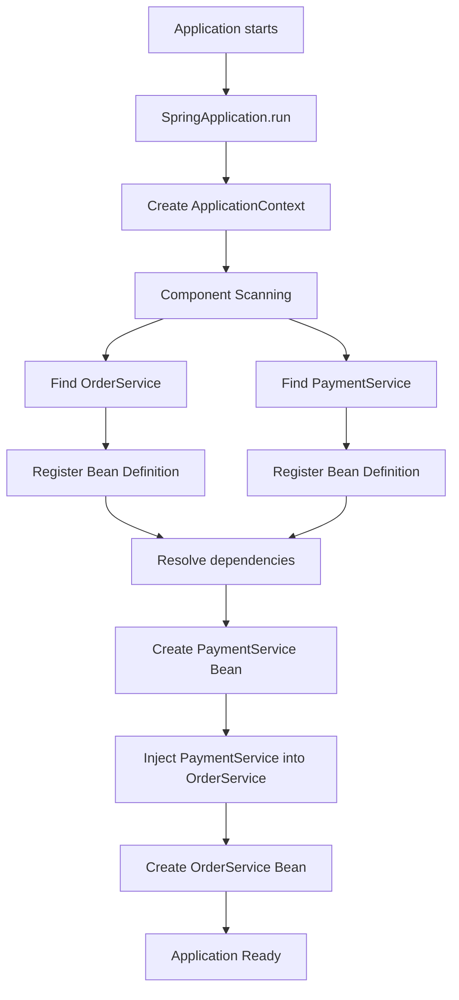
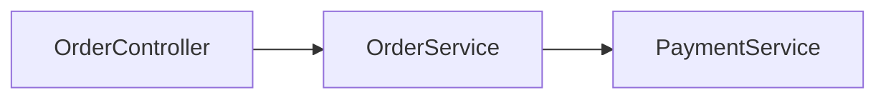
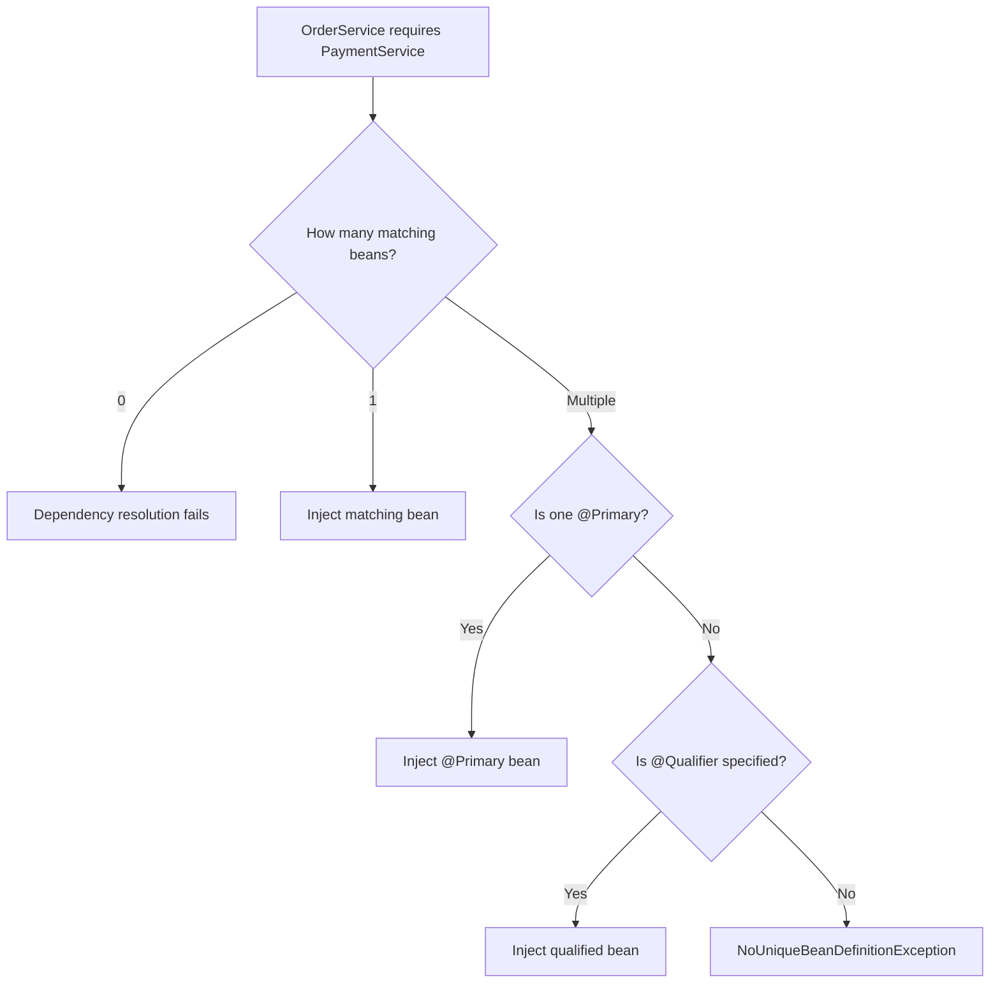
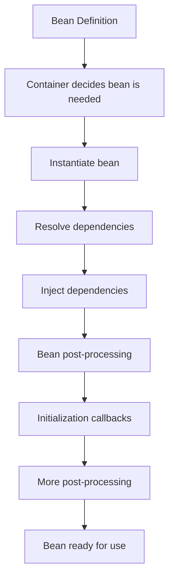
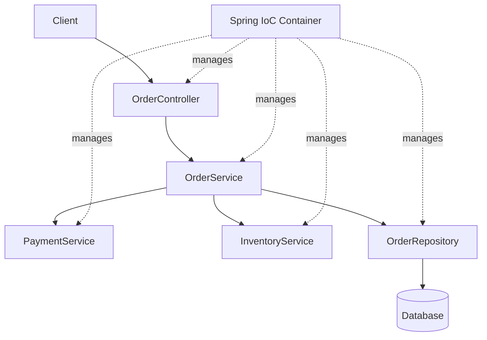
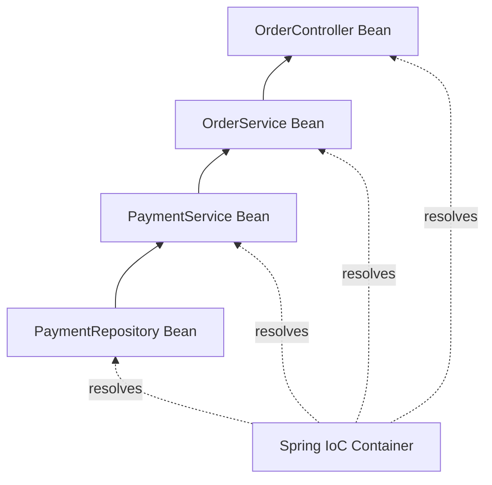
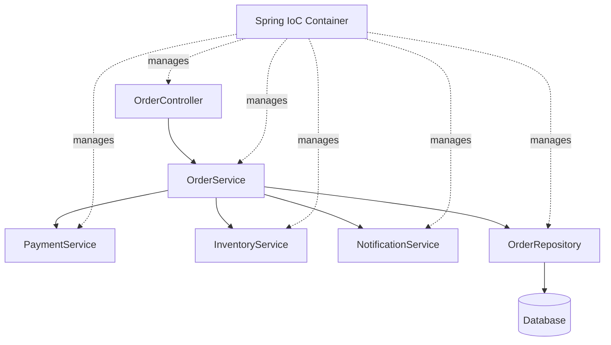
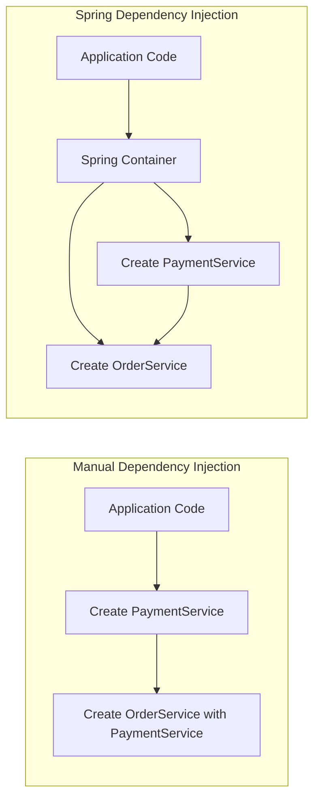
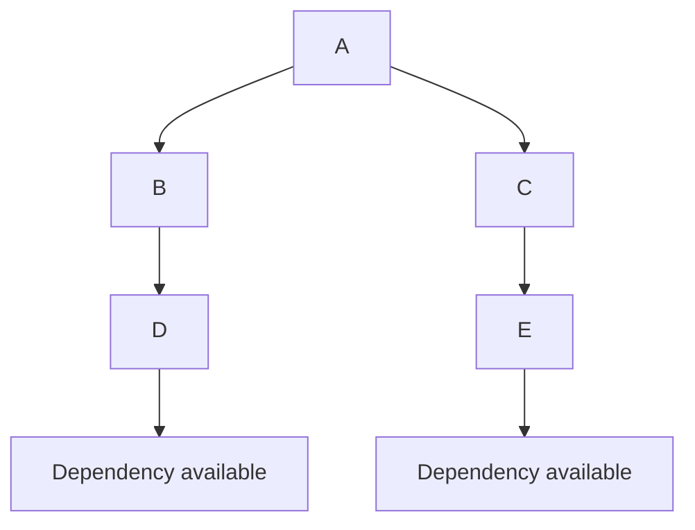
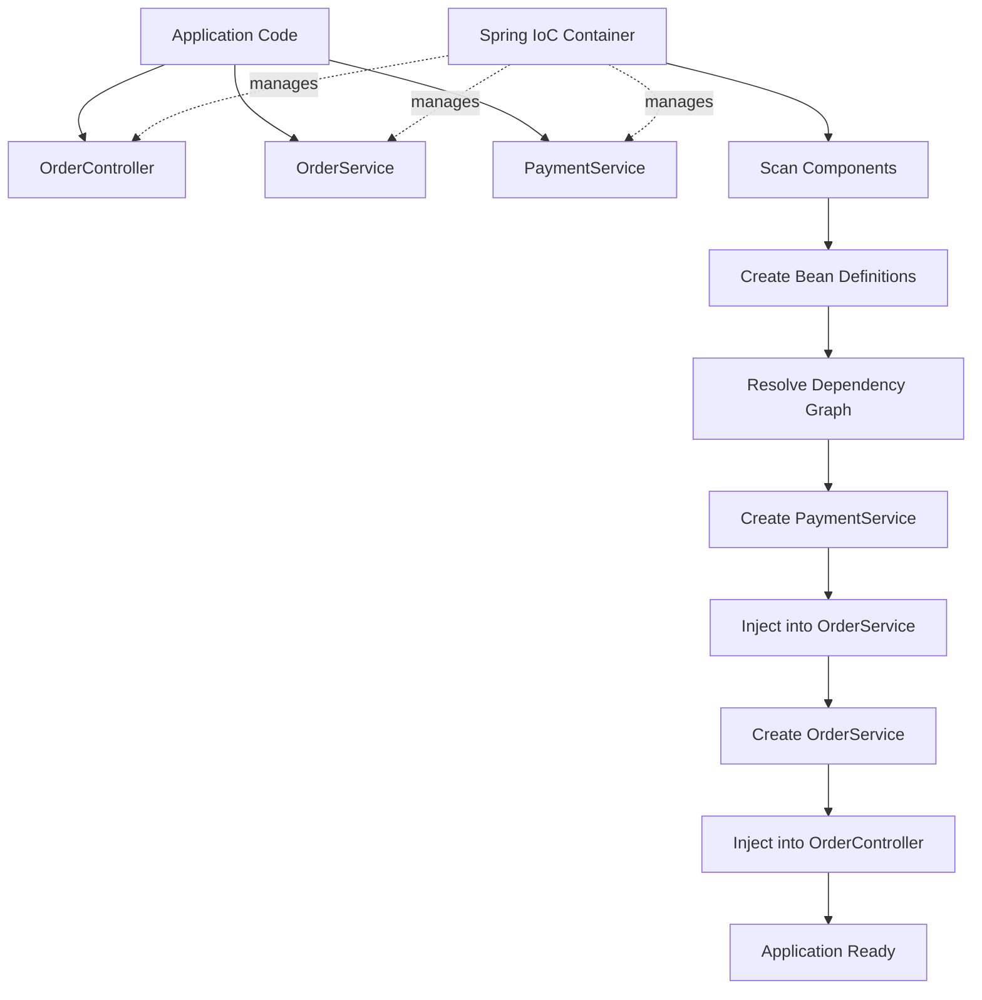

# Dependency Injection (DI) and IoC (Inversion of Control) in Spring

## 1. What is IoC?

**IoC stands for Inversion of Control.**

IoC is a **design principle** in which the control of creating, configuring, and managing objects is transferred from application code to another component, usually a framework or container.

In a normal Java application, developers usually create objects themselves:

```java
PaymentService paymentService = new PaymentService();
OrderService orderService = new OrderService(paymentService);
```

Here, our code controls:

- when the object is created
- which implementation is created
- how dependencies are connected

With Spring, this responsibility is transferred to the **Spring IoC Container**.

Instead of writing:

```java
PaymentService paymentService = new PaymentService();
```

we tell Spring:

```java
@Service
public class PaymentService {
}
```

and then declare the dependency:

```java
@Service
public class OrderService {

    private final PaymentService paymentService;

    public OrderService(PaymentService paymentService) {
        this.paymentService = paymentService;
    }
}
```

Spring creates `PaymentService` and provides it to `OrderService`.

---

# 2. Simple Definition of IoC

For an interview, you can say:

> **IoC is a design principle where the responsibility of creating and managing objects is transferred from application code to a container or framework.**

In Spring:

```text
Application Code
       |
       | declares dependencies
       ↓
Spring IoC Container
       |
       | creates and manages objects
       ↓
Spring Beans
```

---

# 3. Why is IoC needed?

Consider this code:

```java
public class OrderService {

    private PaymentService paymentService;

    public OrderService() {
        this.paymentService = new PaymentService();
    }

    public void placeOrder() {
        paymentService.pay();
    }
}
```

The problem is that `OrderService` is responsible for creating `PaymentService`.

So there is a strong relationship:

```text
OrderService
      |
      | creates
      ↓
PaymentService
```

This is called **tight coupling**.

---

# 4. What is Tight Coupling?

Two classes are tightly coupled when one class strongly depends on the implementation details of another class.

Example:

```java
public class OrderService {

    private PaymentService paymentService;

    public OrderService() {
        paymentService = new PaymentService();
    }
}
```

Here:

```java
OrderService
```

directly depends on:

```java
PaymentService
```

and also controls its creation.

Suppose tomorrow we want:

```java
UPIPaymentService
```

instead of:

```java
PaymentService
```

we must modify `OrderService`.

That creates maintenance problems.

---

# 5. Loose Coupling

A better design is:

```java
public interface PaymentService {

    void pay();
}
```

Implementation:

```java
public class CreditCardPaymentService
        implements PaymentService {

    @Override
    public void pay() {
        System.out.println("Paid using credit card");
    }
}
```

Another implementation:

```java
public class UPIPaymentService
        implements PaymentService {

    @Override
    public void pay() {
        System.out.println("Paid using UPI");
    }
}
```

Now `OrderService` depends on the abstraction:

```java
public class OrderService {

    private final PaymentService paymentService;

    public OrderService(PaymentService paymentService) {
        this.paymentService = paymentService;
    }

    public void placeOrder() {
        paymentService.pay();
    }
}
```

Now:

```text
OrderService
      |
      | depends on
      ↓
PaymentService interface
      ↑
      |
 ┌────┴──────────────┐
 |                   |
CreditCard       UPI
Payment          Payment
```

This is **loose coupling**.

---

# 6. What is Dependency Injection?

**Dependency Injection is a technique used to implement IoC.**

Suppose:

```java
public class OrderService {

    private final PaymentService paymentService;

    public OrderService(PaymentService paymentService) {
        this.paymentService = paymentService;
    }
}
```

`OrderService` has a dependency:

```text
OrderService
      |
      | depends on
      ↓
PaymentService
```

But `OrderService` does not create it.

Instead, someone outside the class provides it:

```text
PaymentService
      ↓
injected into
      ↓
OrderService
```

This is **Dependency Injection**.

---

# 7. Simple Definition of DI

Interview answer:

> **Dependency Injection is a design technique in which an object's dependencies are provided from outside instead of the object creating those dependencies itself.**

Example:

```java
public OrderService(PaymentService paymentService) {
    this.paymentService = paymentService;
}
```

The dependency:

```java
PaymentService
```

is injected into:

```java
OrderService
```

---

# 8. IoC vs Dependency Injection

This is one of the most important interview questions.

### IoC

IoC is a **principle**.

It says:

> The control of object creation and management should be inverted from application code to a container/framework.

### DI

DI is a **technique**.

It says:

> Dependencies should be supplied to an object from outside.

Therefore:

```text
IoC
 |
 | implemented commonly using
 ↓
Dependency Injection
```

A simple way to remember:

```text
IoC = What is the principle?

DI = How is the dependency supplied?
```

---

# 9. Real-Life Example of IoC

Imagine a restaurant.

Without IoC:

```text
You
 |
 | buy ingredients
 ↓
Cook
 |
 | prepare food
 ↓
Food
```

You are responsible for everything.

With IoC:

```text
You
 |
 | order food
 ↓
Restaurant
 |
 | manages
 ├── ingredients
 ├── cook
 ├── kitchen
 └── preparation
 |
 ↓
Food
```

You don't create the food yourself.

You simply say:

> "I need pizza."

The restaurant handles the creation.

This is similar to Spring.

Your class says:

> "I need PaymentService."

Spring handles:

> "I'll create it and give it to you."

---

# 10. Spring IoC Container

The **Spring IoC Container** is responsible for managing Spring beans.

Its responsibilities include:

- creating objects
- configuring objects
- resolving dependencies
- injecting dependencies
- managing bean lifecycle
- managing bean scopes
- applying bean post-processors
- creating proxies when required

The main container abstraction you commonly interact with is:

```java
ApplicationContext
```

---

# 11. BeanFactory and ApplicationContext

Spring provides two important container interfaces:

```text
BeanFactory
     ↑
ApplicationContext
```

`BeanFactory` provides the basic IoC functionality.

`ApplicationContext` provides additional enterprise-level features.

Conceptually:

```text
BeanFactory
    |
    ├── Bean creation
    ├── Dependency Injection
    └── Bean management

ApplicationContext
    |
    ├── Everything above
    ├── Application events
    ├── Internationalization
    ├── Resource loading
    ├── Environment/property support
    └── Integration with other Spring features
```

In normal Spring Boot applications, you generally work with:

```java
ApplicationContext
```

---

# 12. What is a Spring Bean?

A **Spring Bean is an object that is instantiated, configured, and managed by the Spring IoC Container.**

Example:

```java
@Service
public class PaymentService {
}
```

Spring discovers this class and creates an object managed by the container.

Conceptually:

```text
PaymentService.class
       ↓
Spring discovers class
       ↓
Bean Definition
       ↓
Spring creates object
       ↓
PaymentService Bean
```

---

# 13. Bean vs Normal Java Object

Not every Java object is automatically a Spring bean.

Example:

```java
PaymentService service = new PaymentService();
```

This is simply a Java object.

Spring does not automatically manage it just because its class exists.

But:

```java
@Service
public class PaymentService {
}
```

allows component scanning to register it as a Spring bean.

Or:

```java
@Configuration
public class AppConfig {

    @Bean
    public PaymentService paymentService() {
        return new PaymentService();
    }
}
```

also creates a Spring-managed bean.

---

# 14. How Does Spring Know Which Classes Are Beans?

There are several ways.

## Component scanning

Common annotations include:

```java
@Component
@Service
@Repository
@Controller
@RestController
```

For example:

```java
@Service
public class OrderService {
}
```

Spring's component scanning discovers it.

---

## @Bean

You can explicitly tell Spring to create a bean:

```java
@Configuration
public class AppConfig {

    @Bean
    public PaymentService paymentService() {
        return new PaymentService();
    }
}
```

Now the returned object becomes a Spring bean.

---

# 15. Component Scanning

Suppose:

```java
@Service
public class PaymentService {
}
```

and:

```java
@Service
public class OrderService {
}
```

During application startup, Spring scans configured packages.

Conceptually:

```text
Spring Boot Application
        |
        ↓
Component Scan
        |
        ├── OrderService
        |
        └── PaymentService
        |
        ↓
Bean Definitions
        |
        ↓
Spring IoC Container
```

---

# 16. Complete IoC Flow



---

# 17. Dependency Graph

Suppose we have:

```java
@RestController
public class OrderController {

    private final OrderService orderService;

    public OrderController(OrderService orderService) {
        this.orderService = orderService;
    }
}
```

Then:

```java
@Service
public class OrderService {

    private final PaymentService paymentService;

    public OrderService(PaymentService paymentService) {
        this.paymentService = paymentService;
    }
}
```

And:

```java
@Service
public class PaymentService {
}
```

The dependency graph is:

```text
OrderController
       |
       ↓
OrderService
       |
       ↓
PaymentService
```

Spring needs to resolve this entire dependency graph.

---

# 18. Mermaid Dependency Graph



Spring must make sure that:

```text
PaymentService exists
        ↓
OrderService can be created
        ↓
OrderController can be created
```

---

# 19. Constructor Injection

Constructor injection is the most commonly recommended approach.

Example:

```java
@Service
public class OrderService {

    private final PaymentService paymentService;

    public OrderService(PaymentService paymentService) {
        this.paymentService = paymentService;
    }
}
```

Spring sees:

```text
OrderService
     |
     | requires
     ↓
PaymentService
```

and injects the bean.

---

# 20. Why is Constructor Injection Preferred?

## Reason 1 — Required dependencies are explicit

Look at:

```java
public OrderService(PaymentService paymentService) {
}
```

Immediately we know:

> OrderService cannot work without PaymentService.

---

## Reason 2 — Immutability

You can write:

```java
private final PaymentService paymentService;
```

The reference cannot be reassigned after construction.

---

## Reason 3 — Easier testing

Without Spring:

```java
PaymentService paymentService = mock(PaymentService.class);

OrderService orderService =
        new OrderService(paymentService);
```

You can test the class directly.

---

## Reason 4 — Fail-fast behavior

Suppose `PaymentService` is missing.

Constructor injection causes object creation to fail immediately.

That is generally better than discovering a missing dependency much later.

---

# 21. Setter Injection

Example:

```java
@Service
public class OrderService {

    private PaymentService paymentService;

    @Autowired
    public void setPaymentService(PaymentService paymentService) {
        this.paymentService = paymentService;
    }
}
```

The dependency is injected through a setter.

Conceptually:

```text
Create OrderService
       ↓
Call setter
       ↓
setPaymentService(...)
       ↓
Dependency injected
```

Setter injection can make sense when a dependency is genuinely optional or reconfigurable.

For mandatory dependencies, constructor injection is usually preferred.

---

# 22. Field Injection

Example:

```java
@Service
public class OrderService {

    @Autowired
    private PaymentService paymentService;
}
```

Spring injects the field.

This is simple to write but generally less desirable.

Problems include:

- dependencies are less explicit
- harder to instantiate correctly in plain unit tests
- encourages mutable fields
- dependency requirements are hidden
- object construction does not clearly express required dependencies

---

# 23. Constructor vs Setter vs Field Injection

| Feature | Constructor | Setter | Field |
|---|---|---|---|
| Required dependency | Excellent | Possible | Possible |
| Optional dependency | Possible | Good | Possible |
| Immutability | Excellent | Poorer | Poorer |
| Testing | Easy | Easy | Less convenient |
| Explicit dependency | Yes | Yes | Less explicit |
| Recommended | Yes | Sometimes | Generally avoid |

---

# 24. Important Interview Question

### Question:

> Is `@Autowired` mandatory for constructor injection?

No.

If a Spring bean has a single constructor, Spring can use that constructor for dependency injection without `@Autowired`.

Example:

```java
@Service
public class OrderService {

    private final PaymentService paymentService;

    public OrderService(PaymentService paymentService) {
        this.paymentService = paymentService;
    }
}
```

No `@Autowired` is required.

---

# 25. What if There Are Multiple Constructors?

Example:

```java
@Service
public class OrderService {

    public OrderService() {
    }

    public OrderService(PaymentService paymentService) {
    }
}
```

Now Spring needs additional information to determine which constructor should be used.

You can explicitly mark the intended constructor:

```java
@Autowired
public OrderService(PaymentService paymentService) {
    this.paymentService = paymentService;
}
```

---

# 26. Interface-Based Dependency Injection

Consider:

```java
public interface PaymentService {

    void pay();
}
```

Implementations:

```java
@Service
public class CreditCardPaymentService
        implements PaymentService {

    @Override
    public void pay() {
        System.out.println("Credit card payment");
    }
}
```

and:

```java
@Service
public class UpiPaymentService
        implements PaymentService {

    @Override
    public void pay() {
        System.out.println("UPI payment");
    }
}
```

Now:

```java
@Service
public class OrderService {

    private final PaymentService paymentService;

    public OrderService(PaymentService paymentService) {
        this.paymentService = paymentService;
    }
}
```

What happens?

Spring finds **two beans** of type:

```text
PaymentService
```

Therefore Spring cannot determine which one should be injected.

This can result in:

```text
NoUniqueBeanDefinitionException
```

---

# 27. How Do We Solve Multiple Implementations?

There are several common solutions.

### Solution 1 — @Primary

```java
@Service
@Primary
public class CreditCardPaymentService
        implements PaymentService {
}
```

Now it is the default candidate.

---

### Solution 2 — @Qualifier

```java
@Service
public class OrderService {

    private final PaymentService paymentService;

    public OrderService(
            @Qualifier("upiPaymentService")
            PaymentService paymentService) {

        this.paymentService = paymentService;
    }
}
```

Now Spring knows exactly which bean to use.

---

# 28. @Primary vs @Qualifier

### @Primary

Means:

> "Use this bean by default when multiple candidates exist."

### @Qualifier

Means:

> "Use this specific bean."

Example:

```text
PaymentService
   |
   ├── CreditCardPaymentService
   └── UpiPaymentService
```

`@Primary` selects a default.

`@Qualifier` explicitly selects one.

---

# 29. Mermaid Multiple Bean Resolution



---

# 30. @Bean Dependency Injection

DI doesn't require `@Service`.

You can create beans using `@Configuration` and `@Bean`.

Example:

```java
@Configuration
public class AppConfig {

    @Bean
    public PaymentService paymentService() {
        return new PaymentService();
    }

    @Bean
    public OrderService orderService(
            PaymentService paymentService) {

        return new OrderService(paymentService);
    }
}
```

Spring sees:

```text
paymentService()
        ↓
PaymentService Bean
        ↓
orderService(paymentService)
        ↓
OrderService Bean
```

---

# 31. Mermaid @Bean Flow

```mermaid
flowchart TD

    A[AppConfig] --> B[@Bean paymentService]
    B --> C[PaymentService Bean]

    A --> D[@Bean orderService]
    C --> D

    D --> E[OrderService Bean]
```

---

# 32. IoC Container — Complete Mental Model

Think of Spring's container as a sophisticated object factory and manager.

```text
                 Spring IoC Container
                         |
          ┌──────────────┼──────────────┐
          ↓              ↓              ↓
     Bean Creation   DI Resolution   Lifecycle
          |              |              |
          ↓              ↓              ↓
      Objects        Dependencies    Init/Destroy
```

But the container does more than simply call `new`.

It can also participate in:

```text
Dependency Injection
Bean Lifecycle
Scopes
Configuration
AOP
Transactions
Security
Caching
Events
```

---

# 33. Does Spring Replace the `new` Keyword?

This is a tricky question.

**No.**

Spring does not eliminate the `new` keyword from Java.

You can still write:

```java
Order order = new Order();
```

The important question is:

> Who needs to manage this object?

If the object should participate in Spring's container-managed lifecycle and dependency system, it is usually created/managed through Spring.

---

# 34. Important Trap — `new` Inside a Spring Bean

Consider:

```java
@Service
public class OrderService {

    public void process() {

        PaymentService paymentService =
                new PaymentService();
    }
}
```

This `PaymentService` is **not the Spring-managed bean** simply because the code is running inside a Spring bean.

You manually created it.

Therefore Spring does not automatically apply normal container-managed behavior to that object.

Conceptually:

```text
Spring
 |
 └── OrderService Bean
       |
       └── new PaymentService()
                |
                └── ordinary Java object
```

This is an important interview trap.

---

# 35. Spring Bean vs `new`

```text
Spring-managed object:

Spring Container
      ↓
creates object
      ↓
injects dependencies
      ↓
runs lifecycle processing
      ↓
may create proxy
      ↓
Spring Bean
```

Manual object:

```text
Your code
   ↓
new
   ↓
Java object
```

The second object does not automatically become a Spring bean.

---

# 36. Dependency Injection and Abstraction

One of the biggest benefits of DI is programming against an abstraction.

Bad:

```java
private CreditCardPaymentService paymentService;
```

Better:

```java
private PaymentService paymentService;
```

Why?

Because:

```text
OrderService
      |
      ↓
PaymentService interface
      ↑
 ┌────┴─────────────┐
 ↓                  ↓
CreditCard         UPI
```

The high-level class doesn't need to know the concrete implementation.

This follows the **Dependency Inversion Principle**.

---

# 37. DI and SOLID

Dependency Injection is strongly related to the **Dependency Inversion Principle (DIP)**.

DIP says, roughly:

> High-level modules should not depend directly on low-level implementation details. Both should depend on abstractions.

Example:

```text
Bad:

OrderService
     |
     ↓
StripePaymentService
```

Better:

```text
OrderService
     |
     ↓
PaymentService
     ↑
     |
StripePaymentService
```

Spring makes this style of design easier.

---

# 38. DI Does Not Automatically Mean Good Design

This is another tricky interview point.

You can write badly designed code using DI.

Example:

```java
@Service
public class HugeService {

    public HugeService(
            ServiceA a,
            ServiceB b,
            ServiceC c,
            ServiceD d,
            ServiceE e,
            ServiceF f,
            ServiceG g,
            ServiceH h) {
    }
}
```

Technically this uses DI.

But it may indicate:

```text
Too many responsibilities
        ↓
High class complexity
        ↓
Poor separation of concerns
```

DI helps coupling, but it does not automatically fix architecture.

---

# 39. Circular Dependency

Consider:

```java
@Service
public class A {

    private final B b;

    public A(B b) {
        this.b = b;
    }
}
```

and:

```java
@Service
public class B {

    private final A a;

    public B(A a) {
        this.a = a;
    }
}
```

Dependency graph:

```text
A
↓
B
↓
A
```

This is a circular dependency.


This is usually a design smell and should generally be redesigned rather than worked around.

---

# 40. How Can Circular Dependencies Be Fixed?

Instead of:

```text
A → B
B → A
```

ask:

> Why do both services need each other?

Often the solution is to extract shared behavior.

For example:

```text
A → CommonService
B → CommonService
```

Instead of:

```text
A ↔ B
```

This produces a cleaner dependency graph.

---

# 41. IoC Does Not Mean "Spring Creates Everything"

Another interview trap.

Spring only manages objects that are registered/configured as beans or otherwise integrated into the container.

For example:

```java
@Service
public class PaymentService {
}
```

is a candidate for component scanning.

But:

```java
public class RandomObject {
}
```

does not become a Spring bean merely because Spring Boot exists.

---

# 42. Bean Creation Flow

A simplified Spring bean creation flow is:



This is simplified, but useful for interviews.

---

# 43. What is a Bean Definition?

A **BeanDefinition** is metadata describing how Spring should create/manage a bean.

Conceptually it can contain information such as:

```text
Bean class
Scope
Dependencies
Lazy initialization
Initialization method
Destroy method
Autowiring information
```

Think of it as:

```text
BeanDefinition
      ↓
Recipe/instructions
      ↓
Spring Container
      ↓
Actual Bean Object
```

---

# 44. Bean Lifecycle and IoC

IoC is not just about dependency injection.

Spring also manages the lifecycle.

Simplified:

```text
Bean Definition
      ↓
Instantiation
      ↓
Dependency Injection
      ↓
Aware callbacks
      ↓
BeanPostProcessor - before initialization
      ↓
Initialization
      ↓
BeanPostProcessor - after initialization
      ↓
Ready
      ↓
Destroy
```

This becomes important when discussing:

```java
@PostConstruct
```

and:

```java
@PreDestroy
```

---

# 45. `@PostConstruct`

Example:

```java
@Service
public class PaymentService {

    @PostConstruct
    public void init() {
        System.out.println("PaymentService initialized");
    }
}
```

This method is called as part of the bean's initialization lifecycle.

Conceptually:

```text
Create bean
    ↓
Inject dependencies
    ↓
@PostConstruct
    ↓
Bean ready
```

---

# 46. `@PreDestroy`

Example:

```java
@Service
public class PaymentService {

    @PreDestroy
    public void cleanup() {
        System.out.println("Cleanup");
    }
}
```

When the Spring context is shutting down, Spring can invoke the destruction callback for eligible beans.

---

# 47. Bean Scope and IoC

Spring also controls bean scope.

Common scopes include:

```text
singleton
prototype
request
session
application
websocket
```

The default is:

```text
singleton
```

---

# 48. Singleton Scope

Example:

```java
@Service
public class PaymentService {
}
```

By default, Spring creates one bean instance per Spring application context.

Conceptually:

```text
Spring Container
       |
       ↓
PaymentService Bean
       |
   ┌───┼────┐
   ↓   ↓    ↓
User1 User2 User3
   \   |    /
    same bean
```

Important:

> Spring singleton is not exactly the same concept as the classic Gang-of-Four Singleton pattern.

Spring manages the scope within the application context.

---

# 49. Spring Singleton Does Not Mean Thread-Safe

This is a very important interview trick.

Suppose:

```java
@Service
public class CounterService {

    private int count = 0;

    public void increment() {
        count++;
    }
}
```

If this bean is singleton-scoped and multiple requests use it concurrently, there can be concurrency issues.

Therefore:

```text
Singleton
   ≠
Thread-safe
```

Spring managing the object does not automatically make its mutable state thread-safe.

---

# 50. DI and Thread Safety

Consider:

```java
@Service
public class OrderService {

    private final PaymentService paymentService;

    private String currentUser;
}
```

The service is usually singleton-scoped.

Therefore this is dangerous:

```java
this.currentUser = user;
```

because multiple requests may execute concurrently.

Better:

```java
public void process(String user) {
    // use local variable
}
```

Prefer stateless singleton services.

---

# 51. Dependency Injection Flow in Spring Boot

A typical application looks like:

```text
                 Spring Boot
                     |
                     ↓
             ApplicationContext
                     |
       ┌─────────────┼─────────────┐
       ↓             ↓             ↓
 Controller       Service       Repository
       |             |             |
       └─────────────┼─────────────┘
                     ↓
                 Dependencies
```

A more realistic flow:



---

# 52. What Happens When Controller Needs Service?

Suppose:

```java
@RestController
public class OrderController {

    private final OrderService orderService;

    public OrderController(OrderService orderService) {
        this.orderService = orderService;
    }
}
```

Spring needs:

```text
OrderController
      ↓
OrderService
```

So it resolves `OrderService`.

If `OrderService` itself requires:

```java
PaymentService
```

then Spring resolves that too.

Therefore dependency resolution can be recursive.

---

# 53. Recursive Dependency Resolution

Example:

```text
Controller
    ↓
OrderService
    ↓
PaymentService
    ↓
PaymentRepository
```

Spring needs to construct the graph.

Conceptually:

```text
PaymentRepository
       ↓
PaymentService
       ↓
OrderService
       ↓
OrderController
```

The lower-level dependencies must be available so that higher-level beans can be constructed.

---

# 54. Mermaid Recursive Dependency Resolution



---

# 55. What if a Dependency Does Not Exist?

Suppose:

```java
@Service
public class OrderService {

    public OrderService(PaymentService paymentService) {
    }
}
```

but there is no Spring bean for:

```text
PaymentService
```

Spring cannot satisfy the dependency.

Application startup can fail with a dependency-resolution error, commonly represented by messages involving:

```text
NoSuchBeanDefinitionException
```

or an `UnsatisfiedDependencyException` wrapping the underlying problem.

This is one reason constructor injection is useful:

> configuration problems are discovered early.

---

# 56. `@Component` vs `@Service`

Both can make a class a Spring bean through component scanning.

```java
@Component
public class PaymentService {
}
```

and:

```java
@Service
public class PaymentService {
}
```

`@Service` is a specialization of `@Component` and communicates intent:

> This class belongs to the service/business layer.

Similarly:

```java
@Repository
```

communicates repository/data-access intent.

---

# 57. Does `@Service` Perform Dependency Injection?

No.

This distinction is important.

```java
@Service
```

primarily tells Spring:

> Register this class as a component/bean candidate.

Dependency injection occurs when Spring resolves dependencies such as:

```java
public OrderService(PaymentService paymentService)
```

So:

```text
@Service
      ↓
Bean registration

Constructor parameter
      ↓
Dependency injection
```

---

# 58. `@Autowired` vs `@Service`

They have different purposes.

### `@Service`

Marks a class as a component candidate.

```java
@Service
public class PaymentService {
}
```

### `@Autowired`

Marks a dependency injection point.

```java
@Autowired
private PaymentService paymentService;
```

or:

```java
@Autowired
public OrderService(PaymentService paymentService) {
}
```

With a single constructor, explicit `@Autowired` is usually unnecessary.

---

# 59. Can Spring Inject a Primitive?

DI is not limited to other service objects.

Spring can inject configuration values.

Example:

```java
@Value("${payment.timeout}")
private int timeout;
```

Or better for groups of related configuration:

```java
@ConfigurationProperties(prefix = "payment")
public class PaymentProperties {

    private int timeout;
}
```

The broader idea remains:

```text
Value/configuration
      ↓
Spring
      ↓
Application object
```

---

# 60. DI of Collections

Spring can inject multiple implementations.

Suppose:

```java
public interface PaymentProcessor {

    void process();
}
```

Implementations:

```java
@Component
public class CardProcessor implements PaymentProcessor {
}
```

```java
@Component
public class UpiProcessor implements PaymentProcessor {
}
```

You can inject all implementations:

```java
@Service
public class PaymentService {

    private final List<PaymentProcessor> processors;

    public PaymentService(
            List<PaymentProcessor> processors) {

        this.processors = processors;
    }
}
```

Spring can provide all matching beans.

Conceptually:

```text
PaymentProcessor
      |
      ├── CardProcessor
      ├── UpiProcessor
      └── WalletProcessor
             |
             ↓
      List<PaymentProcessor>
```

This is useful for:

- Strategy pattern
- plugin architectures
- rule engines
- payment methods
- notification providers

---

# 61. Map Injection

You can also inject implementations as a map:

```java
public PaymentService(
        Map<String, PaymentProcessor> processors) {

    this.processors = processors;
}
```

The keys are typically bean names.

Conceptually:

```text
Map
 |
 ├── "cardProcessor" → CardProcessor
 ├── "upiProcessor"  → UpiProcessor
 └── "walletProcessor" → WalletProcessor
```

This is a powerful pattern for selecting behavior dynamically.

---

# 62. DI and Strategy Pattern

Suppose:

```java
public interface DiscountStrategy {

    BigDecimal calculate(Order order);
}
```

Implementations:

```java
@Component
public class RegularDiscountStrategy
        implements DiscountStrategy {
}
```

```java
@Component
public class PremiumDiscountStrategy
        implements DiscountStrategy {
}
```

Spring can inject all strategies:

```java
@Service
public class DiscountService {

    private final List<DiscountStrategy> strategies;

    public DiscountService(
            List<DiscountStrategy> strategies) {

        this.strategies = strategies;
    }
}
```

Spring DI makes the Strategy pattern easy to implement.

---

# 63. IoC and AOP

Spring's IoC container also works closely with AOP.

For example:

```java
@Transactional
public void transferMoney() {
}
```

Spring may create/use a proxy around your bean so transaction behavior can be applied.

Conceptually:

```text
Caller
  ↓
Spring Proxy
  ↓
Transaction starts
  ↓
Actual Service
  ↓
Method executes
  ↓
Transaction commit/rollback
```

This is another reason Spring-managed beans matter.

---

# 64. Why `new` Can Break Spring Features

Suppose:

```java
@Service
public class OrderService {

    public void createOrder() {
        PaymentService paymentService =
                new PaymentService();

        paymentService.pay();
    }
}
```

If `PaymentService` was supposed to have Spring-managed behavior such as:

```java
@Transactional
@Async
@Cacheable
```

the manually-created object will not automatically receive the same container-managed proxy/interception.

Therefore:

```text
Spring-managed object
      ↓
Spring features can participate

new Object()
      ↓
ordinary Java object
```

This is a very common interview trick.

---

# 65. Dependency Injection vs Dependency Lookup

These are different approaches.

## Dependency Injection

The dependency is provided to the object.

```java
public OrderService(PaymentService paymentService) {
    this.paymentService = paymentService;
}
```

## Dependency Lookup

The object asks the container for the dependency.

For example:

```java
ApplicationContext context = ...;

PaymentService service =
        context.getBean(PaymentService.class);
```

DI is generally preferred because the class does not need to know about the Spring container.

---

# 66. Why DI is Better Than Service Locator

With service locator:

```java
ApplicationContext context;

PaymentService service =
        context.getBean(PaymentService.class);
```

The class knows about:

```text
Spring ApplicationContext
```

That creates framework coupling.

With DI:

```java
public OrderService(PaymentService paymentService) {
}
```

the class only knows:

```text
PaymentService
```

This makes the business class easier to test and reuse.

---

# 67. Dependency Injection and Testability

Without DI:

```java
public class OrderService {

    private final PaymentService paymentService;

    public OrderService() {
        paymentService = new PaymentService();
    }
}
```

Testing becomes harder because you cannot easily substitute a fake/mock.

With DI:

```java
public OrderService(PaymentService paymentService) {
    this.paymentService = paymentService;
}
```

Test:

```java
PaymentService mockPaymentService =
        mock(PaymentService.class);

OrderService service =
        new OrderService(mockPaymentService);
```

This is a major benefit of DI.

---

# 68. Unit Testing Without Spring

One of the best properties of constructor injection is that you don't need Spring for a pure unit test.

```java
class OrderServiceTest {

    @Test
    void shouldPlaceOrder() {

        PaymentService paymentService =
                mock(PaymentService.class);

        OrderService service =
                new OrderService(paymentService);

        service.placeOrder();

        verify(paymentService).pay();
    }
}
```

The test creates the class directly.

That is a sign of good separation.

---

# 69. Real-World Example

Imagine an e-commerce application.

We have:

```text
OrderController
OrderService
PaymentService
InventoryService
NotificationService
OrderRepository
```

Dependency graph:



The controller does not create:

```java
new OrderService()
```

The service does not create:

```java
new PaymentService()
```

The repository is not manually created by the service.

Spring manages the object graph.

---

# 70. Full Request Flow

Suppose a request arrives:

```http
POST /orders
```

The runtime flow is approximately:

```text
Client
   ↓
Spring MVC
   ↓
OrderController Bean
   ↓
OrderService Bean
   ↓
PaymentService Bean
   ↓
InventoryService Bean
   ↓
OrderRepository Bean
   ↓
Database
```

Spring's DI is primarily about constructing and wiring the objects involved in this architecture.

---

# 71. Important Distinction: DI vs Object Creation

DI does not mean:

> "Spring creates every object."

It means:

> "Dependencies are supplied externally."

For example:

```java
OrderService service =
        new OrderService(paymentService);
```

This is still Dependency Injection even without Spring.

This is important.

**Dependency Injection is a general design technique, not something that exists only in Spring.**

Spring provides a container that automates it.

---

# 72. DI Without Spring

This is valid DI:

```java
PaymentService paymentService =
        new PaymentService();

OrderService orderService =
        new OrderService(paymentService);
```

Who performs the injection?

Your application code.

```text
Application
    |
    | creates dependency
    ↓
PaymentService
    |
    | passes dependency
    ↓
OrderService
```

With Spring:

```text
Spring Container
       |
       | creates dependency
       ↓
PaymentService
       |
       | injects
       ↓
OrderService
```

The principle is the same.

Spring simply automates the process.

---

# 73. Manual DI vs Spring DI



---

# 74. The Most Important Mental Model

Remember these four things:

```text
1. IoC
   ↓
   Control is transferred to the container.

2. DI
   ↓
   Dependencies are provided from outside.

3. Spring IoC Container
   ↓
   Creates and manages Spring beans.

4. Spring DI
   ↓
   Connects those beans according to their dependencies.
```

---

# 75. Interview Question: "What is the relationship between IoC and DI?"

Strong answer:

> IoC is a broader design principle where control of object creation and management is transferred from application code to a container or framework. Dependency Injection is a technique used to achieve IoC by supplying an object's dependencies from outside rather than having the object create them itself. Spring implements IoC primarily through dependency injection and container-managed beans.

---

# 76. Interview Question: "Why is DI useful?"

Strong answer:

> DI reduces tight coupling, makes dependencies explicit, improves testability, supports programming against abstractions, makes implementations replaceable, and allows the framework to manage object creation and lifecycle.

---

# 77. Interview Question: "Why constructor injection?"

Strong answer:

> Constructor injection is preferred because it makes required dependencies explicit, supports immutable fields, makes classes easier to unit test, and fails fast when required dependencies cannot be provided.

---

# 78. Interview Question: "Why avoid field injection?"

Strong answer:

> Field injection hides dependencies, makes plain unit testing less convenient, prevents expressing required dependencies through the constructor, and generally encourages mutable fields. Constructor injection provides a clearer and more maintainable design.

---

# 79. Interview Question: "Does DI remove coupling completely?"

No.

DI **reduces implementation coupling**, but the class still depends on an abstraction.

For example:

```java
OrderService
      |
      ↓
PaymentService
```

There is still a dependency.

But it is preferable to:

```text
OrderService
      |
      ↓
StripePaymentService
```

because the first depends on an abstraction.

---

# 80. Interview Question: "Can DI be used without Spring?"

Absolutely.

Example:

```java
PaymentService paymentService =
        new PaymentService();

OrderService orderService =
        new OrderService(paymentService);
```

This is manual Dependency Injection.

Spring provides:

```text
IoC Container
+
Automatic dependency resolution
+
Bean lifecycle management
+
Configuration
+
Scopes
+
AOP integration
```

---

# 81. Interview Question: "What happens if two beans implement the same interface?"

Example:

```java
PaymentService
   ↑
   ├── CreditCardPaymentService
   └── UpiPaymentService
```

If you inject:

```java
PaymentService paymentService
```

Spring has multiple candidates.

You can use:

```java
@Primary
```

or:

```java
@Qualifier
```

to resolve the ambiguity.

---

# 82. Interview Question: "What happens if no bean matches the dependency?"

Spring cannot resolve the dependency.

Application startup may fail with an error such as:

```text
NoSuchBeanDefinitionException
```

often surfaced through:

```text
UnsatisfiedDependencyException
```

The exact exception chain depends on the situation.

---

# 83. Interview Question: "What happens if there is a circular dependency?"

Example:

```text
A → B
B → A
```

Spring may be unable to construct the beans, particularly with constructor injection, and application startup can fail.

The preferred solution is generally:

> Redesign the dependency graph rather than trying to hide the circular dependency.

---

# 84. Interview Question: "What is the role of ApplicationContext?"

Answer:

> `ApplicationContext` is a central Spring IoC container that manages beans and provides dependency injection along with additional application infrastructure such as events, resources, environment/property handling, and integration with other Spring features.

---

# 85. Interview Question: "Is ApplicationContext a Bean?"

Be careful.

`ApplicationContext` itself is part of the Spring container infrastructure.

It is not simply another application service bean that you should inject everywhere.

Avoid making business classes depend directly on:

```java
ApplicationContext
```

just to retrieve dependencies.

Prefer constructor injection.

---

# 86. Interview Trap: Service Locator vs DI

Bad:

```java
@Service
public class OrderService {

    @Autowired
    private ApplicationContext context;

    public void process() {

        PaymentService paymentService =
                context.getBean(PaymentService.class);
    }
}
```

Better:

```java
@Service
public class OrderService {

    private final PaymentService paymentService;

    public OrderService(PaymentService paymentService) {
        this.paymentService = paymentService;
    }
}
```

The second design is simpler and more testable.

---

# 87. Interview Trap: `@Autowired` Does Not Mean "Create Object"

`@Autowired` means roughly:

> Ask Spring to resolve and inject a suitable dependency at this injection point.

It does not mean:

```text
@Autowired
=
new object
```

Spring's container handles bean creation and dependency resolution.

---

# 88. Interview Trap: `@Service` Does Not Mean Singleton in Java

This:

```java
@Service
public class PaymentService {
}
```

normally creates a Spring singleton-scoped bean.

But that is a **Spring bean scope**, not the classic Java Singleton design pattern.

Spring manages the lifecycle and scope.

---

# 89. Interview Trap: Singleton Does Not Mean One Object in the Entire JVM

Spring's singleton means:

> One instance per Spring IoC container/application context for that bean definition.

If you have multiple application contexts, each context can have its own singleton instance.

---

# 90. Interview Trap: Singleton Does Not Mean Thread-Safe

Again:

```text
Spring singleton
      ≠
thread-safe
```

A singleton service should generally be stateless or carefully synchronize/manage shared mutable state.

---

# 91. Interview Trap: DI Does Not Automatically Solve Circular Dependencies

DI makes dependency wiring easier.

But this:

```text
A → B → A
```

is still a problematic dependency graph.

DI does not magically make circular architecture good.

---

# 92. Interview Trap: Spring Does Not Manage Every Object

This:

```java
new PaymentService();
```

does not automatically produce a Spring-managed bean.

If you need Spring features, use a Spring-managed bean or otherwise explicitly integrate the object into the container.

---

# 93. Interview Trap: `@Autowired` on Private Field

This works in typical Spring configurations:

```java
@Autowired
private PaymentService paymentService;
```

But it is not generally preferred.

The recommended style is:

```java
private final PaymentService paymentService;

public OrderService(PaymentService paymentService) {
    this.paymentService = paymentService;
}
```

---

# 94. Interview Trap: Interface Injection with Multiple Implementations

If:

```java
PaymentService
```

has multiple implementations:

```text
CreditCardPaymentService
UpiPaymentService
WalletPaymentService
```

then:

```java
public OrderService(PaymentService paymentService)
```

is ambiguous unless Spring has a way to select one.

Use:

```java
@Primary
```

or:

```java
@Qualifier
```

or inject all implementations:

```java
List<PaymentService>
```

depending on the design.

---

# 95. Deep Concept — Dependency Graph

Spring can be viewed as a graph resolver.

Suppose:

```text
A → B
A → C
B → D
C → E
```

Spring needs to create:

```text
D
↓
B
```

and:

```text
E
↓
C
```

before:

```text
A
```

can be fully constructed.

Graph:



This dependency graph is one of the most useful ways to understand Spring IoC.

---

# 96. Dependency Graph in a Real Application

Example:

```text
OrderController
       ↓
OrderService
   ┌───┼────────────┐
   ↓   ↓            ↓
Payment Inventory  OrderRepository
   ↓      ↓            ↓
Gateway Warehouse   Database
```

Spring's job is to construct and connect this object graph.

Your business code should primarily describe:

> "What do I need?"

rather than:

> "How do I create everything I need?"

---

# 97. IoC — The Fundamental Shift

Traditional application:

```text
Class
 |
 ├── creates dependency
 ├── configures dependency
 ├── manages dependency
 └── uses dependency
```

Spring application:

```text
Class
 |
 └── declares dependency
          ↑
          |
     Spring Container
 |
 ├── creates
 ├── configures
 ├── injects
 └── manages
```

That is the **inversion**.

---

# 98. Final Mermaid Mental Model



---

# 99. One-Line Definitions for Revision

### IoC

> Transfer of object creation and management control from application code to a container/framework.

### Dependency Injection

> Providing an object's dependencies from outside instead of allowing the object to create them itself.

### Spring IoC Container

> The Spring component responsible for creating, configuring, wiring, and managing Spring beans.

### Bean

> An object managed by the Spring IoC container.

### Constructor Injection

> Supplying required dependencies through the constructor.

### Setter Injection

> Supplying dependencies through setter methods.

### Field Injection

> Injecting dependencies directly into fields.

### @Component

> Marks a class as a component candidate for Spring component scanning.

### @Service

> A specialization of `@Component` commonly used for service/business-layer classes.

### @Repository

> A specialization of `@Component` commonly used for persistence/data-access components.

### @Primary

> Marks one bean as the preferred candidate when multiple beans match.

### @Qualifier

> Explicitly identifies which bean should be injected.

---

# 100. The Best Interview Explanation

If the interviewer says:

> "Explain IoC and Dependency Injection."

You can answer:

> In traditional Java code, a class often creates the objects it depends on using the `new` keyword. This creates tight coupling because the class controls both its business logic and dependency creation.
>
> IoC, or Inversion of Control, is the principle of transferring that object-creation and management responsibility to a container or framework.
>
> Dependency Injection is one of the main techniques used to implement IoC. Instead of creating its dependency, a class declares the dependency and receives it from outside.
>
> For example, if `OrderService` needs `PaymentService`, instead of writing `new PaymentService()` inside `OrderService`, we inject `PaymentService` through the constructor.
>
> Spring's IoC container creates and manages the beans, resolves their dependencies, and injects them. This reduces coupling, makes dependencies explicit, improves testability, and allows implementations to be replaced more easily.
>
> In Spring, constructor injection is generally preferred for required dependencies.

---

# 101. Final Mental Picture

```text
                 ┌─────────────────────────┐
                 │    Spring IoC Container  │
                 │                         │
                 │  Creates Beans          │
                 │  Resolves Dependencies  │
                 │  Injects Dependencies   │
                 │  Manages Lifecycle      │
                 │  Manages Scope          │
                 │  Applies Infrastructure │
                 └───────────┬─────────────┘
                             │
                             ↓
                    ┌────────────────┐
                    │ OrderController│
                    └───────┬────────┘
                            │
                            ↓
                    ┌────────────────┐
                    │  OrderService  │
                    └───────┬────────┘
                            │
             ┌──────────────┼──────────────┐
             ↓              ↓              ↓
       PaymentService  InventoryService  Repository
             │              │              │
             ↓              ↓              ↓
          Payment        Inventory       Database
```

The central idea is:

```text
                IoC
                 |
                 ↓
       Spring controls object
          creation/management
                 |
                 ↓
                DI
                 |
                 ↓
       Dependencies are supplied
            from outside
                 |
                 ↓
          Loose Coupling
                 |
                 ↓
       Better Testability
                 |
                 ↓
       Better Maintainability
```

## Most important points to remember

```text
IoC ≠ DI

IoC = principle
DI  = technique

Spring IoC Container = manages beans

@Bean / @Component / @Service / @Repository
        ↓
make objects available to Spring as beans

Constructor Injection
        ↓
preferred for required dependencies

@Primary / @Qualifier
        ↓
resolve multiple implementations

new SomeService()
        ↓
creates an ordinary object unless explicitly integrated
with Spring

Spring Singleton
        ↓
one instance per Spring ApplicationContext
        ↓
NOT automatically thread-safe

DI
        ↓
does not eliminate all coupling
        ↓
but encourages dependency on abstractions
```

## Interview traps checklist

- [ ] IoC is a principle; DI is a technique.
- [ ] DI can exist without Spring.
- [ ] Spring does not manage every object created with `new`.
- [ ] `@Autowired` is not required on a single constructor.
- [ ] Constructor injection is generally preferred.
- [ ] Multiple beans of the same type can cause ambiguity.
- [ ] `@Primary` and `@Qualifier` can resolve ambiguity.
- [ ] Spring singleton does not mean thread-safe.
- [ ] Spring singleton means one instance per application context.
- [ ] Circular dependencies are usually a design problem.
- [ ] `@Service` makes a class a component candidate; it is not itself "Dependency Injection."
- [ ] `ApplicationContext` is the commonly used Spring IoC container interface.
- [ ] DI improves testability and loose coupling.
- [ ] DI does not automatically make architecture good.
- [ ] Programming against interfaces makes DI significantly more useful.